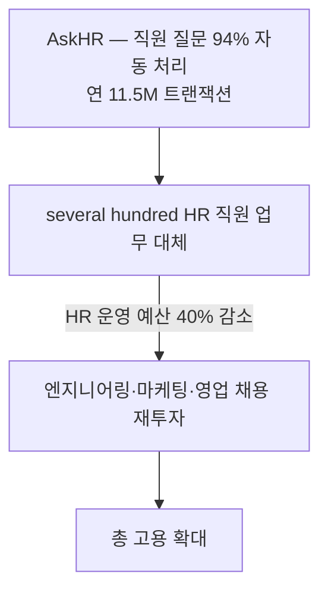

## Summary

2025-05 IBM CEO Arvind Krishna의 WSJ 인터뷰(2차 전달): AI가 **"several hundred" HR 직원의 업무**를 대체했으나 IBM의 총 고용은 오히려 확대 — 절감 재원을 소프트웨어 엔지니어링·마케팅·영업 등 "critical thinking" 직무에 투자 [[sources/entrepreneur-ibm-ceo-ai-replaced-hr-staff-2025-05]]. Forbes(contributor): 일상 HR 업무의 94%를 AI가 처리 [[sources/forbes-ibm-replaces-hundreds-hr-ai-2025-05]]. CHRO LaMoreaux(HR Executive 2025-09 키노트): HR 운영 예산 40% 감소, AskHR 연 11.5M 트랜잭션·직원 질문 94% 시스템 내 처리, 매니저 100%·임원 99% 채택 [[sources/hrexecutive-ibm-chro-time-in-the-sun-2025-09]]. "감원"이 아닌 "재배치 + 재투자" 패러다임의 reference. 기존 "전사 8,000명 layoff(~3%)"·"4년간"·"a couple hundred" 표현은 인용 소스 raw에서 확인되지 않아 수정·_미공개_ 처리 (2026-09-27 grounding 점검; HR Asia 기사는 raw 미확보).

## Problem / Why (도입 배경)

- **Before (baseline)**: ❓ HR 운영 비용 baseline 미공개 — LaMoreaux는 AskHR 전환 당시 HR 이메일·전화를 끊고 21,000명 일선 매니저의 HR 파트너 접근을 중단했다고 회고 [[sources/hrexecutive-ibm-chro-time-in-the-sun-2025-09]]
- **Pain point**: HR transactional 업무가 예산·인력을 흡수 — 복잡한 요청은 전문가에게, 기본 업무는 AI로 [[sources/hrexecutive-ibm-chro-time-in-the-sun-2025-09]]
- **Trigger**: _미공개 (not disclosed)_ — 기존 "2018~2025 누적 효과 임계 도달" 서술은 소스에 없어 삭제

## Solution Architecture

> 본 페이지는 *조직 outcome*. AI 도구 자체는 [[ibm-askhr-watsonx]], [[ibm-charlie-learning-ops-agent]], [[ibm-watsonx-orchestrate-ta-agent]] 등 separate page.

### A. Process (프로세스)

- **Before (As-is)**: HR 직원이 정책 Q&A 등 transactional 업무를 수행; 매니저는 HR 파트너·이메일·전화로 문의 [[sources/hrexecutive-ibm-chro-time-in-the-sun-2025-09]]
- **After**:
  1. AskHR이 직원 질문의 94%를 시스템 내에서 처리 (연 11.5M 트랜잭션) [[sources/hrexecutive-ibm-chro-time-in-the-sun-2025-09]]
  2. 복잡한 요청은 숙련 전문가에게 funneling [[sources/hrexecutive-ibm-chro-time-in-the-sun-2025-09]]
  3. AI가 several hundred HR 직원의 업무를 대체 [[sources/entrepreneur-ibm-ceo-ai-replaced-hr-staff-2025-05]]
  4. 절감 재원을 소프트웨어 엔지니어링·마케팅·영업 채용에 재투자 → 총 고용 확대 [[sources/entrepreneur-ibm-ceo-ai-replaced-hr-staff-2025-05]]
  5. 전사 layoff 규모: _미공개 (not disclosed)_ — 기존 8,000명 수치는 인용 소스 raw에 없음(HR Asia raw 미확보)
- **HITL**: _미공개 (not disclosed)_ — "매니저 최종 결정·HR strategy team 변화관리" 서술은 소스에 없음

### F. Diagrams (도식)

```mermaid
flowchart TB
    AskHR[AskHR — 직원 질문 94% 자동 처리<br/>연 11.5M 트랜잭션] --> Reduce[several hundred HR 직원 업무 대체]
    Reduce -->|HR 운영 예산 40% 감소| Reinvest[엔지니어링·마케팅·영업 채용 재투자]
    Reinvest --> NetGrowth[총 고용 확대]
```

범례: 실선 = Entrepreneur(WSJ 2차) [[sources/entrepreneur-ibm-ceo-ai-replaced-hr-staff-2025-05]]·HR Executive [[sources/hrexecutive-ibm-chro-time-in-the-sun-2025-09]] 확인. 기타 AI 도구(cHaRlie·TA agent)의 기여는 소스가 연결하지 않아 도식에서 제외.

### B. System & Infrastructure (시스템·인프라)

- **Core HRIS / 기반 시스템**: _미공개 (not disclosed)_
- **AI 시스템 배치**: AskHR (관련 페이지 [[ibm-askhr-watsonx]] 참조) [[sources/hrexecutive-ibm-chro-time-in-the-sun-2025-09]]; 기타 도구의 감원 기여는 _미공개_
- **배포 환경**: _미공개 (not disclosed)_
- **연동·통합**: _미공개 (not disclosed)_ — 기존 "Workday/Salesforce/Coupa 통합" 서술은 소스에 없음
- **사용자 접점**: 직원·매니저가 AskHR 이용 (매니저 100%·임원 99% 채택) [[sources/hrexecutive-ibm-chro-time-in-the-sun-2025-09]]
- **인증·권한**: _미공개 (not disclosed)_

### C. Data (데이터)

- **입력 데이터 소스**: 직원 HR 질문·요청 [[sources/hrexecutive-ibm-chro-time-in-the-sun-2025-09]]; 세부 _미공개_
- **데이터 규모**: ✅ AskHR 연 11.5M 트랜잭션 [[sources/hrexecutive-ibm-chro-time-in-the-sun-2025-09]]
- **전처리·정제**: _미공개 (not disclosed)_
- **학습 vs RAG vs In-context**: _미공개 (not disclosed)_ — 기존 "4개 도메인 classifier routing" 서술은 본 페이지 인용 소스에 없음
- **데이터 거버넌스**: _미공개 (not disclosed)_
- **민감정보 처리**: _미공개 (not disclosed)_

### D. Model (모델)

- **Foundation model**: _미공개 (not disclosed)_ — 기존 "Granite + fine-tuned" 서술은 소스에 없음
- **모델 유형**: _미공개 (not disclosed)_
- **제공 방식**: _미공개 (not disclosed)_
- **커스터마이징 기법**: _미공개 (not disclosed)_
- **Orchestration 프레임워크**: _미공개 (not disclosed)_
- **평가·가드레일**: ⚠️ 자사 보고: 직원 질문 94% 시스템 내 처리 [[sources/hrexecutive-ibm-chro-time-in-the-sun-2025-09]]; 전환 초기 eNPS -35를 감내했다는 LaMoreaux 발언 [[sources/hrexecutive-ibm-chro-time-in-the-sun-2025-09]]; 이후 NPS 수치 _미공개_

### E. Organization & Team (조직·팀 구조)

- **오너십**: CEO Arvind Krishna(발표) [[sources/entrepreneur-ibm-ceo-ai-replaced-hr-staff-2025-05]] + CHRO Nickle LaMoreaux(HR 운영 모델) [[sources/hrexecutive-ibm-chro-time-in-the-sun-2025-09]]
- **참여 역할**: 복잡 요청을 받는 HR 전문가(도메인 전문성 강조) [[sources/hrexecutive-ibm-chro-time-in-the-sun-2025-09]]
- **팀 규모·기간**: several hundred HR 직원 업무 대체 [[sources/entrepreneur-ibm-ceo-ai-replaced-hr-staff-2025-05]]; 기간 _미공개 (not disclosed)_
- **거버넌스 체계**: _미공개 (not disclosed)_
- **변화관리**: HR 이메일·전화 중단, 21,000명 일선 매니저의 HR 파트너 접근 중단 — 불만이 가장 많은 프로세스부터 개선 권고 [[sources/hrexecutive-ibm-chro-time-in-the-sun-2025-09]]
- **파트너**: _미공개 (not disclosed)_ (자체 구축)

## Impact / Metrics (기대효과)

### 기대효과 요약
HR ops 자동화로 several hundred HR 직원 업무 대체 + HR 운영 예산 40% 감소 + 총 고용 확대(재투자). KR HR 임원이 가장 자주 묻는 "AI 도입 후 인력 줄일 수 있나" 질문의 reference.

- **Before → After (자사 보고)**:
  - HR 직원 업무 대체: several hundred [[sources/entrepreneur-ibm-ceo-ai-replaced-hr-staff-2025-05]] (구체 인원·재배치 비율 _미공개_)
  - 전사 layoff: _미공개_ (기존 8,000명·~3% 수치는 인용 소스 raw에 없음)
  - HR 운영 예산: -40% [[sources/hrexecutive-ibm-chro-time-in-the-sun-2025-09]] (기간 _미공개_ — 기존 "4년간"은 기사에 없음)
  - 총 고용: 축소 아닌 **확대** [[sources/entrepreneur-ibm-ceo-ai-replaced-hr-staff-2025-05]]
  - 일상 HR 업무 AI 처리: 94% [[sources/forbes-ibm-replaces-hundreds-hr-ai-2025-05]]; 직원 질문 시스템 내 처리 94% [[sources/hrexecutive-ibm-chro-time-in-the-sun-2025-09]]
- **재투자 대상**: 소프트웨어 엔지니어링·마케팅·영업 [[sources/entrepreneur-ibm-ceo-ai-replaced-hr-staff-2025-05]]
- 참고(맥락): Bersin은 AI로 HR 인력 20-30% 감소 전망 [[sources/forbes-ibm-replaces-hundreds-hr-ai-2025-05]]

## Governance & Risk

- ⚠️ 자사 보고만 존재 — Tier 1 독립 검증 부재 (WSJ·Entrepreneur·Forbes는 IBM 발언 전달)
- ⚠️ "several hundred HR roles"의 구체 직무·재배치 비율 _미공개_
- ⚠️ 전환 초기 eNPS -35 — 조직 문화가 감내할 수 있는지 사전 판단 필요 (LaMoreaux) [[sources/hrexecutive-ibm-chro-time-in-the-sun-2025-09]]
- ⚠️ Korean 노동법 RIF 제한 — IBM 모델 직접 적용 불가, **재배치·reskilling**으로 framing 필수

## Contradictions

> [!note] 2026-09-27 grounding — (1) "전사 8,000명 layoff(~3% workforce)"는 인용 소스 raw 어디에도 없음(HR Asia 기사는 403으로 raw 미확보) → _미공개_. (2) "HR budget 4년간 40% 감소"의 "4년간"은 HR Executive 기사에 없음 → 기간 삭제. (3) "a couple hundred"는 Entrepreneur(WSJ 2차) 원문 "several hundred"로 수정. (4) "200명/전체 직원" 비율 환산·"200명"은 소스가 인원을 특정하지 않아 삭제. (5) B~D의 Workday/Salesforce/Coupa·Granite·AWS·TechXchange·NPS +74·4개 도메인 routing 서술은 인용 소스에 없어 _미공개_. Forbes의 "$3.5B 생산성"은 IBM이 아닌 다른 기업 CTO 인용이므로 미사용.

## Consulting Angle

- **KR 컨설팅 핵심 reference — "AI로 인력 줄일 수 있나" 질문의 정답**:
  - 단순 cut 아닌 "재배치 + 재투자" frame이 핵심
  - 한국 노동법·노조·평판 컨텍스트에서 "감원"보다 "직무 전환·reskilling"으로 포지셔닝
  - several hundred HR 직원의 업무를 AI가 대신해 HR 운영 예산 40% 절감 — 임팩트 비율 시사점 (구체 인원 _미공개_)
- **2026 Q3-Q4 핵심 슬라이드**: "AI HR transformation: 비용 절감 vs 가치 재투자"
- **JPMorgan redeployment 사례 [[jpmorgan-llm-suite-redeployment]]와 cross-reference**: 글로벌 finance도 동일 패턴 — Krishna(IBM) + Dimon(JPM) 두 CEO 발언 결합
- **반면교사 포인트**:
  - "several hundred HR roles replaced"가 sound bite로 KR 미디어에 인용될 위험 — 노조·여론 충돌 우려
  - 임원 발표 시 항상 "재배치 + 재투자" 컨텍스트와 함께 전달 권장
- **Tier 1 검증 부재 caveat**: Bersin의 HR 인력 20-30% 감소 전망은 일반 코멘트이며 IBM의 "several hundred"·40% 수치를 독립 검증한 것은 아님
