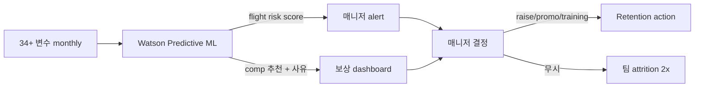

## Summary

IBM이 2019년 공개한 **Predictive Attrition Program** — Watson 기반 patented ML 모델이 34+ 변수(overtime·salary·역할·성과·통근거리)를 분석해 6개월 flight risk를 예측. ⚠️ 자사 보고: 95% 정확도, $300M 누적 retention saving (2023까지). 동일 인프라가 **AI Compensation Recommendation**으로 확장 — 매니저별 per-employee salary 추천 + 이유 설명. 매니저가 권고 무시 시 팀 attrition 2배.

## Problem / Why

- **Before**: 270K 직원 대상 retention 관리는 사후 exit interview 의존 — 떠난 후에야 원인 파악
- **Pain point**: 핵심인재 이탈 비용 (replacement cost 연봉의 1~3배) + 외부 채용 시장 경쟁 격화
- **Trigger**: 2010년대 HR analytics 부상 + Watson 자사 활용 dogfooding 명분

## Solution Architecture

### A. Process

- **Before**: exit interview·서베이 사후 분석
- **After**:
  1. ML 모델이 월간 데이터 갱신 → flight risk score 산출
  2. 위험군 매니저에게 alert + 권장 action menu (raise / promotion / training / mentoring)
  3. AI 보상 추천 — 매니저에게 per-employee salary 인상 권고 + supporting factors (flight risk·성과·시장)
  4. 매니저 결정 (승인/반려/조정)
- **HITL**: 매니저 100% 결정 권한 — AI는 nudge·explanation
- **Frequency**: monthly score, comp planning은 annual cycle
- **Scope of autonomy**: recommend-only

### B. System & Infrastructure

- **Core HRIS**: IBM 내부 (Workday)
- **AI 시스템**: IBM Watson 기반 (자체)
- **연동·통합**: HCM·payroll·performance·learning data 통합 데이터 레이크
- **사용자 접점**: 매니저 dashboard (Bluepages 통합 추정)

### C. Data

- **입력**: 34+ 변수 — overtime·salary·역할·성과·통근거리·승진 이력·학습·매니저 변경 등
- **데이터 규모**: 270K 직원 monthly snapshot
- **거버넌스**: IBM 내부, RBAC

### D. Model

- patented ML (LLM 이전) — feature engineering + supervised classifier
- ⚠️ 벤더 주장: 95% 정확도 (out-of-sample 검증 방법 _미공개_)
- explainable AI — supporting factor 표시

### E. Organization

- IBM HR Analytics + IBM Research

### F. Diagrams

## Impact / Metrics (기대효과)

### 기대효과 요약
ML 기반 사전 retention nudge로 핵심인재 이탈 90%까지 감소 (특정 그룹 사례), 누적 $300M saving 자사 보고.

- **Before → After (자사 보고)**:
  - retention 관리: 사후 exit 분석 → 6개월 사전 예측
  - flagged group에 10% raise → flight risk 90% 감소 (illustrative)
  - 매니저 권고 무시 시 팀 attrition 2배 — 채택 의무화 ROI 입증

## Governance & Risk

- ⚠️ 95%·$300M 수치 독립 검증 부재 (CNBC·Fortune·LinkedIn Talent Blog 모두 IBM 발표 전달)
- ⚠️ 모델 age (2019) — drift·feature obsolescence 가능성
- ⚠️ 매니저에게 score 노출 시 self-fulfilling prophecy 위험 (의도한 retention action 없이 manager가 "어차피 떠날 사람" 취급)
- ⚠️ Korean 노조·근로기준법 컨텍스트 — 보상 차등화 nudge가 단협 위반 가능성

## Consulting Angle

- **KR 적용 1순위**: 한국 대기업 핵심인재 retention 컨설팅의 **canonical reference**. 95% 수치는 ⚠️ 자사 보고로 표기하되 "ML score → manager nudge → action menu" 워크플로 자체는 한국 PA 팀이 가장 갈증 느끼는 패턴
- **반면교사 활용**: 모델 opacity·매니저 인지 부담·노조 리스크 — "responsible deployment" 슬라이드에 동시 인용
- **AI Compensation 차원**: 한국 대기업이 호봉제 → 직무·성과급 전환 시 explainable AI comp 추천이 line manager coaching 수단으로 활용 가능
- **Tier 1 검증 부재 caveat**: Bersin이 IBM HR transformation 일반 코멘트는 했으나 95%·$300M 독립 검증 안 함 — 임원 발표 인용 시 "IBM 자사 발표 기준" 명시 필수
