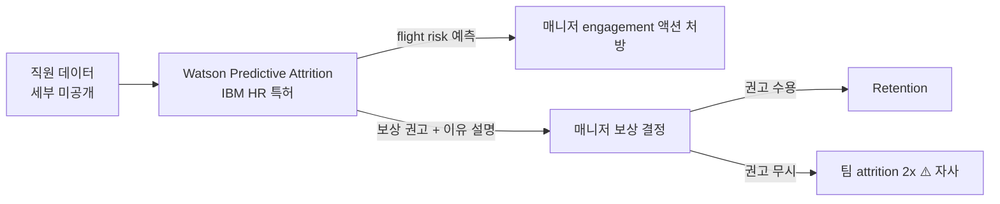

## Summary

IBM이 2019년 공개한 **Predictive Attrition Program** — IBM HR이 특허를 보유한 프로그램으로, Watson과 함께 개발해 직원 flight risk를 예측하고 매니저에게 engagement 액션을 처방 [[sources/cnbc-ibm-ai-predict-95-percent-quit-2019-04]]. ⚠️ 자사 보고(CEO Rometty, CNBC 2019-04): 퇴직 예정 직원 예측 정확도 95% "range", 누적 약 $300M retention 비용 절감; "secret sauce"는 비공개 [[sources/cnbc-ibm-ai-predict-95-percent-quit-2019-04]]. 동일 접근이 **보상 권고**로 확장 — ⚠️ 자사 보고(CHRO Gherson, Fortune 2019-07): 특정 그룹에 10% 인상 시 flight risk 90% 감소, 권고를 따르지 않은 매니저 팀의 attrition은 2배; 시스템이 권고 이유를 설명(black box 개방) [[sources/fortune-ibm-algorithm-pay-raise-2019-07]]. 기존 페이지의 "34+ 변수(overtime·통근거리 등)", "6개월 예측", "전 직원 monthly", "2023까지 누적", "action menu(raise/promotion/training/mentoring)"는 인용 소스 2건에 없어 _미공개_ 처리 (2026-09-27 grounding 점검).

## Problem / Why (도입 배경)

- **Before (baseline)**: ❓ baseline 미공개 — 기존 "사후 exit interview 의존" 서술은 소스에 없음
- **Pain point**: retention 비용 — IBM은 프로그램 효과를 retention cost 절감으로 측정 [[sources/cnbc-ibm-ai-predict-95-percent-quit-2019-04]]
- **Trigger**: _미공개 (not disclosed)_ — "경영진을 정확성으로 설득하는 데 시간이 걸렸다"(Rometty) [[sources/cnbc-ibm-ai-predict-95-percent-quit-2019-04]]

## Solution Architecture

### A. Process (프로세스)

- **Before**: _미공개 (not disclosed)_
- **After** (⚠️ 자사 보고 [[sources/cnbc-ibm-ai-predict-95-percent-quit-2019-04]] [[sources/fortune-ibm-algorithm-pay-raise-2019-07]]):
  1. AI가 직원 flight risk 예측 (predictive attrition program, Watson) [[sources/cnbc-ibm-ai-predict-95-percent-quit-2019-04]]
  2. 매니저에게 직원 engagement 액션 처방(prescribe actions) [[sources/cnbc-ibm-ai-predict-95-percent-quit-2019-04]]
  3. 보상 권고 — 데이터가 특정 그룹에 대한 인상 효과를 제시하고, 시스템이 권고 이유를 설명 [[sources/fortune-ibm-algorithm-pay-raise-2019-07]]
  4. 매니저 결정 — 권고를 따르지 않은 매니저 팀은 attrition 2배 [[sources/fortune-ibm-algorithm-pay-raise-2019-07]]
- **HITL**: 매니저가 권고 수용 여부 결정 [[sources/fortune-ibm-algorithm-pay-raise-2019-07]]
- **Frequency**: _미공개 (not disclosed)_ (frontmatter `monthly`는 분류값 — 소스 미확인)
- **Scope of autonomy**: recommend-only [[sources/cnbc-ibm-ai-predict-95-percent-quit-2019-04]] [[sources/fortune-ibm-algorithm-pay-raise-2019-07]]

### B. System & Infrastructure (시스템·인프라)

- **Core HRIS**: _미공개 (not disclosed)_
- **AI 시스템**: IBM Watson 기반 자체 개발, IBM HR 특허 [[sources/cnbc-ibm-ai-predict-95-percent-quit-2019-04]]
- **연동·통합**: _미공개 (not disclosed)_
- **사용자 접점**: _미공개 (not disclosed)_ — 매니저에게 권고·설명 제공 [[sources/fortune-ibm-algorithm-pay-raise-2019-07]]
- **인증·권한**: _미공개 (not disclosed)_

### C. Data (데이터)

- **입력**: _미공개 (not disclosed)_ — "secret sauce" 비공개 [[sources/cnbc-ibm-ai-predict-95-percent-quit-2019-04]]; 보상 권고는 "all the data" 기반 [[sources/fortune-ibm-algorithm-pay-raise-2019-07]]
- **데이터 규모**: _미공개 (not disclosed)_
- **거버넌스**: _미공개 (not disclosed)_

### D. Model (모델)

- **모델 유형**: Watson 기반 predictive (특허) [[sources/cnbc-ibm-ai-predict-95-percent-quit-2019-04]] — 알고리즘 세부 _미공개_
- **정확도**: ⚠️ 자사 보고: 95% "range" — 검증 방법 _미공개_ [[sources/cnbc-ibm-ai-predict-95-percent-quit-2019-04]]
- **설명가능성**: ⚠️ 자사 보고: 권고 이유를 매니저에게 설명 [[sources/fortune-ibm-algorithm-pay-raise-2019-07]]

### E. Organization

- **오너십**: IBM HR (특허 보유) [[sources/cnbc-ibm-ai-predict-95-percent-quit-2019-04]]; CHRO Diane Gherson [[sources/fortune-ibm-algorithm-pay-raise-2019-07]]; CEO Ginni Rometty [[sources/cnbc-ibm-ai-predict-95-percent-quit-2019-04]]
- **참여 역할·팀 규모**: _미공개 (not disclosed)_

### F. Diagrams (도식)

```mermaid
flowchart LR
    Data[직원 데이터<br/>세부 미공개] --> ML[Watson Predictive Attrition<br/>IBM HR 특허]
    ML -->|flight risk 예측| Alert[매니저 engagement 액션 처방]
    ML -->|보상 권고 + 이유 설명| Comp[매니저 보상 결정]
    Comp -->|권고 수용| Action[Retention]
    Comp -->|권고 무시| Risk[팀 attrition 2x ⚠️ 자사]
```

범례: 실선 = CNBC 2019 [[sources/cnbc-ibm-ai-predict-95-percent-quit-2019-04]]·Fortune 2019 [[sources/fortune-ibm-algorithm-pay-raise-2019-07]] 확인.

## Impact / Metrics (기대효과)

### 기대효과 요약
⚠️ 자사 보고: 95% 예측 정확도·약 $300M retention 절감 [[sources/cnbc-ibm-ai-predict-95-percent-quit-2019-04]]; 특정 그룹 10% 인상 → flight risk 90% 감소, 권고 무시 매니저 팀 attrition 2배 [[sources/fortune-ibm-algorithm-pay-raise-2019-07]].

- **Before → After (자사 보고)**:
  - flight risk 예측 정확도: 95% range (Rometty) [[sources/cnbc-ibm-ai-predict-95-percent-quit-2019-04]]
  - retention 비용 절감: 약 $300M 누적 (시점 _미공개_) [[sources/cnbc-ibm-ai-predict-95-percent-quit-2019-04]]
  - 특정 그룹 10% raise → flight risk 90% 감소 (일반화 불가 — 특정 그룹 사례) [[sources/fortune-ibm-algorithm-pay-raise-2019-07]]
  - 권고 무시 매니저 팀 attrition 2배 [[sources/fortune-ibm-algorithm-pay-raise-2019-07]]

## Governance & Risk

- ⚠️ 95%·$300M 수치 독립 검증 부재 (CNBC·Fortune 모두 IBM 발언 전달)
- ⚠️ 모델 age (2019) — drift·feature obsolescence 가능성
- ⚠️ 매니저에게 score 노출 시 self-fulfilling prophecy 위험
- ⚠️ Korean 노조·근로기준법 컨텍스트 — 보상 차등화 nudge가 단협 위반 가능성
- 규제 노출: 이탈 예측·보상 결정 관여 → AI 기본법 고영향 AI 검토 대상(`kr-high-impact-review`)·EU AI Act Annex III 4(b)

## Contradictions

> [!note] 2026-09-27 grounding — 인용 소스 2건(CNBC 2019-04, Fortune 2019-07) raw에 "34+ 변수", "overtime·salary·통근거리", "6개월 예측", "전 직원 monthly snapshot", "2023까지", "action menu(raise/promotion/training/mentoring)", "Workday", "Bluepages", "RBAC", "데이터 레이크", "IBM Research", "supervised classifier", "annual comp cycle" 서술이 없어 삭제·_미공개_ 처리. Blue Match·MYCA 언급은 [[ibm-blue-match-internal-mobility]] 참조.

## Consulting Angle

- **KR 적용 1순위**: 한국 대기업 핵심인재 retention 컨설팅의 **canonical reference**. 95% 수치는 ⚠️ 자사 보고로 표기하되 "ML score → manager nudge → action menu" 워크플로 자체는 한국 PA 팀이 가장 갈증 느끼는 패턴
- **반면교사 활용**: 모델 opacity·매니저 인지 부담·노조 리스크 — "responsible deployment" 슬라이드에 동시 인용
- **AI Compensation 차원**: 한국 대기업이 호봉제 → 직무·성과급 전환 시 explainable AI comp 추천이 line manager coaching 수단으로 활용 가능
- **Tier 1 검증 부재 caveat**: Bersin이 IBM HR transformation 일반 코멘트는 했으나 95%·$300M 독립 검증 안 함 — 임원 발표 인용 시 "IBM 자사 발표 기준" 명시 필수
