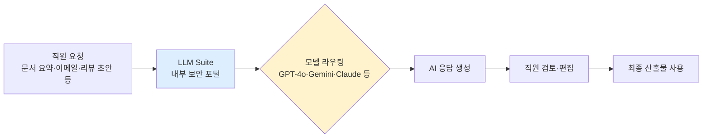

## Summary

JPMorgan Chase는 2024년 여름 자체 개발 생성형 AI 플랫폼 LLM Suite를 출시하여, 2024년 9월 기준 140,000명 직원에게 배포하고 이후 200,000명 이상으로 확대했다. ✅ **Fact** 이 플랫폼은 문서 요약, 이메일 초안, 아이디어 생성 등 지식 노동자의 일상 업무 전반을 지원하며, HR 영역에서는 성과 리뷰 초안 작성 기능이 특히 주목된다. 월가 최대 규모 LLM 배포 사례 중 하나다. [[sources/cnbc-jpmorgan-llm-suite-2024-08.md]]

## Problem / Why

JPMorgan는 200,000명 이상의 지식 노동자가 문서 작성, 데이터 분석, 코드 생성 등 반복적 고숙련 업무에 과도한 시간을 소비하는 문제에 직면했다. 기존에는 각 팀이 개별 AI 도구를 파편적으로 사용하거나 외부 LLM을 통해 민감 데이터가 유출될 위험이 있었다. 단일 보안 거버넌스 하에 엔터프라이즈 전반의 LLM 접근을 제공하는 것이 목적이었다.

## Solution Architecture

> **최우선 원칙**: 이 섹션은 **공개된 사실만** 기록한다.

### A. Process (프로세스)

- **Before (As-is)**: 직원이 개별적으로 외부 AI 도구 또는 전통적 검색·작성 도구를 사용. 성과 리뷰는 관리자가 수동으로 직접 작성.
- **After (To-be)**: ✅ **Fact** LLM Suite를 통해 문서 요약, 이메일·보고서 초안 작성, 아이디어 생성, 코드 작성을 AI 보조로 수행. 성과 리뷰 초안 작성에도 활용 가능(선택적). [[sources/aimagazine-jpmorgan-performance-2025.md]]
- **Human-in-the-loop (HITL) 지점**: ✅ **Fact** 성과 리뷰 AI 작성은 관리자의 선택 사항으로, AI가 초안을 생성하고 관리자가 최종 검토·편집. 완전 자율 결정 없음.
- **Trigger & Frequency**: 일상 업무 중 수시(on-demand) 사용. 성과 리뷰는 연간 주기.
- **Scope of autonomy**: Recommend(제안) 수준 — AI가 초안을 생성하고 인간이 최종 결정.

범례: 실선 = 소스 확인. 노드 내용 전부 [[sources/cnbc-jpmorgan-llm-suite-2024-08.md]] [[sources/tearsheet-jpmorgan-ai-2025.md]] 기반.

### B. System & Infrastructure (시스템·인프라)

- **Core HRIS / 기반 시스템**: _미공개 (not disclosed)_ — LLM Suite는 HR 시스템과의 통합 여부 미확인.
- **AI 시스템 배치**: ✅ **Fact** JPMorgan이 자체 개발한 내부 포털(LLM Suite)로 외부 LLM에 접근하는 모델 애그노스틱 구조. 민감 데이터가 외부로 유출되지 않도록 방화벽 내 운영. [[sources/cnbc-jpmorgan-llm-suite-2024-08.md]]
- **배포 환경**: _미공개 (not disclosed)_
- **연동·통합**: _미공개 (not disclosed)_
- **사용자 접점 (UX layer)**: ✅ **Fact** 웹 포털 형태로 직원이 직접 접근. [[sources/ciodive-jpmorgan-llm-suite-2024-09.md]]
- **인증·권한**: _미공개 (not disclosed)_
- **가용성·SLA**: _미공개 (not disclosed)_

### C. Data (데이터)

- **입력 데이터 소스**: 직원이 업로드하거나 입력하는 문서·텍스트. 내부 지식베이스 연동 여부 _미공개 (not disclosed)_.
- **데이터 규모**: ✅ **Fact** 140,000명(2024-09 기준) → 200,000명 이상(이후)으로 확대. [[sources/ciodive-jpmorgan-llm-suite-2024-09.md]]
- **전처리·정제**: _미공개 (not disclosed)_
- **학습 vs RAG vs In-context 구분**: _미공개 (not disclosed)_
- **데이터 거버넌스**: ✅ **Fact** 외부 LLM 벤더 방화벽 내 격리 운영으로 민감 데이터 외부 유출 차단. [[sources/cnbc-jpmorgan-llm-suite-2024-08.md]]
- **민감정보 처리**: _미공개 (not disclosed)_ — 금융 규제 적용 대상이나 세부 DPIA 내용 불명.
- **데이터 출처의 오너십**: 직원 입력 데이터.

### D. Model (모델)

- **Foundation model**: ✅ **Fact** OpenAI GPT-4o, GPT-4o-mini, o3-mini; Google Gemini 2.0 Flash, Gemini 1.5 Pro; Anthropic Claude 3.7 Sonnet; 오픈소스 모델 포함한 멀티모델 구조. [[sources/tearsheet-jpmorgan-ai-2025.md]]
- **Model 유형**: LLM (생성형), 멀티모델.
- **제공 방식**: ✅ **Fact** 다수 외부 벤더 상용 API를 내부 포털에서 라우팅하는 모델 애그노스틱 방식.
- **커스터마이징 기법**: _미공개 (not disclosed)_
- **Orchestration 프레임워크**: _미공개 (not disclosed)_
- **평가·가드레일**: _미공개 (not disclosed)_
- **비용·성능 지표**: ✅ **Fact** 직원 보고 30–40% 효율성 향상; 엔지니어링 팀 AI 코딩 어시스턴트 10–20% 효율 향상. ⚠️ **자사 보고**: JPMorgan 발표 수치이며 Tier 1·2 독립 검증 미확인. [[sources/tearsheet-jpmorgan-ai-2025.md]]

### E. Organization & Team (조직·팀 구조)

- **오너십**: ✅ **Fact** JPMorgan AI & Data Science 조직 주도 (CDAO Office). [[sources/tearsheet-jpmorgan-ai-2025.md]]
- **참여 역할**: _미공개 (not disclosed)_
- **팀 규모·기간**: _미공개 (not disclosed)_
- **거버넌스 체계**: _미공개 (not disclosed)_
- **변화관리**: _미공개 (not disclosed)_
- **파트너**: ✅ **Fact** OpenAI, Google, Anthropic 등 다수 모델 벤더와 협력.

## Impact / Metrics (기대효과)

### 기대효과 요약
Before: 수동 프로세스 기반, 생산성 성장 약 3% (⚠️ 자사 보고, Marianne Lake 발언) → After: ⚠️ 자사 보고 직원 30~40% 효율성 향상 (직원 자기 보고), 생산성 약 6%로 개선. 연간 AI 포트폴리오 전체 $1.5B 비즈니스 가치(Fact), 450+ 내부 AI use case 운영(Fact). HR 전용 분리 수치 _미공개_.

- ⚠️ **자사 보고**: 직원 30–40% 효율성 향상(직원 자기 보고) [[sources/tearsheet-jpmorgan-ai-2025.md]]
- ⚠️ **자사 보고**: Marianne Lake(CCB CEO) 발언 — 생산성 약 6% 상승(AI 도입 전 약 3%에서 개선) [[sources/aimagazine-jpmorgan-performance-2025.md]]
- ✅ **Fact**: 연간 AI 이니셔티브 비즈니스 가치 $1.5B(총 AI 포트폴리오 기준, HR 전용 분리 불명) [[sources/tearsheet-jpmorgan-ai-2025.md]]
- ✅ **Fact**: 2024년 기준 450개 이상의 내부 AI use case 운영 중. [[sources/tearsheet-jpmorgan-ai-2025.md]]

## Governance & Risk

- ✅ **Fact**: 외부 LLM을 사내 방화벽 내에서 격리 운영하여 데이터 유출 리스크 관리. [[sources/cnbc-jpmorgan-llm-suite-2024-08.md]]
- 성과 리뷰 AI 작성은 관리자 선택 사항으로 HITL 유지. [[sources/aimagazine-jpmorgan-performance-2025.md]]
- 모델 편향·공정성 감사 체계: _미공개 (not disclosed)_

## Contradictions

없음 (현재 기준).

## Consulting Angle

- **금융권 클라이언트 제안**: JPMorgan의 모델 애그노스틱 내부 포털 접근법은 "특정 벤더 종속 없이 최신 LLM을 보안 거버넌스 하에 기업 전체에 배포"하는 패턴의 강력한 레퍼런스. 국내 금융지주·보험사에 대한 AI 생산성 도입 제안 시 즉시 활용 가능.
- **HR 특수 각도**: 성과 리뷰 AI 초안 작성은 HR tech에서 가장 민감한 영역 중 하나. HITL 설계(관리자 선택적 사용)가 저항 완화와 규제 리스크 관리 모두를 충족하는 사례로 제시 가능.
- **파생 질문**: "한국 금융사(KB·신한·하나)가 유사 플랫폼을 내부 구축할 경우, 망분리 규제(금융위)와의 충돌을 어떻게 처리할 것인가?"
- **규모 참고**: 140,000→200,000명 배포 속도(약 6개월)는 대형 엔터프라이즈 LLM 롤아웃의 현실적 타임라인 벤치마크로 활용.
