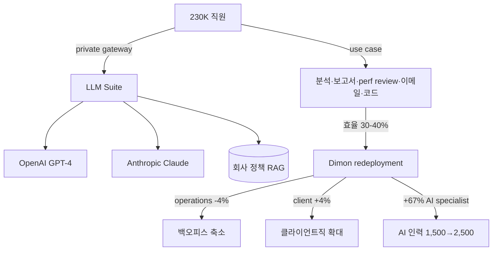

## Summary

JPMorgan **LLM Suite** — 2024 여름 launch, model-agnostic gateway (OpenAI + Anthropic), ~230K 직원 대상 8개월 만에 200K+ 온보딩 (~2/3 workforce). ⚠️ 자사 보고: 30-40% efficiency, 직원당 3-6h/week saved, $1.5B/yr 추정 가치. **핵심 distinct feature**: 직원이 LLM Suite로 **annual performance review 초안 drafting** 가능. 동시에 Dimon Feb 2026: 백오피스/operations -4%/-2%, 클라이언트직 +4% — 총 318,512명 거의 flat 유지하며 AI 재배치. AI specialist 1,500 → 2,500 (+67%).

## Problem / Why

- **Before**: 230K 직원 대규모 finance enterprise, 정보보안·규제 제약으로 외부 LLM(ChatGPT) 직접 사용 불가
- **Pain point**: gen AI 효익 vs 금융정보보호·고객정보·내부거래 정보 제약
- **Trigger**: 2023-24 ChatGPT 시장 도입 + 경쟁사(Goldman·Morgan Stanley) AI 배포 압박

## Solution Architecture

### A. Process

- **Before**: 직원이 외부 ChatGPT·Claude 등 사용 금지 (보안 정책). 내부 분석·보고서 작성 manual
- **After**:
  1. 직원이 LLM Suite (private gateway) 접속
  2. 모델 선택 (OpenAI GPT-4 / Anthropic Claude — agnostic)
  3. 내부 데이터 활용 가능 (RAG with 회사 정책·문서)
  4. 사용 사례:
     - 분석·보고서 drafting
     - **performance review 초안 작성** (HR 명시 use case)
     - 회의 요약·이메일 작성
     - 코드 리뷰·생성
  5. 동시에 Dimon은 AI 효율을 **redeployment** 명분으로 활용 — 백오피스 폐지·클라이언트직 신설
- **HITL**: 모든 산출물 사람 검토·승인. 매니저가 performance review 최종 결정
- **Frequency**: daily 사용

### B. System & Infrastructure

- **Core**: JPMorgan 자체 구축 LLM Suite (private cloud, 추정 AWS·Azure 혼합)
- **AI 시스템**: model-agnostic gateway architecture
- **연동·통합**: 내부 데이터·정책 RAG, 직원 ID·권한 SSO
- **사용자 접점**: web app (사내 인증)

### C/D. Data & Model

- **Foundation model**: OpenAI GPT-4 + Anthropic Claude (선택 가능)
- **데이터**: 230K 직원 활용 데이터 + 회사 정책·문서 RAG
- **거버넌스**: 금융정보보호 강화 — 외부 model API call도 private 통제
- **Model 유형**: LLM (생성·요약), agentic 실험 진행 추정

### E. Organization

- JPMorgan AI Research + IT Plat팀 + HR (review drafting use case 협업)
- AI specialist: 1,500 → 2,500 (+67%, Dimon)

### F. Diagrams

## Impact / Metrics

### 기대효과 요약
private gateway로 보안 유지하며 230K 직원 gen AI 활용 + AI 재배치로 백오피스 축소·클라이언트직 확대 (총 headcount flat 유지).

- ⚠️ 자사 보고:
  - 30-40% efficiency gains
  - 직원당 3-6h/week saved
  - 200K+ onboarded in 8 months (~2/3 workforce)
  - $1.5B/yr 추정 AI value
  - operations 6% more accounts/employee
  - fraud cost/unit -11%
  - 소프트웨어 엔지니어 productivity +10%
  - AI specialist 1,500 → ~2,500 (+67%)
  - 총 headcount: 318,512명 (거의 flat 유지하며 redeployment)

## Governance & Risk

- ✅ private gateway 모델은 금융정보보호 best practice — KR 금융권 강력 reference
- ⚠️ "performance review 초안 drafting" 기능의 인적감독 의무 (한국 AI 기본법 고영향 AI 분류 가능성) — 매니저 검토 필수 명시
- ⚠️ model-agnostic 구조의 model drift·버전 관리 거버넌스 _세부 미공개_
- ⚠️ 30-40%·$1.5B 수치 ⚠️ 자사 보고 — 독립 검증 부재

## Consulting Angle

- **KR 금융권 직격 reference (1순위)**:
  - KB·신한·우리·하나금융 모두 자체 LLM 플랫폼 구축 중 (신한 AI ONE, 하나 지식챗봇, 미래에셋 AI Assistant) — JPMorgan LLM Suite의 **model-agnostic gateway 아키텍처**가 직접 reference
  - 230K 직원 onboarding 8개월 모델 — 한국 대형 은행(KB 17K·신한 14K) 적용 시 6개월 미만 완료 가능성
- **AI 재배치 패러다임 (KR 핵심 어젠다)**:
  - Dimon "operations -4%, client +4%" — IBM 사례 [[ibm-hr-workforce-reduction-agentic]]와 함께 KR 임원 발표 핵심 슬라이드
  - **한국 노동법·노조 컨텍스트에서 "감원"보다 "재배치·reskilling" frame 권장** — Dimon 사례가 가장 fit
- **performance review drafting**: KR 대기업 평가 부담 경감 — 단, 한국 AI 기본법 인적감독 의무 자동 충족 설계 필수
- **AI specialist 67% 증가**: KR 대기업 AI 인력 확보 전략에 quantitative reference (1,500→2,500 = 글로벌 mid-tier IT 회사 1개 규모 신규 채용)
- **반면교사**: $1.5B/yr 가치 등 ⚠️ 자사 보고 수치 — 외부 인용 시 출처·표기 명시 필수
