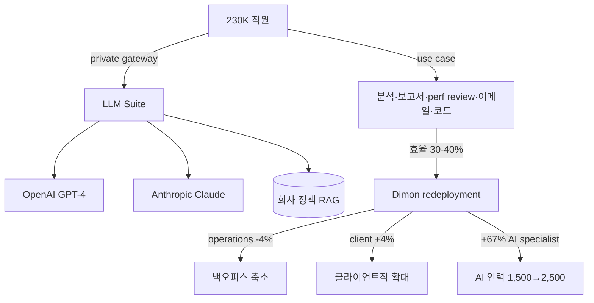

## Summary

JPMorgan **LLM Suite** — 2024 여름 launch, model-agnostic gateway (OpenAI + Anthropic), ~230K 직원 대상 8개월 만에 200K+ 온보딩 (~2/3 workforce). ⚠️ 자사 보고: 30-40% efficiency, 직원당 3-6h/week saved, $1.5B/yr 추정 가치. **핵심 distinct feature**: 직원이 LLM Suite로 **annual performance review 초안 drafting** 가능. 동시에 Dimon Feb 2026: 백오피스/operations -4%/-2%, 클라이언트직 +4% — 총 318,512명 거의 flat 유지하며 AI 재배치. AI specialist 1,500 → 2,500 (+67%). Dimon(2025-10): "AI가 사람들을 displaced 했고 우리는 그들에게 다른 일자리를 제공한다" + 매니저 채용 자제 지시 (⚠️ 자사 보고 — CEO 발언, HR Executive·CNBC 전달). 2026-09-27 `jpmorgan-goldman-sachs-hr-ai` 합본 페이지의 JPM 사실을 이 페이지로 이관.

## Problem / Why (도입 배경)

- **Before**: 230K 직원 대규모 finance enterprise, 정보보안·규제 제약으로 외부 LLM(ChatGPT) 직접 사용 불가
- **Pain point**: gen AI 효익 vs 금융정보보호·고객정보·내부거래 정보 제약
- **Trigger**: 2023-24 ChatGPT 시장 도입 + 경쟁사(Goldman·Morgan Stanley) AI 배포 압박

## Solution Architecture

### A. Process (프로세스)

- **Before**: 직원이 외부 ChatGPT·Claude 등 사용 금지 (보안 정책). 내부 분석·보고서 작성 manual
- **After**:
  1. 직원이 LLM Suite (private gateway) 접속
  2. 모델 선택 (OpenAI GPT-4 / Anthropic Claude — agnostic)
  3. 내부 데이터 활용 가능 (RAG with 회사 정책·문서)
  4. 사용 사례:
     - 분석·보고서 drafting
     - **performance review 초안 작성** (HR 명시 use case)
     - 회의 요약·이메일 작성
     - 코드 리뷰·생성
  5. 동시에 Dimon은 AI 효율을 **redeployment** 명분으로 활용 — 백오피스 폐지·클라이언트직 신설
  6. (병합 이관, CNBC 2025-10-15) ✅ LLM Suite는 8회 메이저 업그레이드로 custom assistant·문서 분석·시각화·모바일·접근성 기능 추가. HR 활용: 정책 Q&A·성과 리뷰 초안·JD 작성·learning 콘텐츠 합성 — ⚠️ HR 한정 use case는 일반 productivity tool에 가까움, HR-specific 모듈 별도 발표 _미공개_
- **HITL**: 모든 산출물 사람 검토·승인. 매니저가 performance review 최종 결정. (병합 이관) 클라이언트 산출물·코드는 senior 검토, 컴플라이언스 팀이 audit log 모니터링
- **Frequency**: daily 사용

### B. System & Infrastructure (시스템·인프라)

- **Core**: JPMorgan 자체 구축 LLM Suite (private cloud, 추정 AWS·Azure 혼합)
- **AI 시스템**: model-agnostic gateway architecture
- **연동·통합**: 내부 데이터·정책 RAG, 직원 ID·권한 SSO
- **사용자 접점**: web app (사내 인증)

### C/D. Data & Model

- **Foundation model**: OpenAI GPT-4 + Anthropic Claude (선택 가능)
- **데이터**: 230K 직원 활용 데이터 + 회사 정책·문서 RAG
- **거버넌스**: 금융정보보호 강화 — 외부 model API call도 private 통제. (병합 이관, CNBC 2025-10-15) ✅ 모든 prompt·response는 firewall 내 audit trail에 기록·컴플라이언스 모니터링, 외부 ChatGPT 차단, 모델 swap 시 재학습 불필요; 사내 KM·문서·Excel/data 시스템 연결은 ⚠️ 자사 보고
- **Model 유형**: LLM (생성·요약), agentic 실험 진행 추정

### E. Organization

- JPMorgan AI Research + IT Plat팀 + HR (review drafting use case 협업)
- AI specialist: 1,500 → 2,500 (+67%, Dimon)

### F. Diagrams (도식)

```mermaid
flowchart TB
    Emp[230K 직원] -->|private gateway| Suite[LLM Suite]
    Suite --> GPT[OpenAI GPT-4]
    Suite --> Claude[Anthropic Claude]
    Suite --> RAG[(회사 정책 RAG)]
    Emp -->|use case| Use[분석·보고서·perf review·이메일·코드]
    Use -->|효율 30-40%| Reinvest[Dimon redeployment]
    Reinvest -->|operations -4%| Ops[백오피스 축소]
    Reinvest -->|client +4%| Client[클라이언트직 확대]
    Reinvest -->|+67% AI specialist| Spec[AI 인력 1,500→2,500]
```

## Impact / Metrics (기대효과)

### 기대효과 요약
private gateway로 보안 유지하며 230K 직원 gen AI 활용 + AI 재배치로 백오피스 축소·클라이언트직 확대 (총 headcount flat 유지).

- ⚠️ 자사 보고:
  - 30-40% efficiency gains
  - 직원당 3-6h/week saved
  - 200K+ onboarded in 8 months (~2/3 workforce)
  - $1.5B/yr 추정 AI value
  - operations 6% more accounts/employee
  - fraud cost/unit -11%
  - 소프트웨어 엔지니어 productivity +10%
  - AI specialist 1,500 → ~2,500 (+67%)
  - 총 headcount: 318,512명 (거의 flat 유지하며 redeployment)

## CEO 발언·채용 억제·ML 채용 도구 (2026-09-27 병합 이관)

> 출처: 舊 `jpmorgan-goldman-sachs-hr-ai` 합본 페이지 — CNBC 2025-10-15, HR Executive, HR Dive (frontmatter sources 참조)

- ⚠️ **자사 보고 (CEO 발언, Bloomberg → HR Executive 전달)**: CEO Jamie Dimon — "AI가 사람들을 **displaced** 했고, 우리는 그들에게 **다른 일자리를 제공**한다"
- ⚠️ **자사 보고 (CNBC 2025-10-15)**: 매니저에게 **채용 자제** 지시 — AI를 every client experience·employee process·backend operation에 주입하면서 신규 채용 회피
- ✅ **Fact**: ML 기반 채용 도구 **특허 출원** — employee public data + 네트워크 분석 → 후보자 **confidence score** 생성 (적합도·접촉 용이성·적극적 구직 여부 예측). 병합 전 페이지에 개별 출처 귀속 없음 — 위 3개 소스 중 어느 것인지 재확인 필요
- ✅ **Fact (HR Dive 보도)**: 은행 업계 전체에서 AI model development·platform engineering·project management 기술자 **13% 증가** (JPMorgan·Wells Fargo·Citigroup 주도)
- ✅ **Fact (CNBC 2025-10-15)**: LLM Suite 200K+ 직원 배포, OpenAI 백엔드(private gateway) — 이 페이지 Summary 수치와 일치

## Governance & Risk

- ✅ private gateway 모델은 금융정보보호 best practice — KR 금융권 강력 reference
- ⚠️ "performance review 초안 drafting" 기능의 인적감독 의무 (한국 AI 기본법 고영향 AI 분류 가능성) — 매니저 검토 필수 명시
- ⚠️ model-agnostic 구조의 model drift·버전 관리 거버넌스 _세부 미공개_
- ⚠️ 30-40%·$1.5B 수치 ⚠️ 자사 보고 — 독립 검증 부재

## Contradictions

> [!note] 2026-09-27 합본 페이지 병합
> `jpmorgan-goldman-sachs-hr-ai` (JPM + Goldman 합본, Talent Acquisition / Sourcing & Attraction, confidence 0.40) 삭제. JPM 사실은 이 페이지로, Goldman 사실은 [[goldman-sachs-gs-ai-assistant]]로, 금융 산업 공통 인사이트는 [[industry-region-landscape]]로 분산 이관. 수치 충돌 없음 — LLM Suite 200K+·OpenAI 백엔드는 양 페이지 일치.

## Consulting Angle

- **KR 금융권 직격 reference (1순위)**:
  - KB·신한·우리·하나금융 모두 자체 LLM 플랫폼 구축 중 (신한 AI ONE, 하나 지식챗봇, 미래에셋 AI Assistant) — JPMorgan LLM Suite의 **model-agnostic gateway 아키텍처**가 직접 reference
  - 230K 직원 onboarding 8개월 모델 — 한국 대형 은행(KB 17K·신한 14K) 적용 시 6개월 미만 완료 가능성
- **AI 재배치 패러다임 (KR 핵심 어젠다)**:
  - Dimon "operations -4%, client +4%" — IBM 사례 [[ibm-hr-workforce-reduction-agentic]]와 함께 KR 임원 발표 핵심 슬라이드
  - **한국 노동법·노조 컨텍스트에서 "감원"보다 "재배치·reskilling" frame 권장** — Dimon 사례가 가장 fit
- **performance review drafting**: KR 대기업 평가 부담 경감 — 단, 한국 AI 기본법 인적감독 의무 자동 충족 설계 필수
- **AI specialist 67% 증가**: KR 대기업 AI 인력 확보 전략에 quantitative reference (1,500→2,500 = 글로벌 mid-tier IT 회사 1개 규모 신규 채용)
- **반면교사**: $1.5B/yr 가치 등 ⚠️ 자사 보고 수치 — 외부 인용 시 출처·표기 명시 필수
- **Dimon "displaced but offered other jobs"** (병합 이관): IBM Krishna의 "replaced but elevated"와 **같은 패턴이지만 더 솔직한 표현** — 재배치 frame의 임원 발언 사례로 인용
- **ML 채용 특허** (병합 이관): 네트워크 기반 후보자 탐색은 passive recruiting의 진화 — 채용 억제 기조와 동시에 진행되는 점이 특징
