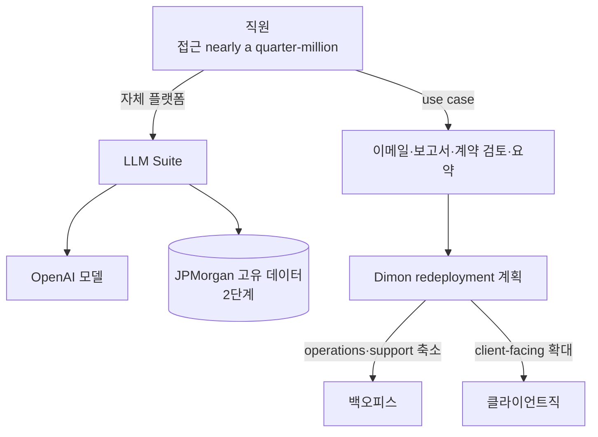

## Summary

JPMorgan **LLM Suite** — 2024-08 CNBC 보도: OpenAI 모델 기반 자체 생성형 AI 플랫폼, 60,000명+ 직원에게 제공(전 직원 약 313,000명), 이메일·보고서 작성 지원, 향후 Zoom처럼 전사 보편화 예정; 2단계로 JPMorgan 고유 데이터 결합 착수 [[sources/cnbc-jpmorgan-llm-suite-2024-08]]. McKinsey 인터뷰(Waldron): "nearly a quarter-million people" 접근, 직원의 절반 조금 못 미치는 인원이 매일 사용, 챗봇에서 "full ecosystem"으로 진화 [[sources/mckinsey-jpmorgan-derek-waldron-ai-first-2024-10]]. HR Executive 2026-03: Dimon "AI로 displaced된 사람들에게 다른 일자리를 제공", 전체 headcount는 거의 flat — 클라이언트 대면 직무 확대·operations/support 축소(Barnum), 소비자금융 operations 직원당 계좌 처리 6%↑, 15만 명이 매주 LLM 플랫폼 사용, 직원 자체 추산 주당 약 4시간 절감 [[sources/hrexecutive-jpmorgan-dimon-ai-redeployment-2026-03]]. CNBC 2025-10: 매니저에게 채용 자제 지시(Barnum) [[sources/cnbc-jpmorgan-goldman-ai-hiring-2025-10]]. 기존 "전 직원 수·8개월 onboarding 인원", "efficiency 퍼센트", "주당 절감 시간 범위", "연간 AI 가치(달러)", "OpenAI+Anthropic model-agnostic", "부문별 증감률·정확한 총 인원", "AI specialist 인원 증가율", "performance review 초안", "fraud -11%·SWE +10%", "8회 업그레이드·audit trail", "ML 채용 특허", "HR Dive 13%"는 인용 소스 raw에 없어 삭제·_미공개_ 처리 (2026-09-27 grounding 점검).

## Problem / Why (도입 배경)

- **Before (baseline)**: 직원의 외부 ChatGPT 사용 제한 맥락 — CNBC는 ChatGPT 출시(2022 말) 이후 은행권 대응을 배경으로 기술 [[sources/cnbc-jpmorgan-llm-suite-2024-08]]; 정량 baseline ❓ 미공개
- **Pain point**: 대규모 long tail 업무를 우선순위 프로젝트로는 못 다룸 → 민주화된 self-service 도구 필요 (Waldron) [[sources/mckinsey-jpmorgan-derek-waldron-ai-first-2024-10]]
- **Trigger**: 경쟁사 Morgan Stanley의 OpenAI 기반 도구 출시 등 시장 흐름 [[sources/cnbc-jpmorgan-llm-suite-2024-08]]

## Solution Architecture

### A. Process (프로세스)

- **Before**: _미공개 (not disclosed)_
- **After**:
  1. 직원이 LLM Suite(자체 플랫폼) 접속 — OpenAI 모델 기반 [[sources/cnbc-jpmorgan-llm-suite-2024-08]]
  2. 이메일·보고서 작성 등 업무 지원 [[sources/cnbc-jpmorgan-llm-suite-2024-08]]; 계약 검토(법무)·covenant 비교(신용)·정보 요약(영업) 등 직무별 활용 [[sources/mckinsey-jpmorgan-derek-waldron-ai-first-2024-10]]
  3. 2단계: JPMorgan 고유 데이터 결합 [[sources/cnbc-jpmorgan-llm-suite-2024-08]] → 팀 지식·전사 데이터·앱과 연결된 ecosystem [[sources/mckinsey-jpmorgan-derek-waldron-ai-first-2024-10]]
  4. AI 효율을 바탕으로 redeployment 계획 운영 — displaced 인력에 다른 직무 제공 [[sources/hrexecutive-jpmorgan-dimon-ai-redeployment-2026-03]]; 매니저 채용 자제 [[sources/cnbc-jpmorgan-goldman-ai-hiring-2025-10]]
  5. performance review 초안 작성: _미공개 (not disclosed)_ — 인용 소스에 없음
- **HITL**: _미공개 (not disclosed)_ — 산출물 검토·승인 절차 소스에 없음
- **Frequency**: 매일 사용 (직원 절반 조금 못 미침) [[sources/mckinsey-jpmorgan-derek-waldron-ai-first-2024-10]]; 15만 명 주간 사용 [[sources/hrexecutive-jpmorgan-dimon-ai-redeployment-2026-03]]

### B. System & Infrastructure (시스템·인프라)

- **Core**: JPMorgan 자체 구축 LLM Suite [[sources/cnbc-jpmorgan-llm-suite-2024-08]]; 배포 환경(클라우드 종류) _미공개 (not disclosed)_
- **AI 시스템**: OpenAI 모델 기반 [[sources/cnbc-jpmorgan-llm-suite-2024-08]]; model-agnostic 구조 여부 _미공개_
- **연동·통합**: 팀 지식 시스템·전사 데이터 시스템·앱·프레젠테이션/데이터 분석/보고서 도구 연결 (진화 방향) [[sources/mckinsey-jpmorgan-derek-waldron-ai-first-2024-10]]
- **사용자 접점**: _미공개 (not disclosed)_

### C. Data (데이터)

- **입력 데이터 소스**: 직원 프롬프트; 2단계에서 JPMorgan 고유 데이터 [[sources/cnbc-jpmorgan-llm-suite-2024-08]]
- **데이터 규모**: 접근 인원 nearly a quarter-million [[sources/mckinsey-jpmorgan-derek-waldron-ai-first-2024-10]]; 주간 사용 15만 명 [[sources/hrexecutive-jpmorgan-dimon-ai-redeployment-2026-03]]; 2024-08 기준 60,000명+ [[sources/cnbc-jpmorgan-llm-suite-2024-08]]
- **전처리·정제**: _미공개 (not disclosed)_
- **학습 vs RAG vs In-context**: 고유 데이터 결합 방식 _미공개 (not disclosed)_
- **데이터 거버넌스**: _미공개 (not disclosed)_ — 기존 "audit trail·firewall" 서술은 인용 소스에 없음
- **민감정보 처리**: _미공개 (not disclosed)_

### D. Model (모델)

- **Foundation model**: OpenAI 모델 [[sources/cnbc-jpmorgan-llm-suite-2024-08]] — 버전 _미공개_; Anthropic 병용은 인용 소스에 없음
- **Model 유형**: LLM (생성·요약) [[sources/cnbc-jpmorgan-llm-suite-2024-08]] [[sources/mckinsey-jpmorgan-derek-waldron-ai-first-2024-10]]; agentic 확장은 Waldron이 향후 과제로 언급 [[sources/mckinsey-jpmorgan-derek-waldron-ai-first-2024-10]]
- **제공 방식**: 자체 플랫폼 경유 상용 모델 [[sources/cnbc-jpmorgan-llm-suite-2024-08]]
- **커스터마이징 기법**: 고유 데이터 결합(2단계) [[sources/cnbc-jpmorgan-llm-suite-2024-08]] — 방식 _미공개_
- **평가·가드레일**: _미공개 (not disclosed)_ — Waldron: agentic 시스템의 신뢰 검증이 과제 [[sources/mckinsey-jpmorgan-derek-waldron-ai-first-2024-10]]

### E. Organization

- **오너십**: Derek Waldron(Chief Analytics Officer) [[sources/mckinsey-jpmorgan-derek-waldron-ai-first-2024-10]]; CTO Heitsenrether [[sources/cnbc-jpmorgan-llm-suite-2024-08]]; CEO Dimon·CFO Barnum(재배치·채용 방침) [[sources/hrexecutive-jpmorgan-dimon-ai-redeployment-2026-03]] [[sources/cnbc-jpmorgan-goldman-ai-hiring-2025-10]]
- **AI 인력 규모**: _미공개 (not disclosed)_ — 기존 "1,500→2,500" 수치는 인용 소스에 없음
- **참여 역할·팀 규모**: _미공개 (not disclosed)_

### F. Diagrams (도식)

```mermaid
flowchart TB
    Emp[직원<br/>접근 nearly a quarter-million] -->|자체 플랫폼| Suite[LLM Suite]
    Suite --> GPT[OpenAI 모델]
    Suite --> Data[(JPMorgan 고유 데이터<br/>2단계)]
    Emp -->|use case| Use[이메일·보고서·계약 검토·요약]
    Use --> Redeploy[Dimon redeployment 계획]
    Redeploy -->|operations·support 축소| Ops[백오피스]
    Redeploy -->|client-facing 확대| Client[클라이언트직]
```

범례: 실선 = CNBC 2024 [[sources/cnbc-jpmorgan-llm-suite-2024-08]]·McKinsey [[sources/mckinsey-jpmorgan-derek-waldron-ai-first-2024-10]]·HR Executive 2026 [[sources/hrexecutive-jpmorgan-dimon-ai-redeployment-2026-03]] 확인. 비율·인원 수치는 인용 소스에 없어 노드에서 제외.

## Impact / Metrics (기대효과)

### 기대효과 요약
자체 플랫폼으로 전사 gen AI 활용 + AI 재배치로 operations 축소·클라이언트직 확대(총 headcount 거의 flat). 정량 수치는 ⚠️ 자사 보고.

- ⚠️ 자사 보고:
  - 접근 인원 nearly a quarter-million; 매일 사용 절반 조금 못 미침 [[sources/mckinsey-jpmorgan-derek-waldron-ai-first-2024-10]]
  - 주간 사용 15만 명; 직원 자체 추산 주당 약 4시간 절감 (Dimon: 정량화 한계 인정) [[sources/hrexecutive-jpmorgan-dimon-ai-redeployment-2026-03]]
  - 소비자금융 operations 직원당 계좌 처리 6%↑ [[sources/hrexecutive-jpmorgan-dimon-ai-redeployment-2026-03]]
  - gen AI use case 1년 새 2배 [[sources/hrexecutive-jpmorgan-dimon-ai-redeployment-2026-03]]
  - AI 프로그램 gross benefit 연 30~40% 성장 [[sources/mckinsey-jpmorgan-derek-waldron-ai-first-2024-10]]
  - 총 headcount 거의 flat — 클라이언트직 확대·operations/support 축소 [[sources/hrexecutive-jpmorgan-dimon-ai-redeployment-2026-03]]
  - 2026 기술 예산 약 $19.8B (+10% YoY) [[sources/hrexecutive-jpmorgan-dimon-ai-redeployment-2026-03]]
  - efficiency %·연간 AI 가치($)·AI specialist 수·부문별 증감률: _미공개 (not disclosed)_

## CEO 발언·채용 억제 (2026-09-27 병합 이관)

- ⚠️ **자사 보고 (CEO 발언, HR Executive 전달)**: Dimon — "AI로 displaced된 사람들이 있고, 우리는 그들에게 다른 일자리를 제공한다"; redeployment 계획을 상시 관리 기능으로 운영 [[sources/hrexecutive-jpmorgan-dimon-ai-redeployment-2026-03]]
- ⚠️ **자사 보고 (CNBC 2025-10-15)**: 매니저에게 채용 자제 지시 — 호황기에도 채용 인원 축소 [[sources/cnbc-jpmorgan-goldman-ai-hiring-2025-10]]
- ML 기반 채용 도구 특허·은행권 AI 기술자 13% 증가(HR Dive): _미공개 (not disclosed)_ — 인용 소스에 없음(舊 합본 페이지 출처 미귀속)

## Governance & Risk

- ✅ 자체 플랫폼 경유 상용 모델 사용은 금융권 reference — 단 보안 아키텍처 세부 _미공개_
- ⚠️ performance review 초안 기능은 인용 소스에서 미확인 — 한국 AI 기본법 고영향 AI 논의는 확인 후
- ⚠️ 시간 절감 수치는 직원 자체 추산(Dimon 정량화 한계 인정) [[sources/hrexecutive-jpmorgan-dimon-ai-redeployment-2026-03]]; Waldron도 정밀 정량화하지 않음 [[sources/mckinsey-jpmorgan-derek-waldron-ai-first-2024-10]]
- ⚠️ 재배치 규모·비율 _미공개_ — "displaced" 인원 수 없음

## Contradictions

> [!note] 2026-09-27 합본 페이지 병합
> `jpmorgan-goldman-sachs-hr-ai` (JPM + Goldman 합본) 삭제. JPM 사실은 이 페이지로, Goldman 사실은 [[goldman-sachs-gs-ai-assistant]]로 이관.

> [!note] 2026-09-27 grounding — 인용 소스 4건 raw 대조 결과: "230K 직원·200K+ 8개월 onboarding", "efficiency 퍼센트"(실제 McKinsey 원문은 AI 프로그램 gross benefit의 연 30~40% 성장), "주당 절감 시간 범위"(HR Executive 원문은 약 4시간), "연간 AI 가치(달러)", "OpenAI + Anthropic model-agnostic", "부문별 증감률·정확한 총 인원", "AI specialist 인원 증가", "performance review 초안", "fraud -11%·SWE +10%", "8회 업그레이드·custom assistant·audit trail·firewall", "ML 채용 특허", "HR Dive 13%", "Bloomberg 전달"은 어느 raw에도 없어 삭제·_미공개_. frontmatter `output`·`vendor`(Anthropic)·title은 기존 서술 유지 중 — 재검토 필요.

## Consulting Angle

- **KR 금융권 직격 reference (1순위)**:
  - KB·신한·우리·하나금융 모두 자체 LLM 플랫폼 구축 중 (신한 AI ONE, 하나 지식챗봇, 미래에셋 AI Assistant) — JPMorgan LLM Suite의 **model-agnostic gateway 아키텍처**가 직접 reference
  - 대규모 onboarding 모델(접근 nearly a quarter-million) — 한국 대형 은행 적용 시 기간 추산은 소스 수치 확보 후
- **AI 재배치 패러다임 (KR 핵심 어젠다)**:
  - Dimon·Barnum "operations/support 축소, client-facing 확대, headcount flat" — IBM 사례 [[ibm-hr-workforce-reduction-agentic]]와 함께 KR 임원 발표 핵심 슬라이드 (부문별 % 수치는 _미공개_)
  - **한국 노동법·노조 컨텍스트에서 "감원"보다 "재배치·reskilling" frame 권장** — Dimon 사례가 가장 fit
- **performance review drafting**: 인용 소스에서 미확인(_미공개_) — 확인 시 KR 대기업 평가 부담 경감 angle + 한국 AI 기본법 인적감독 설계 논의
- **AI 인력 확대**: 구체 인원 수치는 _미공개_ — 확보 시 KR 대기업 AI 인력 확보 전략의 quantitative reference
- **반면교사**: 주당 4시간 절감·6% 등 ⚠️ 자사 보고 수치 — 외부 인용 시 출처·표기 명시 필수; 연간 AI 가치($)는 _미공개_
- **Dimon "displaced but offered other jobs"** (병합 이관): IBM Krishna의 "replaced but elevated"와 **같은 패턴이지만 더 솔직한 표현** — 재배치 frame의 임원 발언 사례로 인용
- **ML 채용 특허** (병합 이관): 인용 소스에서 미확인(_미공개_) — 출처 확보 후 passive recruiting 진화 사례로 활용
