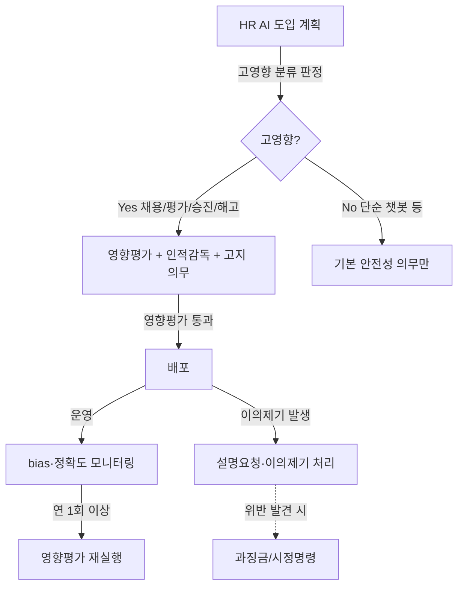

## Summary

「인공지능 발전·신뢰 기반 조성 등에 관한 기본법」(통칭 'AI 기본법')이 **2026-01-22 본격 시행**. EU AI Act에 이은 세계 2번째 포괄규제. **고영향 AI(high-impact AI)** 카테고리에 채용·인사평가·승진·해고 의사결정 AI가 명시적으로 포함됨. 영향평가·투명성 고지·인적 감독·이용자 권리 보장 의무. 모든 KR HR AI 프로젝트의 legal foundation. 2026-08 EU AI Act high-risk 의무 발효와 결합되면 글로벌 KR 대기업은 dual compliance 운영 부담.

## Problem / Why (도입 배경)

- **Before (baseline)**: 한국은 AI 거버넌스를 개인정보보호법(PIPA) 자동화된 결정 조항·차별금지법 등으로 산발 규율. HR AI 도입사도 자체 가이드라인에 의존 (ex. SK·삼성).
- **Pain point**: 채용 AI(마이다스 inAIR·SK AICT·원티드 AI Agent) 도입 가속화에도 불구하고 "이 AI가 합법인지", "지원자 권리는 어떻게 보장되는지", "차별 발생 시 책임은 누구인지" 가 회색 지대.
- **Trigger**: EU AI Act 발효(2024) + OECD AI 원칙 + 국내 마이다스 AI 면접 차별 논란(2020~) → 한국 정부가 2024년 입법 → 2025-01-21 공포 → **2026-01-22 시행**.

## Solution Architecture

> 본 페이지는 "use case"가 아닌 "규제·컴플라이언스 framework"를 다룬다. Solution Architecture는 *기업이 의무를 이행하는 운영 구조* 관점으로 작성.

### A. Process (의무 이행 프로세스)

- **Before (As-is)**: HR AI 도입 시 자체 윤리 가이드라인·DPIA(GDPR)만 적용, 한국 법적 의무 명시 부재
- **After (To-be)**:
  1. **AI 도입 전**: 고영향 AI 분류 판정 (채용·인사평가·승진·해고 → 자동 분류)
  2. **영향평가 (impact assessment)**: 차별·편향·정확도 등 사전 평가 — 시행령 가이드라인 (2026 상반기 추가 고시 예정)
  3. **이용자 고지**: 지원자·직원에게 "AI가 의사결정에 사용됨" 명시
  4. **인적 감독 (human oversight)**: 최종 결정에 사람의 검토·승인 단계 필수
  5. **이용자 권리 보장**: 결과 설명 요청권, 이의제기권
  6. **운영 모니터링**: bias drift·정확도 변화 정기 점검
- **HITL**: 모든 고영향 AI 결정에 사람 개입 필수 — 단순 추천도 채용·평가·승진·해고와 직결 시 적용
- **Trigger & Frequency**: 신규 AI 도입(adhoc) + 분기/연 정기 영향평가 + bias 모니터링 (continuous)
- **Scope of autonomy**: 고영향 AI는 **autonomous decision 금지** — 항상 사람의 승인 필요

### B. System & Infrastructure (의무 이행 인프라)

- **거버넌스 시스템**: AI 자산 인벤토리 + 영향평가 도큐먼트 관리 + 감사 로그
- **추천 솔루션 카테고리**: Workday ASOR 등 [[workday-agent-system-of-record-asor]], 자체 GRC tool
- **연동·통합**: ATS·HRIS·LMS 등 모든 HR 시스템에서 AI 사용 부분 추적
- **사용자 접점**: HRBP·legal·DPO·AI 위원회 (사람), 지원자/직원에게는 채용·평가 process 내 AI 고지
- **인증·권한**: AI 운영자·감사자·HRBP 권한 분리

### C. Data (의무 데이터 관리)

- **입력 데이터 소스**: AI 모델 학습·운영 데이터, 의사결정 로그, 영향평가 결과, 이의제기 처리 기록
- **데이터 규모**: 기업별 상이
- **전처리·정제**: PII 마스킹, bias 검사용 demographic parity 측정 데이터
- **학습 vs RAG vs In-context 구분**: 의무는 model type에 무관. 외부 API 호출 모델도 한국 시장에서 사용 시 대상
- **데이터 거버넌스**: PIPA 보존기간 + AI 기본법 감사 로그 보존 (시행령 가이드)
- **민감정보 처리**: 채용·평가에 사용되는 개인정보는 PIPA + AI 기본법 dual 적용

### D. Model (의무 대상 모델 분류)

- **고영향 AI (high-impact AI) — 채용·HR 관련 명시**:
  - 채용 의사결정 AI (마이다스 inAIR·SK AICT·원티드 AI Agent·Workday·SAP·Eightfold·Paradox 등 KR 운영분)
  - 인사평가 AI (성과평가 자동화)
  - 승진·해고 의사결정 AI (후계자 추천 등 직간접 영향 포함 — 시행령 명확화 진행)
- **저위험 AI**: HR Service Agent (정책 Q&A 챗봇), 학습 콘텐츠 추천 등 (단, 결과가 평가·승진에 연결되면 재분류)
- **분류 경계**: SAP Joule Career Agent의 "후계자 추천"·Workday Illuminate Performance Review Agent → 인적감독 강화 필요 (의무 분류 모니터링)

### E. Organization & Team

- **오너십**: HR + Legal + DPO + IT/AI 위원회 — cross-functional governance board 권장
- **참여 역할**: HRBP·legal counsel·DPO·AI ethics officer·CISO
- **거버넌스 체계**: AI 윤리위원회 + 영향평가 review board + 외부 감사 (필요 시)
- **변화관리**: HR 임직원 교육 (고영향 AI 정의·이행 의무·이의제기 절차)

### F. Diagrams

## Impact / Metrics (기대효과)

### 기대효과 요약
한국 HR AI 시장 전반의 합법 운영 baseline 형성. EU AI Act와 결합 시 글로벌 KR 대기업은 dual compliance 인프라 의무화.

- **Before → After**:
  - HR AI 도입 시 법적 의무: 산발(PIPA·차별금지법) → 명시(AI 기본법 통합)
  - 지원자/직원 권리: 자율 가이드라인 → 법적 권리 (설명요청·이의제기)
  - 사업자 부담: 자율 → 영향평가·인적감독·고지 의무 + 위반 시 과징금
- **시행 효과 측정**: 시행 후 1~2년 enforcement trend 모니터링 필요 (2027~)
- **시장 영향**:
  - 고영향 AI 분류 SaaS·자체구축 모두 컴플라이언스 비용 추가
  - "거버넌스 솔루션" 카테고리(Workday ASOR 등) 수요 증가
  - 한국 HR Tech 벤더(마이다스·원티드·SK AX)는 컴플라이언스 기능 강화 압력

## Governance & Risk

- ✅ Tier 1 정부 1차 자료 + 김앤장 분석으로 신뢰도 높음
- ⚠️ 시행령 일부 조항 2026 상반기 추가 고시 예정 — 모니터링 필수
- ⚠️ 위반 시 과징금 상한·enforcement 강도 미실측 (2027 trend 관찰)
- ⚠️ EU AI Act(2026-08 high-risk 의무 발효)와의 dual compliance 운영 가이드 부재 — 컨설팅 white space

## Contradictions

(없음)

## Consulting Angle

- **모든 KR HR AI 프로젝트의 legal foundation 슬라이드 필수**: 채용·평가·승진·해고 AI 도입 제안 시 첫 페이지에 의무 list 명시
- **dual compliance 어젠다 (2026-08 EU AI Act 발효 동반)**: 글로벌 KR 대기업(삼성·현대·LG·SK)은 EU·KR 동시 대응 인프라 필요 — Workday ASOR 등 거버넌스 솔루션 도입 명분
- **신규 컨설팅 메뉴 — "HR AI Compliance Diagnostic"**:
  1. 현행 HR AI 자산 인벤토리 (어떤 AI가 어디에 쓰이나)
  2. 고영향 분류 판정 (시행령 기준)
  3. 영향평가 템플릿 제공
  4. 인적감독·고지 절차 설계
  5. 거버넌스 솔루션 RFP
- **벤더 RFP 필수 항목**: AI 기본법 영향평가 산출물 자동 생성 기능, 인적감독 워크플로 설정, bias 모니터링 dashboard
- **반면교사 포인트**: 마이다스 inAIR 차별 논란(2020~)이 입법 trigger 중 하나 — 채용 AI 도입 시 인적감독 + 사후 모니터링 강조 필수
- **2026-08 이후 EU AI Act high-risk 의무**: 한국 본사 + 유럽 자회사 운영 KR 대기업은 단일 거버넌스 framework 설계 필요 — 컨설팅 deal entry point
