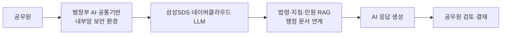

## Summary

한국 인사혁신처는 2025년 3월 공무원 대상 "AI 활용가이드"를 배포하여 생성형 AI 프롬프트 작성 기법과 HR 업무 적용 사례를 안내했다. ✅ **Fact** 행정안전부·과학기술정보통신부는 삼성SDS·네이버클라우드의 AI 대화형 서비스를 정부 내부망에서 보안 운영하는 "범정부 AI 공통기반" 시범 운영을 시작했다. [[sources/mpm-ai-guide-2025-03.md]] [[sources/mois-ai-common-infra-2025.md]]

## Problem / Why (도입 배경)

공무원 업무에서 생성형 AI 활용 수요가 높아졌으나, 민간 AI 서비스는 정부 내부망(망분리 환경)에서 사용이 불가능하고 데이터 유출 위험이 있었다. 인사혁신처는 공무원의 AI 리터러시 수준도 높여야 하는 이중 과제를 안고 있었다.

## Solution Architecture

> **최우선 원칙**: 이 섹션은 **공개된 사실만** 기록한다.

### A. Process (프로세스)

#### 인사혁신처 AI 활용가이드
- **Before (As-is)**: 공무원이 생성형 AI를 개인적·비공식적으로 사용하거나 외부 서비스 접근.
- **After (To-be)**: ✅ **Fact** 공무원 업무 특성에 맞는 프롬프트 작성 기법 제공 — 보고서 작성, 민원 답변, 보도자료 초안 등. [[sources/mpm-ai-guide-2025-03.md]]
- **HITL**: 모든 AI 생성 문서는 공무원이 최종 검토·결재.

#### 범정부 AI 공통기반
- **Before (As-is)**: 공무원이 민간 AI를 내부망에서 사용 불가.
- **After (To-be)**: ✅ **Fact** 삼성SDS·네이버클라우드의 LLM과 GPU 인프라 기반으로, 정부 보유 법령·지침·민원 상담 내역·행정 문서를 연계한 AI 챗서비스를 보안 인프라에서 제공. 시범 운영 후 확대 계획. [[sources/mois-ai-common-infra-2025.md]]
- **Trigger & Frequency**: 수시(on-demand) 행정 업무 지원.
- **Scope of autonomy**: Recommend 수준 (공무원 최종 판단·결재 필수).

범례: 실선 = [[sources/mois-ai-common-infra-2025.md]] 확인.

### B. System & Infrastructure (시스템·인프라)

- **AI 플랫폼**: ✅ **Fact** 삼성SDS, 네이버클라우드 제공 AI 챗서비스. [[sources/mois-ai-common-infra-2025.md]]
- **배포 환경**: ✅ **Fact** 정부 내부망(망분리 환경) — 보안 격리 운영. [[sources/mois-ai-common-infra-2025.md]]
- **연동·통합**: ✅ **Fact** 정부 보유 법령·지침·민원 데이터 연계. [[sources/mois-ai-common-infra-2025.md]]
- **사용자 접점**: _미공개 (not disclosed)_

### C. Data (데이터)

- **입력 데이터 소스**: ✅ **Fact** 공개 행정 문서, 법령, 지침, 민원 상담 내역, 종합계획. [[sources/mois-ai-common-infra-2025.md]]
- **데이터 거버넌스**: ✅ **Fact** 망분리 보안 환경으로 운영. [[sources/mois-ai-common-infra-2025.md]]
- **민감정보 처리**: 개인정보보호법 적용. 세부 DPIA 내용 _미공개 (not disclosed)_.

### D. Model (모델)

- **Foundation model**: ✅ **Fact** 삼성SDS, 네이버클라우드 LLM. 구체 모델명 _미공개 (not disclosed)_. [[sources/mois-ai-common-infra-2025.md]]
- **커스터마이징**: RAG — 행정 문서 연계. [[sources/mois-ai-common-infra-2025.md]]

### E. Organization & Team (조직·팀 구조)

- **오너십**: ✅ **Fact** 행정안전부 + 과학기술정보통신부 공동 추진. [[sources/mois-ai-common-infra-2025.md]]
- **가이드라인 발행**: ✅ **Fact** 디지털플랫폼정부위원회 — 「공공부문 초거대 AI 도입·활용 가이드라인 2.0」 배포 (2025-04-16). [[sources/mois-ai-common-infra-2025.md]]
- **인사혁신처**: ✅ **Fact** 공무원 AI 활용가이드 발행 (2025-03-18). [[sources/mpm-ai-guide-2025-03.md]]

## Impact / Metrics (기대효과)

### 기대효과 요약
시범 운영(pilot) 단계로 정량 성과 수치 0건. 가이드라인·인프라 구축이 현재 산출물이며 outcome metric은 아직 측정 대상이 아님.

- _미공개 (not disclosed)_ — 시범 운영 단계이며 구체 성과 수치 미공개.

## Governance & Risk

- ✅ **Fact**: 망분리 보안 요건이 핵심 제약으로 민간 최신 AI를 내부망에서 사용하기 위한 별도 인프라 필요. [[sources/mois-ai-common-infra-2025.md]]
- 개인정보보호법, 공공데이터법 적용 환경.
- 공무원 결정의 AI 의존 증가 시 행정 책임 소재 이슈 — 세부 가이드라인 _미공개 (not disclosed)_.
- 시범 운영 후 전면 확대 시 예산·조달 과정 미공개.

## Contradictions

없음 (현재 기준).

## Consulting Angle

- **국내 공공기관 AI 도입 레퍼런스**: 인사혁신처의 AI 활용가이드는 공무원 AI 리터러시 공식 인정의 첫 단계. 정부·공공기관 HR AI 컨설팅 제안 시 "정책 환경의 공식 뒷받침" 근거로 활용.
- **망분리 환경의 AI 도입 패턴**: 삼성SDS·네이버클라우드를 통한 정부 내부망 AI는 보안 요건이 강한 금융(금융위 망분리 규제)·의료·방산 분야 클라이언트에게도 참고 가능한 아키텍처 방향.
- **한국 공공부문 시장 기회**: 중앙부처 + 지방자치단체 + 공공기관 전체로 범정부 AI 공통기반이 확대되면 대규모 공공 HR AI 시장 열릴 가능성. 삼성SDS·LG CNS·SK C&C 등 SI 기업의 수혜 예상.
- **한계**: 아직 시범 운영 단계, 성과 수치 없음 — stub 수준. 향후 성과 공개 시 업데이트 필요.
