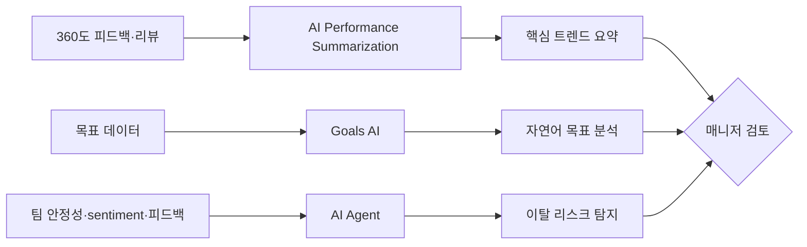

## Summary

Lattice는 성과관리·engagement·보상 통합 SaaS로, **AI Performance Summarization** (리뷰 주기 중 받은 피드백·리뷰를 자동 요약해 핵심 트렌드 도출), **Goals AI Assistance** (자연어로 목표 쿼리·요약·분석), **AI Agent** (Slack/Teams 내장, 개인별 이탈 리스크 탐지)를 제공한다. **Ruggable** VP of People이 "Lattice AI for engagement로 비즈니스의 다른 영역에서도 AI 필요성을 입증했다"고 평가. 2026년 상반기 AI Agent가 Slack/Teams 내 작동하는 업데이트 발표.

## Problem / Why

- 매니저가 리뷰 주기마다 다수 직원의 **360도 피드백을 수동 종합**하는 데 시간 소요
- 목표 진척을 대시보드에서 수동 추적 → **실시간 파악 어려움**
- 이탈 리스크를 **사후적으로만** 파악 — 사전 개입 불가

## Solution Architecture (요약)

### A. Process (프로세스)

- **Before**: 매니저가 직원별 피드백·리뷰를 수동으로 읽고 종합 → 목표 대시보드 수동 확인
- **After**: AI Performance Summarization이 현 주기 피드백·리뷰를 자동 요약 → 핵심 트렌드 도출 → Goals AI가 자연어 쿼리로 목표 진척 분석 → AI Agent가 이탈 리스크 신호 탐지
- **HITL 지점**: 요약·이탈 리스크는 매니저에게 추천 — 최종 행동은 매니저/HR 결정
- **Scope of autonomy**: Recommend

### B. System & Infrastructure

- **Core 플랫폼**: Lattice (Performance Management + Engagement + Compensation SaaS)
- **AI Agent**: Slack, Microsoft Teams 내장 예정 (2026 상반기)
- **연동**: Google Workspace, HRIS 시스템 통합
- 배포 환경 상세: _미공개 (not disclosed)_

### C. Data

- **입력**: 성과 리뷰, 동료 피드백, 목표 데이터, engagement 설문, 매니저 변경·팀 안정성 신호
- **이탈 리스크 분석**: 팀 안정성, sentiment, 피드백 패턴, 매니저 변경 등 신호 분석
- 학습/RAG 방식: _미공개 (not disclosed)_

### D. Model

- _미공개 (not disclosed)_

### E. Organization & Team

- Ruggable: Abby Wilson (VP of People) — engagement AI 도입
- 나머지: _미공개 (not disclosed)_

## Impact / Metrics

### 기대효과 요약

매니저의 리뷰 종합 시간 절감 + 이탈 리스크 사전 탐지. 구체 정량 지표 미공개.

| 지표 | 값 | 출처 | 성격 |
|---|---|---|---|
| 리뷰 시간 절감 | "hours per employee" 절감 (구체 수치 미공개) | Lattice 공식 | ⚠️ 벤더 주장 |
| Ruggable AI 활용 확대 | engagement → 타 비즈니스 영역 | HR Brew (2024) | ⚠️ 자사 보고 |
| **LivePerson 리뷰 시간 50~75% 감소** | 동종 카테고리 reference | Betterworks Case Study (PwC 자료) | ⚠️ Lattice 사례 아님, 비교 reference |
| 15Five 도입사 직원 유지율 94% | 동종 vendor reference | 15Five Press Release 2025 | ⚠️ 벤더 주장 |
| 15Five 도입사 이직률 40% → 32% | 동종 vendor reference | 15Five Blog | ⚠️ 벤더 주장 |
| HBR — 매니저 1인당 연 ~210h 리뷰 작성 | 시장 baseline (PwC 자료 인용) | HBR 일반 통계 | ✅ Tier 1 일반 baseline |

## Governance & Risk

- AI 이탈 리스크 탐지: **개인별 이탈 확률 예측**은 직원 프라이버시·차별 리스크 높음 — EU AI Act High-risk 범주 해당 가능
- 리뷰 요약의 환각(hallucination) 위험 — 원문과 불일치 시 평가 공정성 훼손

## Consulting Angle

### 활용 포인트
- **성과관리 SaaS AI 기능 비교의 중간 포지션**: Culture Amp(코칭 중심) vs Lattice(요약·이탈탐지) vs 15Five(미팅 코칭) vs Betterworks(OKR AI)
- **이탈 리스크 AI의 윤리적 논점**: 클라이언트에게 "AI 이탈 예측을 도입하되 EU AI Act High-risk 범주 대응 필요"라는 논점 제시
- **Slack/Teams 내장 AI Agent 트렌드**: HR AI가 HRIS UI를 벗어나 직원·매니저의 일상 도구로 침투하는 패턴의 사례
