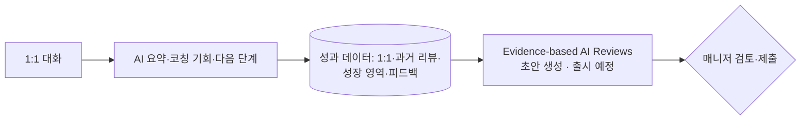

## Summary

Lattice의 Spring/Summer '26 릴리스 — "People + AI platform" 방향: ⚠️ 벤더 주장: **Evidence-based AI Reviews**(이번 여름 출시 예정) — Lattice AI Agent가 1:1 기록·과거 리뷰·성장 영역·피드백 등 실제 성과 데이터에 근거해 직원·매니저의 리뷰 초안을 생성; 매니저가 톤·정확성·결과에 책임지며 AI가 리뷰를 대신 제출하지 않음 [[sources/lattice-ai-performance-features-2025]]. **1:1 내 AI 요약·코칭** — 대화 중 AI가 핵심 주제 요약·코칭 기회·다음 단계 캡처 [[sources/lattice-ai-performance-features-2025]]. 보상(compensation) 기능 강화 병행 [[sources/lattice-ai-performance-features-2025]]. 기존 페이지의 **Ruggable(VP of People Abby Wilson) 도입 사례·HR Brew 인용**, "Goals AI Assistance", "AI Agent 이탈 리스크 탐지", "Slack 내장", "Google Workspace 연동", "hours per employee 절감"은 인용 소스에 없어 _미공개_ 처리 (2026-09-27 grounding 점검 — 별도 소스 확보 필요).

## Problem / Why (도입 배경)

- **Before (baseline)**: 매니저가 수많은 이메일·노트를 뒤져 성과 리뷰를 시작 [[sources/lattice-ai-performance-features-2025]]; 정량 baseline ❓ 미공개
- **Pain point**: 리뷰 품질·일관성 편차, 매니저의 정리(compiling) 시간 [[sources/lattice-ai-performance-features-2025]]
- **Trigger**: _미공개 (not disclosed)_ — 벤더 제품이므로 고객별 상이 (🚫 일반론 표기); Ruggable의 도입 배경은 인용 소스에 없음

## Solution Architecture

### A. Process (프로세스)

- **Before**: 매니저가 이메일·노트를 수동으로 뒤져 리뷰 작성 [[sources/lattice-ai-performance-features-2025]]
- **After** (⚠️ 벤더 주장 [[sources/lattice-ai-performance-features-2025]]):
  1. 1:1 대화 중 AI가 핵심 주제·코칭 기회·다음 단계를 요약·캡처
  2. 리뷰 주기에 Lattice AI Agent가 1:1·과거 리뷰·성장 영역·피드백 데이터로 리뷰 초안 생성 (Evidence-based AI Reviews, 여름 출시 예정)
  3. 매니저가 톤·정확성·결과를 검토·수정 후 직접 제출 — AI는 제출하지 않음
- **HITL 지점**: 매니저가 최종 책임·제출 [[sources/lattice-ai-performance-features-2025]]
- **Scope of autonomy**: Recommend (초안·요약) [[sources/lattice-ai-performance-features-2025]]

```mermaid
flowchart LR
    A[1:1 대화] --> B[AI 요약·코칭 기회·다음 단계]
    B --> D[(성과 데이터: 1:1·과거 리뷰·성장 영역·피드백)]
    D --> E[Evidence-based AI Reviews<br/>초안 생성 · 출시 예정]
    E --> J{매니저 검토·제출}
```

범례: 실선 = Lattice 릴리스 노트 [[sources/lattice-ai-performance-features-2025]] 확인. 이탈 리스크·목표 분석 노드는 소스 미확인으로 제외.

### B. System & Infrastructure (시스템·인프라)

- **Core 플랫폼**: Lattice (Performance + 보상 기능 포함 SaaS) [[sources/lattice-ai-performance-features-2025]]
- **AI Agent 접점**: 1:1 대화 내 AI [[sources/lattice-ai-performance-features-2025]]; Microsoft Teams 관련 기능이 릴리스에 언급 [[sources/lattice-ai-performance-features-2025]] — Slack 내장은 _미공개 (not disclosed)_
- **연동**: HRIS 관련 기능 언급 [[sources/lattice-ai-performance-features-2025]] — 구체 연동 대상 _미공개 (not disclosed)_
- **배포 환경**: _미공개 (not disclosed)_

### C. Data (데이터)

- **입력**: 1:1 기록, 과거 리뷰, 성장 영역, 피드백 [[sources/lattice-ai-performance-features-2025]]
- **이탈 리스크 분석**: _미공개 (not disclosed)_ — 인용 소스에 없음
- **학습/RAG 방식**: _미공개 (not disclosed)_
- **데이터 거버넌스·민감정보**: _미공개 (not disclosed)_

### D. Model (모델)

- **Foundation model**: _미공개 (not disclosed)_
- **Model 유형**: 생성(리뷰 초안)·요약 [[sources/lattice-ai-performance-features-2025]]
- **평가·가드레일**: ⚠️ 벤더 주장: "not an AI autopilot" — 매니저 책임·AI 미제출 [[sources/lattice-ai-performance-features-2025]]

### E. Organization & Team (조직·팀 구조)

- **Ruggable 도입 조직**: _미공개 (not disclosed)_ — 기존 "Abby Wilson (VP of People)" 서술은 인용 소스에 없음
- **나머지**: _미공개 (not disclosed)_

## Impact / Metrics (기대효과)

### 기대효과 요약

⚠️ 기대효과 수치 미공개 — 인용 소스에 정량 지표가 없음. 벤더는 "리뷰 품질·일관성 향상, 팀에 시간 환원"을 정성 목표로 제시 [[sources/lattice-ai-performance-features-2025]].

| 지표 | 값 | 출처 | 성격 |
|---|---|---|---|
| 리뷰 작성 시간 절감 | _미공개_ (정성: "spend less time compiling") | Lattice 릴리스 노트 [[sources/lattice-ai-performance-features-2025]] | ⚠️ 벤더 주장 (정성) |
| Ruggable 도입 효과 | _미공개_ (인용 소스에 없음) | — | ❓ |
| 동종 벤더 비교 수치 (LivePerson·15Five·HBR baseline) | 삭제 — Lattice 사례 아님·본 페이지 인용 소스 없음 | — | — |

## Governance & Risk

- ⚠️ 벤더 주장: 매니저가 톤·정확성·결과에 책임, AI는 제출하지 않음 [[sources/lattice-ai-performance-features-2025]] — 실제 검토 강제 장치 _미공개_
- 리뷰 초안의 환각(hallucination) 위험 — 원문 성과 데이터와 불일치 시 평가 공정성 훼손
- 이탈 리스크 예측 기능은 인용 소스에서 미확인 — 확인 시 EU AI Act High-risk·AI 기본법 고영향 검토
- 규제 노출: 성과 평가 초안 생성 → AI 기본법 고영향 AI 검토 대상(`kr-high-impact-review`)·EU AI Act Annex III 4(b)

## Contradictions

> [!note] 2026-09-27 grounding — 유일한 인용 소스(Lattice Spring/Summer '26 릴리스 노트) raw에 Ruggable·Abby Wilson·HR Brew, "AI Performance Summarization"(360도 피드백 요약) 명칭, "Goals AI Assistance", "AI Agent 이탈 리스크 탐지", Slack·Google Workspace 연동, "hours per employee", LivePerson·15Five·HBR 비교 수치(리뷰 시간 감소율·유지율·이직률·연간 리뷰 시간)가 없어 삭제·_미공개_ 처리. frontmatter `company: Ruggable`·`output`은 기존 값 유지 중 — Ruggable 사례 소스(HR Brew 2024) 확보는 /hr-research 대상.

## Consulting Angle

### 활용 포인트
- **성과관리 SaaS AI 기능 비교의 중간 포지션**: Culture Amp(코칭 중심) vs Lattice(evidence-based 리뷰 초안·1:1 요약) vs 15Five(미팅 코칭) vs Betterworks(OKR AI)
- **이탈 리스크 AI의 윤리적 논점**: Lattice의 해당 기능은 인용 소스에서 미확인 — 확인 시 "AI 이탈 예측 도입 시 EU AI Act High-risk 범주 대응 필요" 논점 제시
- **1:1 대화 내장 AI 트렌드**: HR AI가 HRIS UI를 벗어나 매니저의 일상 대화(1:1)로 침투하는 패턴의 사례 [[sources/lattice-ai-performance-features-2025]]
