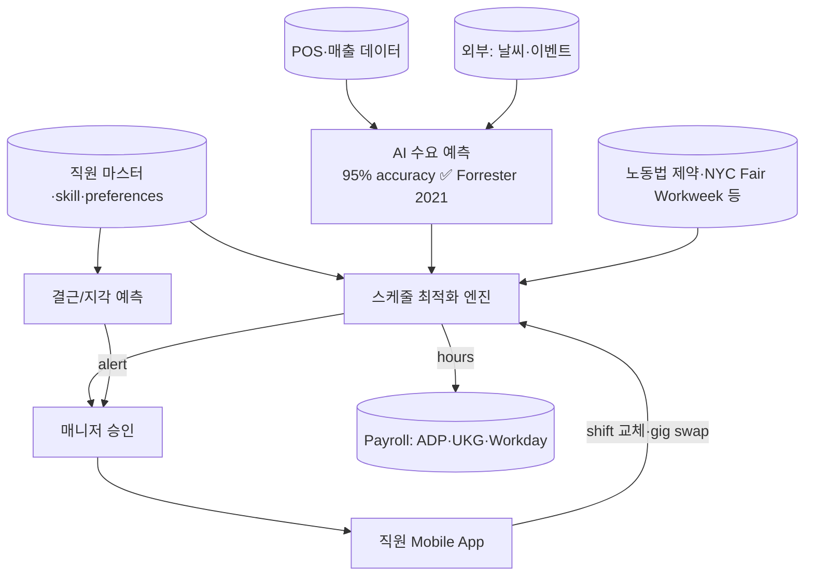

## Summary

Legion Technologies (2016년 설립, Bay Area)는 **AI-native WFM (workforce management)** 벤더 — 시급직 (retail·hospitality·restaurant·healthcare) 스케줄링·수요예측·노동 컴플라이언스 자동화. **Forrester TEI 1,345% ROI / $13.35M NPV** (2021-09 study, 9,000명·500개 매장 사례). 2022~2025 **AI Breakthrough Awards "AI-based WFM Solution of the Year" 4년 연속**. 2026년 1월 **Agentic AI 90+ features** 출시 발표 (벤더). 고객사: Dollar General·Cinemark·Five Below 등.

> ⚠️ **Funding 정정 필수**: 일부 자료(PwC 컨설팅 문서 포함)에서 "$195M Series C in 2024"로 기술되나, 실제로는 **누적 funding 합계**. 2024년 라운드는 (a) **$50M growth round (Riverwood Capital, 2024-05)** + (b) **$50M debt financing (SVB, 2024-12)**. Series C는 2021년 5월 $50M이 별건. 컨설팅 deck 인용 시 정정.
>
> ⚠️ **Mercy Health $30M misattribution**: "Mercy Health 연 $30M travel nurse 절감" 사례는 **Works/Trusted Health**의 결과이지 Legion 아님. PwC 자료에 잘못 인용 — wiki 등재 거부.

## Problem / Why

- **Before**: 시급직 매니저가 매주 spreadsheet로 직원 shift 작성 — 수요 예측 부재, 노동 시간 over/under, 결근 1회당 대체 인력 찾기 30~60분 소요
- **Pain point**:
  - **매니저 시간 over-burden**: 매장 매니저가 주 8~15시간을 스케줄 작성·조정에 사용 → 매장 운영·고객 서비스 시간 감소
  - **시급직 turnover 60~150%/년 (US retail 평균)** — schedule 불만이 turnover 1대 사유
  - **labor cost over/under**: 수요 예측 없으면 trafic 낮은 시간대에도 인력 배치 → 비용 over-spend
- **Trigger**: 미국 retail의 hourly worker 부족 + Schedule Fairness 법규 강화 (NYC·SF·Seattle Predictive Scheduling Act) → AI WFM 수요 급증

## Solution Architecture

### A. Process

- **Before**: 매니저 spreadsheet → 직원 game·휴가 신청 → 매니저 수동 조정 → 결근 시 매니저가 전화로 대체 인력 찾기
- **After (벤더 발표 architecture)**:
  1. **수요 예측**: POS·트래픽·날씨·이벤트 데이터 → AI가 시간대별 labor demand 예측 (95% accuracy — Forrester study에서 검증)
  2. **자동 스케줄 생성**: demand × 직원 가용성·skill·preferences·labor law 제약 → 매장별 shift 최적화
  3. **직원 모바일**: shift 확인·교체·gig swap·휴가 신청 self-service
  4. **결근/지각 예측**: 패턴 분석 → 사전 alert + 자동 대체 인력 후보 추천
  5. **매니저 dashboard**: 인건비·생산성·컴플라이언스 status real-time
  6. **Agentic AI (2026.1 신규)**: 90+ features — 채용·온보딩·스케줄·payroll까지 cross-workflow 자동화 (벤더 발표)
- **HITL**: 매니저가 최종 schedule 승인·개별 조정 권한
- **Frequency**: daily (스케줄·결근 alert) + 주간 (수요예측 갱신)
- **Scope of autonomy**: recommend (스케줄·대체 인력) + auto-execute (직원 self-service shift swap, 매니저 정책 범위 내)

### B. System & Infrastructure

- **Core**: Legion WFM SaaS (cloud-hosted, _구체 hyperscaler 미공개_)
- **사용자 접점**: 매니저 web/desktop, 직원 mobile app, 매니저 mobile alert
- **연동**: POS (Toast·Square·Oracle MICROS), payroll (ADP·UKG·Paychex·Workday), HRIS, 출퇴근 시스템 (timeclock·biometric)
- **인증**: SSO via employer IdP

### C. Data

- **입력 데이터**:
  - POS 트랜잭션·시간대별 매출
  - 외부: 날씨 API·지역 이벤트·계절성
  - 직원 마스터 (skill·가용성·preferences·labor law 제약)
  - 출퇴근·결근 이력
  - 시급·잔업·휴일 수당 정책
- **모델 구조**: 수요 예측 (시계열 ML) + 스케줄 최적화 (constraint optimization) + 결근 예측 (분류) + LLM (직원·매니저 자연어 인터페이스)
- **Data governance**: SOC2 Type II, _구체 retention 미공개_

### D. Model

- **Foundation model**: _구체 LLM provider·버전 미공개_ (Agentic features는 LLM-기반 — 자사 발표)
- **수요 예측 모델**: 자체 시계열 ML (95% accuracy — Forrester 2021 검증)
- **Customization**: 매장·산업별 도메인 fine-tuning (벤더 주장)

### E. Organization & Team

- **오너십**: Legion 벤더 — 고객사가 SaaS 구매
- **참여 역할**: Legion 구현 컨설팅 + 고객 매장 운영팀·HR·payroll·IT
- **Funding stage**: 2021 Series C $50M, 2024 Riverwood growth $50M + SVB debt $50M (누적 ~$195M, **단일 Series C 아님**)

### F. Diagrams

범례: 실선 = Forrester TEI 또는 벤더 자료에서 확인. ✅ 표시는 Tier 1·2 독립 검증.

## Impact / Metrics (기대효과)

### 기대효과 요약
시급직 스케줄링의 **AI 자동화** — 매니저 시간 절감 + 인건비 최적화 + 직원 turnover 감소 + 노동법 컴플라이언스 자동화. 코어 ROI는 Forrester TEI 검증 (단 2021년 study).

| 지표 | 값 | 출처 | 성격 |
|---|---|---|---|
| **Forrester TEI ROI** | **1,345%** | Forrester Total Economic Impact 2021-09 | ✅ Fact (Tier 1, 단 **2021년 study** — recency penalty) |
| **Forrester TEI NPV** | **$13.35M** (9,000명·500매장 사례) | Forrester TEI 2021-09 | ✅ Fact (Tier 1) |
| **수요 예측 정확도** | **95%** | Forrester TEI 2021-09 | ✅ Fact (Tier 1) |
| AI Breakthrough Awards | **4년 연속 (2022·2023·2024·2025)** "AI-based WFM Solution of the Year" | BusinessWire 2025 | ✅ Fact |
| 고객사 reference | Dollar General, Cinemark, Five Below | TechCrunch 2024-05 | ✅ Fact (Tier 2) |
| Dollar General 스케줄 시간 절감 | 50% | TechCrunch 2024-05 (점주 인터뷰) | ⚠️ 자사 보고 (점주 1인 인용, Dollar General 공식 case 미확인) |
| Agentic AI 90+ features | 2026-01 출시 | Legion 자사 발표 | ⚠️ 벤더 주장 |
| Funding 누적 | ~$195M (2016~2024) | Crunchbase·Legion press | ✅ Fact (단 단일 Series C 아님) |
| 🚫 "Mercy Health $30M 절감" | **misattribution** | PwC 자료에 잘못 인용. 실제는 Works/Trusted Health 사례 | wiki 등재 거부 |
| Fortune 500 제조사 OT -58%/$2.2M, Global airline $3.4M, 85%+ 결근 예측 | 자사 자료 | Legion 자사 marketing | ⚠️ 벤더 주장, 독립 검증 _미공개_ |

## Governance & Risk

- ⚠️ **Forrester TEI는 2021년 발표분** — 5년 경과, AI 기술 진화 고려 시 **recency penalty** 필수. 2026년 컨설팅에 "Forrester 검증"으로 인용 시 study 연도 명시
- ⚠️ **Mercy Health $30M misattribution** — PwC 컨설팅 문서가 잘못 기술. 클라이언트 deck에 그대로 인용 시 1차 검증에서 적발. 정정 필수
- ⚠️ **Funding 라운드 정정 필수** — $195M = 누적 funding (2021 Series C $50M + 2024 Riverwood growth $50M + 2024 SVB debt $50M + 기타). 단일 라운드 아님
- ⚠️ Agentic AI 90+ features (2026.1)는 벤더 발표 — 실제 deployment·고객 사례 검증은 2026 H2 이후 expected
- ⚠️ 한국 적용 한계: Legion은 미국 시급직 (retail·QSR·hospitality) 특화. 한국 retail (이마트·신세계·롯데)·F&B (스타벅스 코리아·카페·편의점)·물류 (쿠팡·CJ대한통운) 시급직 컴플라이언스 (52시간·휴게시간·주휴수당)는 별도 customization 필요

## Consulting Angle

- **시급직 WFM AI 대표 reference**: 한국 retail·F&B·물류·콜센터 시급직 스케줄 자동화 컨설팅에서 **AI-native WFM** 패턴 reference
- **vs Workday Illuminate / SAP / UKG**: Legion은 **point-solution** (시급직 특화), 종합 HCM이 아님 — best-of-breed 전략 사례
- **반면교사**:
  - PwC 컨설팅 문서가 (a) Mercy Health misattribution + (b) funding 라운드 오기 — 자료 작성자가 1차 검증 안 함. **컨설팅 deck 작성 전 Forrester TEI 연도·funding 라운드는 1차 출처 (TechCrunch·Crunchbase·BusinessWire) 확인 필수**
  - Forrester TEI 1,345% ROI는 2021년 study — 클라이언트가 "최신 검증?" 물으면 **recency 한계 솔직히 공개** + 2024 Agentic 신규 기능은 검증 미실시 명시
- **한국 retail/F&B 적용 angle**:
  - 이마트 트레이더스·CU 편의점·스타벅스 코리아·롯데마트의 **매장 매니저 스케줄링 시간 over-burden** 동일 pain point
  - 한국 52시간 컴플라이언스·주휴수당·연차 자동 계산이 Legion 같은 AI WFM의 핵심 가치 — **글로벌 솔루션 그대로 가져올 수 없음, 한국 노동법 customization 필수**
- **Watch list**: Legion Agentic AI 2026 H2 고객 deployment 사례·Forrester 신규 study (있다면) 발표 시 confidence 재조정
