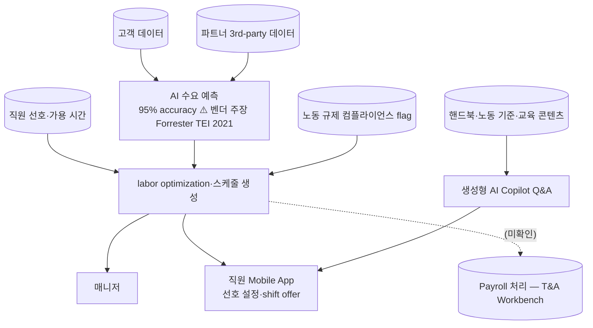

## Summary

Legion Technologies (2016년 설립, Bay Area)는 **AI-native WFM (workforce management)** 벤더 — 시급직 (retail·hospitality·restaurant·healthcare) 스케줄링·수요예측·노동 컴플라이언스 자동화. ⚠️ 벤더 주장: **Forrester TEI 1,345% ROI / $13.35M NPV** (Legion 커미션, 2021-09 study, 9,000명·500개 매장 composite) [[sources/legion-forrester-tei-2021-09]]. 2024년 여름 70개 신기능(생성형 AI Time and Attendance Workbench 포함) 출시 ⚠️ 벤더 주장 [[sources/legion-2024-svb-financing]]. 고객사: Dollar General·Cinemark·Five Below·Panda Express [[sources/legion-techcrunch-2024-05]]. AI Breakthrough Awards 수상·2026-01 'Agentic AI 90+ features' 발표는 인용 소스에 없음 → _미공개_ (수치 근거 미확보 — 2026-09-27 grounding 점검).

> ⚠️ **Funding 정정 필수**: 일부 자료(PwC 컨설팅 문서 포함)에서 "$195M Series C in 2024"로 기술되나, 실제로는 **누적 funding 합계**. 2024년 라운드는 (a) **$50M growth round (Riverwood Capital, 2024-05)** + (b) **$50M debt financing (SVB, 2024-12)**. 2024-05 시점 누적 $145M [[sources/legion-techcrunch-2024-05]] → SVB 후 $195M [[sources/legion-2024-svb-financing]]. 2021년 이전 라운드 세부는 인용 소스 미기재 (_미공개_). 컨설팅 deck 인용 시 정정.
>
> ⚠️ **Mercy Health $30M misattribution**: "Mercy Health 연 $30M travel nurse 절감" 사례는 **Works/Trusted Health**의 결과이지 Legion 아님. PwC 자료에 잘못 인용 — wiki 등재 거부.

## Problem / Why (도입 배경)

- **Before**: 시급직 매니저가 수작업으로 직원 shift 작성 — 수요 예측 부재, 노동 시간 over/under, 결근 시 매니저가 대체 인력을 수동으로 찾음 (❓ baseline 수치 미공개 — 2026-09-27 grounding 점검)
- **Pain point**:
  - **매니저 시간 over-burden**: 매장 매니저의 스케줄 작성·조정 시간 부담 → 매장 운영·고객 서비스 시간 감소 (도입 전 baseline 수치 ❓ 미공개; Forrester composite는 도입 후 점장당 주 5시간 절감 제시 ⚠️ 벤더 주장 [[sources/legion-forrester-tei-2021-09]])
  - **시급직 turnover** — 수치 근거 미확보 (2026-09-27 grounding 점검); 직원의 스케줄 자율성 부여로 이직 감소 효과는 Forrester TEI가 제시 ⚠️ 벤더 주장 [[sources/legion-forrester-tei-2021-09]]
  - **labor cost over/under**: 수요 예측 없으면 trafic 낮은 시간대에도 인력 배치 → 비용 over-spend
- **Trigger**: 미국 retail의 hourly worker 부족 + Schedule Fairness 법규 강화 (NYC·SF·Seattle Predictive Scheduling Act) → AI WFM 수요 급증

## Solution Architecture

### A. Process (프로세스)

- **Before**: 매니저 spreadsheet → 직원 game·휴가 신청 → 매니저 수동 조정 → 결근 시 매니저가 전화로 대체 인력 찾기
- **After (벤더 발표 architecture)**:
  1. **수요 예측**: 고객 데이터 + 파트너 3rd-party 데이터 블렌드로 학습한 알고리즘이 labor demand 예측 [[sources/legion-techcrunch-2024-05]] (인터뷰 고객 보고 95% forecast accuracy ⚠️ 벤더 주장 [[sources/legion-forrester-tei-2021-09]])
  2. **자동 스케줄 생성**: demand forecasting × labor optimization × 직원 preferences → 스케줄 생성 [[sources/legion-techcrunch-2024-05]]; 컴플라이언스·예산·가용성·skill 목표를 Schedule Score로 정의 ⚠️ 벤더 주장 [[sources/legion-2024-svb-financing]]
  3. **직원 모바일**: 앱에서 근무 희망·선호 시간 설정 [[sources/legion-techcrunch-2024-05]], 선호·가용성에 맞는 open shift offer 수신 ⚠️ 벤더 주장 [[sources/legion-2024-svb-financing]]
  4. **결근/지각 예측**: _미공개 (not disclosed)_ — 인용 소스에 없음 (2026-09-27 grounding 점검)
  5. **매니저 dashboard**: 컴플라이언스 위반 자동 flag·초과근무 회피 ⚠️ 벤더 주장 [[sources/legion-forrester-tei-2021-09]]; 세부 dashboard 구성 _미공개_
  6. **생성형 AI (2024)**: Copilot — 직원 핸드북·노동 기준·교육 콘텐츠 기반 Q&A, 스케줄 요약·shift 추가/삭제 요청 처리는 '수개월 내' 예정 [[sources/legion-techcrunch-2024-05]]; Time and Attendance Workbench·스케줄/타임시트 분석 assistant ⚠️ 벤더 주장 [[sources/legion-2024-svb-financing]]. 2026-01 'Agentic AI 90+ features'는 인용 소스에 없음 → _미공개_
- **HITL**: 매니저가 최종 schedule 승인·개별 조정 권한
- **Frequency**: daily (스케줄·결근 alert) + 주간 (수요예측 갱신)
- **Scope of autonomy**: recommend (스케줄·대체 인력) + auto-execute (직원 self-service shift swap, 매니저 정책 범위 내)

### B. System & Infrastructure (시스템·인프라)

- **Core**: Legion WFM SaaS (true SaaS 환경 ⚠️ 벤더 주장 [[sources/legion-forrester-tei-2021-09]]; 구체 hyperscaler _미공개 (not disclosed)_)
- **사용자 접점**: 직원 mobile app (선호 시간 설정·shift offer) [[sources/legion-techcrunch-2024-05]] [[sources/legion-2024-svb-financing]]; 매니저 접점 세부 _미공개 (not disclosed)_
- **연동**: _미공개 (not disclosed)_ — 구체 POS·payroll·HRIS 연동 대상은 인용 소스에 없음 (2026-09-27 grounding 점검). 파트너 3rd-party 데이터를 집계해 예측에 사용 [[sources/legion-techcrunch-2024-05]]; payroll 관리자 대상 Time and Attendance Workbench ⚠️ 벤더 주장 [[sources/legion-2024-svb-financing]]
- **인증**: _미공개 (not disclosed)_

### C. Data (데이터)

- **입력 데이터**:
  - 고객 데이터 + Legion이 파트너로부터 집계한 3rd-party 데이터 (예측용) [[sources/legion-techcrunch-2024-05]]
  - 직원 PII: 이름·이메일·주소·나이·사진·근무 선호 [[sources/legion-techcrunch-2024-05]]
  - 직원 핸드북·노동 기준·교육 콘텐츠 (Copilot Q&A 근거) [[sources/legion-techcrunch-2024-05]]
  - POS·날씨·이벤트 등 구체 입력 항목 _미공개 (not disclosed)_
- **모델 구조**: demand forecasting + labor optimization + 직원 preference 매칭 → 스케줄 생성 [[sources/legion-techcrunch-2024-05]]; 생성형 AI Copilot·assistant [[sources/legion-techcrunch-2024-05]] [[sources/legion-2024-svb-financing]]; 알고리즘 종류(시계열·제약 최적화 등) _미공개 (not disclosed)_
- **Data governance**: 고객 데이터 기본 7년 보관(PII 포함), 사용자 삭제 요청 가능 — TechCrunch가 보존 기간·투명성 우려 제기 [[sources/legion-techcrunch-2024-05]]; SOC2 등 인증 _미공개 (not disclosed)_

### D. Model (모델)

- **Foundation model**: _구체 LLM provider·버전 미공개_ (Agentic features는 LLM-기반 — 자사 발표)
- **수요 예측 모델**: 고객 데이터·3rd-party 데이터 블렌드로 학습한 자체 알고리즘 [[sources/legion-techcrunch-2024-05]]; 인터뷰 고객 보고 95% forecast accuracy ⚠️ 벤더 주장 (Legion 커미션 Forrester TEI 2021) [[sources/legion-forrester-tei-2021-09]]
- **Customization**: _미공개 (not disclosed)_

### E. Organization & Team (조직·팀 구조)

- **오너십**: Legion 벤더 — 고객사가 SaaS 구매
- **참여 역할**: Legion 구현 컨설팅 + 고객 매장 운영팀·HR·payroll·IT
- **Funding stage**: 2024-05 Riverwood 주도 $50M (누적 $145M) [[sources/legion-techcrunch-2024-05]] + 2024-12 SVB $50M → 누적 $195M [[sources/legion-2024-svb-financing]] (**단일 Series C 아님**; 2021 이전 라운드 세부 _미공개_)

### F. Diagrams (도식)

```mermaid
flowchart TB
    Cust[(고객 데이터)] --> Forecast[AI 수요 예측<br/>95% accuracy ⚠️ 벤더 주장 Forrester TEI 2021]
    Third[(파트너 3rd-party 데이터)] --> Forecast
    Pref[(직원 선호·가용 시간)] --> Schedule
    Forecast --> Schedule[labor optimization·스케줄 생성]
    Compliance[(노동 규제 컴플라이언스 flag)] --> Schedule
    Schedule --> Manager[매니저]
    Schedule --> EmpApp[직원 Mobile App<br/>선호 설정·shift offer]
    Handbook[(핸드북·노동 기준·교육 콘텐츠)] --> Copilot[생성형 AI Copilot Q&A]
    Copilot --> EmpApp
    Schedule -.->|"(미확인)"| Payroll[(Payroll 처리 — T&A Workbench)]
```

범례: 실선 = TechCrunch 2024-05·Legion 보도자료·Forrester TEI(벤더 커미션)에서 확인. 점선 = 연동 세부 미확인. Tier 1·2 독립 검증 노드 없음.

## Impact / Metrics (기대효과)

### 기대효과 요약
시급직 스케줄링의 **AI 자동화** — 매니저 시간 절감 + 인건비 최적화 + 직원 turnover 감소 + 노동법 컴플라이언스 자동화. 코어 ROI 수치는 Legion 커미션 Forrester TEI(2021) composite 추산치 [[sources/legion-forrester-tei-2021-09]] — 독립 검증 _미공개_.

| 지표 | 값 | 출처 | 성격 |
|---|---|---|---|
| **Forrester TEI ROI (3년)** | **1,345%** | Legion 블로그 — Forrester TEI 2021-09 [[sources/legion-forrester-tei-2021-09]] | ⚠️ 벤더 주장 (Legion 커미션 composite, **2021년 study** — recency penalty) |
| **Forrester TEI NPV** | **$13.35M** (9,000명·500매장 composite) | [[sources/legion-forrester-tei-2021-09]] | ⚠️ 벤더 주장 (동상) |
| 스케줄 최적화 절감 / 이직 감소 절감 / 매니저 생산성 | $6.1M (46%) / $3.6M (27%) / $4.2M (31%, 점장당 주 5시간 절감) | [[sources/legion-forrester-tei-2021-09]] | ⚠️ 벤더 주장 (동상) |
| 초과근무 수당 | −10% | [[sources/legion-forrester-tei-2021-09]] | ⚠️ 벤더 주장 (동상) |
| **수요 예측 정확도** | **95%** (인터뷰 고객 보고) | [[sources/legion-forrester-tei-2021-09]] | ⚠️ 벤더 주장 (동상) |
| AI Breakthrough Awards | _미공개_ (인용 소스 없음 — 2026-09-27 grounding 점검) | — | — |
| 고객사 reference | Dollar General, Cinemark, Five Below, Panda Express | [[sources/legion-techcrunch-2024-05]] | ✅ Fact (Tier 2) |
| Dollar General 스케줄 시간 절감 | _미공개_ (인용 소스에 없음 — 2026-09-27 grounding 점검) | — | — |
| 2024 신기능 | 70개 (여름 출시) — 생성형 AI Time and Attendance Workbench 포함 | [[sources/legion-2024-svb-financing]] | ⚠️ 벤더 주장 |
| Agentic AI 90+ features (2026-01) | _미공개_ (인용 소스에 없음 — 2026-09-27 grounding 점검) | — | — |
| 매출·수주 성장 | 매출 55%·수주 125% (직전 1년) | [[sources/legion-techcrunch-2024-05]] | ⚠️ 자사 보고 (TechCrunch 전달) |
| Funding 누적 | $145M (2024-05) → $195M (2024-12) | [[sources/legion-techcrunch-2024-05]] [[sources/legion-2024-svb-financing]] | ✅ Fact (단 단일 Series C 아님) |
| 🚫 "Mercy Health $30M 절감" | **misattribution** | PwC 자료에 잘못 인용. 실제는 Works/Trusted Health 사례 | wiki 등재 거부 |
| Fortune 500 제조사 OT 절감·Global airline 절감·결근 예측 정확도 | _미공개_ (인용 소스에 없음 — 2026-09-27 grounding 점검) | — | — |

## Governance & Risk

- ⚠️ **Forrester TEI는 2021년 발표분** — 5년 경과, AI 기술 진화 고려 시 **recency penalty** 필수. 2026년 컨설팅에 "Forrester 검증"으로 인용 시 study 연도 명시
- ⚠️ **Mercy Health $30M misattribution** — PwC 컨설팅 문서가 잘못 기술. 클라이언트 deck에 그대로 인용 시 1차 검증에서 적발. 정정 필수
- ⚠️ **Funding 라운드 정정 필수** — $195M = 누적 funding (2021 Series C $50M + 2024 Riverwood growth $50M + 2024 SVB debt $50M + 기타). 단일 라운드 아님
- ⚠️ 2024 신기능·생성형 AI assistant는 벤더 보도자료 기반 [[sources/legion-2024-svb-financing]] — 고객 사례 검증 _미공개_. 2026-01 'Agentic AI 90+ features'는 인용 소스 없음
- ⚠️ **데이터 보존**: 고객 데이터(직원 PII 포함) 기본 7년 보관 — TechCrunch가 과도한 보존·삭제 절차 투명성 우려 제기 [[sources/legion-techcrunch-2024-05]]; InstantPay(EWA) 수수료 $2.99에 대한 소비자 보호 논란도 지적
- ⚠️ 한국 적용 한계: Legion은 미국 시급직 (retail·QSR·hospitality) 특화. 한국 retail (이마트·신세계·롯데)·F&B (스타벅스 코리아·카페·편의점)·물류 (쿠팡·CJ대한통운) 시급직 컴플라이언스 (52시간·휴게시간·주휴수당)는 별도 customization 필요

## Contradictions

> [!note] 2026-09-27 grounding — 인용 소스에 없는 수치 제거: 매니저 주당 스케줄 작업 시간·결근 대체 소요 시간·시급직 turnover 비율 범위(Problem), Dollar General 스케줄 시간 절감률, AI Breakthrough Awards 연속 수상, 2026-01 Agentic AI 기능 수, Fortune 500 제조사 OT 절감률·절감액, Global airline 절감액, 결근 예측 정확도. B·C·D의 POS/payroll 벤더명·SSO·SOC2·fine-tuning 서술은 소스 미확인으로 _미공개_ 처리. Forrester TEI는 Legion 커미션(Tier 3)이므로 ✅ Fact → ⚠️ 벤더 주장으로 정정.

## Consulting Angle

- **시급직 WFM AI 대표 reference**: 한국 retail·F&B·물류·콜센터 시급직 스케줄 자동화 컨설팅에서 **AI-native WFM** 패턴 reference
- **vs Workday Illuminate / SAP / UKG**: Legion은 **point-solution** (시급직 특화), 종합 HCM이 아님 — best-of-breed 전략 사례
- **반면교사**:
  - PwC 컨설팅 문서가 (a) Mercy Health misattribution + (b) funding 라운드 오기 — 자료 작성자가 1차 검증 안 함. **컨설팅 deck 작성 전 Forrester TEI 연도·funding 라운드는 1차 출처 (TechCrunch·Crunchbase·BusinessWire) 확인 필수**
  - Forrester TEI 1,345% ROI는 Legion 커미션 2021년 study — 클라이언트가 "최신 검증?" 물으면 **recency·커미션 한계 솔직히 공개** + 2024 생성형 AI 신규 기능은 검증 미실시 명시
- **한국 retail/F&B 적용 angle**:
  - 이마트 트레이더스·CU 편의점·스타벅스 코리아·롯데마트의 **매장 매니저 스케줄링 시간 over-burden** 동일 pain point
  - 한국 52시간 컴플라이언스·주휴수당·연차 자동 계산이 Legion 같은 AI WFM의 핵심 가치 — **글로벌 솔루션 그대로 가져올 수 없음, 한국 노동법 customization 필수**
- **Watch list**: Legion Agentic AI 2026 H2 고객 deployment 사례·Forrester 신규 study (있다면) 발표 시 confidence 재조정
