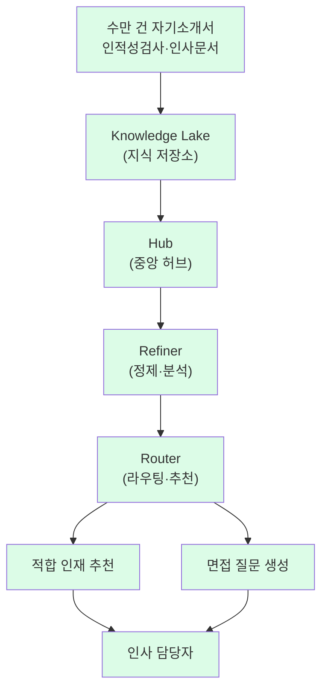

# LG CNS — 에이전틱 AI 기반 HR 채용·인사 시스템

> 🇰🇷 **한국 대기업 SI 벤더의 HR AI 솔루션**: LG CNS가 **에이전틱 AI 생태계**를 본격 가동하며 HR 인사 특화 서비스를 개발. 수만 건의 자기소개서·인적성 데이터 분석 → 적합 인재 추천 + 면접 질문 자동 생성. ⚠️ 자사 보고: **업무 생산성 약 26% 개선**.

## Summary

LG CNS (LG 그룹 IT 서비스 계열사)가 에이전틱 AI 기반 HR 채용·인사 시스템을 개발. **대규모 채용 시** 인사 시스템에 제출된 수만 건의 자기소개서·인적성검사 데이터와 기존 인사 문서를 **AI가 자동 분석**해 적합 인재를 추천하고, **지원자별 면접 질문을 자동 생성**. ⚠️ 자사 보고: 업무 생산성 약 **26% 개선**. 아키텍처는 **Knowledge Lake + Hub + Refiner + Router** 4개 컴포넌트로 구성.

## Solution Architecture

### A. Process

- **Before (As-is)**: _미공개_ (전통적 HR 서류 심사 + 매뉴얼 면접 질문 준비)
- **After (To-be)** — ✅ LG 공식 보도자료 확인:
  1. 채용 시 지원자의 **자기소개서·인적성검사 데이터** (수만 건)가 인사 시스템에 제출
  2. 에이전틱 AI가 **기존 인사 문서**도 함께 분석
  3. AI가 **적합 인재를 추천**
  4. AI가 **지원자별 맞춤 면접 질문을 자동 생성**
  5. 인사 담당자가 AI 추천·질문을 참고해 면접·선발 진행
- **HITL**: AI는 추천·질문 생성까지, 최종 결정은 사람 (recommend-only)
- **생산성 효과**: ⚠️ 자사 보고: **약 26% 개선**

### B. System Architecture (★ 아키텍처 공개)

LG CNS 에이전틱 AI 생태계의 4개 컴포넌트:

_범례: 녹색 = LG 공식 보도 확인. 아키텍처 4개 컴포넌트명 공개._

**이 아키텍처 공개가 이 use case의 가장 큰 가치** — 국내 HR AI 사례 중 **시스템 아키텍처를 컴포넌트 수준으로 공개한 유일 사례**. 다른 사례(SK AX·마이다스아이티)는 모두 아키텍처 미공개.

### C~E. 세부

- **데이터**: 자기소개서·인적성검사·인사 문서 (규모 "수만 건")
- **모델**: 에이전틱 AI (구체 foundation model _미공개_)
- **조직**: LG CNS 내부 개발 (LG 그룹 계열사에 적용 추정)

## Impact / Metrics (기대효과)

### 기대효과 요약
Before: _미공개 (26% 개선의 기준선 — 채용 담당자 서류 심사 시간? 면접 준비 시간? 전체 채용 프로세스?)_ → After: ⚠️ 자사 보고 업무 생산성 약 26% 개선. 수만 건 자기소개서·인적성 분석 수행(Fact). "26%"의 측정 대상·방법론 _미공개_.

| 지표 | 값 | 출처 | 성격 |
|---|---|---|---|
| 업무 생산성 개선 | **약 26%** | LG 공식 보도 | ⚠️ 자사 보고 |
| 분석 규모 | **수만 건** 자기소개서·인적성 | LG 공식 보도 | ✅ Fact |
| 기능 범위 | 인재 추천 + 면접 질문 생성 | LG 공식 보도 | ✅ Fact |

## Consulting Angle

### 핵심 가치
1. **국내 SI 벤더의 HR AI 진출 signal**: 삼성SDS(Brity Copilot, 18만+ 사용자)·LG CNS(에이전틱 AI HR)·SK AX(AI 채용) — **3대 SI 모두** HR AI에 진출 중
2. **아키텍처 4컴포넌트 공개**: Knowledge Lake → Hub → Refiner → Router 구조는 **다른 기업이 자체 HR AI 구축 시 reference architecture**로 활용 가능
3. **"26% 생산성 개선"**: 이 수치가 채용 담당자의 서류 심사 시간 절감인지, 면접 준비 시간인지, 전체 채용 프로세스인지 불명 — 클라이언트에 제시 시 **"어떤 26%인가?"** 반드시 질문

### vs SK AX vs 마이다스아이티

| | SK AX | 마이다스아이티 | **LG CNS** |
|---|---|---|---|
| 핵심 접근 | AICT (AI 활용 능력 평가) | AI가 역량 예측 (Nature 검증) | **AI가 서류 분석 + 면접 질문 생성** |
| 아키텍처 공개 | ❌ | ❌ | ✅ (4컴포넌트) |
| 학술 검증 | ❌ | ✅ (Nature 논문) | ❌ |
| 도입 기업 수 | 3개 계열사 | **10+ 대기업·공공** | _미공개_ (LG 그룹 내부 추정) |
| 생산성 metric | "100배 빠름" (벤더 주장) | "면접관보다 정확" (학술) | **"26% 개선"** (자사 보고) |

**이 대비표 자체가** 한국 HR AI 컨설팅 프로젝트의 **벤더 비교 슬라이드** 재료.
