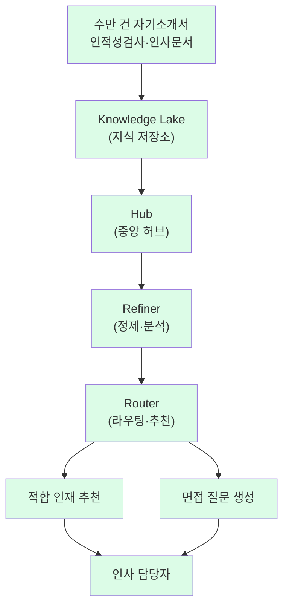

# LG CNS — 에이전틱 AI 기반 HR 채용·인사 시스템

> 🇰🇷 **한국 대기업 SI 벤더의 HR AI 솔루션**: LG CNS가 **에이전틱 AI 플랫폼 '에이전틱웍스'**를 공개하며 인사 특화 에이전틱 AI 서비스를 "개발해 적용할 경우"의 예시로 제시 — 수만 건의 자기소개서·인적성 데이터 분석 → 적합 인재 추천 + 면접 질문 자동 생성. ⚠️ 벤더 주장: **업무 생산성 약 26% 개선 가능** (가정형 서술, 실제 도입 실적 여부 _미공개_) [[sources/lg-cns-agentic-ai-media-release-2025-08]].

## Summary

LG CNS (LG 그룹 IT 서비스 계열사)가 2025-08-25 AX 미디어데이에서 에이전틱 AI 풀스택 플랫폼 '에이전틱웍스(AgenticWorks)'를 공개하고, 인사 특화 에이전틱 AI 서비스를 "개발해 적용할 경우"의 예시로 설명 [[sources/lg-cns-agentic-ai-media-release-2025-08]]. **대규모 채용 시** 인사 시스템에 제출된 수만 건의 자기소개서·인적성검사 데이터와 기존 인사 문서를 **AI가 분석**해 적합 인재를 추천하고, **지원자별 면접 질문을 자동 생성** [[sources/lg-cns-agentic-ai-media-release-2025-08]]. ⚠️ 벤더 주장: 업무 생산성 약 **26% 개선 가능** — 가정형 서술이며 실제 도입 기업·실적 _미공개_ [[sources/lg-cns-agentic-ai-media-release-2025-08]]. 플랫폼은 **Builder·Studio·Knowledge Lake·Hub·Refiner·Router** 6종 모듈로 구성 [[sources/lg-cns-agentic-ai-media-release-2025-08]].

## Problem / Why (도입 배경)

- **Before (baseline)**: ❓ baseline 미공개 — 대규모 채용 시 수만 건의 자기소개서·인적성검사 데이터를 인사 담당자가 심사한다는 문제 설정만 보도자료에 등장 [[sources/lg-cns-agentic-ai-media-release-2025-08]]
- **Pain point**: 대규모 채용의 서류 분석·면접 질문 준비 부하 (규모 축) — 보도자료의 예시 설명 기준 [[sources/lg-cns-agentic-ai-media-release-2025-08]]; 정량 pain point ❓ 미공개
- **Trigger**: 벤더 제품(플랫폼)이므로 특정 기업의 도입 배경은 고객별 상이. LG CNS 측 계기는 에이전틱웍스 플랫폼 출시(2025-08 AX 미디어데이) [[sources/lg-cns-agentic-ai-media-release-2025-08]]
- 🚫 일반론 표기: 채용 서류 심사 부하는 HR 영역의 일반적 pain point이며, 본 사례에 특정된 수치는 없음

## Solution Architecture

### A. Process (프로세스)

- **Before (As-is)**: _미공개_ (전통적 HR 서류 심사 + 매뉴얼 면접 질문 준비)
- **After (To-be)** — ⚠️ 벤더 주장: LG 보도자료의 "인사 특화 에이전틱 AI 서비스를 개발해 적용할 경우" 가정형 설명 [[sources/lg-cns-agentic-ai-media-release-2025-08]]:
  1. 채용 시 지원자의 **자기소개서·인적성검사 데이터** (수만 건)가 인사 시스템에 제출
  2. 에이전틱 AI가 **기존 인사 문서**도 함께 분석
  3. AI가 **적합 인재를 추천**
  4. AI가 **지원자별 맞춤 면접 질문을 자동 생성**
  5. 인사 담당자가 AI 추천·질문을 참고해 면접·선발 진행
- **HITL**: AI는 추천·질문 생성까지, 최종 결정은 사람 (recommend-only)
- **생산성 효과**: ⚠️ 벤더 주장: **약 26% 개선 가능** (가정형) [[sources/lg-cns-agentic-ai-media-release-2025-08]]
- **Trigger & Frequency**: 대규모 채용 시 (adhoc) [[sources/lg-cns-agentic-ai-media-release-2025-08]]
- **Scope of autonomy**: recommend (인재 추천·면접 질문 생성) — 최종 선발 주체는 보도자료 미명시 _미공개_

### B. System & Infrastructure (★ 플랫폼 아키텍처 공개)

- **Core HRIS / 기반 시스템**: _미공개 (not disclosed)_ — "인사 시스템에 제출된" 데이터라는 표현만 있음 [[sources/lg-cns-agentic-ai-media-release-2025-08]]
- **AI 시스템 배치**: 에이전틱웍스 플랫폼 위에 인사 특화 에이전틱 AI 서비스를 구축하는 구조 ⚠️ 벤더 주장 [[sources/lg-cns-agentic-ai-media-release-2025-08]]; 플랫폼은 DAP GenAI 플랫폼 + 코히어 기술 협력 기반 [[sources/lg-cns-agentic-ai-media-release-2025-08]]
- **배포 환경**: _미공개 (not disclosed)_
- **연동·통합**: MCP·A2A로 ERP·CRM 등 기업 시스템과 AI 에이전트 연결 지원 ⚠️ 벤더 주장 [[sources/lg-cns-agentic-ai-media-release-2025-08]]; 'Hub' 모듈이 AI 에이전트-기업 시스템 연동 담당 [[sources/lg-cns-agentic-ai-media-release-2025-08]]
- **사용자 접점 (UX layer)**: _미공개 (not disclosed)_
- **인증·권한**: _미공개 (not disclosed)_; 보안은 자체 AI 보안솔루션 '시큐엑스퍼 AI' 탑재(민감정보 유출 사전 필터링·이상징후 탐지) ⚠️ 벤더 주장 [[sources/lg-cns-agentic-ai-media-release-2025-08]]

LG CNS 에이전틱웍스의 6종 모듈 중 HR 예시와 관련된 4개 컴포넌트 [[sources/lg-cns-agentic-ai-media-release-2025-08]]:

```mermaid
flowchart TB
    Data[수만 건 자기소개서<br/>인적성검사·인사문서] --> KL["Knowledge Lake<br/>(지식 저장소)"]
    KL --> Hub["Hub<br/>(중앙 허브)"]
    Hub --> Refiner["Refiner<br/>(정제·분석)"]
    Refiner --> Router["Router<br/>(라우팅·추천)"]
    Router --> Rec[적합 인재 추천]
    Router --> Q[면접 질문 생성]
    Rec --> HR[인사 담당자]
    Q --> HR
    classDef fact fill:#dcfce7
    class Data,KL,Hub,Refiner,Router,Rec,Q,HR fact
```
_범례: 녹색 = LG 보도자료에서 확인된 모듈명·기능 (벤더 발표). 모듈 간 실제 데이터 흐름 순서는 보도자료에 명시되지 않음 — 도식의 순서는 HR 예시 설명 흐름 기준._

**이 플랫폼 아키텍처 공개가 이 use case의 가장 큰 가치** — 국내 HR AI 사례 중 **플랫폼 컴포넌트 수준으로 공개한 드문 사례**. 다른 사례(SK AX·마이다스아이티)는 아키텍처 미공개. 단, HR 서비스 자체는 "적용할 경우"의 예시이며 실제 구축 여부 _미공개_.

### C. Data (데이터)

- **입력 데이터 소스**: 자기소개서·인적성검사 데이터·시스템상 기존 인사 문서 [[sources/lg-cns-agentic-ai-media-release-2025-08]]
- **데이터 규모**: "수만 건" (대규모 채용 시) [[sources/lg-cns-agentic-ai-media-release-2025-08]]
- **전처리·정제**: 'Knowledge Lake' 모듈이 문서·데이터 수집·정제 등 전처리 담당 ⚠️ 벤더 주장 [[sources/lg-cns-agentic-ai-media-release-2025-08]]; 세부 기법(PII 마스킹·임베딩 등) _미공개 (not disclosed)_
- **학습 vs RAG vs In-context 구분**: _미공개 (not disclosed)_ — 'Refiner'가 산업별 AI 모델 고도화 담당이라고만 서술 [[sources/lg-cns-agentic-ai-media-release-2025-08]]
- **데이터 거버넌스**: _미공개 (not disclosed)_
- **민감정보 처리**: 시큐엑스퍼 AI의 민감정보 유출 사전 필터링 ⚠️ 벤더 주장 [[sources/lg-cns-agentic-ai-media-release-2025-08]]; 개인정보보호법·DPIA 언급 없음
- **데이터 출처의 오너십**: HR 데이터 (고객 기업 인사 시스템) [[sources/lg-cns-agentic-ai-media-release-2025-08]]

### D. Model (모델)

- **Foundation model**: _미공개 (not disclosed)_ — 플랫폼 차원에서는 엑사원·LG CNS-코히어 공동 개발 추론형 LLM 등 활용 가능 ⚠️ 벤더 주장 [[sources/lg-cns-agentic-ai-media-release-2025-08]]; HR 예시에 어떤 모델이 쓰이는지 미명시
- **Model 유형**: agent (에이전틱 AI) [[sources/lg-cns-agentic-ai-media-release-2025-08]]
- **제공 방식**: _미공개 (not disclosed)_
- **커스터마이징 기법**: 'Refiner'로 산업별·밸류체인별 모델 고도화 ⚠️ 벤더 주장 [[sources/lg-cns-agentic-ai-media-release-2025-08]]; 기법 세부 _미공개_
- **Orchestration 프레임워크**: 'Router'가 최적 AI 모델 자동 선택·호출, MCP·A2A 지원 ⚠️ 벤더 주장 [[sources/lg-cns-agentic-ai-media-release-2025-08]]
- **평가·가드레일**: _미공개 (not disclosed)_
- **비용·성능 지표**: _미공개 (not disclosed)_

### E. Organization & Team (조직·팀 구조)

- **오너십**: LG CNS (벤더·SI) — 플랫폼 개발 주체 [[sources/lg-cns-agentic-ai-media-release-2025-08]]; HR 서비스 도입 기업 _미공개 (not disclosed)_
- **참여 역할**: _미공개 (not disclosed)_
- **팀 규모·기간**: _미공개 (not disclosed)_
- **거버넌스 체계**: _미공개 (not disclosed)_
- **파트너**: 코히어(Cohere) 기술 협력 (플랫폼 차원) [[sources/lg-cns-agentic-ai-media-release-2025-08]]

## Impact / Metrics (기대효과)

### 기대효과 요약
Before: _미공개 (26% 개선의 기준선 — 채용 담당자 서류 심사 시간? 면접 준비 시간? 전체 채용 프로세스?)_ → After: ⚠️ 자사 보고 업무 생산성 약 26% 개선. 수만 건 자기소개서·인적성 분석 수행(Fact). "26%"의 측정 대상·방법론 _미공개_.

| 지표 | 값 | 출처 | 성격 |
|---|---|---|---|
| 업무 생산성 개선 | **약 26%** ("적용할 경우" 가정형) | [[sources/lg-cns-agentic-ai-media-release-2025-08]] | ⚠️ 벤더 주장 |
| 분석 규모 | **수만 건** 자기소개서·인적성 | [[sources/lg-cns-agentic-ai-media-release-2025-08]] | ⚠️ 벤더 주장 (예시 설명) |
| 기능 범위 | 인재 추천 + 면접 질문 생성 | [[sources/lg-cns-agentic-ai-media-release-2025-08]] | ⚠️ 벤더 주장 (예시 설명) |
| (참고) 에이엑스씽크 LG디스플레이 적용 | 하루 업무 생산성 약 10% 향상·연 100억원 이상 절감 — HR 채용 서비스가 아닌 공통업무 서비스 | [[sources/lg-cns-agentic-ai-media-release-2025-08]] | ⚠️ 벤더 주장 |

## Governance & Risk

- **HITL**: AI는 추천·질문 생성, 최종 선발 주체·검토 절차는 _미공개_ [[sources/lg-cns-agentic-ai-media-release-2025-08]]
- **편향·공정성**: 자기소개서·인적성 기반 인재 추천에 대한 bias 감사·설명가능성 언급 없음 — _미공개 (not disclosed)_
- **개인정보**: 지원자 개인정보(자기소개서·인적성) 처리 — 시큐엑스퍼 AI 민감정보 필터링 ⚠️ 벤더 주장 [[sources/lg-cns-agentic-ai-media-release-2025-08]]; 채용절차법·개인정보보호법 대응 _미공개_
- **규제 노출**: 채용 서류 심사·면접 질문 생성 → AI 기본법 고영향 AI(채용) 해당 가능, EU AI Act Annex III 4(a)
- ⚠️ **hedging**: 26%는 "개발해 적용할 경우 … 개선할 수 있다"는 가정형 — 실제 도입 실적으로 인용 금지 [[sources/lg-cns-agentic-ai-media-release-2025-08]]

## Contradictions

> [!note] 2026-09-27 grounding — 인용 소스(LG 보도자료)는 HR 채용 서비스를 "적용할 경우"의 예시로만 서술하므로 stage를 production → announced로 정정. 26%는 ⚠️ 자사 보고 → ⚠️ 벤더 주장(가정형)으로 재분류. Consulting Angle의 삼성SDS Brity Copilot 사용자 수, "LG 그룹 계열사 적용 추정" 서술은 인용 소스에 없어 제거.

## Consulting Angle

### 핵심 가치
1. **국내 SI 벤더의 HR AI 진출 signal**: 삼성SDS(Brity Copilot — 사용자 수는 본 페이지 인용 소스에 없음, 해당 페이지 참조)·LG CNS(에이전틱 AI HR 예시)·SK AX(AI 채용) — **3대 SI 모두** HR AI에 진출 중
2. **플랫폼 아키텍처 공개**: Knowledge Lake·Hub·Refiner·Router(+Builder·Studio) 6종 모듈 구조는 **다른 기업이 자체 HR AI 구축 시 reference architecture**로 활용 가능 — 단, HR 서비스는 가정형 예시이므로 "도입 사례"로 제시하지 말 것
3. **"26% 생산성 개선"**: 이 수치가 채용 담당자의 서류 심사 시간 절감인지, 면접 준비 시간인지, 전체 채용 프로세스인지 불명이며 "적용할 경우" 가정형 — 클라이언트에 제시 시 **"어떤 26%인가? 실측인가?"** 반드시 질문

### vs SK AX vs 마이다스아이티

| | SK AX | 마이다스아이티 | **LG CNS** |
|---|---|---|---|
| 핵심 접근 | AICT (AI 활용 능력 평가) | AI가 역량 예측 (Nature 검증) | **AI가 서류 분석 + 면접 질문 생성** |
| 아키텍처 공개 | 🚫 | 🚫 | ✅ (4컴포넌트) |
| 학술 검증 | 🚫 | ✅ (Nature 논문) | 🚫 |
| 도입 기업 수 | 3개 계열사 | **10+ 대기업·공공** | _미공개_ |
| 생산성 metric | "100배 빠름" (벤더 주장) | "면접관보다 정확" (학술) | **"26% 개선 가능"** (벤더 주장, 가정형) |

**이 대비표 자체가** 한국 HR AI 컨설팅 프로젝트의 **벤더 비교 슬라이드** 재료.
