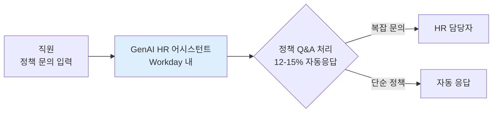

## Summary

Lloyds Banking Group(67,000명)은 2018년 Workday HCM 도입, 2020년 Workday Skills Cloud를 추가 배포한 후, 2024년부터 HR 정책 Q&A에 특화된 생성형 AI 파일럿을 운영 중이다. ✅ **Fact** 2025년 GenAI가 약 £50M 가치를 창출했으며, 2026년 £100M 이상을 목표로 GenAI·Agentic AI 확대를 추진 중이다. 2026년 1월에는 67,000명 전 직원 대상 AI Academy를 론칭했다. [[sources/ffnews-lloyds-100m-ai-2026.md]] [[sources/itpro-lloyds-ai-academy-2026.md]]

## Problem / Why

영국 금융서비스 업계 디지털 전환 압력과 함께, 67,000명 규모의 HR 정책 관련 문의(휴가·복리후생 등)가 HR 팀 리소스를 과도하게 소모하고 있었다. 또한 AI 시대의 스킬 격차를 조직 전체가 선제적으로 해결하는 것이 전략적 과제였다.

## Solution Architecture

> **최우선 원칙**: 이 섹션은 **공개된 사실만** 기록한다.

### A. Process (프로세스)

- **Before (As-is)**: HR 정책 관련 문의를 HR 팀이 직접 처리. 스킬 데이터는 사일로화.
- **After (To-be)**:
  1. ✅ **Fact** Workday HCM을 단일 HR 시스템으로 운영 (2018년 이후). [[sources/enterprisetimes-lloyds-workday-genai-2024-11.md]]
  2. ✅ **Fact** Workday Skills Cloud로 스킬 데이터 통합 관리 (2020년 이후). [[sources/unleash-lloyds-skills-ai-2025.md]]
  3. ✅ **Fact** GenAI 파일럿: 고볼륨 정책(휴가, 복리후생 옵션 등) Q&A를 AI가 처리. 300명 파일럿 중 12–15%의 정책 문의를 GenAI가 응답. [[sources/enterprisetimes-lloyds-workday-genai-2024-11.md]]
- **Human-in-the-loop (HITL) 지점**: ✅ **Fact** 매우 신중한 단계적 접근(rigorous stage gate process) 적용. [[sources/enterprisetimes-lloyds-workday-genai-2024-11.md]]
- **Trigger & Frequency**: 직원 정책 문의 발생 시 수시(on-demand).
- **Scope of autonomy**: Recommend 수준 — AI 응답 후 직원이 확인.

범례: 실선 = [[sources/enterprisetimes-lloyds-workday-genai-2024-11.md]] 확인.

### B. System & Infrastructure (시스템·인프라)

- **Core HRIS / 기반 시스템**: ✅ **Fact** Workday HCM (단일 HR 시스템). [[sources/enterprisetimes-lloyds-workday-genai-2024-11.md]]
- **AI 시스템 배치**: ✅ **Fact** Workday 내 GenAI 기능 + ServiceNow HR(EX 변환 프로젝트). [[sources/enterprisetimes-lloyds-workday-genai-2024-11.md]]
- **배포 환경**: _미공개 (not disclosed)_
- **연동·통합**: Workday HCM ↔ Workday Skills Cloud 통합. ServiceNow HR 별도 운영.
- **사용자 접점 (UX layer)**: _미공개 (not disclosed)_
- **인증·권한**: _미공개 (not disclosed)_

### C. Data (데이터)

- **입력 데이터 소스**: ✅ **Fact** Workday HR 마스터 데이터 + 정책 문서(휴가·복리후생 정책 등). [[sources/enterprisetimes-lloyds-workday-genai-2024-11.md]]
- **데이터 규모**: ✅ **Fact** 67,000명 직원 데이터. [[sources/unleash-lloyds-skills-ai-2025.md]]
- **학습 vs RAG vs In-context 구분**: _미공개 (not disclosed)_
- **데이터 거버넌스**: _미공개 (not disclosed)_ — 영국 금융 규제 적용 대상.
- **민감정보 처리**: _미공개 (not disclosed)_ — UK GDPR 적용 환경.

### D. Model (모델)

- **Foundation model**: _미공개 (not disclosed)_ — Workday GenAI 내장 기능 기반이나 구체 모델 미공개.
- **커스터마이징 기법**: _미공개 (not disclosed)_

### E. Organization & Team (조직·팀 구조)

- **오너십**: HR 주도 + IT 협업.
- **팀 규모·기간**: _미공개 (not disclosed)_
- **거버넌스 체계**: ✅ **Fact** 단계적 stage gate 프로세스를 통해 신중하게 확대. [[sources/enterprisetimes-lloyds-workday-genai-2024-11.md]]
- **변화관리**: ✅ **Fact** 2026년 1월 67,000명 전 직원 대상 AI Academy 론칭. 연말 2026까지 100% 직원 AI 기초 교육 목표. [[sources/itpro-lloyds-ai-academy-2026.md]]

## Impact / Metrics (기대효과)

### 기대효과 요약
GenAI로 2025년 £50M, 2026년 £100M 이상 가치 창출 목표 (자사 보고). 대졸 채용 65,000~75,000건에 AI 스크리닝 적용(Fact).

- ⚠️ **자사 보고**: GenAI가 2025년 £50M 가치 창출. [[sources/ffnews-lloyds-100m-ai-2026.md]]
- ⚠️ **자사 보고**: 2026년 £100M 이상 추가 가치 목표 (GenAI + Agentic AI). [[sources/ffnews-lloyds-100m-ai-2026.md]]
- ⚠️ **자사 보고**: 파일럿 단계에서 정책 문의의 12–15%를 GenAI가 처리. [[sources/enterprisetimes-lloyds-workday-genai-2024-11.md]]
- ✅ **Fact**: 2025년 대졸 신입 채용(Graduate Recruitment Program)에 65,000–75,000건 지원 중 AI 스크리닝 적용. [[sources/unleash-lloyds-skills-ai-2025.md]]

## Governance & Risk

- ✅ **Fact**: 매우 신중한 단계적 확대(stage gate) 접근법 채택 — 영국 금융 규제 환경 반영. [[sources/enterprisetimes-lloyds-workday-genai-2024-11.md]]
- 영국 FCA(금융감독청) AI 관련 규제 적용 대상이나 세부 대응 방안 _미공개 (not disclosed)_.

## Contradictions

없음 (현재 기준).

## Consulting Angle

- **규제 금융 환경 AI 도입 패턴**: Lloyds의 "stage gate" 접근은 금융 규제 환경에서 AI를 도입할 때 "빠르게 파일럿 → 검증 → 단계적 확대"하는 모범 사례. 국내 금융지주(KB·신한·하나·우리)의 HR AI 도입 제안 시 직접 벤치마크 가능.
- **Skills-first 전략**: Workday Skills Cloud를 8년간 축적한 스킬 데이터 기반으로 GenAI를 얹는 구조는 "데이터 인프라 선투자 → AI 활용 극대화"의 전형적 패턴.
- **AI Academy 사례**: 전 직원 67,000명 AI 교육을 1년 내 완료 목표로 설정한 것은 대규모 조직의 AI 리터러시 프로그램 설계 벤치마크.
- **파생 질문**: "한국 금융사가 AI Act(EU) 수준의 고위험 AI 시스템 규제를 미리 준비해야 하는가? Lloyds의 stage gate가 참고 가능한가?"
