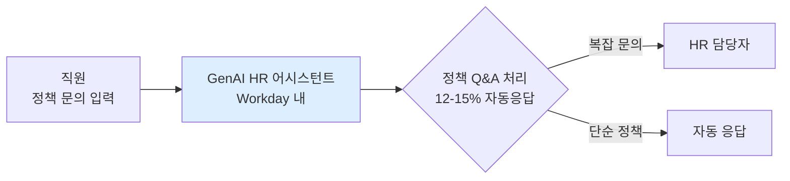

## Summary

Lloyds Banking Group(약 68,000명 [[sources/enterprisetimes-lloyds-workday-genai-2024-11.md]] / 67,000명 [[sources/itpro-lloyds-ai-academy-2026.md]])은 2018년 Workday HCM go-live, 2년 뒤 Workday Skills Cloud를 배포한 후 [[sources/enterprisetimes-lloyds-workday-genai-2024-11.md]], 2024년 시점 직원 300명이 Workday 생성형 AI를 사용하는 **파일럿**을 엄격한 stage-gate로 운영 중이며 첫 use case는 HR 정책 Q&A다 [[sources/enterprisetimes-lloyds-workday-genai-2024-11.md]]. 2025년 GenAI use case 50개를 전사 프로덕션에 투입했고(HR 특정 아님) [[sources/itpro-lloyds-ai-academy-2026.md]], 2026년 1월 67,000명 전 직원 대상 AI Academy를 론칭했다 [[sources/itpro-lloyds-ai-academy-2026.md]]. GenAI 가치 창출 금액(2025 실적·2026 목표)은 FF News 보도 원문 미확보 [[sources/ffnews-lloyds-100m-ai-2026.md]] 및 ITPro 본문 부재로 _미공개_ (수치 근거 미확보 — 2026-09-27 grounding 점검).

## Problem / Why (도입 배경)

- **Before (baseline)**: 고빈도 HR 정책 문의(휴가 등)를 HR 팀이 처리 [[sources/enterprisetimes-lloyds-workday-genai-2024-11.md]]; 문의량·처리 시간 등 정량 baseline ❓ 미공개
- **Pain point**: 고볼륨 정책 문의 처리 부하 (규모 축) [[sources/enterprisetimes-lloyds-workday-genai-2024-11.md]] + 글로벌 스킬 부족을 채용만으로 해결할 수 없어 내부 인력 업스킬·리스킬 필요 [[sources/unleash-lloyds-skills-ai-2025.md]]
- **Trigger**: Workday 생성형 AI 기능 도입을 엄격한 stage-gate로 검토 [[sources/enterprisetimes-lloyds-workday-genai-2024-11.md]]; 직접적 계기 ❓ 미공개

## Solution Architecture

> **최우선 원칙**: 이 섹션은 **공개된 사실만** 기록한다.

### A. Process (프로세스)

- **Before (As-is)**: HR 정책 관련 문의를 HR 팀이 직접 처리. 스킬 데이터는 사일로화.
- **After (To-be)**:
  1. ✅ **Fact** Workday HCM을 단일 HR 시스템으로 운영 (2018년 이후). [[sources/enterprisetimes-lloyds-workday-genai-2024-11.md]]
  2. ✅ **Fact** Workday Skills Cloud로 스킬 데이터 통합 관리 (2020년 이후). [[sources/unleash-lloyds-skills-ai-2025.md]]
  3. ✅ **Fact** GenAI 파일럿: 고볼륨 정책(휴가 등) Q&A를 AI가 처리. 300명 파일럿에서 정책 문의의 약 12-15%를 GenAI가 응답 (⚠️ 자사 보고, Lloyds 인터뷰). 정책을 bite-size로 재구성하고 프롬프트 라이브러리 관리 역량 필요성 발견. [[sources/enterprisetimes-lloyds-workday-genai-2024-11.md]]
- **Human-in-the-loop (HITL) 지점**: ✅ **Fact** 매우 신중한 단계적 접근(rigorous stage gate process) 적용. [[sources/enterprisetimes-lloyds-workday-genai-2024-11.md]]
- **Trigger & Frequency**: 직원 정책 문의 발생 시 수시(on-demand).
- **Scope of autonomy**: Recommend 수준 — AI 응답 후 직원이 확인.

```mermaid
flowchart LR
    A[직원\n정책 문의 입력] --> B[GenAI HR 어시스턴트\nWorkday 내]
    B --> C{정책 Q&A 처리\n12-15% 자동응답}
    C -->|복잡 문의| D[HR 담당자]
    C -->|단순 정책| E[자동 응답]
    style B fill:#ddeeff
```
범례: 실선 = [[sources/enterprisetimes-lloyds-workday-genai-2024-11.md]] 확인.

### B. System & Infrastructure (시스템·인프라)

- **Core HRIS / 기반 시스템**: ✅ **Fact** Workday HCM (단일 HR 시스템). [[sources/enterprisetimes-lloyds-workday-genai-2024-11.md]]
- **AI 시스템 배치**: ✅ **Fact** Workday 내장 생성형 AI 기능 [[sources/enterprisetimes-lloyds-workday-genai-2024-11.md]]. ServiceNow HR 사용 여부는 인용 소스에 없음 → _미공개 (not disclosed)_ (2026-09-27 grounding 점검)
- **배포 환경**: _미공개 (not disclosed)_
- **연동·통합**: Workday HCM + Workday Skills Cloud (단일 HR 시스템 오브 레코드) [[sources/enterprisetimes-lloyds-workday-genai-2024-11.md]] [[sources/unleash-lloyds-skills-ai-2025.md]]; 그 외 연동 _미공개_
- **사용자 접점 (UX layer)**: _미공개 (not disclosed)_
- **인증·권한**: _미공개 (not disclosed)_

### C. Data (데이터)

- **입력 데이터 소스**: ✅ **Fact** Workday HR 마스터 데이터 + 정책 문서(휴가·복리후생 정책 등). [[sources/enterprisetimes-lloyds-workday-genai-2024-11.md]]
- **데이터 규모**: ✅ **Fact** 직원 65,000명+ 및 계약 인력 20,000명 [[sources/unleash-lloyds-skills-ai-2025.md]]; AI Academy 대상 67,000명 [[sources/itpro-lloyds-ai-academy-2026.md]]
- **학습 vs RAG vs In-context 구분**: _미공개 (not disclosed)_
- **데이터 거버넌스**: _미공개 (not disclosed)_ — 영국 금융 규제 적용 대상.
- **민감정보 처리**: _미공개 (not disclosed)_ — UK GDPR 적용 환경.

### D. Model (모델)

- **Foundation model**: _미공개 (not disclosed)_ — Workday GenAI 내장 기능 기반이나 구체 모델 미공개.
- **커스터마이징 기법**: _미공개 (not disclosed)_

### E. Organization & Team (조직·팀 구조)

- **오너십**: HR 측(Stuart Martin) 주도로 거버넌스·IT 솔루션 도입 프로세스를 전면 재검토 [[sources/enterprisetimes-lloyds-workday-genai-2024-11.md]]; IT 협업 세부 _미공개_
- **참여 역할**: AI 윤리 책임자(head of AI ethics) 채용, AI 거버넌스 포럼 참여 [[sources/enterprisetimes-lloyds-workday-genai-2024-11.md]]; 프롬프트 라이브러리 관리 역량 필요성 인식 [[sources/enterprisetimes-lloyds-workday-genai-2024-11.md]]
- **팀 규모·기간**: _미공개 (not disclosed)_
- **거버넌스 체계**: ✅ **Fact** 단계적 stage gate 프로세스를 통해 신중하게 확대. [[sources/enterprisetimes-lloyds-workday-genai-2024-11.md]]
- **변화관리**: ✅ **Fact** 2026년 1월 67,000명 전 직원 대상 AI Academy 론칭. 연말 2026까지 100% 직원 AI 기초 교육 목표. [[sources/itpro-lloyds-ai-academy-2026.md]]

## Impact / Metrics (기대효과)

### 기대효과 요약
파일럿 단계에서 정책 문의 12-15% GenAI 자동 응답 (⚠️ 자사 보고). 전사 GenAI 가치 창출 금액은 _미공개_ (원문 미확보). 대졸 채용 65,000~75,000건 지원에 AI 초기 스크리닝 적용 (⚠️ 자사 보고).

- ⚠️ **자사 보고**: 파일럿 단계에서 정책 문의의 약 12-15%를 GenAI가 처리. [[sources/enterprisetimes-lloyds-workday-genai-2024-11.md]]
- ⚠️ **자사 보고**: 2025 Graduate Recruitment Program에 65,000~75,000건 지원 — AI로 초기 스크리닝, 지역·기능·스킬별 자동 배분. [[sources/unleash-lloyds-skills-ai-2025.md]]
- ✅ **Fact**: 2025년 GenAI use case 50개 전사 프로덕션 투입 (HR 특정 아님), 2,000만 고객 대상 에이전틱 금융 어시스턴트 계획. [[sources/itpro-lloyds-ai-academy-2026.md]]
- 2025년 GenAI 가치 창출 실적·2026년 목표 금액: _미공개_ — FF News 원문 미확보 [[sources/ffnews-lloyds-100m-ai-2026.md]], ITPro 본문에 해당 수치 없음 [[sources/itpro-lloyds-ai-academy-2026.md]] (수치 근거 미확보 — 2026-09-27 grounding 점검)

## Governance & Risk

- ✅ **Fact**: 매우 신중한 단계적 확대(stage gate) 접근법 채택, 거버넌스 프로세스 전면 재검토, head of AI ethics 채용 — 영국 규제 환경 반영. [[sources/enterprisetimes-lloyds-workday-genai-2024-11.md]]
- ✅ **Fact**: AI Academy 전 직원이 'Working with AI Responsibly' 모듈을 먼저 이수. [[sources/itpro-lloyds-ai-academy-2026.md]]
- 영국 FCA(금융감독청) AI 관련 규제 적용 대상이나 세부 대응 방안 _미공개 (not disclosed)_.

## Contradictions

> [!note] 2026-09-27 grounding — GenAI 가치 창출 금액(2025 실적·2026 목표)은 인용 소스 중 FF News 원문 미확보·ITPro 본문 부재로 _미공개_ 처리(✅ Fact 표기 제거). ServiceNow HR 사용 서술은 인용 소스에 없어 _미공개_. HR 정책 Q&A GenAI는 소스 기준 300명 파일럿이므로 stage를 production → pilot으로 정정 (전사 GenAI 50개 use case 프로덕션은 HR 특정 아님). UNLEASH 기사 실제 발행일은 2024-12-18.

## Consulting Angle

- **규제 금융 환경 AI 도입 패턴**: Lloyds의 "stage gate" 접근은 금융 규제 환경에서 AI를 도입할 때 "빠르게 파일럿 → 검증 → 단계적 확대"하는 모범 사례. 국내 금융지주(KB·신한·하나·우리)의 HR AI 도입 제안 시 직접 벤치마크 가능.
- **Skills-first 전략**: Workday Skills Cloud를 8년간 축적한 스킬 데이터 기반으로 GenAI를 얹는 구조는 "데이터 인프라 선투자 → AI 활용 극대화"의 전형적 패턴.
- **AI Academy 사례**: 전 직원 67,000명 AI 교육을 2026년 내 100% 완료 목표로 설정한 것은 대규모 조직의 AI 리터러시 프로그램 설계 벤치마크 [[sources/itpro-lloyds-ai-academy-2026.md]].
- **인용 주의**: HR GenAI는 파일럿(300명) 단계 수치만 공개 — "전사 £ 단위 가치"는 원문 미확보이므로 클라이언트 deck에 인용하지 말 것.
- **파생 질문**: "한국 금융사가 AI Act(EU) 수준의 고위험 AI 시스템 규제를 미리 준비해야 하는가? Lloyds의 stage gate가 참고 가능한가?"
