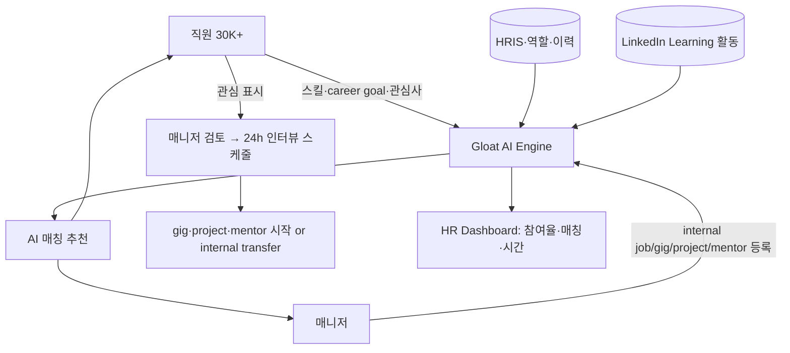

> 📌 **본 페이지 생성 배경 (2026-05-06)**: 기존 [[eightfold-ai-talent-intelligence]] 페이지에 Mastercard "Unlocked" 사례가 Eightfold reference로 등재되어 있었으나, fact-check 결과 **Unlocked = Gloat 도입 사례** (2022~)임이 확인됨. PwC 컨설팅 자료가 정확했고, 기존 wiki가 잘못된 추론으로 등재한 것이 발견되어 별도 페이지로 분리.

## Summary

Mastercard는 2022년 Gloat을 도입해 internal talent marketplace **"Unlocked"**를 출시 — 이전 수동 운영하던 "Project Possible"의 AI 후속. ⚠️ 자사 보고 (Gloat case study + Mastercard 2025 AI culture story 종합):
- 2022 시점: $21M productivity 절감 (첫 1년), 24,000+ 직원 매칭, 62% 등록률, 100,000+ unlocked capacity hours, 3,000+ role/멘토십 매칭 — cross-functional 62%·cross-regional 52%
- 2025 시점: **93% 등록률, 42% 월간 engagement, 1M project hours 누적, 24h 내 인터뷰 스케줄링**

> ⚠️ **PwC 컨설팅 자료 정정**: PwC 자료의 "$20M 절감"은 **$21M의 오기/반올림** (Gloat 공식 case study 기준). "360,000 hours"는 **Schneider Electric Open Talent Market** 메트릭과 혼동된 것 — Mastercard는 100K → 1M project hours.

## Problem / Why (도입 배경)

- **Before**: Mastercard는 2019년부터 "Project Possible"이라는 **수동 internal gig 프로그램** 운영 — HR이 spreadsheet로 직원 ↔ gig 매칭, scale 한계
- **Pain point**:
  - 30,000+ global 직원의 **스킬 inventory invisible** — 어느 부서에 어떤 스킬을 가진 직원이 있는지 매니저도 모름
  - 직원이 internal mobility 경로 모름 → external offer로 이탈
  - cross-functional·cross-regional collaboration 기회 손실
- **Trigger**: Project Possible의 success → AI 자동 매칭으로 scale up 결정. Gloat 도입 (2022)

## Solution Architecture

### A. Process (프로세스)

- **Before (Project Possible 시대)**: 직원이 gig 신청 → HR 수동 검토 → 매니저가 후보자 1~2명 추천 → 1:1 인터뷰
- **After (Unlocked / Gloat 도입 후)**:
  1. **직원 onboarding**: 자기 스킬·관심사·career goal 입력 (또는 LinkedIn/자체 데이터에서 자동 추출)
  2. **매니저가 internal job/gig/project/mentor 요청** 등록 (필요 스킬·기간·시간 commitment)
  3. **AI 매칭 엔진**: 직원 ↔ opportunity 자동 추천 (스킬 fit·career fit·가용성)
  4. 직원이 관심 표시 → 매니저 검토 → **24h 내 인터뷰 스케줄** (벤더 발표 평균)
  5. 매칭 성공 시 직원이 본업과 병행 (gig·part-time) 또는 internal transfer
  6. **Dashboard**: 매니저는 skill inventory 검색·talent pool 관리, HR는 참여율·matching outcome 추적
- **HITL**: 모든 매칭은 직원 신청 + 매니저 승인 (recommend-only, 자동 transfer 아님)
- **Frequency**: daily (기회 등록·매칭) + 분기별 dashboard 리뷰
- **Scope of autonomy**: recommend-only

### B. System & Infrastructure (시스템·인프라)

- **Core**: Gloat Talent Marketplace SaaS (cloud-hosted, _구체 hyperscaler 미공개_)
- **사용자 접점**: web portal, mobile app, embedded in Workday SSO (추정 — Mastercard 핵심 HRIS)
- **연동**: HRIS (직원 마스터), LinkedIn Learning (스킬 추론), 사내 communication (Teams)
- **인증**: SSO via Mastercard IdP

### C. Data (데이터)

- **입력 데이터**:
  - 직원 자기입력 스킬·career goal·preferences
  - HRIS (역할·이력·성과)
  - LinkedIn Learning 활동 (스킬 추론)
  - 매니저 등록 internal opportunity (job·gig·project·mentor)
- **모델 구조**: skill-based matching (collaborative filtering + ontology) + LLM (자연어 매칭 설명·career path 생성)
- **Data governance**: GDPR (EU 직원), Mastercard 자체 privacy policy, _구체 retention 미공개_

### D. Model (모델)

- **Foundation model**: _구체 LLM provider·버전 미공개_ (Gloat 자체 ML stack)
- **추천 모델**: skills ontology + collaborative filtering + career path simulation
- **Customization**: Mastercard 직무 체계·산업 특화

### E. Organization & Team (조직·팀 구조)

- **오너십**: Mastercard People & Capability 팀 + Gloat customer success
- **참여 역할**: HR business partner (deployment) + IT (HRIS 연동) + 매니저 community
- **거버넌스**: 직원 자발 참여 모델 (강제 등록 아님 — 단 93% 자발 등록률)

### F. Diagrams (도식)

범례: 모든 연결 ⚠️ Gloat case study + Mastercard 2025 자사 보고 기반.

## Impact / Metrics (기대효과)

### 기대효과 요약
**internal mobility** 자동화로 30K+ 글로벌 직원 스킬 visibility·cross-functional·cross-regional collaboration 활성화. 2022~2025 메트릭 모두 ⚠️ 자사 보고 (Gloat case study + Mastercard newsroom). Tier 1 독립 검증은 Josh Bersin 블로그 부분만.

| 지표 | 값 | 출처 | 성격 |
|---|---|---|---|
| **Productivity 절감 (첫 1년, 2022)** | **$21M** (PwC가 $20M로 표기 = 오기/반올림) | Gloat case study 2022 | ⚠️ 자사 보고 (벤더 case study) |
| Unlocked capacity (2022) | **100,000+ hours** | Gloat case study 2022 | ⚠️ 자사 보고 |
| **Project hours (2025 누적)** | **1M hours** | Mastercard 2025 AI culture story | ⚠️ 자사 보고 |
| 직원 매칭 (2022) | **24,000+** | Gloat case study 2022 | ⚠️ 자사 보고 |
| **등록률 (2022)** | **62%** | Gloat case study 2022 | ⚠️ 자사 보고 |
| **등록률 (2025)** | **93%** | Mastercard 2025 자사 보고 | ⚠️ 자사 보고 |
| **월간 engagement (2025)** | **42%** | Mastercard 2025 자사 보고 | ⚠️ 자사 보고 |
| **인터뷰 스케줄링 (2025)** | **24h 내 완료** | Mastercard 2025 자사 보고 | ⚠️ 자사 보고 |
| Cross-functional 매칭 비율 | **62%** | Gloat case study | ⚠️ 자사 보고 |
| Cross-regional 매칭 비율 | **52%** | Gloat case study | ⚠️ 자사 보고 |
| Role/멘토십 매칭 (2022) | 3,000+ | Gloat case study | ⚠️ 자사 보고 |
| 🚫 "$20M 절감" (PwC 표기) | **$21M의 오기** | Gloat 공식은 $21M | 정정 |
| 🚫 "360,000 hours" | Schneider Open Talent Market 메트릭과 혼동 | wiki 등재 거부 | 정정 |

## Governance & Risk

- ⚠️ **모든 customer outcome metric은 ⚠️ 자사 보고** — Gloat 벤더 자료 + Mastercard newsroom. Tier 1 (Forrester·Gartner·McKinsey) 독립 정량 검증 0건. Josh Bersin 2019 블로그가 talent marketplace 전반 가치를 검증한 정도
- ⚠️ **PwC 자료 정정 사항**:
  - "$20M" → "$21M" (Gloat 공식)
  - "360,000 hours" → 100K (2022) / 1M (2025); 360K는 Schneider Electric 사례
  - 다만 PwC 자료의 **"Unlocked = Gloat" 벤더 식별은 정확** — 기존 wiki의 Eightfold 등재가 잘못
- ✅ "Unlocked" 프로그램 명칭 + 2022년 Gloat 도입 + Project Possible 후속이라는 사실은 Gloat 공식 case study + Mastercard newsroom + Josh Bersin 블로그 3출처 교차 확인
- ⚠️ Mastercard 2025 newsroom 기사는 **벤더명을 명시하지 않음** — "AI-powered talent marketplace called Unlocked"로만 표현. 벤더 식별은 별도 출처 필요

## Consulting Angle

- **Internal mobility AI의 대표 customer reference**: Mastercard·Schneider Electric·Unilever 3사가 Gloat 글로벌 reference Top 3. 한국 대기업 internal talent marketplace 도입 시 가장 자주 인용
- **vs Schneider Electric [[schneider-electric-gloat-talent-marketplace]]**:
  - Schneider: 360,000+ hours unlocked, $15M+ 절감 (Gloat reference)
  - Mastercard: 100K → 1M hours (3년간 10배 성장), $21M 절감 (첫 1년)
  - 양사 모두 Gloat reference이나 Schneider는 manufacturing·engineering, Mastercard는 finance·tech 직군 — 산업별 reference 차이
- **vs Eightfold [[eightfold-ai-talent-intelligence]]**:
  - Eightfold: skill ontology + AI matching의 다른 접근. Gloat는 talent marketplace 전용
  - 한국 도입 시 vendor selection 핵심 질문: Eightfold (talent intelligence) vs Gloat (marketplace) — 사용 사례 fit이 다름
- **반면교사 (이중)**:
  1. **PwC 자료 디테일 검증 필요** — "$20M ($21M 오기)" + "360,000 hours (혼동)" — 컨설팅 deck 작성 시 1차 source (Gloat case study) 직접 확인 필수
  2. **기존 wiki의 Eightfold 오등재** — Mastercard 2025 newsroom이 벤더명을 명시하지 않은 점을 이용해 잘못된 추론 발생. **벤더가 명시되지 않은 customer story는 별도 1차 출처 (벤더 case study) 교차 확인 필수**
- **한국 적용 angle**:
  - 삼성·LG·SK·현대차 등 글로벌 직원 30K+ 그룹사에 talent marketplace 도입 시 Mastercard·Schneider 모두 reference로 사용 가능
  - 단 **한국 직무 체계 (전임직·기술사무직·계약직 구분)와 Gloat의 글로벌 skill ontology fit** 검증 필요
- **Watch list**: Mastercard 2026 newsroom 갱신·Gloat case study 갱신·Forrester/Gartner의 talent marketplace report 발표 시 confidence 재조정
