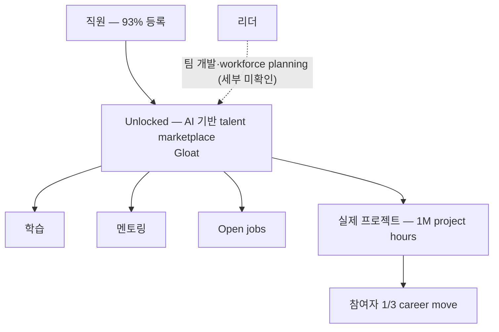

> 📌 **본 페이지 생성 배경 (2026-05-06)**: 기존 [[eightfold-ai-talent-intelligence]] 페이지에 Mastercard "Unlocked" 사례가 Eightfold reference로 등재되어 있었으나, fact-check 결과 **Unlocked = Gloat 도입 사례** (2022~)임이 확인됨. PwC 컨설팅 자료가 정확했고, 기존 wiki가 잘못된 추론으로 등재한 것이 발견되어 별도 페이지로 분리.

## Summary

Mastercard의 internal talent marketplace **"Unlocked"**는 AI 기반 탤런트 마켓플레이스로, 직원에게 학습·멘토링·open job·실제 프로젝트 접근을 제공한다 [[sources/mastercard-ai-culture-story-2025]]. Gloat가 자사 impacts 페이지에 Mastercard 제목으로 게재 → Gloat 고객 [[sources/gloat-mastercard-case-study-2023]]. 도입 연도·전신 프로그램("Project Possible") 등 도입 경위는 인용 소스에 없음 → _미공개_.
- ⚠️ 벤더 주장: 첫해 $21M unlocked productivity [[sources/gloat-mastercard-case-study-2023]] — 캐러셀 카드에 사명 미표기(페이지 제목·URL만 Mastercard), Company size 21,000 카드
- ⚠️ 자사 보고 (2025): **93% 등록률, 월평균 42% engagement, 분기 내 1M project hours 돌파, 참여자의 1/3이 career move** [[sources/mastercard-ai-culture-story-2025]]
- 2022 시점 세부 지표(직원 매칭 수·등록률·unlocked hours·매칭 건수·cross-functional/cross-regional 비율)는 인용 소스에 없음 → _미공개_ (수치 근거 미확보 — 2026-09-27 grounding 점검). Gloat 호스팅 Josh Bersin Co. 사례연구 페이지(bersin-gloat-mastercard-unlocked-case-study-2022)가 별도 생성되어 있으나 본 페이지 sources에 미포함 — /hr-research에서 추가 검토

> ⚠️ **PwC 컨설팅 자료 정정**: PwC 자료의 "$20M 절감"은 **$21M의 오기/반올림** (Gloat impacts 페이지 카드 기준 [[sources/gloat-mastercard-case-study-2023]]). PwC의 unlocked hours 수치는 **Schneider Electric Open Talent Market** 메트릭과 혼동된 것 — Mastercard 공개 수치는 1M project hours (2025) [[sources/mastercard-ai-culture-story-2025]].

## Problem / Why (도입 배경)

- **Before**: ❓ baseline 미공개 — 전신 프로그램("Project Possible")·도입 연도는 인용 소스에 없음 (2026-09-27 grounding 점검)
- **Pain point**:
  - "title·학위보다 skills"에 집중해 직원의 future-readiness 확보 — AI 등 신흥 역할·스킬 수요 [[sources/mastercard-ai-culture-story-2025]]
  - AI로 변화하는 역할(예: 리포팅 업무 junior)의 재배치 필요 [[sources/mastercard-ai-culture-story-2025]]
  - 직원 규모·스킬 inventory 가시성 등 정량 pain point ❓ 미공개
- **Trigger**: ❓ 미공개 — 도입 계기는 인용 소스에 없음

## Solution Architecture

### A. Process (프로세스)

- **Before**: _미공개 (not disclosed)_ — 도입 전 프로세스는 인용 소스에 없음
- **After (Unlocked)** — ⚠️ 자사 보고 [[sources/mastercard-ai-culture-story-2025]]:
  1. 직원이 Unlocked에 등록 (93% 등록) — 등록 시 입력 항목 _미공개_
  2. 플랫폼이 학습·멘토링·open job·실제 프로젝트 기회를 제공 ("powered by AI") — 매칭 로직 세부 _미공개_
  3. 직원이 프로젝트에 참여 → project hours 누적 (분기 내 1M 시간 돌파)
  4. 참여자의 1/3이 career move 경험
  5. 리더는 Unlocked를 팀 개발·workforce planning 파트너로 활용
  - 매니저 승인 절차·dashboard 구성 _미공개 (not disclosed)_
  - ※ "인터뷰 24시간 내 스케줄링"은 같은 기사의 **외부 채용(talent acquisition) AI** 수치이며 Unlocked 프로세스가 아님 [[sources/mastercard-ai-culture-story-2025]] (2026-09-27 grounding 점검으로 분리)
- **HITL**: _미공개 (not disclosed)_ — 매니저 승인 단계 여부 미기재
- **Frequency**: 상시 (월간 engagement 42% 측정) [[sources/mastercard-ai-culture-story-2025]]
- **Scope of autonomy**: _미공개 (not disclosed)_ — 추천만 하는지 여부 미기재

### B. System & Infrastructure (시스템·인프라)

- **Core**: Gloat Talent Marketplace (Gloat impacts 페이지에 Mastercard 사례 게재) [[sources/gloat-mastercard-case-study-2023]]; 호스팅 환경 _미공개 (not disclosed)_
- **Core HRIS**: _미공개 (not disclosed)_
- **사용자 접점**: _미공개 (not disclosed)_
- **연동**: _미공개 (not disclosed)_
- **인증**: _미공개 (not disclosed)_

### C. Data (데이터)

- **입력 데이터**: 학습·멘토링·open job·프로젝트 기회 데이터 [[sources/mastercard-ai-culture-story-2025]]; 직원 스킬 프로필 입력 방식·HRIS 연동 _미공개 (not disclosed)_
- **데이터 규모**: 직원 93% 등록, 1M project hours [[sources/mastercard-ai-culture-story-2025]]; 직원 수 _미공개_
- **모델 구조**: _미공개 (not disclosed)_ — "AI 기반"이라는 서술만 있음 [[sources/mastercard-ai-culture-story-2025]]
- **Data governance**: _미공개 (not disclosed)_

### D. Model (모델)

- **Foundation model**: _미공개 (not disclosed)_
- **추천 모델**: _미공개 (not disclosed)_
- **Customization**: _미공개 (not disclosed)_

### E. Organization & Team (조직·팀 구조)

- **오너십**: Mastercard People & Capabilities 팀 (HR) [[sources/mastercard-ai-culture-story-2025]]; Gloat 측 역할 _미공개_
- **참여 역할**: _미공개 (not disclosed)_
- **거버넌스**: 직원 등록률 93%·월간 참여 42% [[sources/mastercard-ai-culture-story-2025]]; 등록 강제 여부 _미공개_

### F. Diagrams (도식)

```mermaid
flowchart TB
    Emp[직원 — 93% 등록] --> Unlocked[Unlocked — AI 기반 talent marketplace<br/>Gloat]
    Unlocked --> Learn[학습]
    Unlocked --> Mentor[멘토링]
    Unlocked --> Jobs[Open jobs]
    Unlocked --> Proj[실제 프로젝트 — 1M project hours]
    Proj --> Move[참여자 1/3 career move]
    Leader[리더] -.->|"팀 개발·workforce planning (세부 미확인)"| Unlocked
```

범례: 실선 = Mastercard 2025 자사 보고 확인 (⚠️ 자사 보고). 점선 = 세부 미확인. HRIS·매니저 승인·dashboard 노드는 소스 미확인으로 제거 (2026-09-27).

## Impact / Metrics (기대효과)

### 기대효과 요약
**internal mobility** 플랫폼으로 직원의 학습·멘토링·프로젝트·이동 기회 확대. 메트릭은 ⚠️ 벤더 카드(Gloat) + ⚠️ 자사 보고(Mastercard newsroom). Tier 1 독립 검증 없음 — Josh Bersin 2019 블로그 [[sources/bersin-schneider-unilever-talent-marketplace-2019-07]]는 Unilever·Schneider 사례로 Mastercard 언급 없음.

| 지표 | 값 | 출처 | 성격 |
|---|---|---|---|
| **Unlocked productivity (첫 1년)** | **$21M** (PwC가 $20M로 표기 = 오기/반올림) — 카드에 사명 미표기, Company size 21,000 | [[sources/gloat-mastercard-case-study-2023]] | ⚠️ 벤더 주장 (Gloat impacts 캐러셀) |
| Unlocked capacity hours (2022) | _미공개_ (수치 근거 미확보 — 2026-09-27 grounding 점검) | — | — |
| **Project hours (2025)** | **1M hours** (분기 내 돌파) | [[sources/mastercard-ai-culture-story-2025]] | ⚠️ 자사 보고 |
| 직원 매칭 (2022) | _미공개_ (수치 근거 미확보 — 2026-09-27 grounding 점검) | — | — |
| 등록률 (2022) | _미공개_ (수치 근거 미확보 — 2026-09-27 grounding 점검) | — | — |
| **등록률 (2025)** | **93%** | [[sources/mastercard-ai-culture-story-2025]] | ⚠️ 자사 보고 |
| **월간 engagement (2025)** | **42%** | [[sources/mastercard-ai-culture-story-2025]] | ⚠️ 자사 보고 |
| **참여자 career move (2025)** | 참여자의 **1/3** | [[sources/mastercard-ai-culture-story-2025]] | ⚠️ 자사 보고 |
| (참고) 채용 인터뷰 스케줄링 | 24시간 내 — **외부 채용 AI 수치, Unlocked 아님** | [[sources/mastercard-ai-culture-story-2025]] | ⚠️ 자사 보고 |
| Cross-functional 매칭 비율 | _미공개_ (수치 근거 미확보 — 2026-09-27 grounding 점검) | — | — |
| Cross-regional 매칭 비율 | _미공개_ (수치 근거 미확보 — 2026-09-27 grounding 점검) | — | — |
| Role/멘토십 매칭 (2022) | _미공개_ (수치 근거 미확보 — 2026-09-27 grounding 점검) | — | — |
| 🚫 "$20M 절감" (PwC 표기) | **$21M의 오기** | Gloat 카드는 $21M [[sources/gloat-mastercard-case-study-2023]] | 정정 |
| 🚫 PwC의 unlocked hours 수치 | Schneider Open Talent Market 메트릭과 혼동 — [[schneider-electric-gloat-talent-marketplace]] 참조 | wiki 등재 거부 | 정정 |

## Governance & Risk

- ⚠️ **모든 customer outcome metric은 ⚠️ 벤더 주장/자사 보고** — Gloat 카드 + Mastercard newsroom. Tier 1 (Forrester·Gartner·McKinsey) 독립 정량 검증 0건. Josh Bersin 2019 블로그 [[sources/bersin-schneider-unilever-talent-marketplace-2019-07]]는 talent marketplace 전반(Unilever·Schneider) 가치를 다룬 것으로 Mastercard 언급 없음
- ⚠️ **PwC 자료 정정 사항**:
  - "$20M" → "$21M" (Gloat 카드 [[sources/gloat-mastercard-case-study-2023]])
  - PwC의 unlocked hours 수치 → Mastercard 공개 수치는 1M project hours (2025) [[sources/mastercard-ai-culture-story-2025]]; PwC 수치는 Schneider Electric 사례
  - 다만 PwC 자료의 **"Unlocked = Gloat" 벤더 식별은 정확** — 기존 wiki의 Eightfold 등재가 잘못
- ✅ "Unlocked" 프로그램 명칭은 Mastercard newsroom [[sources/mastercard-ai-culture-story-2025]], Gloat 고객 관계는 Gloat impacts 페이지 제목 [[sources/gloat-mastercard-case-study-2023]]으로 확인. 도입 연도(2022)·Project Possible 후속 서술은 인용 소스에 없어 _미공개_ 처리 (2026-09-27)
- ⚠️ Mastercard 2025 newsroom 기사는 **벤더명을 명시하지 않음** — "AI-powered talent marketplace called Unlocked"로만 표현. 벤더 식별은 별도 출처 필요

## Contradictions

> [!note] 2026-09-27 grounding — Gloat impacts 페이지 raw에는 $21M 카드(사명 미표기)만 있고 2022 세부 지표(직원 매칭 수·등록률·unlocked hours·매칭 건수·cross-functional/cross-regional 비율)와 도입 연도·Project Possible 서술이 없어 _미공개_ 처리. "인터뷰 24시간 내 스케줄링"은 Mastercard 기사의 외부 채용 AI 수치이므로 Unlocked 프로세스에서 분리. B·C·D의 Workday SSO·LinkedIn Learning·Teams·collaborative filtering 등 추정 서술 제거. Josh Bersin 2019 기사는 Mastercard를 다루지 않음(Unilever·Schneider). 별도 생성된 Bersin-Gloat Mastercard 사례연구 source 페이지는 sources 미포함 — /hr-research 검토 대상.

## Consulting Angle

- **Internal mobility AI의 대표 customer reference**: Mastercard·Schneider Electric·Unilever 3사가 Gloat 글로벌 reference Top 3. 한국 대기업 internal talent marketplace 도입 시 가장 자주 인용
- **vs Schneider Electric [[schneider-electric-gloat-talent-marketplace]]**:
  - Schneider: unlocked hours·절감액은 [[schneider-electric-gloat-talent-marketplace]] 페이지 수치 참조 (Gloat reference)
  - Mastercard: 1M project hours (2025, 자사 보고), $21M unlocked productivity (첫 1년, Gloat 카드 — 사명 미표기)
  - 양사 모두 Gloat reference이나 Schneider는 manufacturing·engineering, Mastercard는 finance·tech 직군 — 산업별 reference 차이
- **vs Eightfold [[eightfold-ai-talent-intelligence]]**:
  - Eightfold: skill ontology + AI matching의 다른 접근. Gloat는 talent marketplace 전용
  - 한국 도입 시 vendor selection 핵심 질문: Eightfold (talent intelligence) vs Gloat (marketplace) — 사용 사례 fit이 다름
- **반면교사 (이중)**:
  1. **PwC 자료 디테일 검증 필요** — "$20M ($21M 오기)" + unlocked hours 수치 혼동 — 컨설팅 deck 작성 시 1차 source (Gloat case study) 직접 확인 필수
  2. **기존 wiki의 Eightfold 오등재** — Mastercard 2025 newsroom이 벤더명을 명시하지 않은 점을 이용해 잘못된 추론 발생. **벤더가 명시되지 않은 customer story는 별도 1차 출처 (벤더 case study) 교차 확인 필수**
- **한국 적용 angle**:
  - 삼성·LG·SK·현대차 등 글로벌 대규모 그룹사에 talent marketplace 도입 시 Mastercard·Schneider 모두 reference로 사용 가능
  - 단 **한국 직무 체계 (전임직·기술사무직·계약직 구분)와 Gloat의 글로벌 skill ontology fit** 검증 필요
- **Watch list**: Mastercard 2026 newsroom 갱신·Gloat case study 갱신·Forrester/Gartner의 talent marketplace report 발표 시 confidence 재조정
