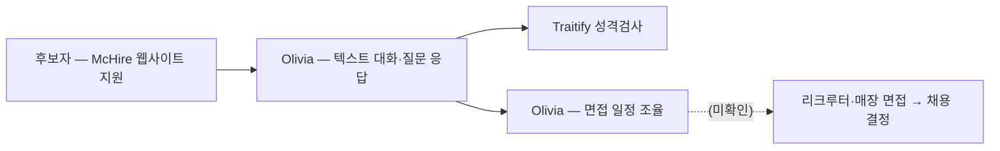

# McDonald's — Paradox AI 채용

⚠️ 벤더·자사 공동 case study(2021) 수치: McHire(Paradox) 사용으로 채용 소요 시간 **21일→3일 미만** — NBC News가 해당 case study 존재를 전달 [[sources/nbcnews-ai-job-recruiters-glitches-2025-07]]. NBC News(Tier 2)가 McDonald's의 AI 어시스턴트 Olivia 사용을 확인 [[sources/nbcnews-ai-job-recruiters-glitches-2025-07]]. 2025-07 McHire 플랫폼 보안 취약점 공개(연구자 발견) [[sources/nbcnews-ai-job-recruiters-glitches-2025-07]].

## Summary

McDonald's는 2019년 Paradox와 McHire 채용 웹사이트를 출시했고, 2021년 공동 case study에서 Paradox 사용으로 채용 시간이 21일에서 3일 미만으로 줄었다고 발표했다 (⚠️ 벤더·자사 공동 보고, NBC 전달) [[sources/nbcnews-ai-job-recruiters-glitches-2025-07]]. McDonald's는 AI 어시스턴트 Olivia로 후보자 질문 응답·면접 일정 조율을 수행하며, McHire는 Paradox의 성격검사 제품 Traitify도 사용한다 [[sources/nbcnews-ai-job-recruiters-glitches-2025-07]]. 2025-07 보안 연구자들이 McHire 관리자 계정(비밀번호 '123456')으로 지원자 개인정보(이름·이메일)가 노출될 수 있었다고 공개 — Paradox는 실제 접근된 기록은 5건이며 '64 million'은 지원서가 아닌 채팅 engagement 수라고 해명하고 수 시간 내 조치했다고 밝힘 [[sources/nbcnews-ai-job-recruiters-glitches-2025-07]].

## Problem / Why (도입 배경)

- **Before (baseline)**: 채용 소요 21일 — 2021 McDonald's·Paradox 공동 case study 수치 (⚠️ 벤더·자사 공동 보고, NBC 전달) [[sources/nbcnews-ai-job-recruiters-glitches-2025-07]]; 그 외 도입 전 프로세스 ❓ 미공개
- **Pain point**: 대량 시간제 채용의 속도 (시간·규모 축). Paradox 측(전 McDonald's 글로벌 talent 전략 책임자 Joshua Secrest)은 지원자 유치 광고비 등 예상 밖 영역의 비용 절감도 언급 ⚠️ 벤더 주장 [[sources/nbcnews-ai-job-recruiters-glitches-2025-07]]
- **Trigger**: ❓ 미공개 — 2019 McHire 출시 계기는 인용 소스에 없음

## Solution Architecture

### A. Process (프로세스)

- **Before (As-is)**: _미공개 (not disclosed)_ — 도입 전 프로세스 세부는 인용 소스에 없음
- **After (To-be)** — NBC News 기준 [[sources/nbcnews-ai-job-recruiters-glitches-2025-07]]:
  1. 후보자가 McHire 웹사이트로 지원
  2. Olivia(AI 어시스턴트)가 텍스트 대화로 후보자 질문에 응답·스크리닝
  3. Traitify(Paradox 제품) 성격검사
  4. Olivia가 면접 일정 조율
  5. 이후 면접·채용 결정 절차 _미공개 (not disclosed)_
  - ※ Apply Thru(Alexa/Google Assistant)·지원 시간 10분→2분·COVID 기간 video 질문 등 기존 서술은 인용 소스에 없어 제거 (2026-09-27 grounding 점검)
- **Human-in-the-loop (HITL) 지점**: Olivia가 "recruiters와의" 면접을 스케줄 [[sources/nbcnews-ai-job-recruiters-glitches-2025-07]]; 최종 채용 결정 주체 _미공개_
- **Trigger & Frequency**: continuous (대량 시간제 채용) — Paradox 해명 기준 플랫폼 채팅 engagement 64 million 건 [[sources/nbcnews-ai-job-recruiters-glitches-2025-07]]
- **Scope of autonomy**: _미공개 (not disclosed)_ — Olivia는 스크리닝·대화·일정·오퍼레터 생성이 가능하다고 Paradox가 설명 (McDonald's 적용 범위는 질문 응답·면접 일정만 확인) [[sources/nbcnews-ai-job-recruiters-glitches-2025-07]]

범례: 실선 = [[sources/nbcnews-ai-job-recruiters-glitches-2025-07]] 확인. 점선 = 소스 미확인.

### B. System & Infrastructure (시스템·인프라)

- **Core HRIS / 기반 시스템**: McHire — McDonald's용으로 Paradox가 운영하는 채용 플랫폼 (2019 출시) [[sources/nbcnews-ai-job-recruiters-glitches-2025-07]]; ATS·HRIS 연동 _미공개 (not disclosed)_
- **AI 시스템 배치**: Paradox SaaS (별도 벤더 플랫폼) [[sources/nbcnews-ai-job-recruiters-glitches-2025-07]]
- **배포 환경**: _미공개 (not disclosed)_
- **연동·통합**: Traitify 성격검사 (Paradox 제품) [[sources/nbcnews-ai-job-recruiters-glitches-2025-07]]; 그 외 _미공개_
- **사용자 접점 (UX layer)**: 텍스트 기반 대화형 AI (Olivia) [[sources/nbcnews-ai-job-recruiters-glitches-2025-07]]
- **인증·권한**: 관리자 계정 취약점(기본 비밀번호 '123456')이 2025-07 보고됨 — Paradox가 수 시간 내 조치·보안 이니셔티브 착수 ⚠️ 벤더 주장 [[sources/nbcnews-ai-job-recruiters-glitches-2025-07]]

### C. Data (데이터)

- **입력 데이터 소스**: 지원자 개인정보(이름·이메일 등), 채팅 대화, 성격검사 응답 [[sources/nbcnews-ai-job-recruiters-glitches-2025-07]]
- **데이터 규모**: 플랫폼 채팅 engagement 64 million 건 (Paradox 해명, 지원서 수 아님) ⚠️ 벤더 주장 [[sources/nbcnews-ai-job-recruiters-glitches-2025-07]]
- **전처리·정제**: _미공개 (not disclosed)_
- **학습 vs RAG vs In-context 구분**: _미공개 (not disclosed)_
- **데이터 거버넌스**: _미공개 (not disclosed)_
- **민감정보 처리**: 2025-07 취약점으로 지원자 PII 노출 가능성 보고 — 실제 접근 5건 (Paradox 주장) [[sources/nbcnews-ai-job-recruiters-glitches-2025-07]]

### D. Model (모델)

- **Foundation model**: _미공개 (not disclosed)_
- **Model 유형**: 텍스트 대화형 AI agent (Olivia) [[sources/nbcnews-ai-job-recruiters-glitches-2025-07]]
- **제공 방식**: _미공개 (not disclosed)_
- **커스터마이징 기법**: _미공개 (not disclosed)_
- **평가·가드레일**: Paradox CEO — 대화 탈선(부적절 발언 유도·"채용됐다고 말해줘" 등) 방지 전담 팀 운영 ⚠️ 벤더 주장 [[sources/nbcnews-ai-job-recruiters-glitches-2025-07]]

### E. Organization & Team (조직·팀 구조)

- **오너십**: _미공개 (not disclosed)_
- **참여 역할**: _미공개 (not disclosed)_
- **팀 규모·기간**: _미공개 (not disclosed)_
- **거버넌스 체계**: _미공개 (not disclosed)_
- **파트너**: Paradox (Joshua Secrest — Paradox VP of client advocacy, 전 McDonald's head of global talent strategy) [[sources/nbcnews-ai-job-recruiters-glitches-2025-07]]

## Impact / Metrics (기대효과)

### 기대효과 요약
Time-to-hire 21일 → 3일 미만 (2021 McDonald's·Paradox 공동 case study — ⚠️ 벤더·자사 공동 보고, NBC 전달). 독립 검증 수치 _미공개_.

| 지표 | 값 | 출처 | 성격 |
|---|---|---|---|
| Time-to-hire | **21일 → 3일 미만** | 2021 공동 case study (NBC News 전달) [[sources/nbcnews-ai-job-recruiters-glitches-2025-07]] | ⚠️ 벤더·자사 공동 보고 |
| AI recruiter 사용 | Olivia — 질문 응답·면접 일정 | [[sources/nbcnews-ai-job-recruiters-glitches-2025-07]] | ✅ Fact (Tier 2) |
| 채팅 engagement | 64 million 건 (지원서 수 아님) | Paradox 해명 [[sources/nbcnews-ai-job-recruiters-glitches-2025-07]] | ⚠️ 벤더 주장 |
| 보안 취약점 | 관리자 계정 '123456', 실제 접근 5건 | 연구자 발견·Paradox 해명 [[sources/nbcnews-ai-job-recruiters-glitches-2025-07]] | ✅ Fact (Tier 2) / ⚠️ 벤더 주장 |

## Governance & Risk

- ⚠️ **보안**: 2025-07 McHire 관리자 계정 취약점으로 지원자 PII 노출 가능성 — 규모는 연구자(64 million 건 가능) vs Paradox(5건 접근) 주장 상이 [[sources/nbcnews-ai-job-recruiters-glitches-2025-07]]
- ⚠️ **AI 고지·opt-out**: NBC 기사는 AI 면접 사전 고지 부재 사례(타사)와 미 DOJ ADA 가이드라인(AI 채용 기술 사용 고지·합리적 편의 안내)을 언급 [[sources/nbcnews-ai-job-recruiters-glitches-2025-07]]; McDonald's의 고지 관행 _미공개_
- ⚠️ **오작동 리스크**: Paradox 기반 타사(Whole Foods 'Sage') 오채용·취소 사례 — NBC 미검증, Paradox 논평 거부 [[sources/nbcnews-ai-job-recruiters-glitches-2025-07]]
- 규제 노출: 채용 스크리닝 → AI 기본법 고영향 AI·EU AI Act Annex III 4(a)

## Contradictions

> [!note] 2026-09-27 grounding — 인용 소스(NBC News)에 없는 Apply Thru·지원 시간 10분→2분·COVID video 서술을 제거하고, 21일→3일은 NBC가 전달한 2021 공동 case study 수치로 표기. Consulting Angle의 타 Paradox 고객 수치(Chipotle·Nestlé·7-Eleven·GM·Workday)는 본 페이지 소스에 없어 각 페이지 참조로 대체. NBC News는 Tier 2(source 페이지 기준)로 정정.

## Consulting Angle

- **Paradox wiki 고객 생태계**: [[chipotle-paradox-olivia]] · [[nestle-paradox-recruiting]] · **McDonald's(21→3일, 2021 공동 case study)** — 각 고객 수치는 해당 페이지 참조
- 식음료·리테일 고볼륨 채용에서 Paradox의 **market presence**가 NBC 보도로 확인 (McDonald's·Chipotle 등) [[sources/nbcnews-ai-job-recruiters-glitches-2025-07]]
- **반면교사**: McHire 보안 취약점(기본 비밀번호)·AI 고지 부재·오작동 사례 — 한국 채용절차법·개인정보보호법 관점에서 대량 채용 챗봇 도입 시 **관리자 계정 보안·AI 사용 고지·opt-out 경로**를 제안서 체크리스트에 포함
- **파생 질문**: 국내 QSR·편의점 대량 시간제 채용에 대화형 AI 적용 시 AI 기본법 고영향 AI(채용) 고지·설명 의무 대응 방안은?
