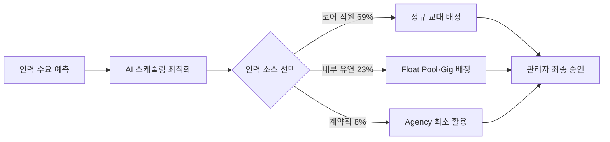

## Summary

Mercy(미국 5대 가톨릭 의료 시스템, 40개 병원)는 AI 기반 유연 인력 모델을 도입하여 계약직 간호사(Agency) 비중을 25%에서 8%로 줄이고, 2023년 $30M 비용 절감을 달성했다. ✅ **Fact** 핵심 전략은 AI 주도 스케줄링과 내부 유연 인력풀(Float Pool) 확대를 결합한 "혼합 인력 모델(Blended Workforce)"이다. [[sources/healthcareitnews-mercy-30m-2023.md]] [[sources/beckershospitalreview-mercy-2024.md]]

## Problem / Why

COVID-19 이후 간호사 부족과 계약직(Travel Nurse·Agency) 비용 급등이 미국 병원 시스템의 최대 비용 위협이었다. Mercy도 인력의 25%를 비싼 계약직에 의존했으며, 번아웃과 이직률 상승으로 악순환이 지속되었다.

## Solution Architecture

> **최우선 원칙**: 이 섹션은 **공개된 사실만** 기록한다.

### A. Process (프로세스)

- **Before (As-is)**: 인력의 67% 코어 직원, 8% 내부 유연 인력, 25% 계약직(Agency).
- **After (To-be)**:
  1. ✅ **Fact** AI 기반 유연 스케줄링으로 내부 유연 인력(Float Pool·Gig Nurses) 확대: 코어 69%, 유연+기그 23%, 계약직 8%로 재편. [[sources/beckershospitalreview-mercy-2024.md]]
  2. ✅ **Fact** "Win From Within" 프로그램 20개 병원으로 확대 — 예비 간호사에게 학비 지원·파트타임 역할 제공, 2026년 봄 340명+ 등록. [[sources/beckershospitalreview-mercy-2024.md]]
  3. ✅ **Fact** Microsoft·Epic 협력으로 Dragon Copilot AI 문서화 도구 도입 (2025년 2월 파일럿) — 문서 정확도 30%→90% 향상. [[sources/beckershospitalreview-mercy-2024.md]]
- **Human-in-the-loop (HITL) 지점**: 스케줄 최종 승인은 관리자가 수행.
- **Trigger & Frequency**: 일별 교대 스케줄링(daily); 분기별 인력 계획(quarterly).
- **Scope of autonomy**: 스케줄 최적화(recommend → 관리자 승인).

범례: 실선 = [[sources/beckershospitalreview-mercy-2024.md]] 확인.

### B. System & Infrastructure (시스템·인프라)

- **Core HRIS / 기반 시스템**: ✅ **Fact** Epic (EMR) 연동. [[sources/beckershospitalreview-mercy-2024.md]]
- **AI 스케줄링 시스템**: _미공개 (not disclosed)_ — 구체 AI 스케줄링 벤더 미공개.
- **Dragon Copilot**: ✅ **Fact** Microsoft와 Epic 협력으로 개발한 AI 음성 문서화 도구. [[sources/beckershospitalreview-mercy-2024.md]]
- **배포 환경**: _미공개 (not disclosed)_

### C. Data (데이터)

- **입력 데이터 소스**: 인력 수요 예측 데이터, 직원 가용성 데이터, 교대 기록, 환자 데이터(스케줄링 연계).
- **데이터 규모**: ✅ **Fact** 40개 병원, 미국 5개 주 운영. [[sources/healthcareitnews-mercy-30m-2023.md]]
- **학습 vs RAG vs In-context**: _미공개 (not disclosed)_
- **데이터 거버넌스**: HIPAA 적용 환경. 세부 내용 _미공개 (not disclosed)_.

### D. Model (모델)

- **Foundation model**: _미공개 (not disclosed)_
- **Dragon Copilot**: ✅ **Fact** Microsoft Azure 기반 AI 음성 인식 및 문서화. [[sources/beckershospitalreview-mercy-2024.md]]
- **커스터마이징 기법**: _미공개 (not disclosed)_

### E. Organization & Team (조직·팀 구조)

- **오너십**: 운영 및 HR 공동 주도.
- **파트너**: ✅ **Fact** Microsoft, Epic (Dragon Copilot 공동 개발). [[sources/beckershospitalreview-mercy-2024.md]]
- **팀 규모**: _미공개 (not disclosed)_

## Impact / Metrics (기대효과)

### 기대효과 요약
계약직 비중 25%에서 8%로 감축(Fact), 2023년 $30M 비용 절감, 계약직 비용 50% 절감, Dragon Copilot 문서 정확도 30%→90% (자사 보고 기반).

- ✅ **Fact**: 계약직 비중 25% → 8% (내부 유연 인력 확대). [[sources/beckershospitalreview-mercy-2024.md]]
- ⚠️ **자사 보고**: 2023년 $30M 비용 절감. [[sources/healthcareitnews-mercy-30m-2023.md]] (Tier 2 Healthcare IT News 보도이나 Mercy 자체 발표 수치)
- ⚠️ **자사 보고**: 계약직 비용 50% 절감. [[sources/beckershospitalreview-mercy-2024.md]]
- ⚠️ **자사 보고**: Dragon Copilot 파일럿 — 문서 정확도 30% → 90% 향상. [[sources/beckershospitalreview-mercy-2024.md]]

## Governance & Risk

- HIPAA 적용 환경(의료 데이터 보호).
- Dragon Copilot 문서화 AI 도입에 따른 임상 책임 소재 문제 — 자동 문서화 오류 시 의료 법적 리스크. 세부 거버넌스 _미공개 (not disclosed)_.
- 간호사 노동조합 관련 이슈: _미공개 (not disclosed)_.

## Contradictions

없음 (현재 기준).

## Consulting Angle

- **의료 분야 HR AI ROI 가시화**: "$30M 절감, 계약직 25%→8%"는 의료 HR AI 투자 타당성을 설득하는 가장 강력한 수치 중 하나. 국내 병원·의료 시스템(서울대병원·삼성서울병원·분당서울대병원 등) 대상 제안 시 레퍼런스로 활용.
- **혼합 인력 모델 설계**: 코어-유연-계약직 최적 구성비를 AI가 실시간 조정하는 "Blended Workforce" 개념은 제조·물류·유통 등 교대제 운영 산업에도 이식 가능.
- **"Win From Within" 내부 파이프라인**: 외부 계약직 의존 탈피를 위한 내부 육성 프로그램과 AI 스케줄링의 조합 — 단기 비용 절감 + 중장기 인재 파이프라인 이중 효과.
- **파생 질문**: "한국 간호사 부족 문제(2025년 필수의료 패키지 이후)에 유사 AI 스케줄링 모델을 국내 병원에 적용할 때의 제약은? (근로기준법 교대 제한·의료법 등)"
