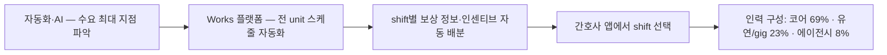

## Summary

Mercy는 Trusted Health의 Works 플랫폼으로 유연 간호 인력 모델을 도입하여 계약직(agency) 비중을 25%에서 8%로 줄이고, FY2023 프리미엄 인건비 $30.7M을 절감했다고 발표했다 (⚠️ 자사 보고 — Becker's CEO+CFO Roundtable의 Trusted Health 후원 세션) [[sources/beckershospitalreview-mercy-2024.md]] [[sources/worksai-mercy-playbook-2024.md]]. 핵심 전략은 코어·유연(float/gig)·에이전시 3층 인력 모델 + 스케줄 선택권 확대 + 자동화·AI 기반 인센티브 배분이다 [[sources/beckershospitalreview-mercy-2024.md]]. 병원 수·운영 주 등 조직 규모는 인용 소스 원문 미확보(Healthcare IT News 403 [[sources/healthcareitnews-mercy-30m-2023.md]])로 _미공개_ (2026-09-27 grounding 점검).

## Problem / Why (도입 배경)

- **Before (baseline)**: 인력 구성 코어 67% / 유연 8% / 에이전시 25% [[sources/beckershospitalreview-mercy-2024.md]]; fill rate 83% [[sources/beckershospitalreview-mercy-2024.md]]
- **Pain point**: 프리미엄(에이전시) 인건비 (비용 축) + 간호사 기대 변화에 맞춘 스케줄 자율성 부족 [[sources/beckershospitalreview-mercy-2024.md]]. 인센티브 배분이 간호 관리자의 주관적 판단에 의존 (Rocchio 발언) [[sources/beckershospitalreview-mercy-2024.md]]
- **Trigger**: ❓ 미공개 — Trusted Health 파트너십 결정 계기는 인용 소스에 없음

## Solution Architecture

> **최우선 원칙**: 이 섹션은 **공개된 사실만** 기록한다.

### A. Process (프로세스)

- **Before (As-is)**: 인력의 67% 코어 직원, 8% 내부 유연 인력, 25% 계약직(Agency).
- **After (To-be)**:
  1. ⚠️ **자사 보고** Works 플랫폼으로 전 unit 스케줄링 자동화, 지역·광역 float pool 등 유연 인력을 앱으로 운영, shift별 보상 정보 제공 → 간호사가 근무 시점 선택 [[sources/beckershospitalreview-mercy-2024.md]] [[sources/worksai-mercy-playbook-2024.md]]
  2. ⚠️ **자사 보고** 자동화·AI로 인력 수요가 가장 큰 지점을 파악하고, 채우기 어려운 shift에 인센티브를 자동 배분 (이전에는 간호 관리자 판단) [[sources/beckershospitalreview-mercy-2024.md]]
  3. ⚠️ **자사 보고** 인력 구성 코어 69% / 유연+gig 23% / 에이전시 8%로 재편 [[sources/beckershospitalreview-mercy-2024.md]] [[sources/worksai-mercy-playbook-2024.md]]
  - ※ "Win From Within" 프로그램·Dragon Copilot(Microsoft·Epic) 문서화 도구 서술은 인용 소스에 없어 제거 (2026-09-27 grounding 점검)
- **Human-in-the-loop (HITL) 지점**: _미공개 (not disclosed)_ — Rocchio는 "아무도 손대지 않는(no one touching)" 자동 흐름을 지향한다고 발언 [[sources/beckershospitalreview-mercy-2024.md]]
- **Trigger & Frequency**: shift 단위 상시 (교대 스케줄·인센티브 배분) [[sources/beckershospitalreview-mercy-2024.md]]; 주기 세부 _미공개_
- **Scope of autonomy**: 인센티브 배분은 "completely automated" (Rocchio) [[sources/beckershospitalreview-mercy-2024.md]]; 스케줄 배정의 승인 단계 _미공개_

```mermaid
flowchart LR
    A[자동화·AI — 수요 최대 지점 파악] --> B[Works 플랫폼 — 전 unit 스케줄 자동화]
    B --> C[shift별 보상 정보·인센티브 자동 배분]
    C --> D[간호사 앱에서 shift 선택]
    D --> E[인력 구성: 코어 69% · 유연/gig 23% · 에이전시 8%]
```
범례: 실선 = [[sources/beckershospitalreview-mercy-2024.md]] 확인 (Trusted Health 후원 세션 — ⚠️ 자사 보고). 관리자 승인 노드는 소스 미확인으로 제거.

### B. System & Infrastructure (시스템·인프라)

- **Core HRIS / 기반 시스템**: _미공개 (not disclosed)_ — Epic 연동 서술은 인용 소스에 없어 제거 (2026-09-27)
- **AI 스케줄링 시스템**: ⚠️ **자사 보고** Trusted Health의 Works 플랫폼 (유연 인력 채용·스케줄·인센티브 자동화) [[sources/beckershospitalreview-mercy-2024.md]] [[sources/worksai-mercy-playbook-2024.md]]
- **사용자 접점 (UX layer)**: 간호사용 플랫폼/앱 [[sources/beckershospitalreview-mercy-2024.md]]
- **연동·통합**: _미공개 (not disclosed)_
- **배포 환경**: _미공개 (not disclosed)_

### C. Data (데이터)

- **입력 데이터 소스**: unit별 shift 수요·shift별 보상 정보·유연 인력 pool [[sources/beckershospitalreview-mercy-2024.md]]; 환자 데이터 연계 여부 _미공개_
- **데이터 규모**: _미공개 (not disclosed)_ — 병원 수·주 수는 원문 미확보 소스([[sources/healthcareitnews-mercy-30m-2023.md]])에만 의존하여 제거 (2026-09-27)
- **학습 vs RAG vs In-context**: _미공개 (not disclosed)_
- **데이터 거버넌스**: HIPAA 적용 환경. 세부 내용 _미공개 (not disclosed)_.

### D. Model (모델)

- **Foundation model**: _미공개 (not disclosed)_
- **Model 유형**: 수요 지점 파악·인센티브 배분 자동화 ("automation and artificial intelligence") [[sources/beckershospitalreview-mercy-2024.md]]; 알고리즘 세부 _미공개_
- **커스터마이징 기법**: _미공개 (not disclosed)_

### E. Organization & Team (조직·팀 구조)

- **오너십**: CFO(Cheryl Matejka)·CNO(Betty Jo Rocchio)가 플레이북 발표 — 재무·간호 리더십 주도 [[sources/beckershospitalreview-mercy-2024.md]]; HR 부서 역할 _미공개_
- **파트너**: ⚠️ **자사 보고** Trusted Health (Works 플랫폼) [[sources/beckershospitalreview-mercy-2024.md]] [[sources/worksai-mercy-playbook-2024.md]]
- **팀 규모**: _미공개 (not disclosed)_

## Impact / Metrics (기대효과)

### 기대효과 요약
에이전시 비중 25% → 8%, FY2023 프리미엄 인건비 $30.7M 절감, fill rate 83% → 86%, 이직률 −8% (모두 ⚠️ 자사 보고 — 벤더 후원 세션·벤더 플레이북).

- ⚠️ **자사 보고**: 인력 구성 67/8/25% → 69/23/8% (코어/유연/에이전시). [[sources/beckershospitalreview-mercy-2024.md]] [[sources/worksai-mercy-playbook-2024.md]]
- ⚠️ **자사 보고**: FY2023 프리미엄 인건비 rate 절감 $30.7M. [[sources/beckershospitalreview-mercy-2024.md]] [[sources/worksai-mercy-playbook-2024.md]] (Healthcare IT News 보도 [[sources/healthcareitnews-mercy-30m-2023.md]]는 원문 미확보)
- ⚠️ **자사 보고**: fill rate 83% → 86%. [[sources/beckershospitalreview-mercy-2024.md]] [[sources/worksai-mercy-playbook-2024.md]]
- ⚠️ **자사 보고**: 이직률 8% 감소, 1년차 이직률 9% 감소. [[sources/beckershospitalreview-mercy-2024.md]] [[sources/worksai-mercy-playbook-2024.md]]
- 계약직 비용 50% 절감·Dragon Copilot 문서 정확도: _미공개_ (수치 근거 미확보 — 2026-09-27 grounding 점검)

## Governance & Risk

- HIPAA 적용 환경(의료 데이터 보호) — 세부 _미공개_.
- ⚠️ 자사 보고: 자동화가 shift 보상의 공정성·투명성을 보장하는 거버넌스 역할 — unit별 임의 고액 지급(rogue units) 방지 (Matejka) [[sources/beckershospitalreview-mercy-2024.md]]
- ⚠️ 소스 성격: Becker's 기사는 Trusted Health 후원 세션, Works 플레이북은 벤더 자료 — 독립 검증 없음. Healthcare IT News 기사 원문 미확보 [[sources/healthcareitnews-mercy-30m-2023.md]].
- 간호사 노동조합 관련 이슈: _미공개 (not disclosed)_.

## Contradictions

> [!note] 2026-09-27 grounding — 인용 소스에 없는 Dragon Copilot(Microsoft·Epic) 문서화 도구·문서 정확도 수치, "Win From Within" 프로그램(20개 병원·340명), Epic 연동, 40개 병원·5개 주, 계약직 비용 50% 절감 서술을 제거. $30M은 raw 표기 $30.7M으로 정정. Becker's 소스는 벤더 후원 세션이므로 ✅ Fact → ⚠️ 자사 보고로 재분류.

## Consulting Angle

- **의료 분야 HR AI ROI 가시화**: "$30.7M 절감, 에이전시 25%→8%"(자사 보고, 벤더 후원 세션)는 의료 HR AI 투자 타당성을 설득하는 강력한 수치 — 단 독립 검증 없음을 명시. 국내 병원·의료 시스템(서울대병원·삼성서울병원·분당서울대병원 등) 대상 제안 시 레퍼런스로 활용.
- **혼합 인력 모델 설계**: 코어-유연-계약직 최적 구성비를 AI가 실시간 조정하는 "Blended Workforce" 개념은 제조·물류·유통 등 교대제 운영 산업에도 이식 가능.
- **인센티브 자동화 = 거버넌스**: shift 보상 결정을 자동화해 unit별 임의 지급을 막는다는 CFO 발언 [[sources/beckershospitalreview-mercy-2024.md]] — 국내 병원의 야간·휴일 수당 배분 투명성 논의에 직접 활용 가능.
- **파생 질문**: "한국 간호사 부족 문제(2025년 필수의료 패키지 이후)에 유사 AI 스케줄링 모델을 국내 병원에 적용할 때의 제약은? (근로기준법 교대 제한·의료법 등)"
