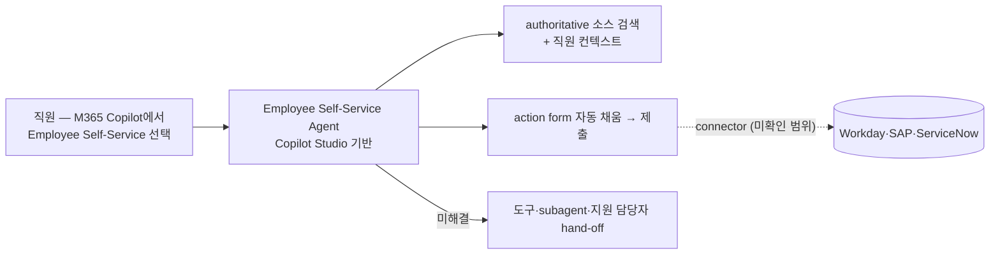

# Microsoft — Employee Self-Service Agent + Viva Copilot HR

## Summary

Microsoft HR·Microsoft Digital(사내 IT)이 **Copilot Studio로 구축한 Employee Self-Service Agent**를 자사 직원(정규직 200,000명+)에게 배포한 self-dogfooding("Customer Zero") 사례 [[sources/microsoft-insidetrack-employee-self-service-agent-2025-11]]. HR·IT 지원·시설/부동산 헬프를 하나의 대화형 에이전트로 통합했으며, 1년 이상 전 지리적 단계 롤아웃(영국·캐나다 → 인도 → 미국·전 세계)을 거쳐 전 세계 직원에게 제공 중이고 고객에게도 출시 [[sources/microsoft-insidetrack-employee-self-service-agent-2025-11]]. ROI 목표는 전 카테고리 지원 티켓 40% 이상 감소, HR 월간 티켓 2026년 중반까지 44% 감소 — 모두 **목표치** ⚠️ 자사 보고 [[sources/microsoft-insidetrack-employee-self-service-agent-2025-11]]. 별도로 HR 조직은 Viva Glint 반기 'Signals' 설문에 Copilot 문항을 추가해 'employee thriving'과의 상관을 측정 [[sources/microsoft-insidetrack-hr-viva-copilot-2024-08]].

## Problem / Why (도입 배경)

- **Before (baseline)**: 직원이 기술 문제·HR 질문·구내 정보 등을 여러 앱·도구·SharePoint 사이트를 오가며 찾아야 했고, 티켓 제출 후 24~48시간 대기; HR 지원 요청 해결에 며칠 소요 (Ajmera) [[sources/microsoft-insidetrack-employee-self-service-agent-2025-11]]. 연간 IT 지원 상호작용 200만 건+ (Virtual Agent·채팅·전화) [[sources/microsoft-insidetrack-employee-self-service-agent-2025-11]]; HR 티켓 건수 baseline ❓ 미공개 (완전 도입 시 연 40만~60만 건의 HR 티켓성 상호작용을 에이전트가 처리할 것으로 기대 [[sources/microsoft-insidetrack-employee-self-service-agent-2025-11]])
- **Pain point**: 시간·비용 축 — HR·IT는 매년 수백만 건의 사내 문의·티켓을 발생시켜 ROI 잠재력이 큰 영역으로 선정 [[sources/microsoft-insidetrack-employee-self-service-agent-2025-11]]; 지원 도구 인지 부족·마찰로 유용한 도구가 활용되지 않음 (Ajmera) [[sources/microsoft-insidetrack-employee-self-service-agent-2025-11]]
- **Trigger**: M365 Copilot과 agentic AI의 등장을 계기로 직원 지원 과제에 적용 [[sources/microsoft-insidetrack-employee-self-service-agent-2025-11]]; Customer Zero로서 제품 출시 전 사내 검증 필요 [[sources/microsoft-insidetrack-employee-self-service-agent-2025-11]]

## Solution Architecture

### A. Process (프로세스)

- **Before (As-is)**: 다중 앱·도구·SharePoint 사이트 탐색 → 티켓 제출 → 24~48시간 대기 [[sources/microsoft-insidetrack-employee-self-service-agent-2025-11]]
- **After (To-be)** [[sources/microsoft-insidetrack-employee-self-service-agent-2025-11]]:
  1. 직원이 Microsoft 365 Copilot 실행 → "Employee Self-Service" 선택 → 자연어 질의
  2. 에이전트가 authoritative 소스에서 응답을 orchestrate하고/또는 action form 제시 (채팅 내용으로 form 자동 채움)
  3. 직원이 form 제출 → 채팅 안에서 작업 완료 (예: 육아휴직 신청, 방문객 등록, 시설 수리 요청 — 사진 업로드로 문제 감지·세부 자동 입력)
  4. 에이전트가 해결 못 하면 적절한 도구·subagent·지원 담당자에게 hand-off; 라이브 지원 연결 시 기술자가 에이전트 대화 이력 열람
- **Human-in-the-loop (HITL) 지점**: 미해결 건은 지원 담당자에게 hand-off [[sources/microsoft-insidetrack-employee-self-service-agent-2025-11]]; HR 전문가들이 프롬프트·응답을 수동 평가해 정확도 검증 [[sources/microsoft-insidetrack-employee-self-service-agent-2025-11]]; 매니저 승인 단계 _미공개_
- **Trigger & Frequency**: on-demand, 상시 [[sources/microsoft-insidetrack-employee-self-service-agent-2025-11]]
- **Scope of autonomy**: 정보 검색 + 채팅 내 작업 완료(task completion) — form 제출로 배후 워크플로 실행 [[sources/microsoft-insidetrack-employee-self-service-agent-2025-11]]; 자율 실행 범위 세부 _미공개_

범례: 실선 = [[sources/microsoft-insidetrack-employee-self-service-agent-2025-11]] 확인 (⚠️ 자사 보고). 점선 = 커넥터는 고객용으로 제공된다고만 서술, Microsoft 사내 연동 대상 미확인.

### B. System & Infrastructure (시스템·인프라)

- **Core HRIS / 기반 시스템**: _미공개 (not disclosed)_ — Microsoft 사내 HRIS 명칭은 인용 소스에 없음
- **AI 시스템 배치**: ⚠️ 자사 보고: Microsoft Copilot Studio로 구축한 custom engine agent, M365 Copilot 안에서 실행 [[sources/microsoft-insidetrack-employee-self-service-agent-2025-11]]
- **배포 환경**: _미공개 (not disclosed)_
- **연동·통합**: ⚠️ 자사 보고: 고객용 Workday·SAP·ServiceNow 커넥터 제공, 사전 구성 워크플로·accelerator pack [[sources/microsoft-insidetrack-employee-self-service-agent-2025-11]]; Microsoft 사내 연동 대상 _미공개_
- **사용자 접점 (UX layer)**: M365 Copilot 채팅 내 "Employee Self-Service" [[sources/microsoft-insidetrack-employee-self-service-agent-2025-11]]
- **인증·권한**: _미공개 (not disclosed)_ — 에이전트가 사용자 디바이스·컴플라이언스 상태·국가 등 컨텍스트를 인지 [[sources/microsoft-insidetrack-employee-self-service-agent-2025-11]]

### C. Data (데이터)

- **입력 데이터 소스**: ⚠️ 자사 보고: HR authoritative 소스(PTO·성과·보상·학습·사내 공고·well-being 등 정책 콘텐츠), IT 서비스 소스, 시설 데이터, 직원 컨텍스트(디바이스·국가) [[sources/microsoft-insidetrack-employee-self-service-agent-2025-11]]
- **데이터 규모**: 연간 IT 지원 상호작용 200만 건+, 2024년 방문객 등록 200만 건(업무 관련 roughly 1.2 million) [[sources/microsoft-insidetrack-employee-self-service-agent-2025-11]]; HR 콘텐츠 규모 _미공개_
- **전처리·정제**: 콘텐츠 정확성·최신성 검수, "vetted sources만 응답" 원칙 [[sources/microsoft-insidetrack-employee-self-service-agent-2025-11]]; 기술 세부 _미공개_
- **학습 vs RAG vs In-context 구분**: _미공개 (not disclosed)_ — "authoritative 소스에 grounded"라는 서술만 [[sources/microsoft-insidetrack-employee-self-service-agent-2025-11]]
- **데이터 거버넌스**: ⚠️ 자사 보고: 국가·지역별 규정 준수, 회사 Responsible AI 원칙 적용 [[sources/microsoft-insidetrack-employee-self-service-agent-2025-11]]
- **민감정보 처리**: HR 응답의 민감성을 고려해 privacy·security 검토 [[sources/microsoft-insidetrack-employee-self-service-agent-2025-11]]; DPIA 등 세부 _미공개_
- **데이터 출처의 오너십**: HR·IT·시설 조직의 사내 콘텐츠 [[sources/microsoft-insidetrack-employee-self-service-agent-2025-11]]

### D. Model (모델)

- **Foundation model**: _미공개 (not disclosed)_ — Azure OpenAI·GPT 계열 서술은 인용 소스에 없어 제거 (2026-09-27 grounding 점검)
- **Model 유형**: agent (Copilot Studio custom engine agent; 검색 + 작업 실행 + 이미지 기반 시설 문제 감지) [[sources/microsoft-insidetrack-employee-self-service-agent-2025-11]]
- **제공 방식**: M365 Copilot 라이선스 내 기능 [[sources/microsoft-insidetrack-employee-self-service-agent-2025-11]]
- **커스터마이징 기법**: Copilot Studio 워크플로·accelerator pack·코드 샘플 [[sources/microsoft-insidetrack-employee-self-service-agent-2025-11]]
- **Orchestration 프레임워크**: Copilot Studio [[sources/microsoft-insidetrack-employee-self-service-agent-2025-11]]
- **평가·가드레일**: HR 전문가가 프롬프트·응답을 수동 평가해 정확도 기준 충족 확인, 텔레메트리 수집·피드백 라우팅 [[sources/microsoft-insidetrack-employee-self-service-agent-2025-11]]
- **비용·성능 지표**: _미공개 (not disclosed)_

### E. Organization & Team (조직·팀 구조)

- **오너십**: Microsoft Digital(사내 IT) + HR(Employee Experience·HR digital strategy) + M365 Copilot/Viva 제품 그룹 공동 [[sources/microsoft-insidetrack-employee-self-service-agent-2025-11]]
- **참여 역할**: Employee Experience CVP(Nathalie D'Hers), HR PM architect(Rajamma Krishnamurthy), HR digital strategy GM(Prerna Ajmera), Microsoft Digital Modern Support GM, 제품 그룹 PM [[sources/microsoft-insidetrack-employee-self-service-agent-2025-11]]
- **팀 규모·기간**: 1년 이상 단계적 롤아웃 [[sources/microsoft-insidetrack-employee-self-service-agent-2025-11]]; 인원 _미공개_
- **거버넌스 체계**: Responsible AI 원칙 준수 [[sources/microsoft-insidetrack-employee-self-service-agent-2025-11]]; 위원회 구성 _미공개_
- **변화관리**: 이메일·Viva 등 채널로 정기 커뮤니케이션 [[sources/microsoft-insidetrack-employee-self-service-agent-2025-11]]; HR 조직 Copilot 도입은 Viva Amplify·Learning·Engage·Glint 등으로 커뮤니케이션·스킬링·측정 [[sources/microsoft-insidetrack-hr-viva-copilot-2024-08]]
- **파트너**: _미공개 (not disclosed)_

## Impact / Metrics (기대효과)

### 기대효과 요약
정량 실적 _미공개_ — 공개된 것은 ROI **목표치**(티켓 40%↓, HR 월간 티켓 44%↓)와 측정 프레임워크(Viva Glint + Copilot 상관)뿐 (⚠️ 자사 보고).

| 지표 | 값 | 출처 | 성격 |
|---|---|---|---|
| 배포 범위 | 전 세계 Microsoft 직원 (영국·캐나다 → 인도 → 미국·전 세계 단계 롤아웃, 1년+) | [[sources/microsoft-insidetrack-employee-self-service-agent-2025-11]] | ⚠️ 자사 보고 |
| 지원 티켓 감소 **목표** | 전 카테고리 40% 이상 | [[sources/microsoft-insidetrack-employee-self-service-agent-2025-11]] | ⚠️ 자사 보고 (목표치) |
| HR 월간 티켓 감소 **목표** | 44% (2026년 중반까지) | [[sources/microsoft-insidetrack-employee-self-service-agent-2025-11]] | ⚠️ 자사 보고 (목표치) |
| HR 티켓성 상호작용 처리 **기대** | 연 40만~60만 건 | [[sources/microsoft-insidetrack-employee-self-service-agent-2025-11]] | ⚠️ 자사 보고 (기대치) |
| 방문객 등록 자동화 시간 절감 **잠재** | 연 50,000시간 | [[sources/microsoft-insidetrack-employee-self-service-agent-2025-11]] | ⚠️ 자사 보고 (잠재치) |
| 응답 시간 | 티켓 24~48시간 대기 → 분 단위 답변 | [[sources/microsoft-insidetrack-employee-self-service-agent-2025-11]] | ⚠️ 자사 보고 (정성) |
| 측정 방식 | Viva Glint 반기 Signals 설문 + Copilot 사용 ↔ employee thriving 상관 (주 1회+ 사용자가 thriving 응답 높음) | [[sources/microsoft-insidetrack-hr-viva-copilot-2024-08]] | ⚠️ 자사 보고 (상관, 효과 크기 미공개) |
| 정량 ROI 실적 | _미공개_ | — | — |

## Governance & Risk

- ⚠️ 자사 보고: Responsible AI 원칙·국가별 규정 준수, HR 응답은 vetted source만 사용 [[sources/microsoft-insidetrack-employee-self-service-agent-2025-11]]
- ⚠️ HR AI Transformation 팀이 식별한 리스크: 직원 기밀·프라이버시 관련 법·지침 변화, Copilot의 책임 있는 사용 범위 불확실성, 데이터 보안·정보 흐름 [[sources/microsoft-insidetrack-hr-viva-copilot-2024-08]]
- ⚠️ 독립 검증 없음 — 모든 정보가 Microsoft Inside Track(자사 블로그) 출처; 수치는 목표치
- ⚠️ 제품은 "turnkey가 아닌 customizable template" — 도입 조직의 구현·분류·데이터 선택·법무 검토 필요 [[sources/microsoft-insidetrack-employee-self-service-agent-2025-11]]

## Contradictions

> [!note] 2026-09-27 grounding — 인용 소스에 없는 Azure OpenAI·GPT-4/4o·Teams embedded·SharePoint 정책 KB 조회 서술을 제거하고 _미공개_ 처리. source 페이지 Limitations는 "UK→Canada→India→US 롤아웃 순서가 원문에 없다"고 기록했으나 raw 스냅샷에는 "first to the United Kingdom and Canada, then India, then to the United States and the rest of the world"가 존재 — 본문은 raw 기준(영국·캐나다 동시)으로 표기. 40%/44%는 목표치임을 명시.

## Consulting Angle

- **"product vs deployment 구분"의 교과서**: Microsoft Viva·Copilot은 **제품**이지만, 이 use case는 Microsoft **자사 HR팀이 실제로 배포·측정·개선한 과정**(Customer Zero)을 기록
- **Viva Glint + Copilot 상관 측정 방식**은 다른 기업이 "HR AI 효과를 어떻게 측정할 것인가?"의 참고 모델 — 단 상관관계이며 효과 크기 미공개
- **IBM AskHR vs Microsoft Self-Service Agent**: 양사 모두 자사 AI를 자사 HR에 적용한 self-dogfooding ([[ibm-askhr-watsonx]] 참조)
- **한국 적용**: Microsoft 365 Copilot 라이선스를 이미 쓰는 국내 기업은 Employee Self-Service Agent 경로가 마찰 낮은 HR AI 진입점 — 단 HRIS 커넥터(Workday·SAP·ServiceNow 외 국내 HRIS) 확인 필요
- **파생 질문**: "HR 티켓 44% 감소 목표"를 국내 shared service center KPI로 번역할 때 baseline 티켓 정의(문의 vs 요청)를 어떻게 맞출 것인가?

### 한계
- 모든 정보가 **Microsoft Inside Track** (자사 블로그) 출처 — 독립 검증 없음
- 정량 ROI 미공개 (목표치·기대치·상관만, 달성 실적 없음)
