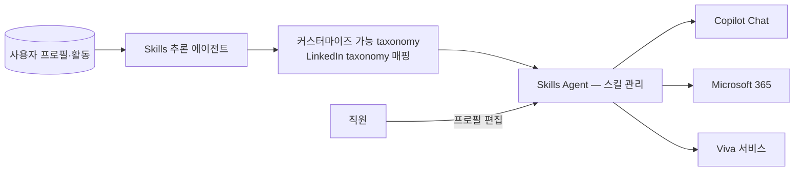

## Summary

Microsoft **People Skills** + **Skills Agent** — 2025-04-23 Copilot 발표에 포함된 스킬 인프라. MS Copilot·M365 라이선스 고객의 직원 스킬을 **사용자 프로필·활동에서 자동 추론**해 커스터마이즈 가능한 taxonomy에 매핑하고, 이 데이터 레이어가 Skills Agent를 통해 Copilot Chat·M365·Viva에 공급된다 [[sources/bersin-microsoft-people-skills-copilot-2025-04]]. LinkedIn 사용자는 LinkedIn taxonomy와 매핑 [[sources/bersin-microsoft-people-skills-copilot-2025-04]]. Josh Bersin(Tier 1)은 Workday Skills Cloud·Eightfold·Gloat·Techwolf 등 스킬 플랫폼이 commoditize될 수 있다고 전망 [[sources/bersin-microsoft-people-skills-copilot-2025-04]]. Taxonomy 스킬 수(16K)·GA 시점·2026-03 에이전트 분리·사용 모델은 인용 소스에 없음 → _미공개_ (수치 근거 미확보 — 2026-09-27 grounding 점검).

## Problem / Why (도입 배경)

- **Before**: 벤더 제품(플랫폼 기능)이므로 특정 기업의 도입 배경은 고객별 상이. 🚫 일반론: 직원 self-update 프로필에 의존하는 스킬 inventory는 outdated·incomplete하다는 HR 영역 일반 pain point; 정량 baseline ❓ 미공개
- **Pain point**: 기존 HCM 벤더(Workday·SAP·Oracle·Eightfold 등)는 각자 스킬 태깅·추론·상호운용 레이어를 갖고 있으나, Microsoft는 이를 Microsoft 기반 기업 전반에서 "actionable·manageable"하게 만든다는 것이 Bersin의 분석 [[sources/bersin-microsoft-people-skills-copilot-2025-04]]
- **Trigger**: Microsoft의 2025-04-23 Copilot 발표 — 수년간 개발된 스킬 추론 에이전트 공개 [[sources/bersin-microsoft-people-skills-copilot-2025-04]]

## Solution Architecture

### A. Process (프로세스)

- **Before**: _미공개 (not disclosed)_ — 도입 전 프로세스는 인용 소스에 없음
- **After** — Bersin 설명 기준 [[sources/bersin-microsoft-people-skills-copilot-2025-04]]:
  1. MS Copilot·M365 라이선스 시 Microsoft가 각 직원의 스킬을 자동 "discover" (사용자 프로필·활동 기반 추론)
  2. 커스터마이즈 가능한 taxonomy에 매핑 — Microsoft taxonomy 사용 또는 자사 taxonomy로 매핑; LinkedIn 사용자는 LinkedIn taxonomy와 연결
  3. 직원은 자기 스킬 프로필 편집 가능 (HITL)
  4. 리더·직원이 Skill Agent로 사내 전문가 검색, 동료 스킬 파악, 스킬 개발 의사결정
  5. Copilot으로 개발 계획 수립·프로젝트 staffing·전사 스킬 평가
- **HITL**: 직원이 자기 스킬 프로필 편집 [[sources/bersin-microsoft-people-skills-copilot-2025-04]]; 추론 결과 거부·승인 워크플로 세부 _미공개_
- **Trigger & Frequency**: _미공개 (not disclosed)_
- **Scope**: 추론·검색·추천 — 자동 배치 여부 _미공개_

범례: 실선 = [[sources/bersin-microsoft-people-skills-copilot-2025-04]] 확인 (Bersin 분석, 발표 당일). Tier 1 analyst 기술이나 Microsoft 1차 자료 미인용.

### B. System & Infrastructure (시스템·인프라)

- **Core HRIS / 기반 시스템**: _미공개 (not disclosed)_ — HCM 연동 커넥터 명시 없음
- **AI 시스템 배치**: M365·Copilot 내장 데이터 레이어 + Skills Agent (Copilot Chat·M365·Viva에 공급) [[sources/bersin-microsoft-people-skills-copilot-2025-04]]
- **배포 환경**: _미공개 (not disclosed)_
- **연동·통합**: LinkedIn taxonomy 매핑 (LinkedIn 사용자) [[sources/bersin-microsoft-people-skills-copilot-2025-04]]; Microsoft Graph 활용은 Bersin의 전망("if Microsoft does this within the Microsoft Graph")이며 확인된 사실 아님 [[sources/bersin-microsoft-people-skills-copilot-2025-04]]
- **사용자 접점 (UX layer)**: Copilot Chat·M365·Viva 서비스, 내부 Microsoft 프로필에 내장 [[sources/bersin-microsoft-people-skills-copilot-2025-04]]
- **인증·권한**: _미공개 (not disclosed)_
- **플랫폼 맥락**: Viva를 'EX 운영체제'로 평가한 Forrester 2021 분석 [[sources/forrester-microsoft-viva-ex-operating-system-2021-03]] — People Skills 자체 내용은 없음

### C. Data (데이터)

- **입력 데이터 소스**: 사용자 프로필 + 활동(activity) [[sources/bersin-microsoft-people-skills-copilot-2025-04]]; 이메일·문서·미팅 등 구체 신호 종류 _미공개_
- **데이터 규모**: _미공개 (not disclosed)_ — taxonomy 스킬 수 인용 소스 없음 (수치 근거 미확보 — 2026-09-27 grounding 점검)
- **전처리·정제**: _미공개 (not disclosed)_
- **학습 vs RAG vs In-context 구분**: _미공개 (not disclosed)_ — "추론(inference)"이라는 서술만 [[sources/bersin-microsoft-people-skills-copilot-2025-04]]
- **데이터 거버넌스**: _미공개 (not disclosed)_
- **민감정보 처리**: _미공개 (not disclosed)_ — opt-out 옵션 언급은 인용 소스에 없음
- **데이터 출처의 오너십**: M365 tenant 내 직원 데이터 [[sources/bersin-microsoft-people-skills-copilot-2025-04]]

### D. Model (모델)

- **Foundation model**: _미공개 (not disclosed)_ — OpenAI 모델 사용 서술은 인용 소스에 없어 제거
- **Model 유형**: 스킬 추론 에이전트 + 스킬 관리 에이전트 [[sources/bersin-microsoft-people-skills-copilot-2025-04]]
- **제공 방식**: MS Copilot·M365 라이선스 내 제공 [[sources/bersin-microsoft-people-skills-copilot-2025-04]]
- **커스터마이징 기법**: taxonomy 커스터마이즈·자사 taxonomy 매핑 [[sources/bersin-microsoft-people-skills-copilot-2025-04]]; 추론 기법(게임이론·multi-agent 등 서술)은 인용 소스에 없어 제거
- **Orchestration 프레임워크**: _미공개 (not disclosed)_
- **평가·가드레일**: _미공개 (not disclosed)_ — Everest Group 평가 인용은 소스 미확인으로 제거

### E. Organization & Team (조직·팀 구조)

- **오너십**: Microsoft 벤더 제품 — 고객사 HR이 taxonomy·활용 주체 (고객별 상이)
- **참여 역할**: _미공개 (not disclosed)_
- **팀 규모·기간**: _미공개 (not disclosed)_
- **거버넌스 체계**: _미공개 (not disclosed)_
- **파트너**: LinkedIn (taxonomy 매핑) [[sources/bersin-microsoft-people-skills-copilot-2025-04]]; Bersin은 자사 Galileo와의 Copilot 연동을 진행 중이라고 밝힘 — 이해관계 [[sources/bersin-microsoft-people-skills-copilot-2025-04]]

## Impact / Metrics (기대효과)

### 기대효과 요약
직원 self-update 부담 없이 스킬 데이터를 자동 갱신 — 외부 스킬 플랫폼 대비 M365 native option. 고객 성과 수치 _미공개_ (발표 당일 분석만 존재).

- ✅ Tier 1 (Bersin) 분석: "Microsoft Launches People Skills In Copilot, Altering The HR Tech Market" — 스킬 플랫폼 commoditize 전망 [[sources/bersin-microsoft-people-skills-copilot-2025-04]]
- 고객 도입 수·정확도·시간 절감 metric: _미공개_
- taxonomy 규모·GA 시점·2026 에이전트 분리: _미공개_ (수치 근거 미확보 — 2026-09-27 grounding 점검)

## Governance & Risk

- ⚠️ 직원 활동 기반 추론의 privacy 인지 — opt-out·투명성 설계 필요 (Microsoft 제공 여부 _미공개_)
- ⚠️ 한국 개인정보보호법 + AI 기본법 (추론 스킬이 평가·승진에 영향 시 고영향 검토) 의무 검증
- ⚠️ taxonomy 한국어·한국 직무 fit 미검증
- ⚠️ 소스 한계: Bersin 발표 당일 분석 1건(이해관계 있음) + Forrester 2021 배경 자료 — Microsoft 1차 자료 미인용

## Contradictions

> [!note] 2026-09-27 grounding — 인용 소스에 없는 16,000 스킬 taxonomy, OpenAI 모델·Azure OpenAI 추정, Microsoft Graph·Entra ID 확정 서술, "game theory·multi-agent" 추론 기법, Everest Group 평가, GA 2025·2026-03 에이전트 분리, opt-out 옵션, Cisco Workforce Consortium AI 스킬 통계 수치를 제거하고 _미공개_ 처리. 제목·tags의 '16K' 표기는 frontmatter이므로 미수정 — 소스 확보 후 정정 필요. Bersin 컴필레이션 URL 404 → 실제 URL은 source 페이지 참조.

## Consulting Angle

- **KR HRMS RFP 시장 game-changer 가능성**:
  - 기존 Eightfold·Gloat·Beamery 외부 vendor 대비 **M365 native option** 등장 (Bersin 전망 [[sources/bersin-microsoft-people-skills-copilot-2025-04]])
  - 이미 Microsoft 365 도입 KR 대기업 → People Skills 추가 도입 비용·통합 부담 적음 (가설 — 라이선스 조건 확인 필요)
  - People Skills vs Eightfold 비교 RFP 슬라이드 — 단 Microsoft 1차 자료·고객 사례 확보 후 작성
- **자동 스킬 추론 = 한국 대기업 핵심 페인 해소 후보**: 직원 self-update 부담 없이 taxonomy 유지
- **KR consulting deck**: Bersin People Skills 분석 + Eightfold 비교 — talent marketplace 카테고리 종합 (외부 AI 스킬 통계는 별도 소스 확보 후 인용)
- **반면교사**:
  - 활동 기반 추론은 직원 "감시" 인식 위험 — opt-in/transparent governance 설계 필수
  - taxonomy의 한국어·한국 직무 fit은 POC 검증 필수
- **한국 AI 기본법 dual compliance**: 추론 스킬이 인사평가·승진에 사용되면 고영향 AI 검토 — 인적감독 의무 설계 필요 (Microsoft 거버넌스 제공 여부 RFP 항목)
