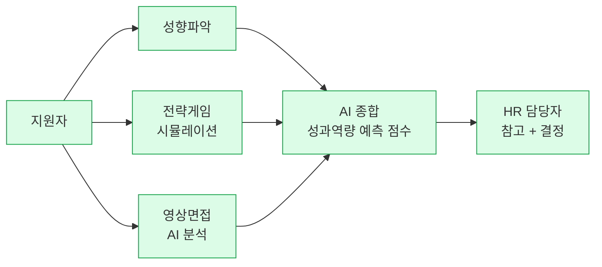

# 마이다스아이티 inAIR — AI 역량검사

> 🇰🇷 ⭐ **한국 HR AI 최대 규모 레퍼런스**: 기아·KB증권·신한은행·CJ그룹·LIG넥스원·GS리테일 등 10+ 대기업 + 공공기관 도입. **KAIST 연구진이 Nature 자매지에 논문 게재**하며 "면접관보다 정확"하다는 독립 학술 검증을 확보한 유일한 국내 채용 AI.

## Summary

마이다스아이티의 AI 역량검사 솔루션 **inAIR**은 성향파악·전략게임·영상면접 3개 과제로 구성된 시뮬레이션 기반 채용 평가 도구. 2025년 하반기 기준 **기아·KB증권·신한은행·CJ그룹·LIG넥스원·GS리테일·비씨카드·티웨이항공·KT클라우드·유니클로** 등 대기업과 **오산시청·구미시청·경북도청·제주도청** 등 공공기관이 도입. 2025-07 **KAIST 연구진**이 Nature 자매지 *Scientific Reports*에 발표한 논문에서 "기존 채용 방식 중 유일하게 채용 1년 후 실제 업무 성과를 통계적으로 유의미하게 예측"함을 확인 — **국내 HR AI 중 최고 수준의 독립 검증**.

## Problem / Why

- 한국 대기업·공공기관의 채용 평가는 전통적으로 **인적성검사(SSAT·HMAT 등) + 면접관 주관 평가**에 의존
- 면접관의 **편향** (학벌·외모·인상 등)이 채용 품질을 저하
- 채용 1년 후 실제 업무 성과와 면접 점수의 상관관계가 낮다는 문제 인식 (Bersin·SHRM 등 글로벌 공통)
- "AI가 사람보다 정확히 성과를 예측할 수 있는가?"라는 질문에 **학술 논문으로 답한** 유일 벤더

## Solution Architecture

### A. Process (프로세스)

- **Before (As-is)**: 서류 → 인적성(SSAT 류) → 면접관 면접 → 합격 (한국 대기업 전형)
- **After (To-be)** — ZDNet Korea 2025-09 확인:
  1. 지원자가 **성향파악** 과제 수행 (행동 성향 분석)
  2. **전략게임** 수행 (시뮬레이션 기반 문제 해결 능력)
  3. **영상면접** (AI 분석)
  4. AI가 3개 과제 종합해 **성과역량 예측 점수** 산출
  5. HR 담당자가 점수 참고해 면접·합격 결정
- **Human-in-the-loop**: AI가 **평가**, 최종 합격은 **사람 결정** (평가 보조 도구)
- **Trigger & Frequency**: 채용 시즌 (상반기·하반기 공채 연 2회 + 수시)
- **Scope of autonomy**: **Recommend** — AI 점수를 면접관·HR이 참고

_범례: 녹색 = ZDNet Korea + Nature 논문 확인 사실._

### B~E. 시스템·데이터·모델·조직

- **시스템**: 마이다스아이티 자체 플랫폼 (JOBFLEX 연동). 세부 아키텍처 _미공개_.
- **데이터**: 지원자의 행동 데이터(성향 응답·게임 행동 로그·영상) → AI 처리. 데이터 규모·보관 정책 _미공개_.
- **모델**: 시뮬레이션 기반 역량 예측. LLM 기반인지 전통 ML인지 _미공개_. **KAIST 논문에서 통계 유의성 검증됨** (모델 자체의 독립 검증).
- **조직**: 마이다스아이티 내부 팀. 도입 기업 측 구조 _미공개_.

### F. Diagrams
- Process flowchart 1개 (A). 모델·시스템 세부 미공개로 추가 도식 생략.

### B. System & Infrastructure (R9 research)

- **Core HRIS**: ✅ 마이다스아이티 자체 채용 platform (JOBFLEX 연동)
- **AI 시스템 배치**: 마이다스 SaaS — 도입 기업 ATS와 별도 운영
- **배포 환경**: _미공개_ (한국 데이터센터 추정)
- **연동·통합**: 도입 기업 ATS와 result feed (구체 _미공개_)
- **사용자 접점**: 지원자용 web/모바일 — 성향파악·전략게임·영상면접
- **인증·권한**: _미공개_

### C. Data (R9 research)

- **입력 데이터 소스**: ✅ 지원자 행동 데이터 — 성향 응답·게임 행동 로그·영상 (음성·표정 추정)
- **데이터 규모**: _미공개_ (10+ 대기업·4+ 공공기관, 누적 응시자 미공개)
- **전처리·정제**: _미공개_
- **학습 vs RAG vs In-context**: 시뮬레이션 기반 역량 예측 ML (전통 ML 추정)
- **데이터 거버넌스**: ⚠️ 영상면접 데이터 보관·폐기 _미공개_ — KR PIPA 생체정보 처리 검증 필요
- **민감정보 처리**: ⚠️ 채용절차공정화법: AI 평가 사용 시 지원자 고지 의무 — 마이다스 고지 방식 _미공개_

### D. Model (R9 research)

- **Foundation model**: _미공개_ — LLM 기반인지 전통 ML 기반인지 미공개
- **모델 유형**: ✅ predictive (성과역량 예측) + recognition (영상·음성) + simulation (게임 행동)
- **제공 방식**: 자체 모델 (마이다스아이티 R&D)
- **커스터마이징 기법**: _미공개_ — 직무·기업별 norm 조정 가능성 추정
- **Orchestration 프레임워크**: _미공개_
- **평가·가드레일**: ✅ KAIST 연구진 *Nature Scientific Reports* (2025-07) — 채용 1년 후 업무 성과 예측 통계적 유의성 검증. 단 편향 부재 별도 검증 미공개

## Impact / Metrics (기대효과)

### 기대효과 요약
Nature Scientific Reports 학술 검증으로 채용 1년 후 업무 성과를 통계적으로 유의미하게 예측(Fact). 국내 10+ 대기업 도입(기아, KB증권, 신한은행, CJ 등).

| 지표 | 값 | 출처 | 성격 |
|---|---|---|---|
| **Nature 논문 검증** | 채용 1년 후 업무 성과를 **통계적으로 유의미하게 예측** | KAIST, Nature Scientific Reports 2025-07 | ✅ **Fact (학술 검증, Tier 4)** ⭐ |
| **"면접관보다 정확"** | 기존 채용 방식 중 유일하게 유의미 예측 | KAIST 논문 | ✅ Fact (학술) |
| 도입 대기업 수 | **10+** (기아·KB증권·신한은행·CJ 등) | ZDNet Korea 2025-09-16 | ✅ Fact (Tier 2) |
| 도입 공공기관 | **4+** (오산·구미·경북·제주) | ZDNet Korea 2025-09-16 | ✅ Fact (Tier 2) |
| ROI (시간·비용 절감) | _미공개_ | — | — |
| 편향 감소 효과 | _미공개_ (논문은 성과 예측에 집중) | — | — |

**★ 핵심**: Nature Scientific Reports 논문이 **이 wiki 전체에서 가장 높은 수준의 독립 검증**. Paradox의 "75% time-to-hire" (벤더 자체 주장)이나 Moderna의 "주 120 대화" (자사 보고)와는 근본적으로 다른 레벨.

## Governance & Risk

- **학술 검증의 한계**: Nature 논문은 "성과 예측 정확도"를 검증했지 "편향 없음"을 증명한 것은 아님. 성별·학벌·지역 편향에 대한 **별도 adverse impact 감사** 결과 공개 없음
- **한국 규제**:
  - **채용절차공정화법**: AI 평가 사용 시 지원자 고지 의무 — 마이다스아이티의 고지 방식 _미공개_
  - **개인정보보호법**: 영상면접 데이터는 생체 정보에 가까움 — 처리·보관·폐기 정책 _미공개_
- **공공기관 도입 확산**: 공직 채용에 AI 평가를 쓴다는 것은 **공정성·투명성 기대치가 민간보다 높음** — 감사원·국민권익위 등의 검증 대상이 될 가능성

## Contradictions
_없음_

## Consulting Angle

### 국내 컨설팅 가치 — ★★★★★ (최고등급)

1. **"과학적 근거 있는 채용 AI"**의 유일 레퍼런스: Nature 논문을 CHRO에게 직접 보여줄 수 있음
2. **도입 기업 다양성**: 자동차(기아)·금융(KB·신한)·유통(CJ·GS)·방산(LIG)·항공·IT·공공 — **산업 불문 적용 증거**
3. **SK Group AICT와의 대조**: "SK = AI 활용 능력 평가(AICT)" vs "마이다스아이티 = AI가 역량을 평가(inAIR)" — **접근법의 근본적 차이**를 클라이언트 워크숍에서 토론 주제로
4. **글로벌 벤더(HireVue·Pymetrics) 대비 차별점**: 한국어 문맥·한국 기업 문화 최적화 + 국내 학술 검증

### 제시 시 주의점
- Nature 논문이 "편향 없음"까지 입증한 것은 아님
- 도입 기업 수는 있지만 **각 기업의 만족도·ROI** 수치 미공개
- 공공기관 도입이 **정치적 리스크** (AI 채용 반대 여론)에 노출될 수 있음

### 파생 질문
1. inAIR과 인적성(SSAT/HMAT)을 병행하는 기업이 있는가? 상호 보완인가 대체인가?
2. 영상면접의 **다문화·장애인** 대응력은?
3. 성과 예측 정확도가 직무별로 다른가? (R&D vs 영업 vs 생산직)
4. 공공기관 도입 후 **지원자 이의제기·민원** 사례는?
