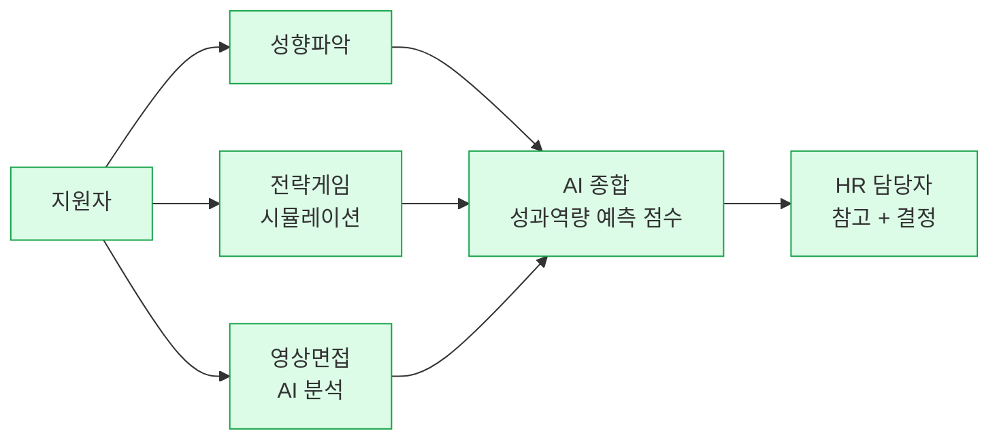

# 마이다스아이티 inAIR — AI 역량검사

> 🇰🇷 ★ **한국 HR AI 최대 규모 레퍼런스**: 1,200개 이상 기업 활용(⚠️ 벤더 주장, ZDNet 전달), 2025 하반기 공채에서 티웨이항공·KT클라우드·KB증권·기아·유니클로가 선발 도구로 채택 [[sources/zdnet-korea-midas-ai-competency-test-2025-09]]. **Scientific Reports(Nature 자매지) 논문**의 필드 스터디(병원 간호직 n=282)에서 AI 점수만이 입사 후 대인관계 성과의 유의한 예측변수 [[sources/nature-scientific-reports-ai-assessment-interpersonal-skills-2025-07]] — 국내 채용 AI 중 동료심사 학술 검증을 확보한 사례.

## Summary

마이다스그룹의 AI 역량검사('역검') 솔루션은 성향파악·전략게임·영상면접 3개 과제로 구성된 시뮬레이션 기반 채용 평가 도구로, 2018년 국내 최초 개발, 1,200개 이상 기업 활용 (⚠️ 벤더 주장, ZDNet 전달) [[sources/zdnet-korea-midas-ai-competency-test-2025-09]]. 2025년 하반기 공채에서 **티웨이항공·KT클라우드·KB증권·기아·유니클로**가 주요 선발 도구로 채택 [[sources/zdnet-korea-midas-ai-competency-test-2025-09]]. 신한은행·CJ·LIG넥스원·GS리테일·비씨카드 및 공공기관(오산·구미·경북·제주) 도입은 인용 소스에 없음 → _미공개_ (2026-09-27 grounding 점검). 2025-07 **KAIST 정일융 연구진**의 *Scientific Reports* 논문: ZDNet(벤더 보도자료 톤)은 "기존 채용 방식 중 유일하게 채용 1년 후 실제 업무 성과를 유의미하게 예측"이라 전하나 [[sources/zdnet-korea-midas-ai-competency-test-2025-09]], 논문 본문에서 확인되는 것은 한국 대형병원 간호직 지원자 282명 필드 데이터에서 **AI 점수만이 입사 후 대인관계 성과의 유의한 예측변수(β=0.10, P=0.02)**였다는 결과 [[sources/nature-scientific-reports-ai-assessment-interpersonal-skills-2025-07]].

## Problem / Why (도입 배경)

- 한국 대기업·공공기관의 채용 평가는 전통적으로 **인적성검사(SSAT·HMAT 등) + 면접관 주관 평가**에 의존
- 면접관의 **편향** (학벌·외모·인상 등)이 채용 품질을 저하
- 학벌·학점·어학성적 중심 평가가 실제 업무 성과와 연관성이 떨어진다는 지적 → 실제 역량을 측정할 새 평가 도구 수요 (ZDNet 해석) [[sources/zdnet-korea-midas-ai-competency-test-2025-09]]
- "AI가 사람보다 정확히 성과를 예측할 수 있는가?"라는 질문에 **동료심사 논문(필드 스터디)**으로 부분 답변 [[sources/nature-scientific-reports-ai-assessment-interpersonal-skills-2025-07]]

## Solution Architecture

### A. Process (프로세스)

- **Before (As-is)**: 서류 → 인적성(SSAT 류) → 면접관 면접 → 합격 (한국 대기업 전형)
- **After (To-be)** — ZDNet Korea 2025-09 확인 [[sources/zdnet-korea-midas-ai-competency-test-2025-09]]:
  1. 지원자가 **성향파악** 과제 수행 (자기보고식 검사)
  2. **전략게임** 수행 (게임화된 과제 — 조작하기 어려운 즉각적 반응에서 의사결정 패턴 분석)
  3. **영상면접**
  4. 직무별 고성과자 데이터·기업 인재상을 반영한 예측 모델로 성장 가능성·직무 적합도 수치화 ⚠️ 벤더 주장
  5. 기업이 객관적 기준으로 우선 선별 후 면접 진행 (유통기업 G사 담당자 인용)
- **Human-in-the-loop**: AI 점수로 우선 선별 → 면접은 사람 (G사 사례) [[sources/zdnet-korea-midas-ai-competency-test-2025-09]]; 최종 합격 결정 절차는 기업별 상이
- **Trigger & Frequency**: 채용 시즌 — G사는 연 4회 수천 명 지원 규모 [[sources/zdnet-korea-midas-ai-competency-test-2025-09]]; 지원자는 원하는 시간·장소에서 응시, 1회 응시로 여러 기업 지원 가능 [[sources/zdnet-korea-midas-ai-competency-test-2025-09]]
- **Scope of autonomy**: **Recommend** — AI 점수를 선별 기준으로 활용, 면접은 사람

```mermaid
flowchart LR
    App[지원자] --> T1[성향파악]
    App --> T2[전략게임<br/>시뮬레이션]
    App --> T3[영상면접<br/>AI 분석]
    T1 --> Score[AI 종합<br/>성과역량 예측 점수]
    T2 --> Score
    T3 --> Score
    Score --> HR[HR 담당자<br/>참고 + 결정]
    classDef fact fill:#dcfce7,stroke:#16a34a
    class App,T1,T2,T3,Score,HR fact
```
_범례: 녹색 = ZDNet Korea [[sources/zdnet-korea-midas-ai-competency-test-2025-09]] 확인 (3개 과제·선별 후 면접). 논문 [[sources/nature-scientific-reports-ai-assessment-interpersonal-skills-2025-07]]은 병원 간호직 사례의 예측력만 확인._

### B. System & Infrastructure (시스템·인프라)

- **Core HRIS**: _미공개 (not disclosed)_ — JOBFLEX 연동 서술은 인용 소스에 없어 제거 (2026-09-27)
- **AI 시스템 배치**: 마이다스그룹 솔루션 (도입 기업 외부 서비스) [[sources/zdnet-korea-midas-ai-competency-test-2025-09]]; 아키텍처 세부 _미공개_
- **배포 환경**: _미공개 (not disclosed)_
- **연동·통합**: _미공개 (not disclosed)_
- **사용자 접점**: 지원자가 원하는 시간·장소에서 응시 (온라인) [[sources/zdnet-korea-midas-ai-competency-test-2025-09]]; 기기·채널 세부 _미공개_
- **인증·권한**: _미공개 (not disclosed)_

### C. Data (데이터)

- **입력 데이터 소스**: 자기보고식 검사 응답, 게임화 과제의 즉각적 반응(의사결정 패턴), 영상면접 [[sources/zdnet-korea-midas-ai-competency-test-2025-09]]; 영상에서 추출하는 신호(음성·표정 등) _미공개_
- **데이터 규모**: 1,200개 이상 기업 활용 (⚠️ 벤더 주장) [[sources/zdnet-korea-midas-ai-competency-test-2025-09]]; 누적 응시자 수 _미공개_
- **전처리·정제**: _미공개 (not disclosed)_
- **학습 vs RAG vs In-context**: 직무별 고성과자 데이터·기업 인재상을 반영한 예측 모델 ⚠️ 벤더 주장 [[sources/zdnet-korea-midas-ai-competency-test-2025-09]]; 모델 종류(ML/LLM) _미공개_
- **데이터 거버넌스**: ⚠️ 영상면접 데이터 보관·폐기 _미공개_ — KR PIPA 생체정보 처리 검증 필요
- **민감정보 처리**: ⚠️ 채용절차공정화법: AI 평가 사용 시 지원자 고지 의무 — 마이다스 고지 방식 _미공개_

### D. Model (모델)

- **Foundation model**: _미공개_ — LLM 기반인지 전통 ML 기반인지 미공개
- **모델 유형**: ✅ predictive (성과역량 예측) + recognition (영상·음성) + simulation (게임 행동)
- **제공 방식**: 마이다스그룹 자체 솔루션 [[sources/zdnet-korea-midas-ai-competency-test-2025-09]]
- **커스터마이징 기법**: 직무별 고성과자 데이터와 기업 인재상 반영 ⚠️ 벤더 주장 [[sources/zdnet-korea-midas-ai-competency-test-2025-09]]; 기법 세부 _미공개_
- **Orchestration 프레임워크**: _미공개 (not disclosed)_
- **평가·가드레일**: ✅ *Scientific Reports* 필드 스터디 — 병원 간호직 n=282, AI 점수만 입사 후 대인관계 성과의 유의한 예측변수(β=0.10, P=0.02), 관리자·임원 면접 점수는 비유의 [[sources/nature-scientific-reports-ai-assessment-interpersonal-skills-2025-07]]. 효과 크기 작고 단일 병원. 편향 부재 별도 검증 _미공개_

### E. Organization & Team (조직·팀 구조)

- **오너십**: 마이다스그룹(마이다스아이티·마이다스인) 벤더 — 도입 기업 HR이 선별 기준 운영 [[sources/zdnet-korea-midas-ai-competency-test-2025-09]]
- **참여 역할**: _미공개 (not disclosed)_
- **팀 규모·기간**: _미공개 (not disclosed)_
- **거버넌스 체계**: _미공개 (not disclosed)_
- **파트너**: 논문 Study 3 설문은 MidasIT가 수집 — 연구 이해관계 [[sources/nature-scientific-reports-ai-assessment-interpersonal-skills-2025-07]]

## Impact / Metrics (기대효과)

### 기대효과 요약
Scientific Reports 필드 스터디에서 AI 점수가 입사 후 대인관계 성과를 유의하게 예측(Fact, 효과 크기 작음). 2025 하반기 5개사 공채 채택 + 1,200개 이상 기업 활용(벤더 주장).

| 지표 | 값 | 출처 | 성격 |
|---|---|---|---|
| **Scientific Reports 필드 스터디** | AI 점수만 입사 후 **대인관계 성과**의 유의한 예측변수 (β=0.10, P=0.02, n=282 병원 간호직) | [[sources/nature-scientific-reports-ai-assessment-interpersonal-skills-2025-07]] | ✅ **Fact (학술, Tier 4 academic)** ★ |
| **"면접관보다 정확"** | 논문: "AI selection technology can outperform humans in predicting interpersonal performances" — 관리자·임원 면접 점수는 비유의 | [[sources/nature-scientific-reports-ai-assessment-interpersonal-skills-2025-07]] | ✅ Fact (학술, 대인관계 성과 한정) |
| "모든 분야 유일 예측" | ZDNet(벤더 보도자료 톤) 표현 — 논문 본문에서는 대인관계 성과만 확인 | [[sources/zdnet-korea-midas-ai-competency-test-2025-09]] | ⚠️ 벤더 주장 |
| 2025 하반기 공채 채택 | **5개사** (티웨이항공·KT클라우드·KB증권·기아·유니클로) | [[sources/zdnet-korea-midas-ai-competency-test-2025-09]] | ✅ Fact (Tier 2) |
| 활용 기업 수 | **1,200개 이상** | [[sources/zdnet-korea-midas-ai-competency-test-2025-09]] | ⚠️ 벤더 주장 (ZDNet 전달) |
| 도입 공공기관 | _미공개_ (인용 소스에 없음 — 2026-09-27 grounding 점검) | — | — |
| ROI (시간·비용 절감) | _미공개_ | — | — |
| 편향 감소 효과 | _미공개_ (논문은 성과 예측에 집중) | — | — |

**★ 핵심**: 동료심사 학술지 필드 스터디는 벤더 자체 주장(Paradox 등)이나 자사 보고(Moderna 등)와는 다른 레벨의 근거 — 단 효과 크기(β=0.10)가 작고 단일 병원·간호직·대인관계 성과에 한정된다는 점을 함께 제시.

## Governance & Risk

- **학술 검증의 한계**: 논문은 대인관계 성과 예측력(단일 병원, 효과 크기 작음)을 확인했지 "편향 없음"을 증명한 것은 아님 [[sources/nature-scientific-reports-ai-assessment-interpersonal-skills-2025-07]]. 성별·학벌·지역 편향에 대한 **별도 adverse impact 감사** 결과 공개 없음. ZDNet의 "편향성 문제를 근본적으로 해결"은 벤더 주장 [[sources/zdnet-korea-midas-ai-competency-test-2025-09]]
- **연구 이해관계**: 논문 Study 3 설문 데이터는 MidasIT가 수집 [[sources/nature-scientific-reports-ai-assessment-interpersonal-skills-2025-07]]
- **한국 규제**:
  - **채용절차공정화법**: AI 평가 사용 시 지원자 고지 의무 — 마이다스아이티의 고지 방식 _미공개_
  - **개인정보보호법**: 영상면접 데이터는 생체 정보에 가까움 — 처리·보관·폐기 정책 _미공개_
- **공공기관 도입 확산**: 공직 채용에 AI 평가를 쓴다는 것은 **공정성·투명성 기대치가 민간보다 높음** — 감사원·국민권익위 등의 검증 대상이 될 가능성

## Contradictions

> [!note] 2026-09-27 grounding — 인용 소스에 없는 도입 기업(신한은행·CJ·LIG넥스원·GS리테일·비씨카드)·공공기관(오산·구미·경북·제주)·JOBFLEX 연동·데이터센터/ML/norm 조정 추정 서술을 제거하고 _미공개_ 처리. "모든 분야에서 유일하게 유의미 예측"은 ZDNet(벤더 보도자료 톤) 표현이며 논문 본문은 대인관계 성과(β=0.10)만 확인 [[sources/nature-scientific-reports-ai-assessment-interpersonal-skills-2025-07]] — 벤더 주장과 학술 결과를 분리 표기.

## Consulting Angle

### 국내 컨설팅 가치 — ★★★★★ (최고등급)

1. **"과학적 근거 있는 채용 AI"**의 드문 레퍼런스: Scientific Reports 논문을 CHRO에게 직접 보여줄 수 있음 — 단 대인관계 성과·단일 병원 한정임을 함께 제시
2. **도입 기업 다양성**: 항공(티웨이)·IT(KT클라우드)·금융(KB증권)·자동차(기아)·유통(유니클로) [[sources/zdnet-korea-midas-ai-competency-test-2025-09]] — 산업 다양성 증거; 그 외 산업·공공기관은 소스 미확보
3. **SK Group AICT와의 대조**: "SK = AI 활용 능력 평가(AICT)" vs "마이다스아이티 = AI가 역량을 평가(inAIR)" — **접근법의 근본적 차이**를 클라이언트 워크숍에서 토론 주제로
4. **글로벌 벤더(HireVue·Pymetrics) 대비 차별점**: 한국어 문맥·한국 기업 문화 최적화 + 국내 학술 검증

### 제시 시 주의점
- Nature 논문이 "편향 없음"까지 입증한 것은 아님
- 도입 기업 수는 있지만 **각 기업의 만족도·ROI** 수치 미공개
- 공공기관 도입이 **정치적 리스크** (AI 채용 반대 여론)에 노출될 수 있음

### 파생 질문
1. inAIR과 인적성(SSAT/HMAT)을 병행하는 기업이 있는가? 상호 보완인가 대체인가?
2. 영상면접의 **다문화·장애인** 대응력은?
3. 성과 예측 정확도가 직무별로 다른가? (R&D vs 영업 vs 생산직)
4. 공공기관 도입 후 **지원자 이의제기·민원** 사례는?
