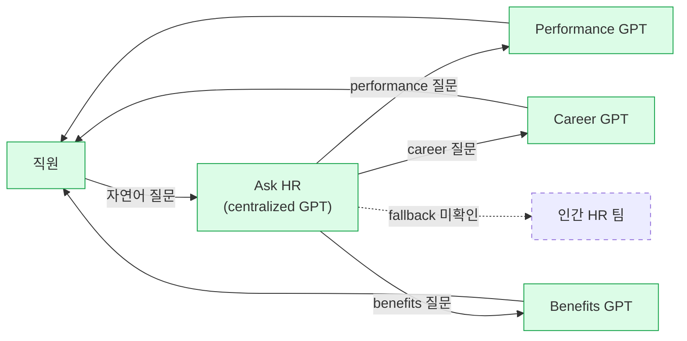
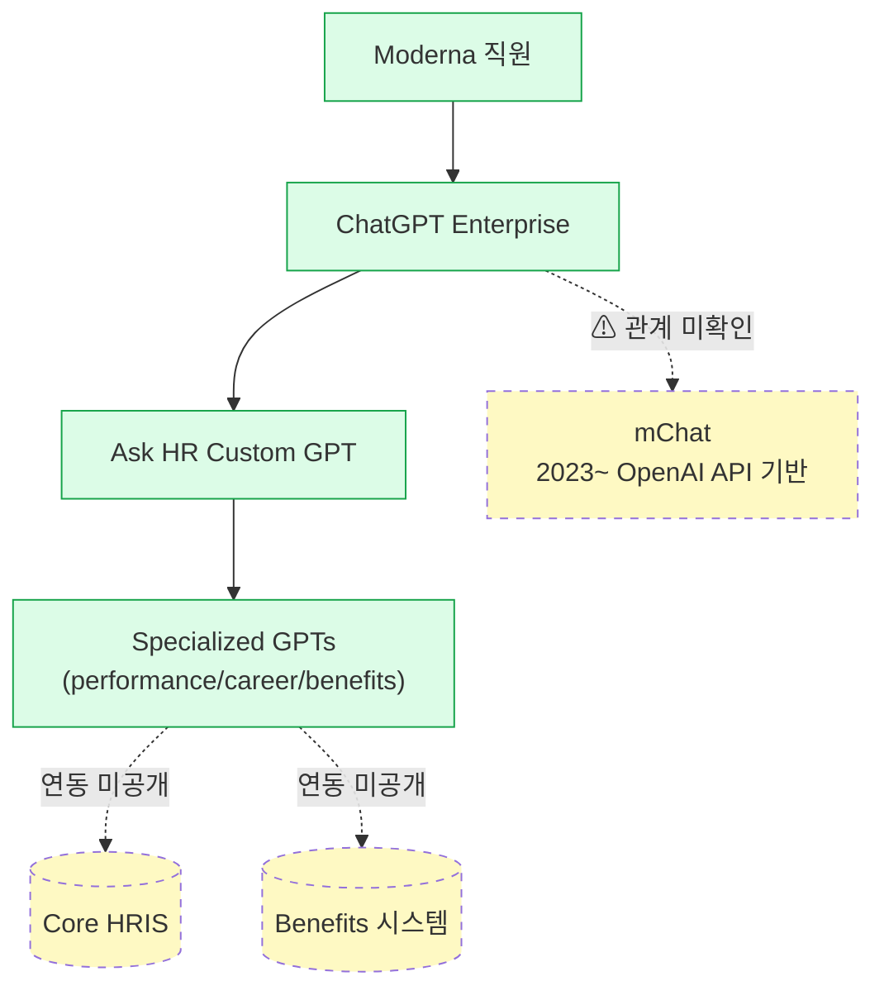
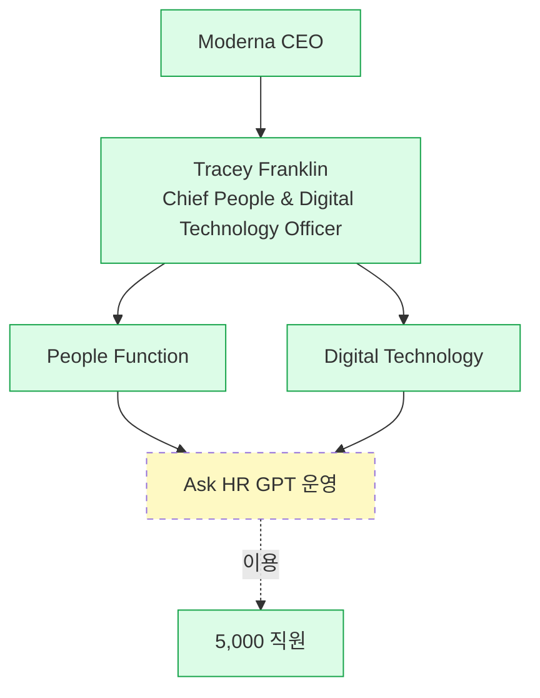

# Moderna — Ask HR 중앙 GPT routing

## Summary

Moderna는 OpenAI ChatGPT Enterprise 위에 **"Ask HR"이라는 centralized 커스텀 GPT**를 구축해, 직원의 HR 문의를 **performance·career·benefits** 영역의 specialized GPT들로 분기(routing)시킨다. HR 도메인 전체에서 "front door" 역할을 수행. 이는 전사 3,000+ 커스텀 GPT 생태계 중 HR 특화 허브에 해당하며, 2025년 Moderna의 HR+IT 부서 병합(단일 리더 Tracey Franklin CPDO)과 **조직 구조 변화와 함께** 전개된 사례라는 점에서 특히 주목된다.

## Problem / Why

- **Before (baseline)**: Moderna는 5,000명 규모의 바이오텍이지만 급성장기 동안 HR 인력만으로 늘어나는 직원 문의를 처리하기 어려워짐. ❓ **구체 before 수치(월간 HR 티켓 수·평균 응답 시간·HR 인력 대비 직원 비율) 미공개** — 이 baseline 부재가 이 use case의 최대 약점
- Franklin의 프레이밍: 기존의 "workforce planning"(HR 독립)과 "technology planning"(IT 독립)이 **"work의 흐름 자체를 설계"**하지 못했다. 개별 HR 프로세스 개선이 아니라 **업무·정보·의사결정 흐름 전체 재설계**가 목적 — [[unleash-moderna-hr-it-merger-2025-06]]
- 기술적으로는, 전사 ChatGPT Enterprise 위에 각 부서가 GPT를 남발할 경우 HR 도메인 질문이 품질 낮은 일반 GPT로 향할 위험 → HR 도메인 전용 "front door"가 필요

## Solution Architecture

### A. Process (프로세스)

- **Before (As-is)**: _미공개. 기존 HR 티켓/셀프서비스 시스템의 구체 프로세스는 공개 소스에 없음._
- **After (To-be)** — ✅ [[unleash-moderna-hr-it-merger-2025-06]] 확인:
  1. 직원이 "Ask HR" 중앙 GPT에 자연어 질문 입력
  2. Ask HR GPT가 질문 도메인 분류 — performance, career, benefits 등
  3. 해당 영역의 specialized GPT로 routing
  4. Specialized GPT가 답변 제공
  5. Franklin 인용 목적: *"minimizes wait times and maximizes response quality"*
- **Human-in-the-loop 지점**: ❓ 미공개. 자동 라우팅이 몇 % 정확한지, 실패 시 인간 HR에게 fallback되는지 여부 공개 안 됨.
- **Trigger & Frequency**: ✅ 일상 직원 질문 기반 (frequency: daily). ✅ 전사 평균 사용자당 주 120 ChatGPT Enterprise 대화 ([[constellation-moderna-chatgpt-enterprise-2024-04]]) — 다만 이 수치는 ChatGPT Enterprise 전체 대화량이며 **Ask HR만의 내역은 분리 공개되지 않음**.
- **Scope of autonomy**: "routing + response" 수준. "take action"(실제 HR 트랜잭션 실행) 권한 부여 여부는 ❓ 미공개.

_범례: 녹색 = Unleash 2025-06 소스 확인. 점선 = 존재 여부 미확인._

### B. System & Infrastructure (시스템·인프라)

- **Core HRIS**: ❓ 미공개. Moderna가 Workday·SAP SF·Oracle HCM 중 무엇을 쓰는지 fetched 소스에 기재 없음.
- **AI 시스템 배치**: ✅ OpenAI **ChatGPT Enterprise** 위의 **Custom GPT** 기능 활용 ([[moderna-blog-openai-2024-04]], [[constellation-moderna-chatgpt-enterprise-2024-04]])
- **별도 내부 ChatGPT 인스턴스**: ⚠️ 자사 보고 — **mChat**이라는 자체 ChatGPT 인스턴스가 2023년부터 존재하며 OpenAI API 위에 구축 ([[moderna-blog-openai-2024-04]]). Ask HR이 mChat 위에 있는지 ChatGPT Enterprise 위에 있는지, 또는 **병행 운영**인지 공개 자료에서 명확히 구분되지 않음 — ❓ 모호 구간
- **배포 환경**: OpenAI 클라우드 (ChatGPT Enterprise SaaS). 추가 인프라 상세 ❓ 미공개.
- **연동·통합**: ❓ 미공개. HRIS·payroll·benefits 시스템과 실시간 API 연결 여부 공개 없음.
- **사용자 접점 (UX layer)**: ChatGPT Enterprise UI (소스 미확인). 사내 portal·Slack·Teams embed 여부 ❓ 미공개.
- **인증·권한**: ❓ 미공개 (기본적으로 ChatGPT Enterprise SSO 기능이 있지만 Moderna 특정 설정 공개 없음)
- **SLA**: ❓ 미공개

### C. Data (데이터)

- **입력 데이터 소스**: 자연어 질문 (직원 발화)
- **Specialized GPT가 참조하는 knowledge**: ❓ 미공개. 사내 정책 문서·benefit plan·performance 기준 등이 RAG로 주입되는지, in-context 참조인지, OpenAI가 학습한 base knowledge만 쓰는지 — 모두 공개 자료에 없음
- **데이터 규모**: ❓ 미공개 (Ask HR 특정). 전사 기준 사용자당 주 120 대화는 ChatGPT Enterprise 전체.
- **전처리·정제**: ❓ 미공개 (PII 마스킹 여부 등)
- **학습 vs RAG vs In-context 구분**: ❓ 미공개. Custom GPT 특성상 RAG 또는 instruction-following이 일반적이나 Moderna 특정 구현은 공개 없음 → 추측 금지.
- **데이터 거버넌스**: ❓ 미공개. ChatGPT Enterprise 기본 약관(데이터 미학습 등)이 적용될 것으로 보이나, HR 데이터 특정 처리 방침 공개 없음.
- **민감정보 처리**: ❓ 미공개. HR 데이터는 HIPAA·GDPR(EU 직원)·주 법률 등에 해당할 수 있으나 Moderna 대응 세부 공개 없음.

### D. Model (모델)

- **Foundation model**: ✅ **OpenAI 모델** (ChatGPT Enterprise는 OpenAI GPT-4/4o 계열 사용 — OpenAI 공식 제품 정의) ([[moderna-blog-openai-2024-04]])
- **정확한 모델 버전**: ❓ 미공개. ChatGPT Enterprise가 사용 시점 최신 GPT를 쓰므로 2024-04 시점 GPT-4 Turbo, 이후 GPT-4o·GPT-5 등으로 변경 가능성 있으나 Moderna가 공개하지 않음.
- **모델 유형**: LLM (생성) 중심. Ask HR routing은 LLM의 classification 능력 활용 (별도 classifier 모델 사용 여부 ❓ 미공개).
- **제공 방식**: ✅ OpenAI 상용 SaaS (ChatGPT Enterprise + Custom GPT 기능)
- **커스터마이징 기법**: ✅ **Custom GPT** 기능 활용 — prompt + 지식파일 + (선택적) Action 조합. Fine-tuning 사용 여부 ❓ 미공개.
- **Orchestration 프레임워크**: ❓ 미공개. Ask HR → specialized GPT 라우팅이 OpenAI의 basic Custom GPT 기능만으로 되는지, 별도 오케스트레이션 레이어가 있는지 공개 없음.
- **평가·가드레일**: ❓ 미공개. HR 도메인 특유의 편향(성별·인종·연령 대응) 감사, hallucination 테스트 결과 공개 없음.
- **비용·성능 지표**: ❓ 미공개 (월간 토큰·latency·비용 모두 없음).
- **Fallback 전략**: ❓ 미공개.

### E. Organization & Team (조직·팀 구조)

이 use case의 **가장 탄탄한 Fact 영역**.

- ✅ **오너십**: HR + IT **병합 단일 조직**. 리더 **Tracey Franklin, Chief People and Digital Technology Officer (CPDO)** ([[unleash-moderna-hr-it-merger-2025-06]]). Moderna 최초 CPDO 직책.
- ✅ **전제 철학**: "workforce planning" + "technology planning" → **"work planning"** 통합. 즉, 이 use case는 조직 구조 변화와 함께 등장했으며, 독립된 IT 프로젝트가 아니었음.
- ⚠️ **Franklin의 솔직한 caveat**: *"still very much a work in progress"*, *"not a one-size-fits-all solution"*, "strong foundation을 이미 갖춘 조직에 적합". ← 컨설팅 포지셔닝에 **필수 인용**.
- ❓ 구체 팀 사이즈, 하위 reporting 라인, 참여 역할(PM·ML eng·legal·HRBP 등)은 **모두 미공개**.
- ❓ 거버넌스 체계: AI 윤리위원회, 리뷰보드 존재 여부 공개 없음 (대형 제약사 특성상 내부에는 있을 확률 높으나 공개 자료에서 확인 불가 → 추측 금지).
- ❓ 변화관리 방식 미공개
- ❓ 컨설팅·구현 파트너 공개 없음 (OpenAI 자체가 파트너)

_범례: 녹색 = Fact. 노랑/점선 = 존재는 확인되나 구체 운영 구조 미공개._

### F. Diagrams (도식)

- Process flowchart (A 섹션) ✅
- System architecture (B 섹션) ✅ — mChat/ChatGPT Enterprise 관계 모호성 시각화
- Organizational chart (E 섹션) ✅
- Data flow: **작성 안 함** — 입력 데이터 소스·전처리·RAG 여부 대부분이 미공개라 억지로 그리면 [[CLAUDE|CLAUDE.md]] §3 규칙 위반

---

**Fact 품질 요약**:
- ✅ **Fact 풍부 영역** (A Process, E Org): 3개 소스 교차 확인
- ⚠️ **자사 보고** (B System, Timeline): mChat/ChatGPT Enterprise 관계, adoption 수치 등 — 독립 검증 없음
- ❓ **미공개 영역**: 전체 C Data, D Model 대부분, E 세부 조직 구조
- 🟢 **Mermaid 도식**: 3개 생성 (process / system / org) — 모두 실선/점선 범례 적용
- 📊 **A~E 커버리지**: 5개 영역 중 Fact로 최소 일부 채워진 곳 = 4개 (A, B부분, D부분, E) / 순수 미공개 = 1개 (C)

## Impact / Metrics (기대효과)

### 기대효과 요약
⚠️ 자사 보고: 전사 ChatGPT Enterprise 기준 사용자당 주 120회 대화. 이는 **플랫폼 전체** 수치이며 Ask HR 전용 분해(라우팅 정확도·해결률·티켓 deflection·만족도)는 _미공개_. Constellation Research도 "독립 검증 아닌 illustrative"라고 명시.

전사 ChatGPT Enterprise 기준 수치 (Ask HR 전용 분해 아님):

| 지표 | 값 | 시점 | 출처 | 성격 |
|---|---|---|---|---|
| 주당 평균 대화 (사용자당) | 120 | 2024-04 | [[constellation-moderna-chatgpt-enterprise-2024-04]] | ⚠️ Moderna self-report (Constellation 전달, 독립 검증 없음) |
| weekly active users 중 GPT 제작자 비율 | 40% | 2024-04 | [[constellation-moderna-chatgpt-enterprise-2024-04]] | ⚠️ Moderna self-report |
| 초기 mChat 채택률 | 80% | 2024-04 | [[constellation-moderna-chatgpt-enterprise-2024-04]] | ⚠️ Moderna self-report |
| Legal 팀 채택률 | 100% | 2024-04 | [[constellation-moderna-chatgpt-enterprise-2024-04]] | ⚠️ Moderna self-report |
| 커스텀 GPT 총 수 | 750 → 3,000+ | 2024-04 → 2025-06 | [[constellation-moderna-chatgpt-enterprise-2024-04]], [[unleash-moderna-hr-it-merger-2025-06]] | ⚠️ Moderna self-report (14개월 성장) |

**HR 특화 지표**: _미공개_. Ask HR의 라우팅 정확도, 해결률, 인간 HR 티켓 deflection 비율, 만족도 — **어느 수치도 공개된 것이 없음**.

> ⚠️ **중요**: Constellation Research 자체가 이 수치를 "독립 검증(independently endorsing)이 아닌 illustrative"라고 **명시**. 분석가가 지면에 실었다는 이유만으로 Tier 1 검증이 되는 것은 아님.

## Governance & Risk

- ❓ HITL 수준 미공개: Ask HR의 답변을 HR 전문가가 사후 검토하는지, 애매한 케이스만 에스컬레이션하는지 공개 없음
- ❓ 편향·공정성 감사 공개 없음: 성별·인종·연령·장애 등 보호 범주에 대한 bias 테스트 공개 없음
- ❓ 개인정보: HR 질문은 급여·건강·퇴직금·징계 등 매우 민감. Moderna가 ChatGPT Enterprise에 보내는 데이터 범위와 보존 정책 공개 없음
- ⚠️ Franklin의 공개적 경고: "still very much a work in progress" — **성공 narrative로 포장 불가**
- 🚨 **컨설팅 리스크 플래그**:
  1. 한국 클라이언트에 제시 시 개인정보보호법·근로자 대표 동의·영업비밀 경계 등 Moderna가 대응하지 않은 영역을 **추가 검토 필수**
  2. OpenAI 기반이라는 점은 data residency·sovereign cloud 요구가 강한 공공·금융 고객에는 **부적합할 가능성**

## Contradictions

_없음._ 소스 간 수치·주장 충돌은 발견되지 않음. GPT 수(750→3,000+)는 14개월에 걸친 시계열 성장이므로 contradiction 아님.

## Consulting Angle

### 사용처 (최고 활용도)
1. **"조직 구조가 기술보다 먼저"** 워크숍의 앵커 사례 — CEO/CHRO 클라이언트에게 CPDO 직책 자체를 메시지로 제시
2. 대형 HR AI 이니셔티브의 **"work in progress" 정직 포지셔닝** 근거 — Franklin의 caveat을 인용해 클라이언트 기대 관리
3. Custom GPT 생태계를 구축하려는 클라이언트의 **라우팅 아키텍처 reference** — A섹션 flowchart를 수정·적용

### 클라이언트에게 제시할 때 반드시 함께 말해야 할 것
- ✅ Moderna 특수성: $3.2B / 5,000명 / 디지털 네이티브 / CEO 지원 4가지 정렬
- ⚠️ 한국 대기업 복제 제안 금지: 계열사 구조·노사 합의·전통적 HR 문화 상에서 HR+IT 병합은 **동일한 효과를 보장하지 않음**
- ⚠️ 지표는 Moderna self-report임을 솔직히 고지 — 독립 검증된 ROI 수치는 **없음**

### 파생 질문 (벤더·클라이언트에게 물어야 할 것)
1. Ask HR의 routing 정확도 실측치는?
2. HR 특화 bias 감사 결과가 있는가?
3. HR 데이터가 OpenAI 학습에 쓰이지 않는다는 계약상 근거는? (ChatGPT Enterprise 기본 약관 외에)
4. Ask HR 답변이 잘못됐을 때 책임 소재 및 구제 절차는?
5. EU 직원(GDPR) 대응은?
6. Specialized GPT들(performance/career/benefits)의 지식베이스는 누가 유지보수하는가? 이 bookkeeping 비용은?

### 제안서 인용 가이드
- confidence 0.65 → **제안서 본문에 "reference case"로 인용 가능** (단독 근거로는 부족)
- 인용 시 반드시: "Moderna self-report 기준", "조직 구조 변화와 함께 진행됨", "Franklin은 work-in-progress로 명시"
- 숫자 인용 시: "주 120 대화/사용자" 같은 전사 지표는 쓰되 "Ask HR deflection rate" 같은 HR 특화 지표는 **만들어 쓰지 말 것** (없음)
