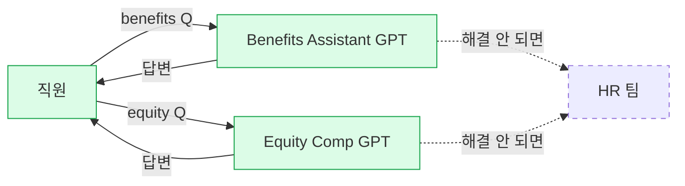

# Moderna — US Benefits Assistant GPT + Equity Compensation GPT

> 본 페이지는 Moderna의 **두 개의 밀접하게 관련된 Total Rewards GPT**를 하나의 use case로 통합 기술합니다. 두 GPT 모두 직원 대상, 혜택·보상 영역 Q&A·선택 지원이라는 동일한 기능군이며 단일 소스([[hr-brew-moderna-total-rewards-2025-05]])에서 함께 언급됩니다.

## Summary

Moderna가 OpenAI Custom GPT로 구축한 **Total Rewards 영역 직원 self-service 어시스턴트 2종**:

1. **US Benefits Assistant GPT** — 직원이 의료 등 혜택을 선택할 때 도움. Moderna 내부 **HR GPT 사용량 2위** (⚠️ 자사 보고)
2. **Equity Compensation GPT** — 직원들이 가장 적게 이해하던 프로그램이라는 인식에서 출발해 출시. ⚠️ 자사 보고: 출시 후 해당 영역 이메일·티켓 **"a huge decrease"**

두 GPT 모두 전형적인 **HR case deflection** 패턴 — 직원 자가 해결률을 높여 HR 팀 부담을 낮춤.

## Problem / Why (도입 배경)

- 대기업의 Total Rewards(의료·치과·401k·생명보험·stock/equity) 정책은 복잡하고, 직원이 개인 상황에 맞게 선택하려면 HR 담당자에게 묻는 경우가 많음
- Equity compensation은 **용어(vesting·RSU·ESPP·exercise)만으로도 진입장벽이 커서** 직원 이해도가 낮은 영역 — Moderna VP 발언이 이를 명시적으로 지적
- HR 팀은 반복적인 Q&A에 시간 소모 → "진짜 필요한 업무" 시간 부족
- **주의**: Moderna의 공식 problem statement는 이 수준의 세부 진술이 없음. 위는 일반 해석 + VP의 "most under-understood program" 발언 기반.

## Solution Architecture

### A. Process (프로세스)

- **Before (As-is)**: _미공개_ — 아마 HR 팀 직접 문의, 또는 기존 benefits portal의 FAQ 수준. 이 전제는 소스에 없음, 추측 금지 — 단순히 "미공개"
- **After (To-be)**: 직원이 혜택·equity 관련 질문을 GPT에 입력 → GPT가 정책·FAQ·개인 상황 반영하여 답변 → 해결되지 않으면 HR로 escalate (이 escalation 경로는 ❓ 미공개)
- **Human-in-the-loop 지점**: _미공개._ "take action" (혜택 실제 선택)의 자동화 수준도 미공개 — 단순 Q&A만 하는지, 선택 제출까지 돕는지 불명
- **Trigger & Frequency**: **연중 상시** (특히 enrollment 시즌·equity vesting 이벤트 시점에 피크)
- **Scope of autonomy**: Q&A (recommend-only가 합리적 기본값이지만 공식 확인은 없음)

_범례: 녹색 = HR Brew 소스 확인. 점선 = escalation 경로 미확인._

### B. System & Infrastructure (시스템·인프라)

- **Core HRIS**: _미공개_
- **AI 시스템 배치**: OpenAI ChatGPT Enterprise의 Custom GPT ([[moderna-blog-openai-2024-04]])
- **배포 환경**: OpenAI 클라우드
- **연동·통합**: _미공개._ Benefits enrollment 시스템·equity 플랫폼(Fidelity·Carta·Morgan Stanley 등 중 어느 것을 쓰는지)과의 연결 여부 불명
- **사용자 접점**: ChatGPT Enterprise UI
- **인증·권한**: _미공개_

### C. Data (데이터)

- **입력 데이터 소스**: Moderna의 benefits plan 문서·FAQ·정책 가이드 (RAG로 제공될 것으로 보이나 공개 없음)
- **데이터 규모**: _미공개_
- **전처리·정제**: _미공개_
- **학습 vs RAG vs In-context 구분**: _미공개._ Custom GPT의 지식파일 기능을 쓰는 것이 통상 경로이나 Moderna 특정 구현 공개 없음
- **데이터 거버넌스**: _미공개_
- **민감정보 처리**: _미공개._ 직원의 개인 equity 소유·vesting 일정이 노출되면 안 되는 민감 data — 이를 GPT에 넘기지 않는 방식으로 설계되는지 확인 불가

### D. Model (모델)

- **Foundation model**: OpenAI GPT 계열 (ChatGPT Enterprise)
- **커스터마이징**: Custom GPT 기능
- **평가·가드레일**: _미공개._ **Benefits·equity는 regulated·semi-regulated 영역** (IRS·SEC 규정) — 잘못된 답변의 법적 리스크 존재. Moderna의 guardrail·disclaimer 정책 **공개 없음**
- **기타**: 전부 미공개 (성능·비용·fallback 등)

### E. Organization & Team (조직·팀 구조)

- **오너십**: Moderna People and Digital Technology (Franklin 산하 — specific 오너 ❓ 미공개)
- **참여 역할**: _미공개_
- **거버넌스 체계**: _미공개_

### F. Diagrams (도식)
- Process flowchart 1개 (A 섹션). 나머지 미공개 영역은 생략.

---

**Fact 품질 요약**:
- ✅ Fact: 두 GPT의 존재·이름·목적·사용량 2위·equity 티켓 감소 주장
- ⚠️ 자사 보고: 위 수치 전부 VP 발표 기반, 구체 % 없음
- ❓ 미공개: 아키텍처·데이터 연동·governance·법적 가드레일

## Impact / Metrics (기대효과)

### 기대효과 요약
Before: _미공개 (기존 benefits/equity 관련 이메일·티켓 건수)_ → After: ⚠️ 자사 보고 HR GPT 중 사용량 2위 (채택 지표, outcome 아님), Equity Compensation GPT 관련 이메일/티켓 "a huge decrease" (VP 정성 진술, 수치 없음). 제안서 수치 인용 불가.

| GPT | 지표 | 값 | 출처 | 성격 |
|---|---|---|---|---|
| US Benefits Assistant | 사용량 랭킹 | HR GPT 중 **2위** | [[hr-brew-moderna-total-rewards-2025-05]] | ⚠️ 자사 보고 |
| Equity Compensation | 관련 이메일/티켓 | "a huge decrease" (수치 없음) | [[hr-brew-moderna-total-rewards-2025-05]] | ⚠️ 자사 보고 |

**주의**: "huge decrease"는 **Moderna VP의 정성 진술**일 뿐, % 수치·before/after 비교값 없음. 제안서 수치 인용 불가.

## Governance & Risk

- **Regulatory 리스크 (중대)**:
  - Benefits plan 설명이 부정확하면 직원이 잘못된 선택 → 실손해
  - Equity 설명에 "투자 조언" 수준 답변이 섞이면 SEC 규정 위반 가능
  - 이런 가드레일·disclaimer 설계가 **공개 없음** — 컨설팅 관점에서 가장 큰 **체크리스트 항목**
- **개인정보**: 개인별 equity 보유·vesting 일정은 민감 — GPT 쿼리에 반영되면 안 됨. 처리 방식 공개 없음
- **편향**: Benefits 선택은 개인 가정 상황·건강 정보와 얽힘. LLM의 추천이 성별·연령·가족상태에 따라 달라질 위험 — 감사 없음

## Contradictions
_없음 — 단일 소스_

## Consulting Angle

- **사용처**: Total Rewards 영역의 "**case deflection**" 패턴의 대표 예시. 컨설팅 프로젝트에서 "HR 운영 비용 절감"을 목표로 할 때 first candidate 중 하나.
- **핵심 insight**: Moderna는 **equity comp GPT의 "직원 이해도가 낮은 프로그램부터 공략"** 이라는 **우선순위 결정 기준**을 주었음. 이게 실제 wiki에서 가장 가치 있는 teaching point — 복잡한 영역부터 AI가 진입하면 효과가 눈에 보임.
- **제시 시 주의점**:
  - Benefits GPT 사용 시 **법적 가드레일 필수** — 클라이언트가 "AI 말만 믿고 선택하면 어떻게 하냐"는 우려를 당연히 제기
  - equity 프로그램이 없거나 단순한 한국 기업에는 equity GPT 교훈은 less applicable
- **파생 질문**:
  1. 연말정산 같은 **한국 특유 Total Rewards 영역**에 같은 패턴 적용 가능? ([[CLAUDE|CLAUDE.md §2]] 5번 Total Rewards → Payroll Operations → Year-end Tax Settlement)
  2. 복지포인트·경조사·복지몰 추천 같은 한국형 복리후생 GPT 구축의 기대 효과는?
  3. Benefits GPT의 답변이 잘못됐을 때 책임 소재는?
