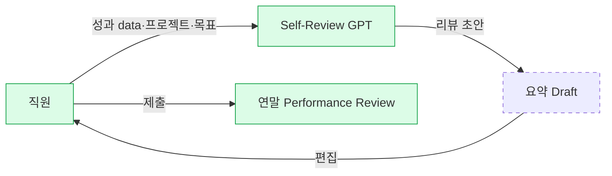

# Moderna — Self-Review GPT

## Summary

Moderna가 OpenAI Custom GPT 기반으로 구축한 HR 내부 도구. **직원 본인의 연말 성과 리뷰를 요약**해주는 기능. Moderna 내부 통계(2025년 3~4월)에서 **HR GPT 중 메시지·사용자 수 1위** (⚠️ 자사 보고, VP 발표 기준). HR Brew가 WorldatWork Total Rewards 컨퍼런스에서 취재. 단일 Tier 2 소스 기반이므로 stub 경계.

## Problem / Why

- 연말 성과 리뷰는 작성 부담이 큰 반복 업무 (특히 성과 data·1:1 노트·프로젝트 결과 등 여러 입력을 종합해야 함)
- Moderna의 "work의 흐름 설계" 철학 맥락에서, 직원이 리뷰 bookkeeping보다 **실제 reflection에 집중**하도록 AI가 요약 초안을 제공
- **주의**: 위 problem 진술은 일반적 해석이며, 소스에 Moderna의 공식 problem statement는 없음.

## Solution Architecture

### A. Process (프로세스)

- **Before (As-is)**: _미공개_
- **After (To-be)**: 직원이 본인의 성과 data·프로젝트·목표 달성을 GPT에 입력/연결 → GPT가 연말 리뷰 초안 요약 → 직원이 검토·편집 후 제출 (**추정 흐름 아님, 소스에 구체 단계 미공개 — 위 흐름은 "self-review 요약"이라는 기능 정의에서 직접 읽히는 부분만**)
- **Human-in-the-loop**: 직원 본인이 당연히 최종 검토 (self-review 특성상). 매니저 review 단계에 AI가 관여하는지 ❓ 미공개
- **Trigger & Frequency**: 연말 리뷰 사이클 — annual (+ 연중 ad-hoc 사용 가능성)
- **Scope of autonomy**: Summary-assist (recommend-only, 직원 최종 소유)

_범례: 녹색 = HR Brew 소스 확인. 점선 = 세부 단계 미확인 (구체 UI·trigger·HITL 공개 없음)._

### B. System & Infrastructure (시스템·인프라)

- **Core HRIS**: _미공개_ (Moderna가 어떤 HCM을 쓰는지 공개된 바 없음)
- **AI 시스템 배치**: OpenAI **Custom GPT** 기능 활용 — ChatGPT Enterprise 기반으로 추정 (Moderna 전사 인프라가 그쪽 기반이므로) ([[constellation-moderna-chatgpt-enterprise-2024-04]], [[moderna-blog-openai-2024-04]])
- **배포 환경**: OpenAI 클라우드
- **연동·통합**: _미공개._ 성과 data·목표 data를 HCM에서 GPT로 끌어오는 방식, 또는 직원이 수동 입력하는지 등 세부 미공개
- **사용자 접점**: ChatGPT Enterprise UI (Custom GPT 형식) — Moderna 전사 기본값
- **인증·권한**: _미공개._ 성과 data가 포함되므로 권한 모델이 중요하나 공개 없음
- **SLA**: _미공개_

### C. Data (데이터)

- **입력 데이터 소스**: _미공개._ 직원의 과거 성과 data·프로젝트 기록·1:1 노트·목표 달성 등 통상 필요한 input들이 어느 범위까지 연결되는지 공개 없음
- **데이터 규모**: _미공개_
- **전처리·정제**: _미공개_
- **학습 vs RAG vs In-context 구분**: _미공개._ Custom GPT 특성상 instruction + 지식파일 형태 가능하나 Moderna 특정 구현 확인 안 됨
- **데이터 거버넌스**: _미공개._ 개인 성과 data는 민감 카테고리인데 Workday 같은 HCM에서 ChatGPT Enterprise로 흘러가는 경로·보존 정책 **공개 없음**
- **민감정보 처리**: _미공개_

### D. Model (모델)

- **Foundation model**: OpenAI GPT 계열 (ChatGPT Enterprise 기본 모델)
- **정확한 버전**: _미공개_
- **모델 유형**: LLM 요약 중심
- **제공 방식**: OpenAI 상용 SaaS
- **커스터마이징 기법**: Custom GPT 기능 (prompt + 지식파일)
- **Orchestration 프레임워크**: _미공개_
- **평가·가드레일**: _미공개._ 성과 리뷰 요약에서의 **편향**(표현·성별·문화별 자기평가 차이 등)이 중요하지만 Moderna가 공개한 가드레일 0건
- **비용·성능 지표**: _미공개_
- **Fallback 전략**: _미공개_

### E. Organization & Team (조직·팀 구조)

- **오너십**: Moderna **People and Digital Technology** (Franklin CPDO 산하 — 이 use case 자체에 대한 specific 오너십은 ❓ 미공개)
- **참여 역할**: _미공개_
- **거버넌스 체계**: _미공개_
- **변화관리**: _미공개_
- **파트너**: _미공개_

### F. Diagrams
- Process flowchart 1개 작성 (A 섹션). 나머지 도식은 근거 부족으로 생략.

---

**Fact 품질 요약**:
- ✅ Fact: GPT의 존재·이름·목적·Moderna 내부 사용 1위 등 기본 사실
- ⚠️ 자사 보고: "1위 사용량" 등 Moderna VP의 conference 발언
- ❓ 미공개: 구체 아키텍처·데이터 흐름·governance·정량 효과 전반

## Impact / Metrics (기대효과)

### 기대효과 요약
⚠️ 자사 보고: Moderna HR GPT 중 사용량 1위 — 이는 채택(adoption) 지표이며 outcome(리뷰 품질·시간 절감·만족도·정확도) 아님. 구체 ROI 수치 _미공개_.

| 지표 | 값 | 출처 | 성격 |
|---|---|---|---|
| HR GPT 중 사용량 랭킹 | **1위** | [[hr-brew-moderna-total-rewards-2025-05]] | ⚠️ 자사 보고 (2025-03~04) |
| 구체 ROI (시간·만족도·정확도) | **없음** | — | — |

**없는 것**: 리뷰 품질 개선, 매니저 calibration 영향, 직원 만족도, 요약 정확도 벤치마크 — 전부 공개 없음.

## Governance & Risk

- **HITL**: 직원 본인이 최종 결정자 (self-review의 본질)
- **편향 리스크 (미관리)**: Self-review는 성별·문화·언어별로 **자기평가 성향 차이가 크게 나는 영역** — LLM이 이 차이를 증폭시킬 위험. Moderna의 관련 감사 **공개 없음**.
- **개인정보**: 성과 data는 민감 — 데이터 경계·보존 정책 **공개 없음**
- **노사관계 리스크**: 성과 리뷰의 AI 개입은 지역별(EU·한국) **근로자대표 합의 이슈** 가능성 — Moderna의 대응 **공개 없음**

## Contradictions
_없음 — 단일 소스_

## Consulting Angle

- **사용처**: Moderna의 "work in progress" HR AI 전략을 설명할 때 대표 예시. 특히 **"가장 많이 쓰이는 것이 self-review"**는 직원 입장에서 **"반복 문서 작업"이 AI의 sweet spot**이라는 insight.
- **주의**:
  - 단일 소스 (HR Brew) + 원문 직접 미열람 → "Moderna VP가 공개 conference에서 말한 내용" 수준으로만 인용
  - 수치가 없으므로 "성공 증명"으로 사용 불가 — "패턴 관찰" 수준
- **파생 질문**:
  1. 한국 대기업의 성과 리뷰 문화(팀·상사 평가 중심)에서 self-review GPT가 같은 효과를 낼까?
  2. 성과 data가 HCM에 있는 기업 vs 분산된 기업의 적용성 차이는?
  3. 매니저 리뷰 단계에도 AI를 넣을 것인가? (경계 판단 필요)
- **반면교사**: 이 use case는 **"제품으로서는 단순, 거버넌스로서는 복잡"**한 전형. 클라이언트에 제시 시 "기술 도입은 쉬워도 HR 프로세스 재설계·노사 합의·편향 감사가 진짜 과제"라는 교훈 강조.
