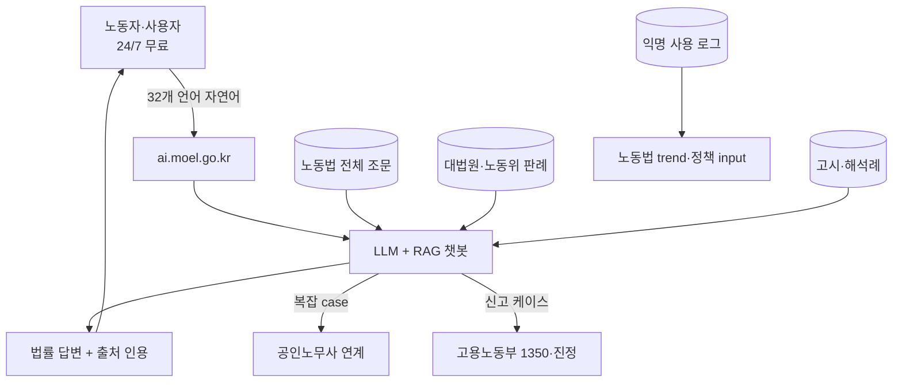

## Summary

대한민국 고용노동부가 **2024년 11월 시범 출시**한 **AI 노동법 상담 챗봇** (ai.moel.go.kr) — 노동자·사용자가 24/7 무료 노동법 상담. ✅ Fact: **2025년 누적 117,000회 사용**, **노동법 상담 시간 87.5% 단축** (정부 자체 측정), 야간·주말 사용 비중 37.7%, **32개 언어 지원** (외국인 노동자 대응). 공인노무사회와 MOU 체결 — 노동약자 보호 AI 혁신 협업. 한국 정부가 직접 운영하는 **노무 AI 표준 사례** — 한국 대기업 사내 ER 챗봇 reference.

## Problem / Why

- **Before**: 한국 노동자·사용자가 노동법 (근로기준법·최저임금법·산업안전보건법·직장 내 괴롭힘 금지법 등) 관련 질문 시 — (a) 고용노동부 콜센터 (1350, 평일 업무시간) (b) 공인노무사 유료 상담 (c) 인터넷 검색 (정확도 낮음)
- **Pain point**:
  - **시간·접근성 한계**: 콜센터 평일 업무시간만 → 야간·주말 근로자·외국인 노동자 접근 어려움
  - **언어 장벽**: 외국인 노동자 (이주노동자 100만+)는 한국어 상담 어려움
  - **유료 상담 부담**: 공인노무사 1건 30분 상담료 ~5만원 → 저소득 노동자 부담
  - **노동법 복잡성**: 변수 다수 (근로계약 형태·근속·임금구조·교대제 등) → 자가 검색 정확도 낮음
- **Trigger**: 윤석열 정부 노동약자 보호 정책 + GenAI 등장 + 32개 언어 LLM 가능성 + 공인노무사회 협업 의지

## Solution Architecture

### A. Process

- **Before**: 노동자 → 콜센터 1350 (평일만) 또는 노무사 유료 → 답변 며칠 소요
- **After**:
  1. 노동자·사용자가 ai.moel.go.kr 접속 (24/7, 무료, 32개 언어)
  2. 자연어 질문 입력 (예: "주 52시간 위반 신고는 어떻게?", "최저임금 미지급 시 대응 방법?")
  3. AI가 노동법 조문·판례·고시 기반 답변 생성 + 출처 인용
  4. 복잡 case는 공인노무사 추천 연계 (공인노무사회 MOU)
  5. 사용 데이터 anonymized → 노동법 trend 분석·정부 정책 input
- **HITL**:
  - 단순 질문은 AI 자율 답변
  - 복잡·민감 case는 공인노무사 또는 고용노동부 colleague 연계
  - 정부 부처가 답변 정확도 모니터링·법률 변경 시 학습 갱신
- **Frequency**: 24/7 daily (야간·주말 비중 37.7%)
- **Scope of autonomy**: assist (정보 제공) — 결정·신고는 사람

### B. System & Infrastructure

- **Core platform**: 정부 ai.moel.go.kr (자체 host)
- **AI 시스템 배치**: 자체 구축 LLM 기반 챗봇 + 노동법 RAG
- **사용자 접점**: web portal (ai.moel.go.kr) + mobile-friendly UI
- **인증**: 익명 사용 (노동약자 진입 장벽 낮춤)
- **Multilingual**: 32개 언어 (한국어·영어·중국어·베트남어·태국어·필리핀어·인도네시아어·캄보디아어·미얀마어 등 외국인 노동자 비중 높은 언어)

### C. Data

- **입력 데이터**:
  - 노동법 전체 조문 (근로기준법·최저임금법·산업안전보건법·노동조합법·직장 내 괴롭힘 금지법 등)
  - 대법원·노동위원회 판례
  - 고용노동부 고시·해석례
  - 공인노무사회 자문 정리
- **모델 구조**: RAG (노동법 corpus) + LLM (자연어 응답·다국어) + classification (질문 유형·연계 필요성 판단)
- **Data governance**: 정부 PIPA 준수, 익명 사용·anonymized 로그, 사용 트렌드만 정책 input

### D. Model

- **Foundation model**: _구체 LLM provider 미공개_ — 한국 정부 보안 정책상 비공개. 추정: 국내 LLM (네이버 HyperCLOVA·삼성 Gauss·SKT 또는 글로벌)
- **Customization**: 노동법 도메인 fine-tuning + 32개 언어 자료 학습
- **Guardrails**: 정부 운영 → 보수적 답변·법률 자문이 아닌 "정보 제공" 명시

### E. Organization & Team

- **오너십**: 고용노동부 + 한국고용정보원 (운영) + **공인노무사회 (MOU 자문)**
- **참여 역할**: 노동법 전문가·공인노무사·LLM 엔지니어·다국어 검증
- **거버넌스**: 정부 부처 직접 운영, 정기 답변 정확도 audit

### F. Diagrams

범례: 모든 연결 ✅ 정부 공식 발표 + Tier 2 한국 정책 뉴스 검증.

## Impact / Metrics (기대효과)

### 기대효과 요약
**한국 정부 직접 운영 노무 AI 표준 사례**. ✅ 정부 공식 통계 + 다수 언론 보도. 한국 대기업 사내 ER/노무 챗봇 도입 시 **반드시 인용**.

| 지표 | 값 | 출처 | 성격 |
|---|---|---|---|
| **누적 사용 (2025)** | **117,000회** | 고용노동부 공식 발표 | ✅ Fact (정부) |
| **상담 시간 단축** | **87.5%** | 정부 자체 측정 | ✅ Fact (정부 자체 측정) |
| **야간·주말 사용 비중** | **37.7%** | 정부 발표 | ✅ Fact |
| **지원 언어 수** | **32개** | 정부 공식 | ✅ Fact |
| **시범 출시일** | 2024-11 | 정부 공식 | ✅ Fact |
| **공인노무사회 MOU** | 노동약자 보호 AI 혁신 협업 | 정부 + 노무사회 발표 | ✅ Fact |
| 외국인 노동자 활용 | 다국어 지원으로 access | 정부 정책 보도 | ⚠️ 정성 평가 (구체 외국인 사용 비중 미공개) |

## Governance & Risk

- ✅ 정부 직접 운영 → 정확도·법률 책임 정부 부담 (사용자에 추가 위임 없음)
- ✅ PIPA 준수 + 익명 사용 → 노동약자가 신원 노출 부담 없이 사용 가능
- ✅ 공인노무사회 협업 → 법률 자문 품질 검증 mechanism
- ⚠️ "정보 제공"이며 "법률 자문 아님" — 복잡·중대 case는 노무사·변호사 연계 필요 (정부 명시)
- ⚠️ LLM 환각 risk — 노동법 조문·판례 정확 인용 검증 필수
- ⚠️ 외국인 노동자 32개 언어 지원이지만 LLM 다국어 정확도 일부 언어에서 낮을 수 있음 (특히 미얀마어·캄보디아어·필리핀어 등 low-resource 언어)

## Consulting Angle

- **한국 대기업 사내 ER/노무 AI 챗봇 도입 시 #1 reference**:
  - "정부도 한다" 카드 — CHRO·법무·노무팀 보수성 극복에 효과적
  - 정부 사례 정량 metric (117K 사용, 87.5% 단축, 37.7% 야간) — 한국 대기업 사내 챗봇 ROI 시뮬레이션 base
- **vs HR Acuity** [[hr-acuity-oliver-er-companion]] / Sodales [[sodales-spire-energy-labor-relations]]:
  - 정부 사례: **개별 노무자 상담** (B2C 성격, 정보 제공)
  - HR Acuity: 사내 ER **case management** (B2B, investigation·documentation)
  - Sodales: 사내 **단체노사 grievance** (B2B, CBA·다중 노조)
  - 보완 관계 — 정부 사례는 사내 챗봇의 학습 reference, HR Acuity는 case management, Sodales는 노조 운영
- **외국인 노동자 32개 언어 지원** = 한국 대기업 (제조·유통·F&B의 외국인 비중 높은 사업장 — 삼성SDS 인도, 현대차 인도네시아, LG화학 베트남 등) **사내 다국어 노무 챗봇** 모델 reference
- **2026 Q3-Q4 컨설팅 deck**:
  - "한국 대기업 ER/노무 AI 도입 3-tier 모델": 정부 노동법 챗봇 (학습) + 사내 ER case management (HR Acuity·Sodales) + 익명 신고 (Vault·AllVoices)
- **확장 가능성**: 정부가 향후 사용 데이터 기반 **노동법 trend 보고서** 발간 시 한국 노동시장 정책 input의 핵심 source — 컨설팅 시 정기 monitoring 권장
- **Watch list**: 정부 2026~2027 사용 통계 갱신·공인노무사회 협업 확장·기업용 API 공개 (가능성) 시 confidence 재조정
