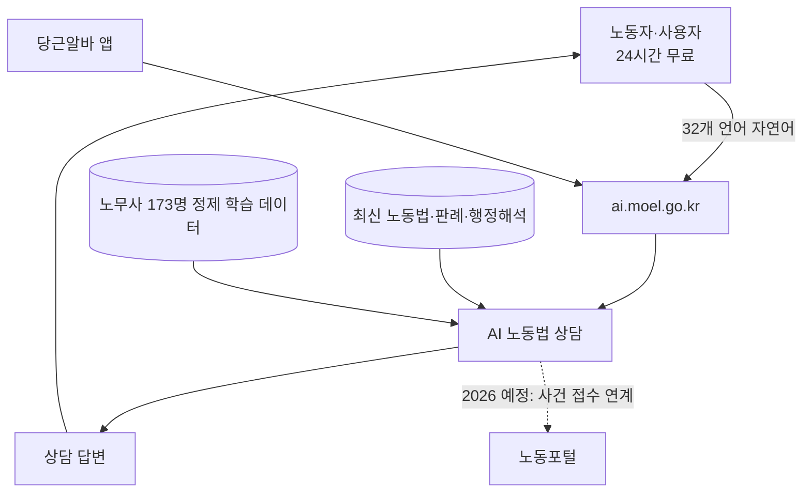

## Summary

대한민국 고용노동부의 **AI 노동법 상담** (ai.moel.go.kr) — 노동자·사용자가 24시간 무료로 노동법(임금·근로시간·실업급여 등) 상담 [[sources/korea-kr-policy-news-moel-2025]] [[sources/moel-ai-portal-2024-11]]. 2024년 (주)마음AI와 과기정통부 초거대 AI 사업으로 시제품 개발 → 2025-03 한국공인노무사회 MOU·노무사 173명 감수 → 2025-09-05 AX Summit에서 정식 운영 개시, 32개 언어 지원 [[sources/korea-kr-policy-news-moel-2025]] (포털은 2026-09 현재 34개 언어 표기 [[sources/moel-ai-portal-2024-11]]). ⚠️ 자사 보고(정부 발표): **2025년 누적 11.7만 건(117,000) 상담**, 검색 포털 대비 **노동법 정보 탐색 시간 87.5% 단축** (숙명여대 권순원 교수 비용·편익 분석), 이용자 37.7%가 야간·주말 접속 [[sources/moel-newsroom-117k-usage-2025]]. 한국 정부가 직접 운영하는 **노무 AI 표준 사례** — 한국 대기업 사내 ER 챗봇 reference.

## Problem / Why (도입 배경)

- **Before**: 고용노동부 대표전화 1350 (유료, 평일 09시~18시) [[sources/moel-ai-portal-2024-11]] 또는 검색 포털 이용 — 검색 포털 기준 노동법 정보 탐색 시간이 AI 대비 8배 (87.5% 단축의 역산) [[sources/moel-newsroom-117k-usage-2025]]
- **Pain point**:
  - **시간·접근성 한계**: 콜센터 평일 업무시간만 → 야간·주말 이용 수요 (실제 이용자 37.7%가 야간·주말 접속) [[sources/moel-newsroom-117k-usage-2025]]
  - **언어 장벽**: 외국인 노동자를 위해 32개 언어 지원으로 개선 [[sources/korea-kr-policy-news-moel-2025]]; 외국어 질의 비중 6.8% [[sources/moel-newsroom-117k-usage-2025]] (이주노동자 규모 수치는 인용 소스에 없음 — 2026-09-27 grounding 점검)
  - **노동법 복잡성**: 임금·근로시간·실업급여·퇴직금·해고예고수당 등 다양한 주제 [[sources/moel-ai-portal-2024-11]]
  - 유료 상담료 수치는 소스 미확보로 제거
- **Trigger**: 과기정통부 초거대 AI 서비스 개발 지원 사업 참여(마음AI와 시제품 개발) → 2025-09 '고용노동행정 AI 대전환(AX Summit)'에서 정식 운영 개시 [[sources/korea-kr-policy-news-moel-2025]]

## Solution Architecture

### A. Process (프로세스)

- **Before**: 대표전화 1350 (유료, 평일 09~18시) [[sources/moel-ai-portal-2024-11]] 또는 검색 포털 [[sources/moel-newsroom-117k-usage-2025]]
- **After**:
  1. 노동자·사용자가 ai.moel.go.kr 접속 (24시간, 무료, 32개 언어) [[sources/korea-kr-policy-news-moel-2025]] [[sources/moel-ai-portal-2024-11]] — 또는 '당근알바'(당근마켓) 앱에서 바로 이용 [[sources/korea-kr-policy-news-moel-2025]] [[sources/moel-newsroom-117k-usage-2025]]
  2. 자연어 질문 입력 (예시 Q&A: 실업급여·퇴직금·근로시간·해고예고수당·휴게시간) [[sources/moel-ai-portal-2024-11]]
  3. AI가 최신 노동법·판례·행정해석을 근거로 답변 [[sources/moel-ai-portal-2024-11]] — 출처 인용 형식 세부 _미공개_
  4. 2026년 계획: 근로계약서·임금명세서 분석, 권리 침해가 명백한 경우 노동포털 사건 접수 연계, 상담 범위 확대 (예산 28억 원) — **예정** [[sources/moel-newsroom-117k-usage-2025]]
  - 공인노무사 추천 연계·익명 로그 기반 정책 분석 서술은 인용 소스에 없어 제거 (2026-09-27 grounding 점검)
- **HITL**:
  - 현직 노무사 173명이 학습 데이터를 정제·감수해 정확도 확보 (사전 검수) [[sources/korea-kr-policy-news-moel-2025]] [[sources/moel-newsroom-117k-usage-2025]]
  - 개별 답변에 대한 실시간 인간 검토 여부 _미공개_
- **Frequency**: 24시간 상시 (야간·주말 접속 37.7%) [[sources/moel-newsroom-117k-usage-2025]]; 당근알바 탑재 후 일평균 251회 → 466회, 2026-01 일 1천 회 상회 [[sources/moel-newsroom-117k-usage-2025]]
- **Scope of autonomy**: assist (정보 제공) — 사건 접수 연계는 2026 계획 [[sources/moel-newsroom-117k-usage-2025]]

### B. System & Infrastructure (시스템·인프라)

- **Core platform**: 고용노동부 누리집 ai.moel.go.kr [[sources/korea-kr-policy-news-moel-2025]] [[sources/moel-ai-portal-2024-11]]
- **AI 시스템 배치**: (주)마음AI와 개발한 초거대 AI 기반 상담 시제품에서 출발 [[sources/korea-kr-policy-news-moel-2025]]; 호스팅·아키텍처 세부 _미공개_ (근로감독 AI 비서는 삼성SDS와 설계한 노동부 전용 클라우드에서 작동한다고 발표 [[sources/korea-kr-policy-news-moel-2025]] — 노동법 상담 서비스에의 적용 여부 미명시)
- **배포 환경**: _미공개 (not disclosed)_
- **연동·통합**: 당근마켓 '당근알바' 연동 [[sources/korea-kr-policy-news-moel-2025]] [[sources/moel-newsroom-117k-usage-2025]]; 2026년 노동포털 사건 접수 연계 예정 [[sources/moel-newsroom-117k-usage-2025]]
- **사용자 접점**: web (ai.moel.go.kr) [[sources/moel-ai-portal-2024-11]] + 당근 앱 [[sources/korea-kr-policy-news-moel-2025]]
- **인증·권한**: _미공개 (not disclosed)_
- **Multilingual**: 32개 언어 [[sources/korea-kr-policy-news-moel-2025]] (포털 표기 34개 [[sources/moel-ai-portal-2024-11]]); 실제 외국어 질의 상위: 러시아어 3.2%·미얀마어 1.3%·우즈베키스탄어 0.5% [[sources/moel-newsroom-117k-usage-2025]]

### C. Data (데이터)

- **입력 데이터**:
  - 최신 노동법·판례·행정해석 [[sources/moel-ai-portal-2024-11]]
  - 현직 노무사 173명이 정제한 학습 데이터 [[sources/moel-newsroom-117k-usage-2025]]
  - 구체 법령 목록·판례 범위 _미공개_
- **데이터 규모**: 2025년 상담 11.7만 건 [[sources/moel-newsroom-117k-usage-2025]]; 학습 데이터 규모 _미공개_
- **모델 구조**: _미공개 (not disclosed)_ — RAG/분류기 구성은 인용 소스에 없음
- **Data governance**: _미공개 (not disclosed)_ — 익명 사용·로그 정책 미명시. 근로감독 AI 비서는 개인정보 유출 우려 없는 전용 클라우드에서 작동한다고 발표 [[sources/korea-kr-policy-news-moel-2025]]

### D. Model (모델)

- **Foundation model**: _미공개 (not disclosed)_ — 시제품 개발사는 (주)마음AI [[sources/korea-kr-policy-news-moel-2025]]; 기반 모델명 미공개
- **Customization**: 노무사 173명의 학습 데이터 정제로 환각 최소화 ⚠️ 자사 보고 [[sources/moel-newsroom-117k-usage-2025]]; fine-tuning/RAG 여부 _미공개_
- **Guardrails**: _미공개 (not disclosed)_ — 법률 자문 면책 고지 방식 미확인

### E. Organization & Team (조직·팀 구조)

- **오너십**: 고용노동부 [[sources/korea-kr-policy-news-moel-2025]] [[sources/moel-newsroom-117k-usage-2025]]; 한국고용정보원 운영 서술은 인용 소스에 없어 제거
- **참여 역할**: (주)마음AI (시제품 개발, CTO 이형용 시연) [[sources/korea-kr-policy-news-moel-2025]], 한국공인노무사회 노무사 173명 지원단 (감수·데이터 정제) [[sources/korea-kr-policy-news-moel-2025]] [[sources/moel-newsroom-117k-usage-2025]], 당근마켓 (채널 제휴) [[sources/korea-kr-policy-news-moel-2025]]
- **거버넌스**: 2025-03 한국공인노무사회 업무협약 [[sources/korea-kr-policy-news-moel-2025]]; 정기 정확도 audit 여부 _미공개_
- **파트너**: 과기정통부 초거대 AI 서비스 개발 지원 사업 [[sources/korea-kr-policy-news-moel-2025]]

### F. Diagrams (도식)

```mermaid
flowchart TB
    User[노동자·사용자<br/>24시간 무료] -->|32개 언어 자연어| Portal[ai.moel.go.kr]
    Danggeun[당근알바 앱] --> Portal
    Portal --> AI[AI 노동법 상담]
    Law[(최신 노동법·판례·행정해석)] --> AI
    Train[(노무사 173명 정제 학습 데이터)] --> AI
    AI --> Answer[상담 답변]
    Answer --> User
    AI -.->|"2026 예정: 사건 접수 연계"| MOEL[노동포털]
```

범례: 실선 = 고용노동부 발표·정책브리핑·포털 확인 (정부 자사 보고). 점선 = 2026년 계획. 노무사 연계·익명 로그 정책 분석 노드는 소스 미확인으로 제거 (2026-09-27).

## Impact / Metrics (기대효과)

### 기대효과 요약
**한국 정부 직접 운영 노무 AI 표준 사례**. 수치는 모두 정부 자체 발표(⚠️ 자사 보고 성격, Tier 4 government) — 독립 검증 없음. 한국 대기업 사내 ER/노무 챗봇 도입 시 인용.

| 지표 | 값 | 출처 | 성격 |
|---|---|---|---|
| **누적 상담 (2025)** | **11.7만 건** | [[sources/moel-newsroom-117k-usage-2025]] | ⚠️ 자사 보고 (정부 발표) |
| **정보 탐색 시간 단축** | **87.5%** (검색 포털 대비; 권순원 교수 비용·편익 분석) | [[sources/moel-newsroom-117k-usage-2025]] | ⚠️ 자사 보고 (정부 위탁 연구) |
| **일평균 이용** | 251회 → 466회 (당근알바 탑재 후, 85.7%↑); 2026-01 일 1천 회 상회 | [[sources/moel-newsroom-117k-usage-2025]] | ⚠️ 자사 보고 |
| **야간·주말 접속 비중** | **37.7%** | [[sources/moel-newsroom-117k-usage-2025]] | ⚠️ 자사 보고 |
| **외국어 질의 비중** | 6.8% (러시아어 3.2%·미얀마어 1.3%·우즈베키스탄어 0.5%) | [[sources/moel-newsroom-117k-usage-2025]] | ⚠️ 자사 보고 |
| **지원 언어 수** | **32개** (2025-09) / 34개 (포털 2026-09 표기) | [[sources/korea-kr-policy-news-moel-2025]] [[sources/moel-ai-portal-2024-11]] | ✅ Fact (정부 공식) |
| **정식 운영 개시** | 2025-09-05 (AX Summit) — 시범 출시 시점 세부 _미공개_ | [[sources/korea-kr-policy-news-moel-2025]] | ✅ Fact |
| **공인노무사회 MOU** | 2025-03, 노무사 173명 감수 | [[sources/korea-kr-policy-news-moel-2025]] [[sources/moel-newsroom-117k-usage-2025]] | ✅ Fact |
| **2026 예산** | 28억 원 (서류 분석·사건 접수 연계 확대) | [[sources/moel-newsroom-117k-usage-2025]] | ✅ Fact (계획) |

## Governance & Risk

- ✅ 정부 직접 운영 [[sources/korea-kr-policy-news-moel-2025]] [[sources/moel-newsroom-117k-usage-2025]]; 법적 책임·면책 고지 방식 _미공개_
- 익명 사용·개인정보 처리 정책 _미공개_ — 근로감독 AI 비서만 전용 클라우드 운영이 명시됨 [[sources/korea-kr-policy-news-moel-2025]]
- ✅ 공인노무사회 협업 → 노무사 173명이 학습 데이터 정제·감수 [[sources/korea-kr-policy-news-moel-2025]] [[sources/moel-newsroom-117k-usage-2025]]
- ⚠️ LLM 환각 risk — 정부는 노무사 데이터 정제로 환각 최소화를 주장 [[sources/moel-newsroom-117k-usage-2025]]; 독립 정확도 평가 _미공개_
- ⚠️ 외국인 노동자 32개 언어 지원이지만 LLM 다국어 정확도 일부 언어에서 낮을 수 있음 (특히 미얀마어·캄보디아어·필리핀어 등 low-resource 언어)

## Contradictions

> [!note] 2026-09-27 grounding — 인용 소스에 없는 이주노동자 규모 수치, 노무사 상담료 5만원, 노동법 조문·판례 corpus 목록, RAG 구조, 공인노무사 추천 연계, 익명 로그 정책 분석, 한국고용정보원 운영, 국내 LLM 추정을 제거·_미공개_ 처리. '상담 시간 87.5% 단축'은 raw 기준 '노동법 정보 탐색 시간 87.5% 단축'으로 정정. 지원 언어 수는 2025-09 보도 32개 [[sources/korea-kr-policy-news-moel-2025]] vs 포털 현재 34개 [[sources/moel-ai-portal-2024-11]] — 시점 차이. '2024-11 시범 출시'는 인용 소스 본문에 없어 표에서 정식 운영 개시(2025-09-05)로 대체.

## Consulting Angle

- **한국 대기업 사내 ER/노무 AI 챗봇 도입 시 #1 reference**:
  - "정부도 한다" 카드 — CHRO·법무·노무팀 보수성 극복에 효과적
  - 정부 사례 정량 metric (11.7만 건 사용, 정보 탐색 시간 87.5% 단축, 37.7% 야간·주말) — 한국 대기업 사내 챗봇 ROI 시뮬레이션 base (정부 자체 발표임을 병기)
- **vs HR Acuity** [[hr-acuity-oliver-ai-er-companion]] / Sodales [[sodales-spire-energy-labor-relations]]:
  - 정부 사례: **개별 노무자 상담** (B2C 성격, 정보 제공)
  - HR Acuity: 사내 ER **case management** (B2B, investigation·documentation)
  - Sodales: 사내 **단체노사 grievance** (B2B, CBA·다중 노조)
  - 보완 관계 — 정부 사례는 사내 챗봇의 학습 reference, HR Acuity는 case management, Sodales는 노조 운영
- **외국인 노동자 32개 언어 지원** = 한국 대기업 (제조·유통·F&B의 외국인 비중 높은 사업장 — 삼성SDS 인도, 현대차 인도네시아, LG화학 베트남 등) **사내 다국어 노무 챗봇** 모델 reference
- **2026 Q3-Q4 컨설팅 deck**:
  - "한국 대기업 ER/노무 AI 도입 3-tier 모델": 정부 노동법 챗봇 (학습) + 사내 ER case management (HR Acuity·Sodales) + 익명 신고 (Vault·AllVoices)
- **확장 가능성**: 정부가 향후 사용 데이터 기반 **노동법 trend 보고서** 발간 시 한국 노동시장 정책 input의 핵심 source — 컨설팅 시 정기 monitoring 권장
- **Watch list**: 정부 2026~2027 사용 통계 갱신·공인노무사회 협업 확장·기업용 API 공개 (가능성) 시 confidence 재조정
