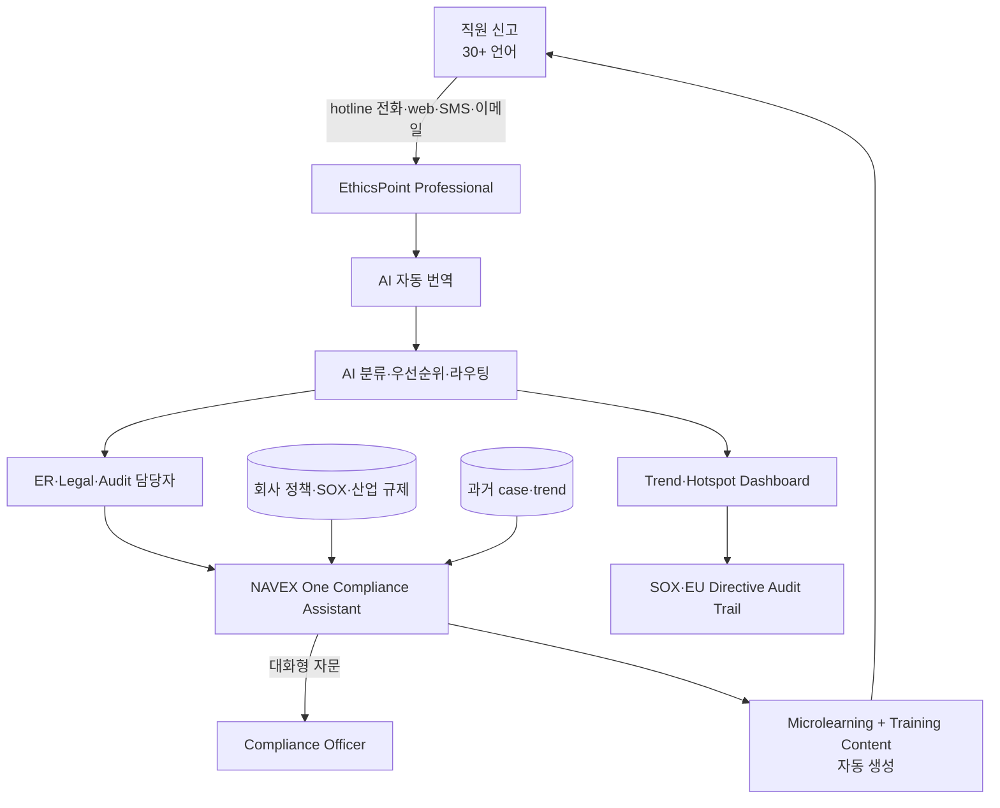

## Summary

NAVEX Global은 **글로벌 whistleblowing·compliance 시장 표준** — 13,000+ 조직 사용 (Fortune 100 다수). 2025년 12월 **NAVEX One Compliance Assistant (NCA)** 메이저 AI 확장 발표 — 대화형 compliance 자문 + 기계 번역 + microlearning + AI training content 통합. EthicsPoint Professional은 SOX·EU Whistleblower Protection Directive·다국어 신고 표준. AI 분류·우선순위·라우팅·요약 자동화로 case 처리 가속. HR Acuity·Vault Platform과 함께 ER/whistleblowing AI 4-vendor 비교군.

## Problem / Why (도입 배경)

- **Before**: NAVEX EthicsPoint은 1990년대부터 hotline service의 사실상 표준 — 2024년까지는 신고 intake·case 분류는 사람이 처리, AI 분석·자동 번역 부분적
- **Pain point**:
  - **다국어 신고 처리 시간**: 글로벌 enterprise 30+ 언어 신고 → 사람 번역사 처리 시간 over-burden
  - **Case 분류·라우팅 지연**: 1건씩 사람이 분류 → 우선순위 case 누락 risk
  - **컴플라이언스 training content 노화**: 정책 변경 시 training material 갱신 수작업
  - **대화형 자문 부재**: 컴플라이언스 담당자가 정책 question 시 검색 수작업
- **Trigger**: GenAI 시대 + HR Acuity·AllVoices·Vault 등 AI-native 신생 경쟁자 등장 → NAVEX의 AI 확장 필요. 2025-12 NCA 발표

## Solution Architecture

### A. Process (프로세스)

- **Before**: 직원 hotline 신고 → 사람 번역 → HR/legal 분류 → case 처리 → 분기 trend 보고서. Compliance training material 수작업 갱신
- **After (NCA + EthicsPoint AI architecture)**:
  1. 직원이 EthicsPoint hotline (전화·web·SMS) 익명 신고 — 30+ 언어
  2. AI 자동 번역 → 영어·통합 언어로 normalize
  3. AI classification: case type (harassment·fraud·SOX·safety) + severity + urgency 자동 분류
  4. AI routing: case를 적절한 ER·legal·internal audit 담당자에 자동 라우팅 + summary 제공
  5. **NAVEX One Compliance Assistant (NCA)**: 컴플라이언스 담당자가 자연어로 정책 query → AI 답변 (회사 handbook + 산업 규제 + NAVEX 표준 corpus)
  6. AI가 microlearning content + training material 자동 생성·갱신 (정책 변경 시)
  7. Trend·hotspot dashboard + SOX·EU Directive 컴플라이언스 audit trail
- **HITL**: ER·legal·compliance officer가 모든 case 결정·resolution 진행. AI는 분류·번역·요약·자문·content 생성만
- **Frequency**: 24/7 익명 신고 + daily case 처리 + 분기 SOX/regulatory audit
- **Scope of autonomy**: assist + automate (분류·번역·라우팅·content 자율, 결정·조치는 사람)

### B. System & Infrastructure (시스템·인프라)

- **Core platform**: NAVEX One (글로벌 GRC SaaS)
- **AI 시스템 배치**: NCA (Compliance Assistant) + EthicsPoint AI (intake·routing) — 모두 platform 내장
- **연동**: HRIS (Workday·SAP), GRC (audit·risk), training LMS
- **사용자 접점**: hotline 전화·web·mobile·SMS·이메일 (다국어), 컴플라이언스 담당자 dashboard
- **인증**: 익명 + RBAC + SOC 2

### C. Data (데이터)

- **입력 데이터**:
  - Hotline 신고 내용 (30+ 언어)
  - 회사 정책·handbook·정관·SOX 통제
  - 산업 규제 corpus (NAVEX 자체 maintained)
  - 과거 case 이력
- **모델 구조**: LLM (NCA·번역·요약) + classification (case type·severity·routing) + 생성 (training content·microlearning)
- **Data governance**:
  - SOC 2, GDPR, EU Whistleblower Directive
  - 익명 보호·anti-retaliation
  - SOX·HIPAA 등 산업별 표준 대응

### D. Model (모델)

- **Foundation model**: _구체 LLM provider 미공개_ (NAVEX enterprise stack)
- **Customization**: ethics·compliance·SOX 도메인 fine-tuning + 30+ 언어
- **Guardrails**: 결정 도출 금지·사람 검토 강제 (whistleblowing 표준)

### E. Organization & Team (조직·팀 구조)

- **오너십**: NAVEX Global 벤더 — 고객은 13K+ 조직 (Fortune 100 다수)
- **거버넌스**: 1990년대부터 hotline 표준 → 글로벌 enterprise 신뢰 base. SOX·EU Directive 컴플라이언스 이력

### F. Diagrams (도식)

범례: 모든 연결 ⚠️ NAVEX 공식 + 2025-12 NCA 발표 (Mondaq Tier 4 보도) 기반.

## Impact / Metrics (기대효과)

### 기대효과 요약
**13K+ 조직 사용 글로벌 표준** — SOX·EU Whistleblower Directive·다국어 신고의 사실상 default. 2025-12 NCA 발표로 AI-native 시대 대응. ⚠️ customer outcome metric은 NAVEX 자사 발표.

| 지표 | 값 | 출처 | 성격 |
|---|---|---|---|
| 사용 조직 수 | **13,000+** | NAVEX 공식 | ⚠️ 벤더 주장 (다수 매체 인용) |
| NCA 발표 | 2025-12 | NAVEX + Mondaq 보도 | ✅ Fact (Tier 4) |
| 지원 언어 | 30+ (intake), 100+ (자동 번역) | NAVEX 공식 | ⚠️ 벤더 주장 |
| 컴플라이언스 표준 | SOX, EU Whistleblower Directive, GDPR, HIPAA | NAVEX 공식 | ✅ Fact |
| 산업 reference | Fortune 100 다수 (구체 명단 부분 비공개) | NAVEX 공식 | ✅ Fact (logo 공개) |

## Governance & Risk

- ✅ **글로벌 whistleblowing 표준** — 1990년대부터 운영, SOX·EU Directive 사실상 default vendor
- ✅ 13K+ 조직 사용 → 시장 검증 + 산업 best practice 누적
- ⚠️ NCA는 **2025-12 신규 발표** — 실 deployment customer reference·effectiveness metric 미공개 (2026-05 기준)
- ⚠️ HR Acuity·Vault·AllVoices 같은 AI-native 경쟁자 대비 NAVEX의 AI integration이 후발 — 통합 architecture는 검증 필요
- ⚠️ 한국 적용 시:
  - 한국 customer reference _부분 미공개_
  - 한국어 LLM 정확도 검증 필요
  - PIPA + 직장 내 괴롭힘 금지법 + 노조 fit customization 필요

## Consulting Angle

- **글로벌 whistleblowing 표준** — 한국 대기업 SOX 대응·EU 진출 시 default option. "13K+ 조직이 사용한다" — 보수적 CHRO에게 가장 안정적 선택
- **vs 4-vendor 비교**:
  - **HR Acuity** [[hr-acuity-oliver-er-companion]]: ER case management 전문 (G2 #1, Brandon Hall Gold)
  - **AllVoices** [[allvoices-vera-ai-er-copilot]]: AI-native, 200+ 언어, Vera AI copilot
  - **Vault Platform (Diligent)** [[diligent-vault-active-integrity-speakup]]: GRC 통합 + 집단 신고 + EthicsChat
  - **NAVEX**: 글로벌 whistleblowing 표준 + SOX·EU Directive (보수적 선택)
- **선택 가이드**:
  - 보수적 + SOX·EU 의무 강함 → NAVEX
  - ER case management 운영 효율 → HR Acuity
  - AI-native + 다국어 → AllVoices
  - GRC·board governance 통합 → Diligent Vault
- **NCA의 기대효과**: 컴플라이언스 담당자 자문 + microlearning content 자동 생성 → 한국 대기업 SOX/RCMS·산업안전 컴플라이언스 training 자동화 reference
- **한국 적용 한계**:
  - 한국 SOX·내부통제 (회계기준원·금감원) customization 필요
  - 한국 산업별 규제 (반도체·금융·바이오 등) corpus 보강 필요
  - 한국 customer reference 부분적 — POC 시 정확도·언어·규제 fit 검증
- **2026 Q3-Q4 컨설팅 deck**:
  - "한국 대기업 ER/Compliance AI 4-vendor 비교": HR Acuity (성숙) vs AllVoices (AI-native) vs Vault (GRC 통합) vs NAVEX (whistleblowing 표준)
- **Watch list**: NCA 한국 customer reference·Forrester Wave 등재·NAVEX 한국 진출 가시화 시 confidence 재조정
