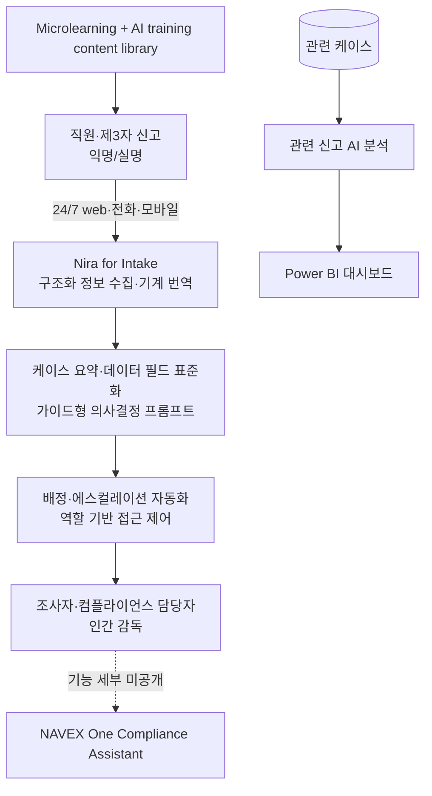

## Summary

NAVEX는 통합 risk·compliance 관리 벤더 — ⚠️ 벤더 주장: 13,000개 조직(Fortune 100·500의 75%) 사용 [[sources/navex-one-compliance-assistant-2025-12]] [[sources/navex-ethicspoint-product-page]]. 지난 1년간 **NAVEX One Compliance Assistant (NCA)**·기계 번역·통합 microlearning·AI training content library를 출시했고, 2025-12-15 NAVEX One 플랫폼 전반의 AI 확장을 발표 — Whistleblowing 및 Incident & Case Management에 유연한 접수, 스마트 케이스 요약·데이터 필드 표준화, 가이드형 의사결정 프롬프트, 다국어 접근 추가(인간 감독 유지) [[sources/navex-one-compliance-assistant-2025-12]] (Mondaq 게재본 [[sources/mondaq-navex-ai-expansion-2025-12]]는 동일 보도자료). EthicsPoint Professional은 다국적 규제 대응용 AI 기반 내부고발·사건 관리 SW로 포지셔닝 [[sources/navex-ethicspoint-product-page]]. HR Acuity·Vault Platform과 함께 ER/whistleblowing AI 4-vendor 비교군.

## Problem / Why (도입 배경)

- **Before**: 벤더 제품이므로 특정 기업의 도입 배경은 고객별 상이. 🚫 일반론: 내부고발 접수·번역·분류·조사 문서화의 수작업 부담. NAVEX 연혁(1990년대 등)·도입 전 수치는 인용 소스에 없음 → ❓ 미공개
- **Pain point** (벤더 제품 페이지의 문제 설정 기준 ⚠️ 벤더 주장 [[sources/navex-ethicspoint-product-page]]): 다국적 규제 대응, 접수·조사 효율(streamlined intake and investigation), 관련 케이스·반복 행동 파악, 감사 대응 데이터
- **Trigger**: NAVEX의 AI 확장 발표 (2025-12-15) — CPO Kevin Haugh: "AI is no longer an add-on" [[sources/navex-one-compliance-assistant-2025-12]] [[sources/mondaq-navex-ai-expansion-2025-12]]; 경쟁자 대응 서술은 소스 미확보

## Solution Architecture

### A. Process (프로세스)

- **Before**: _미공개 (not disclosed)_ — 도입 전 프로세스는 인용 소스에 없음
- **After (벤더 발표 기능)** ⚠️ 벤더 주장:
  1. 직원·제3자(계약자·공급업체 포함)가 24/7 web·전화·모바일로 익명 또는 실명 신고 [[sources/navex-ethicspoint-product-page]]
  2. 'Nira for Intake' AI 어시스턴트가 구조화된 정보 수집을 안내, 다국어 지원·기계 번역 [[sources/navex-ethicspoint-product-page]]
  3. 스마트 케이스 요약·데이터 필드 표준화, 가이드형 의사결정 프롬프트 [[sources/navex-one-compliance-assistant-2025-12]]
  4. 배정·에스컬레이션 자동화, 지역별 커스텀 워크플로 [[sources/navex-ethicspoint-product-page]]
  5. **NAVEX One Compliance Assistant (NCA)** — 기능 세부(자문 범위·참조 corpus) _미공개_ [[sources/navex-one-compliance-assistant-2025-12]]
  6. 통합 microlearning + AI training content library [[sources/navex-one-compliance-assistant-2025-12]]
  7. 관련 신고 AI 분석(반복 행동 파악), Power BI 대시보드 [[sources/navex-ethicspoint-product-page]]
  - case type 자동 분류(harassment·fraud 등)·SOX 감사 추적 서술은 인용 소스에 없어 제거 (2026-09-27)
- **HITL**: "always with human oversight at the center" [[sources/navex-one-compliance-assistant-2025-12]]; 역할 기반 접근 제어로 관련 당사자의 민감 정보 접근 차단 [[sources/navex-ethicspoint-product-page]]
- **Frequency**: 24/7 접수 [[sources/navex-ethicspoint-product-page]]; 처리 주기 _미공개_
- **Scope of autonomy**: assist + 배정·에스컬레이션 자동화 [[sources/navex-ethicspoint-product-page]]; 결정은 사람 [[sources/navex-one-compliance-assistant-2025-12]]

### B. System & Infrastructure (시스템·인프라)

- **Core platform**: NAVEX One [[sources/navex-one-compliance-assistant-2025-12]]
- **AI 시스템 배치**: NCA·기계 번역·microlearning·AI training content (NAVEX One 내장) [[sources/navex-one-compliance-assistant-2025-12]]; Nira for Intake (EthicsPoint Professional) [[sources/navex-ethicspoint-product-page]]
- **배포 환경**: _미공개 (not disclosed)_
- **연동**: HR·risk·정책 시스템 연동 ⚠️ 벤더 주장 [[sources/navex-ethicspoint-product-page]]; 구체 HRIS 벤더명(Workday·SAP 등) _미공개_
- **사용자 접점**: web·전화·모바일 신고 채널 [[sources/navex-ethicspoint-product-page]]; Power BI 대시보드 [[sources/navex-ethicspoint-product-page]]
- **인증·권한**: 역할 기반 접근 제어 [[sources/navex-ethicspoint-product-page]]; 익명/실명 신고 [[sources/navex-ethicspoint-product-page]]; SOC 2 등 인증 _미공개_

### C. Data (데이터)

- **입력 데이터**:
  - 신고 내용 (다국어, 기계 번역) [[sources/navex-ethicspoint-product-page]]
  - 관련 케이스 이력 (반복 행동 분석용) [[sources/navex-ethicspoint-product-page]]
  - 정책·규제 corpus 구성 _미공개 (not disclosed)_
- **데이터 규모**: "industry's richest data set" ⚠️ 벤더 주장 [[sources/navex-one-compliance-assistant-2025-12]]; 수치 _미공개_
- **모델 구조**: _미공개 (not disclosed)_ — 요약·번역·의사결정 프롬프트·콘텐츠 생성 기능만 발표 [[sources/navex-one-compliance-assistant-2025-12]]
- **Data governance**: 책임 있는 AI 개발 원칙(투명성·거버넌스·고객 신뢰) ⚠️ 벤더 주장 [[sources/navex-one-compliance-assistant-2025-12]]; 익명 신고 [[sources/navex-ethicspoint-product-page]]; GDPR·SOC 2·SOX·HIPAA 등 구체 인증·규제 대응 _미공개_

### D. Model (모델)

- **Foundation model**: _미공개 (not disclosed)_
- **Customization**: _미공개 (not disclosed)_ — fine-tuning·언어 수 서술은 인용 소스에 없어 제거
- **Guardrails**: 인간 감독 중심, 각 기능을 엄격히 검증한다고 발표 ⚠️ 벤더 주장 [[sources/navex-one-compliance-assistant-2025-12]]

### E. Organization & Team (조직·팀 구조)

- **오너십**: NAVEX 벤더 — 고객 13,000개 조직 ⚠️ 벤더 주장 [[sources/navex-one-compliance-assistant-2025-12]]; 고객사 측 운영 조직은 고객별 상이
- **참여 역할**: NAVEX CPO Kevin Haugh (AI 전략 발언) [[sources/navex-one-compliance-assistant-2025-12]]
- **거버넌스**: 책임 있는 AI 개발 원칙 ⚠️ 벤더 주장 [[sources/navex-one-compliance-assistant-2025-12]]; 연혁·규제 이력 서술은 소스 미확보로 제거

### F. Diagrams (도식)

```mermaid
flowchart TB
    Emp[직원·제3자 신고<br/>익명/실명] -->|24/7 web·전화·모바일| Nira[Nira for Intake<br/>구조화 정보 수집·기계 번역]
    Nira --> Case[케이스 요약·데이터 필드 표준화<br/>가이드형 의사결정 프롬프트]
    Case --> Route[배정·에스컬레이션 자동화<br/>역할 기반 접근 제어]
    Route --> Investigator[조사자·컴플라이언스 담당자<br/>인간 감독]
    Past[(관련 케이스)] --> Related[관련 신고 AI 분석]
    Related --> Dashboard[Power BI 대시보드]
    Investigator -.->|"기능 세부 미공개"| NCA[NAVEX One Compliance Assistant]
    Training[Microlearning + AI training content library] --> Emp
```

범례: 실선 = NAVEX 보도자료(2025-12)·제품 페이지 확인 (⚠️ 벤더 주장, Tier 3). 점선 = 기능 세부 미공개. Mondaq 게재본은 동일 보도자료로 별개 근거 아님.

## Impact / Metrics (기대효과)

### 기대효과 요약
⚠️ 벤더 주장: 13,000개 조직 사용, 다국적 규제 대응 포지셔닝. 고객 outcome metric은 벤더 가정 기반 마케팅 수치만 존재 — 독립 검증 _미공개_.

| 지표 | 값 | 출처 | 성격 |
|---|---|---|---|
| 사용 조직 수 | **13,000** (Fortune 100·500의 75%) | [[sources/navex-one-compliance-assistant-2025-12]] [[sources/navex-ethicspoint-product-page]] | ⚠️ 벤더 주장 |
| NCA 출시·확장 | NCA는 지난 1년 내 출시(별도 2024-03 보도자료), 2025-12-15 AI 확장 발표 | [[sources/navex-one-compliance-assistant-2025-12]] [[sources/mondaq-navex-ai-expansion-2025-12]] | ✅ Fact (벤더 보도자료, Tier 3) |
| ROI | 최대 9x ROI, 7,505시간 절감 (6,000명 조직·연 100건 가정) | [[sources/navex-ethicspoint-product-page]] | ⚠️ 벤더 주장 (가정 기반 마케팅 수치) |
| 지원 언어 | _미공개_ (수치 근거 미확보 — 2026-09-27 grounding 점검) | — | — |
| 컴플라이언스 표준 | "다국적 규제 요건 대응" — 구체 규제명(SOX·EU Directive 등) _미공개_ | [[sources/navex-ethicspoint-product-page]] | ⚠️ 벤더 주장 |

## Governance & Risk

- ⚠️ 13,000개 조직 사용은 벤더 주장 [[sources/navex-one-compliance-assistant-2025-12]] — 독립 시장 검증(Forrester Wave 등) _미공개_
- ⚠️ 인간 감독·책임 있는 AI 원칙은 벤더 발표 [[sources/navex-one-compliance-assistant-2025-12]] — 감사·검증 결과 미공개
- ⚠️ NCA·AI 확장 기능의 customer reference·effectiveness metric 미공개; 제품 페이지 ROI는 가정 기반 [[sources/navex-ethicspoint-product-page]]
- ⚠️ 세 소스 모두 NAVEX 자사 자료(보도자료 2건은 동일 본문) — 독립 소스 0건
- ⚠️ HR Acuity·Vault·AllVoices 같은 AI-native 경쟁자 대비 NAVEX의 AI integration이 후발 — 통합 architecture는 검증 필요
- ⚠️ 한국 적용 시:
  - 한국 customer reference _부분 미공개_
  - 한국어 LLM 정확도 검증 필요
  - PIPA + 직장 내 괴롭힘 금지법 + 노조 fit customization 필요

## Contradictions

> [!note] 2026-09-27 grounding — 인용 소스에 없는 1990년대 연혁, 30+/100+ 언어, SOX·EU Whistleblower Directive·GDPR·HIPAA·SOC 2 준수, Workday·SAP 연동, case type 자동 분류, 도메인 fine-tuning 서술을 제거·_미공개_ 처리. Mondaq 게재본은 NAVEX 보도자료와 동일 본문(Tier 3)이므로 독립 근거로 세지 않음. 'Fortune 100 다수'는 raw 표기 'Fortune 100·500의 75%'로 정정.

## Consulting Angle

- **대형 설치 기반 벤더** — "13,000개 조직이 사용한다"(벤더 주장)는 보수적 CHRO에게 안정적 선택지로 제시 가능; 구체 규제 대응 범위는 RFP에서 확인
- **vs 4-vendor 비교**:
  - **HR Acuity** [[hr-acuity-oliver-ai-er-companion]]: ER case management 전문 (G2 #1, Brandon Hall Gold)
  - **AllVoices** [[allvoices-vera-ai-er-copilot]]: AI-native, 200+ 언어, Vera AI copilot
  - **Vault Platform (Diligent)** [[diligent-vault-active-integrity-speakup]]: GRC 통합 + 집단 신고 + EthicsChat
  - **NAVEX**: 대형 설치 기반 + 다국적 규제 대응 포지셔닝 (보수적 선택, 벤더 주장)
- **선택 가이드**:
  - 보수적 + 다국적 규제 대응 필요 → NAVEX (규제별 지원 범위는 확인 필요)
  - ER case management 운영 효율 → HR Acuity
  - AI-native + 다국어 → AllVoices
  - GRC·board governance 통합 → Diligent Vault
- **NCA의 기대효과**: 컴플라이언스 담당자 자문 + microlearning content 자동 생성 → 한국 대기업 SOX/RCMS·산업안전 컴플라이언스 training 자동화 reference
- **한국 적용 한계**:
  - 한국 SOX·내부통제 (회계기준원·금감원) customization 필요
  - 한국 산업별 규제 (반도체·금융·바이오 등) corpus 보강 필요
  - 한국 customer reference 부분적 — POC 시 정확도·언어·규제 fit 검증
- **2026 Q3-Q4 컨설팅 deck**:
  - "한국 대기업 ER/Compliance AI 4-vendor 비교": HR Acuity (성숙) vs AllVoices (AI-native) vs Vault (GRC 통합) vs NAVEX (대형 설치 기반)
- **Watch list**: NCA 한국 customer reference·Forrester Wave 등재·NAVEX 한국 진출 가시화 시 confidence 재조정
