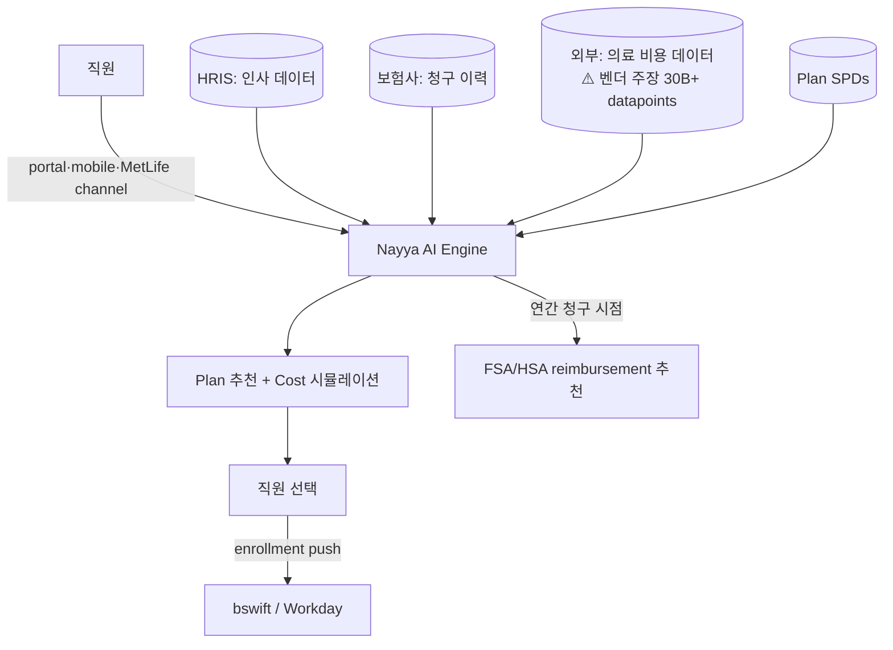

## Summary

Nayya는 2019년 설립 미국 startup, **AI 기반 복리후생 의사결정 지원 platform**. 직원이 OE(Open Enrollment) 시점에 의료·치과·생명·voluntary plan을 선택할 때 **개인 청구이력·소득·가족 구성을 분석해 plan별 예상 본인부담을 시뮬레이션**, 최적 plan 추천. 2023년 10월 **MetLife 전략적 파트너십** — MetLife가 1,000+ employer에 Nayya solution을 exclusive 채널로 제공. 2024년 ADP·Workday Ventures 추가 strategic 라운드. ⚠️ 자사 보고: 평균 직원 $1,200 연간 절감.

> ⚠️ **Funding 정정 필수**: 일부 자료(PwC 컨설팅 문서 포함)에서 "$55M Series B (2022)"로 기술되나, 실제로는 **$55M Series C (2022-03)** + **$37M Series B (2021-06)**. 컨설팅 deck에 인용 시 정정.

## Problem / Why

- **Before**: 미국 직원이 OE 시즌에 plan 선택 — 평균 17분 소요, 의료 plan만 5~10개 옵션, voluntary benefit (accident·hospital·critical illness·disability)은 추가 5~15개. 정보 비대칭으로 직원이 "안전하게" 비싼 PPO 선택 → 본인부담 over-pay
- **Pain point**: 직원당 plan mismatch로 연 평균 $750~$1,500 over-pay (Nayya 자사 조사). voluntary benefit 가입율 낮음 (직원 정보 부족)
- **Trigger**: 미국 의료비 인플레이션 + HDHP/HSA 채택 증가 → 직원이 "올바른 선택"하기 어려운 환경 → AI 추천 수요

## Solution Architecture

### A. Process

- **Before**: HR이 plan 비교 PDF 배포 → 직원이 1년에 1번 30분 안에 선택 → 1년 후 청구 후 후회
- **After (벤더 발표 architecture)**:
  1. 직원이 Nayya portal·MetLife channel 로그인
  2. **데이터 통합**: 직원이 본인 정보 (가족 구성·예상 의료 사용·소득) + Nayya가 보유한 외부 데이터 (지역 의료 비용·청구 패턴) 결합
  3. AI engine이 **plan별 expected total cost** (premium + deductible + copay + 본인부담) 시뮬레이션
  4. 의료·치과·생명·voluntary plan별 **개인화 추천 ranking** + 추천 이유 자연어 설명
  5. 직원이 선택 → bswift 등 enrollment platform으로 자동 push
  6. 1년 후 청구 시점 → Nayya가 청구 자동 추적·HSA·FSA reimbursement 추천
- **HITL**: 직원 본인이 모든 결정 — Nayya는 추천만
- **Frequency**: annual (OE 시즌) + 청구 시점 (수시)
- **Scope of autonomy**: recommend-only

### B. System & Infrastructure

- **Core**: Nayya SaaS platform (cloud-hosted, _구체 hyperscaler 미공개_)
- **사용자 접점**: web portal, mobile app, embedded in MetLife portal·bswift enrollment platform
- **연동**: MetLife channel partner, bswift (enrollment), Mercer (broker), ADP·Workday (HRIS)
- **인증**: SSO via employer IdP

### C. Data

- **입력 데이터**:
  - 직원 청구 이력 (carrier integration)
  - 직원 demographic (HRIS)
  - 외부 의료 비용 데이터 (Nayya가 보유: 30B+ external data points + 200M claim data — ⚠️ 벤더 주장)
  - Plan documents (employer SPD)
- **모델 구조**: 추천 모델 (collaborative filtering + cost prediction) + LLM (자연어 설명)
- **Data governance**: HIPAA 준수, _구체 retention 정책 미공개_

### D. Model

- **Foundation model**: _구체 LLM provider·버전 미공개_
- **추천 모델**: cost prediction + collaborative filtering 조합 (_구체 architecture 미공개_)
- **Customization**: domain-specific (US 의료 plan 구조)

### E. Organization & Team

- **오너십**: Nayya 벤더 — employer/broker가 SaaS 구매
- **파트너 채널**: MetLife (2023-10 전략적 파트너), bswift (enrollment), Mercer (broker), ADP·Workday Ventures (투자자)
- **참여 역할**: Nayya AI 팀 + 고객 HR/Benefits 팀 + broker (Mercer 등)

### F. Diagrams

범례: 모든 연결 ⚠️ 벤더 발표·자사 자료 기반. Tier 1·2 독립 검증 0건.

## Impact / Metrics (기대효과)

### 기대효과 요약
복리후생 plan 선택을 **추천 시스템화** — 직원 stress 감소·본인부담 최적화·voluntary benefit 가입율 증가 효과 주장. ⚠️ 모든 metric은 Nayya 자사 또는 고객 자사 보고.

| 지표 | 값 | 출처 | 성격 |
|---|---|---|---|
| Series C funding | **$55M (2022-03)** | TechCrunch 2022-03 | ✅ Fact (Tier 2 미디어) |
| Series B funding | $37M (2021-06) | Nayya 공식 blog | ✅ Fact |
| MetLife 채널 employer 규모 | **1,000+** | MetLife newsroom 2023-10 | ⚠️ 자사 보고 (보험사 발표) |
| 외부 데이터 규모 | 30B datapoints + 200M 청구 | Nayya 자사 marketing | ⚠️ 벤더 주장 |
| 직원 평균 연간 절감 | **$1,200** | Nayya 자사 자료 | ⚠️ 벤더 주장 (산정 방법론 _미공개_) |
| Just Global voluntary benefit 증가 | +40% | Nayya 자사 case study | ⚠️ 자사 보고 |
| 누적 payroll tax 절감 (HSA/FSA) | $17M | Nayya 자사 자료 | ⚠️ 벤더 주장 |
| 직원 만족도 | 85% | Nayya 자사 자료 | ⚠️ 벤더 주장 |

## Governance & Risk

- ⚠️ **Funding 라운드 정정 필수**: $55M = Series C(2022-03), Series B는 $37M(2021-06). PwC 컨설팅 문서 인용 시 1차 검토에서 잡힘
- ⚠️ 모든 customer outcome metric은 ⚠️ 벤더 주장 또는 ⚠️ 자사 보고 — Tier 1 (Forrester·Gartner) 독립 검증 0건
- ✅ 회사·MetLife 파트너십·funding 라운드는 Tier 2 미디어 (TechCrunch·Fierce Healthcare) 검증
- ⚠️ "30B external data points + 200M claim" 같은 데이터 규모는 Nayya 자사 marketing — 데이터 출처·정합성 외부 감사 _미공개_
- ⚠️ 한국 적용성 0: Nayya는 **미국 의료보험 plan 구조 (PPO/HMO/HDHP/HSA/FSA)에 특화** — 한국 4대 보험·실손보험 구조와 호환 안 됨

## Consulting Angle

- **복리후생 decision support 대표 reference**: Nayya는 admin (Businessolver Sofia [[businessolver-sofia-agentic-benefits]])이 아닌 **선택 단계 추천**. 보완 포지션
- **MetLife 채널 전략 사례**: 보험사가 vendor를 자사 portal에 embed → 채널 락인. 한국 보험사 (삼성생명·교보·한화) HR 시장 진출 전략 reference
- **벤처 투자 시그널**: ADP Ventures + Workday Ventures 동시 strategic 투자 → US HR tech 거인들이 Nayya를 "보완 자산"으로 인식
- **반면교사**:
  - PwC 컨설팅 문서가 funding 라운드 오기 ($55M Series B) — 자료 작성자가 1차 검증 안 한 사례. 컨설팅 deck 작성 시 funding 정보는 TechCrunch/Crunchbase 1차 확인 필수
  - 30B datapoints·85% 만족도 같은 round number는 자사 marketing 표현 — 클라이언트 인용 시 정량 출처 명시
- **한국 적용 한계**: US 의료 plan 구조 특화로 직접 이식 불가. **추천 엔진 패턴 + 외부 데이터 결합** 자체는 한국 복지포인트몰·flex benefit 추천에 reference 가능
- **Watch list**: Nayya가 한국·일본·EU 진출 시 또는 Forrester/Gartner의 employee experience report에 등재 시 confidence 재조정
