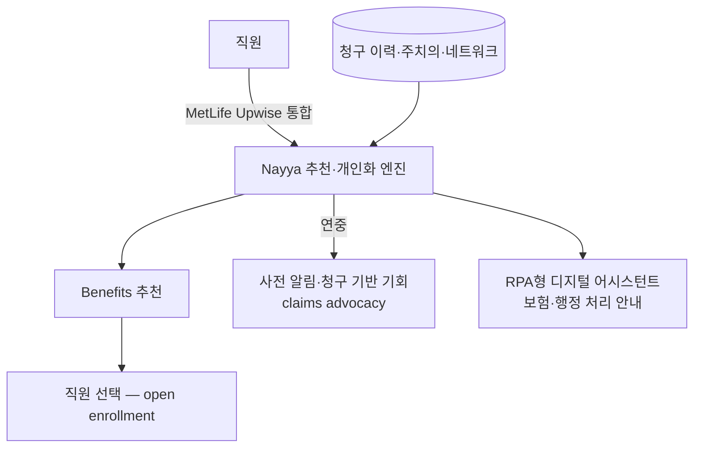

## Summary

Nayya는 2019년 설립 뉴욕 startup, **AI 기반 복리후생 추천·개인화 엔진 + RPA형 디지털 어시스턴트** [[sources/nayya-techcrunch-series-c-2022-03]] [[sources/nayya-fiercehealthcare-2022-03]]. 직원이 open enrollment 시점에 실제로 쓸 benefits를 선택하도록 돕고, 청구 시점에는 claims advocacy로 절감 기회를 찾아준다 [[sources/nayya-fiercehealthcare-2022-03]] [[sources/nayya-techcrunch-series-c-2022-03]]. 2023-10 **MetLife 전략적 파트너십** — MetLife가 **미국 직원 1,000명 초과 고용주**에게 Nayya 역량을 제공하는 독점 보험사가 되며, Upwise 플랫폼에 완전 통합해 무상 제공 [[sources/nayya-metlife-partnership-2023-10]] (기존 '1,000+ employer' 표기는 고용주 수가 아닌 고용주 규모 기준으로 정정). ⚠️ 벤더 주장: 이용자 연평균 $1,200 절감 [[sources/nayya-fiercehealthcare-2022-03]]. ADP·Workday Ventures 투자 서술은 인용 소스에 없음 → _미공개_.

> ⚠️ **Funding 정정 필수**: 일부 자료(PwC 컨설팅 문서 포함)에서 "$55M Series B (2022)"로 기술되나, 실제로는 **$55M Series C (2022-03)** + **$37M Series B (2021-06)**. 컨설팅 deck에 인용 시 정정.

## Problem / Why (도입 배경)

- **Before**: 벤더 제품이므로 특정 기업의 도입 배경은 고객별 상이. 🚫 일반론: 미국 민간 의료보험·복리후생의 정보 공백으로 소비자가 open enrollment에서 옵션을 이해하기 어려움 [[sources/nayya-techcrunch-series-c-2022-03]] [[sources/nayya-fiercehealthcare-2022-03]]; 선택 소요 시간·옵션 수·over-pay 금액 수치는 인용 소스에 없음 (수치 근거 미확보 — 2026-09-27 grounding 점검)
- **Pain point**: 직원이 "실제로 쓸" benefits를 고르지 못해 engagement·utilization이 낮음 (Nayya 문제 설정) ⚠️ 벤더 주장 [[sources/nayya-fiercehealthcare-2022-03]]
- **Trigger**: ❓ 미공개 — 고객별 상이

## Solution Architecture

### A. Process (프로세스)

- **Before**: _미공개 (not disclosed)_ — 도입 전 프로세스 세부는 인용 소스에 없음
- **After (벤더·언론 설명)** ⚠️ 벤더 주장:
  1. 직원이 open enrollment 시 Nayya 추천 엔진 사용 — MetLife 고객은 Upwise 플랫폼 안에서 [[sources/nayya-metlife-partnership-2023-10]]
  2. 추천 엔진이 청구 이력, 기존 주치의·네트워크 등 요인을 반영해 benefits 선택 지원 [[sources/nayya-techcrunch-series-c-2022-03]]
  3. 연중: 사전 알림·청구 기반 기회 제공(year-round engagement) [[sources/nayya-metlife-partnership-2023-10]], RPA형 디지털 어시스턴트가 보험·임상·직장 행정 처리 시 안내 [[sources/nayya-techcrunch-series-c-2022-03]], 전체 benefits와 연동한 claims advocacy로 절감 기회 발굴 [[sources/nayya-fiercehealthcare-2022-03]]
  - plan별 총비용 시뮬레이션·enrollment 플랫폼 자동 push·HSA/FSA reimbursement 서술은 인용 소스에 없어 제거 (2026-09-27)
- **HITL**: 직원 본인이 선택 — Nayya는 추천 [[sources/nayya-techcrunch-series-c-2022-03]]
- **Frequency**: annual (open enrollment) + 연중 청구 시점 [[sources/nayya-metlife-partnership-2023-10]] [[sources/nayya-fiercehealthcare-2022-03]]
- **Scope of autonomy**: recommend + 행정 처리 안내(RPA형) [[sources/nayya-techcrunch-series-c-2022-03]]

### B. System & Infrastructure (시스템·인프라)

- **Core**: Nayya 플랫폼 (고객은 고용주, 사용자는 개인) [[sources/nayya-techcrunch-series-c-2022-03]]; 호스팅 _미공개_
- **사용자 접점**: MetLife Upwise 플랫폼에 완전 통합 (MetLife 고객) [[sources/nayya-metlife-partnership-2023-10]]; 자체 web·mobile 접점 세부 _미공개_
- **연동**: MetLife (독점 보험사 채널; MetLife는 다른 플랫폼과도 계속 협력) [[sources/nayya-metlife-partnership-2023-10]]; 소비자의 전체 benefits와 연동(claims advocacy) ⚠️ 벤더 주장 [[sources/nayya-fiercehealthcare-2022-03]]; bswift·Mercer·ADP·Workday 연동은 인용 소스에 없음 _미공개_
- **인증**: _미공개 (not disclosed)_

### C. Data (데이터)

- **입력 데이터**:
  - 청구 이력(claims histories), 기존 주치의·네트워크 등 요인 [[sources/nayya-techcrunch-series-c-2022-03]]
  - 그 외 입력(소득·가족 구성·plan 문서)·외부 데이터 규모(30B datapoints 등) _미공개_ (수치 근거 미확보 — 2026-09-27 grounding 점검)
- **모델 구조**: 알고리즘 추천 엔진 + RPA형 디지털 어시스턴트 [[sources/nayya-techcrunch-series-c-2022-03]]; 기법 세부 _미공개_
- **Data governance**: _미공개 (not disclosed)_ — HIPAA 등 준수 여부 인용 소스에 없음

### D. Model (모델)

- **Foundation model**: _미공개 (not disclosed)_
- **추천 모델**: _미공개 (not disclosed)_ — "algorithmic recommendations-meets-RPA engine" [[sources/nayya-techcrunch-series-c-2022-03]]
- **Customization**: 미국 민간 의료보험·benefits 도메인 특화 [[sources/nayya-techcrunch-series-c-2022-03]]

### E. Organization & Team (조직·팀 구조)

- **오너십**: Nayya 벤더 — 고용주가 계약, 개인이 사용 [[sources/nayya-techcrunch-series-c-2022-03]]
- **파트너 채널**: MetLife (2023-10 전략적 관계, 독점 보험사) [[sources/nayya-metlife-partnership-2023-10]]; bswift·Mercer·ADP·Workday 서술은 인용 소스에 없음 _미공개_
- **참여 역할**: 공동창업자 CEO Sina Chehrazi·CTO Akash Magoon [[sources/nayya-techcrunch-series-c-2022-03]]; 고객사 측 역할 _미공개_
- **투자자**: ICONIQ Growth 주도 Series C, Transformation Capital·Felicis·SemperVirens 참여 [[sources/nayya-techcrunch-series-c-2022-03]] [[sources/nayya-fiercehealthcare-2022-03]]

### F. Diagrams (도식)

```mermaid
flowchart TB
    Emp[직원] -->|MetLife Upwise 통합| Nayya[Nayya 추천·개인화 엔진]
    Claims[(청구 이력·주치의·네트워크)] --> Nayya
    Nayya --> Rec[Benefits 추천]
    Rec --> Decision[직원 선택 — open enrollment]
    Nayya -->|연중| Engage[사전 알림·청구 기반 기회<br/>claims advocacy]
    Nayya --> RPA[RPA형 디지털 어시스턴트<br/>보험·행정 처리 안내]
```

범례: 실선 = TechCrunch·Fierce Healthcare(2022)·MetLife-Nayya 보도자료(2023) 확인. 기능 설명은 회사 측 서술(⚠️ 벤더 주장). HRIS·외부 데이터·enrollment 연동 노드는 소스 미확인으로 제거 (2026-09-27).

## Impact / Metrics (기대효과)

### 기대효과 요약
복리후생 plan 선택을 **추천 시스템화** — 직원 stress 감소·본인부담 최적화·voluntary benefit 가입율 증가 효과 주장. ⚠️ 모든 metric은 Nayya 자사 또는 고객 자사 보고.

| 지표 | 값 | 출처 | 성격 |
|---|---|---|---|
| Series C funding | **$55M (2022-03)**, ICONIQ Growth 주도 | [[sources/nayya-techcrunch-series-c-2022-03]] [[sources/nayya-fiercehealthcare-2022-03]] | ✅ Fact (Tier 2 미디어) |
| Series B funding | $37M (6월 라운드, 직전) | [[sources/nayya-fiercehealthcare-2022-03]] | ✅ Fact (Tier 2 미디어) |
| 누적 조달 | $106M (2019 창업 이후, 2022-03 기준) | [[sources/nayya-fiercehealthcare-2022-03]] | ✅ Fact |
| 기업가치 | $500M~$750M 범위 (CEO 인터뷰 진술) | [[sources/nayya-techcrunch-series-c-2022-03]] | ⚠️ 자사 보고 |
| MetLife 채널 | 미국 직원 **1,000명 초과 고용주** 대상 독점 보험사, Upwise 통합·무상 제공 | [[sources/nayya-metlife-partnership-2023-10]] | ⚠️ 양사 보도자료 |
| 외부 데이터 규모 | _미공개_ (수치 근거 미확보 — 2026-09-27 grounding 점검) | — | — |
| 이용자 평균 연간 절감 | **$1,200** | [[sources/nayya-fiercehealthcare-2022-03]] | ⚠️ 벤더 주장 ("according to the company", 산정 방법론 _미공개_) |
| Just Global voluntary benefit 증가 | _미공개_ (수치 근거 미확보 — 2026-09-27 grounding 점검) | — | — |
| 누적 payroll tax 절감 | _미공개_ (수치 근거 미확보 — 2026-09-27 grounding 점검) | — | — |
| 직원 만족도 | _미공개_ (수치 근거 미확보 — 2026-09-27 grounding 점검) | — | — |

## Governance & Risk

- ⚠️ **Funding 라운드 정정 필수**: $55M = Series C(2022-03), Series B는 $37M(2021-06). PwC 컨설팅 문서 인용 시 1차 검토에서 잡힘
- ⚠️ 모든 customer outcome metric은 ⚠️ 벤더 주장 또는 ⚠️ 자사 보고 — Tier 1 (Forrester·Gartner) 독립 검증 0건
- ✅ 회사·MetLife 파트너십·funding 라운드는 Tier 2 미디어 (TechCrunch·Fierce Healthcare) 검증
- ⚠️ 데이터 규모·만족도 등 자사 marketing 수치는 인용 소스에 없어 제거 — 확보 시 데이터 출처·정합성 외부 감사 여부 확인
- ⚠️ 한국 적용성 0: Nayya는 **미국 의료보험 plan 구조 (PPO/HMO/HDHP/HSA/FSA)에 특화** — 한국 4대 보험·실손보험 구조와 호환 안 됨

## Contradictions

> [!note] 2026-09-27 grounding — 인용 소스에 없는 OE 선택 시간·옵션 수·over-pay 금액, 30B datapoints·200M 청구, Just Global +40%, $17M payroll tax 절감, 직원 만족도 비율, bswift·Mercer·ADP·Workday 연동/투자, HIPAA 준수, HSA/FSA reimbursement 기능을 제거·_미공개_ 처리. 'MetLife가 1,000+ employer에 제공'은 raw 기준 '직원 1,000명 초과 미국 고용주 대상'으로 정정 (frontmatter company 필드의 '1,000+ employer 채널' 표기는 미수정 — 정정 필요).

## Consulting Angle

- **복리후생 decision support 대표 reference**: Nayya는 admin (Businessolver Sofia [[businessolver-sofia-agentic-benefits]])이 아닌 **선택 단계 추천**. 보완 포지션
- **MetLife 채널 전략 사례**: 보험사가 vendor를 자사 Upwise 플랫폼에 통합해 대형 고용주에 무상 제공 → 채널 락인 [[sources/nayya-metlife-partnership-2023-10]]. 한국 보험사 (삼성생명·교보·한화) HR 시장 진출 전략 reference
- **벤처 투자 시그널**: ICONIQ Growth 주도 $55M Series C, 누적 $106M [[sources/nayya-techcrunch-series-c-2022-03]] [[sources/nayya-fiercehealthcare-2022-03]] — 전략적 투자자(ADP·Workday) 참여 여부는 소스 미확보
- **반면교사**:
  - PwC 컨설팅 문서가 funding 라운드 오기 ($55M Series B) — 자료 작성자가 1차 검증 안 한 사례. 컨설팅 deck 작성 시 funding 정보는 TechCrunch/Crunchbase 1차 확인 필수
  - $1,200 절감 같은 회사 주장 수치는 "according to the company" 표현 그대로 — 클라이언트 인용 시 정량 출처·방법론 미공개 명시
- **한국 적용 한계**: US 의료 plan 구조 특화로 직접 이식 불가. **추천 엔진 패턴 + 외부 데이터 결합** 자체는 한국 복지포인트몰·flex benefit 추천에 reference 가능
- **Watch list**: Nayya가 한국·일본·EU 진출 시 또는 Forrester/Gartner의 employee experience report에 등재 시 confidence 재조정
