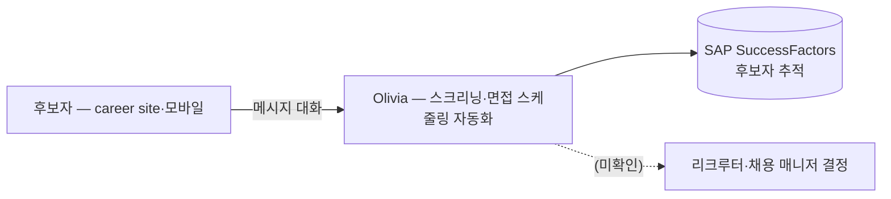

# Nestlé — Paradox Olivia 채용 자동화

## Summary

Nestlé(스위스 Vevey 본사, 189개국, 직원 339,000명+ [[sources/emerj-ai-at-nestle-2024-08]]; Paradox 사례 페이지 표기 275,000명 [[sources/paradox-nestle-case-study-2026-09]])가 Paradox의 conversational AI **Olivia**를 채용에 도입. ⚠️ 벤더 주장: 2022년 이전 글로벌 채용팀이 **월 8,000시간 이상**을 면접 일정 조정·재조정에 사용 → Olivia가 career site·모바일에서 스크리닝·면접 스케줄링 자동화, **SAP SuccessFactors** 연동 → **면접 예약 YoY 600% 증가, 연 8K 시간 절감** [[sources/paradox-nestle-case-study-2026-09]]. Emerj 자료는 Nestlé의 전사 AI(수요예측·사내 LLM 'NesGPT') 배경만 다루며 채용 자동화는 언급 없음 [[sources/emerj-ai-at-nestle-2024-08]].

## Problem / Why (도입 배경)

- **Before (baseline)**: ⚠️ 벤더 주장: 2022년 이전 글로벌 채용팀이 월 8,000시간 이상을 면접 일정 조정에 사용 [[sources/paradox-nestle-case-study-2026-09]]
- **Pain point**: 시간 축 — 고볼륨 채용에서 스케줄링 수작업 부담 [[sources/paradox-nestle-case-study-2026-09]]
- **Trigger**: "시간 소모적 채용 프로세스를 개선할 기회"로 인식 (Paradox 서술) [[sources/paradox-nestle-case-study-2026-09]]; 직접 계기 ❓ 미공개

## Solution Architecture

### A. Process (프로세스)

- **Before (As-is)**: 채용팀이 수작업으로 면접 일정 조정·재조정 [[sources/paradox-nestle-case-study-2026-09]]; 그 외 세부 _미공개_
- **After (To-be)** ⚠️ 벤더 주장 [[sources/paradox-nestle-case-study-2026-09]]:
  1. 후보자가 career site 또는 모바일에서 Olivia와 빠른 메시지로 대화
  2. Olivia가 스크리닝 자동화
  3. Olivia가 면접 스케줄링 자동화
  4. 결과가 SAP SuccessFactors(back-end)에 연동되어 후보자 추적·면접 스케줄링 기능 강화
  - knockout 질문·500+ FAQ·offer letter·I9 등 기존 서술은 인용 소스에 없어 제거 (2026-09-27 grounding 점검)
- **Human-in-the-loop (HITL) 지점**: _미공개 (not disclosed)_ — 리크루터·채용 매니저의 결정 단계 미기재
- **Trigger & Frequency**: 고볼륨 채용, 상시 [[sources/paradox-nestle-case-study-2026-09]]
- **Scope of autonomy**: 스크리닝·스케줄링 자동화 ("automates tasks") [[sources/paradox-nestle-case-study-2026-09]]; 결정 권한 범위 _미공개_

범례: 실선 = [[sources/paradox-nestle-case-study-2026-09]] 확인 (⚠️ 벤더 사례). 점선 = 소스 미확인.

### B. System & Infrastructure (시스템·인프라)

- **Core HRIS / 기반 시스템**: SAP SuccessFactors (back-end, Olivia 연동) ⚠️ 벤더 주장 [[sources/paradox-nestle-case-study-2026-09]]
- **AI 시스템 배치**: Paradox conversational software (별도 SaaS) [[sources/paradox-nestle-case-study-2026-09]]
- **배포 환경**: _미공개 (not disclosed)_
- **연동·통합**: SAP SuccessFactors [[sources/paradox-nestle-case-study-2026-09]]; 그 외 _미공개_
- **사용자 접점 (UX layer)**: career site·모바일 메시지 [[sources/paradox-nestle-case-study-2026-09]]
- **인증·권한**: _미공개 (not disclosed)_

### C. Data (데이터)

- **입력 데이터 소스**: 후보자 대화(스크리닝 응답)·면접 가용 일정 [[sources/paradox-nestle-case-study-2026-09]]; 세부 _미공개_
- **데이터 규모**: _미공개 (not disclosed)_ — 지원자 수·대화 건수 미공개
- **전처리·정제**: _미공개 (not disclosed)_
- **학습 vs RAG vs In-context 구분**: _미공개 (not disclosed)_
- **데이터 거버넌스**: _미공개 (not disclosed)_ — 스위스 본사·글로벌 운영으로 GDPR 검토 대상이나 대응 세부 미공개
- **민감정보 처리**: _미공개 (not disclosed)_

### D. Model (모델)

- **Foundation model**: _미공개 (not disclosed)_
- **Model 유형**: conversational AI assistant (Olivia) [[sources/paradox-nestle-case-study-2026-09]]
- **제공 방식**: Paradox SaaS [[sources/paradox-nestle-case-study-2026-09]]
- **커스터마이징 기법**: _미공개 (not disclosed)_
- **평가·가드레일**: _미공개 (not disclosed)_

### E. Organization & Team (조직·팀 구조)

- **오너십**: Nestlé 글로벌 채용팀 (high-volume recruiters) [[sources/paradox-nestle-case-study-2026-09]]; 조직 세부 _미공개_
- **참여 역할**: _미공개 (not disclosed)_
- **팀 규모·기간**: _미공개 (not disclosed)_ — 2022년 이전 도입 [[sources/paradox-nestle-case-study-2026-09]]
- **거버넌스 체계**: _미공개 (not disclosed)_
- **파트너**: Paradox [[sources/paradox-nestle-case-study-2026-09]]
- **전사 AI 맥락**: Nestlé AI Program Lead Carolina Pinart — 효율·디지털 운영·지속가능성 3대 목표; 사내 LLM/챗봇(NesGPT) 자체 구축 [[sources/emerj-ai-at-nestle-2024-08]]

## Impact / Metrics (기대효과)

### 기대효과 요약
Before: 월 8,000시간 이상 면접 일정 조정 (⚠️ 벤더 주장) → After: 면접 예약 YoY 600% 증가, 연 8K 시간 절감 (⚠️ 벤더 주장). Paradox 페이지 내 '월 8,000시간 소요' vs '연 8K 시간 절감' 표기가 상충 — 수치 정의 불명.

| 지표 | 값 | 출처 | 성격 |
|---|---|---|---|
| 면접 예약 증가 | **600% YoY** | [[sources/paradox-nestle-case-study-2026-09]] | ⚠️ 벤더 주장 |
| 시간 절감 | **8K hours annually** (도입 전 '월 8,000시간+'와 단위 상충) | [[sources/paradox-nestle-case-study-2026-09]] | ⚠️ 벤더 주장 |
| 리크루터 체감 | "life-changing experience" (정성) | [[sources/paradox-nestle-case-study-2026-09]] | ⚠️ 벤더 주장 |
| 기업 규모 | 275,000명 (Paradox) / 339,000명+ (Emerj) | [[sources/paradox-nestle-case-study-2026-09]] [[sources/emerj-ai-at-nestle-2024-08]] | ⚠️ 소스 간 불일치 |

## Governance & Risk

- ⚠️ 유일한 채용 관련 소스가 Paradox 자사 사례 페이지(Tier 3, partial 스냅샷) — 독립 검증 없음
- ⚠️ 수치 내부 불일치(월 8,000시간 vs 연 8K 절감) — 클라이언트 인용 시 정의 확인 필요
- ⚠️ 채용 스크리닝 자동화 → EU AI Act Annex III 4(a)·AI 기본법 고영향 AI(채용) 검토 대상; Nestlé의 AI 고지·편향 감사 _미공개_
- ⚠️ GDPR·EU data residency 대응 _미공개_

## Contradictions

> [!contradiction] 직원 수: Paradox 사례 페이지 275,000명 [[sources/paradox-nestle-case-study-2026-09]] vs Emerj 339,000명+ [[sources/emerj-ai-at-nestle-2024-08]] — 시점·집계 기준 차이로 보이나 미확인. 상태: noted.

> [!note] 2026-09-27 grounding — 인용 소스에 없는 knockout 질문·500+ FAQ·offer letter·I9·리마인더 서술과 Consulting Angle의 타 Paradox 고객 수치(Chipotle·7-Eleven·GM·Workday)를 제거. 도입 전 월 8,000시간·SAP SuccessFactors 연동·연 8K 절감을 raw 기준으로 추가.

## Consulting Angle

### ★ Paradox 고객 생태계 wiki 축적 현황

| Paradox 고객 | 산업 | Region | 핵심 metric |
|---|---|---|---|
| **Chipotle** [[chipotle-paradox-olivia]] | Restaurant | NA | 해당 페이지 참조 |
| **Nestlé** | FMCG | **EU/Global** | **600% interview↑, 8K hours/yr** (벤더 주장) |
| **McDonald's** [[mcdonalds-paradox-recruiting]] | QSR | Global | 해당 페이지 참조 |

→ Paradox는 **고볼륨 채용의 conversational AI**로 식음료·리테일에 다수 reference — 단 각 수치는 벤더 사례 페이지 기반.

### EU 맥락
- Nestlé는 **스위스 Vevey 본사** [[sources/emerj-ai-at-nestle-2024-08]], EU 직원 다수 → GDPR 적용 대상
- Paradox가 EU data residency·GDPR 규정을 어떻게 처리하는지 → EU 기업에 제안 시 핵심 질문
- SAP SuccessFactors 고객사에 Paradox를 얹는 패턴 [[sources/paradox-nestle-case-study-2026-09]] — 국내 SF 사용 대기업(고볼륨 채용) 제안 시 reference
