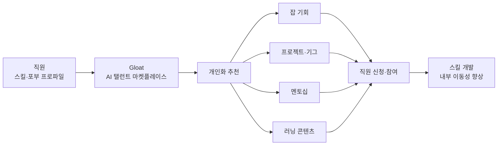

## Summary

글로벌 제약사 Novartis는 Gloat의 AI 탤런트 마켓플레이스를 도입하여 스킬 기반 조직으로 전환했다. ✅ **Fact** 직원들은 잡(Job)·프로젝트·멘토십·러닝 콘텐츠를 스킬 기반으로 매칭받는다. 탤런트 마켓플레이스를 통해 성공적인 과제 수행 경험이 있는 직원은 조직 내 영구 이동 가능성이 132% 더 높아졌으며, 크로스펑셔널 프로젝트 배정이 67% 증가했다. ⚠️ **자사 보고**: Novartis 및 Gloat 공개 자료 기반 수치. [[sources/gloat-novartis-case-study-2024.md]]

## Problem / Why

Novartis는 연구·개발·상업화 등 다양한 기능 조직을 보유하면서도 내부 이동성이 낮아 인재가 사일로화되는 문제를 안고 있었다. 기존 직무 중심 인사 관리로는 조직이 필요로 하는 미래 스킬을 빠르게 파악하고 개발하기 어려웠다. "Unbossed" 문화 (자율적이고 권한 위임된 조직) 추진과 함께 탤런트 민주화가 전략 목표였다.

## Solution Architecture

> **최우선 원칙**: 이 섹션은 **공개된 사실만** 기록한다.

### A. Process (프로세스)

- **Before (As-is)**: 직무 중심의 경직된 인사 관리. 내부 이동 기회가 제한적이고 관리자 추천에 의존.
- **After (To-be)**:
  1. ✅ **Fact** Gloat 탤런트 마켓플레이스로 직원에게 잡·프로젝트·멘토·러닝 기회를 AI 기반으로 개인화 추천. [[sources/gloat-novartis-case-study-2024.md]]
  2. ✅ **Fact** 스킬 온톨로지 기반으로 직원의 현재 스킬과 희망 스킬을 분석, 성장 기회 연결. [[sources/gloat-novartis-case-study-2024.md]]
  3. ✅ **Fact** "기존 접근법 대비 2개월 만에 4년치 품질 데이터 수집." [[sources/gloat-novartis-case-study-2024.md]]
- **Human-in-the-loop (HITL) 지점**: AI가 기회를 추천하고 직원이 자율적으로 신청. 최종 배정 결정은 매니저/HR이 관여.
- **Trigger & Frequency**: 직원 커리어 탐색·프로젝트 매칭 수시.
- **Scope of autonomy**: Recommend 수준.

범례: 실선 = [[sources/gloat-novartis-case-study-2024.md]] 확인.

### B. System & Infrastructure (시스템·인프라)

- **Core HRIS / 기반 시스템**: _미공개 (not disclosed)_
- **AI 시스템 배치**: ✅ **Fact** Gloat SaaS 탤런트 마켓플레이스. [[sources/gloat-novartis-case-study-2024.md]]
- **배포 환경**: _미공개 (not disclosed)_
- **연동·통합**: _미공개 (not disclosed)_
- **사용자 접점 (UX layer)**: _미공개 (not disclosed)_

### C. Data (데이터)

- **입력 데이터 소스**: 직원 스킬 프로파일, 직무 데이터, 프로젝트 데이터, 러닝 카탈로그.
- **데이터 규모**: _미공개 (not disclosed)_
- **학습 vs RAG vs In-context**: _미공개 (not disclosed)_
- **데이터 거버넌스**: _미공개 (not disclosed)_ — 스위스 본사 기반, GDPR 적용 환경.
- **민감정보 처리**: _미공개 (not disclosed)_

### D. Model (모델)

- **Foundation model**: _미공개 (not disclosed)_ — Gloat 내부 AI 엔진. 구체 기술 미공개.
- **Model 유형**: 추천 시스템, 스킬 매칭, NLP(스킬 추론).
- **커스터마이징 기법**: ✅ **Fact** AI가 비즈니스 우선순위와 직원 희망 스킬을 결합하여 개인화 추천 생성. [[sources/gloat-novartis-case-study-2024.md]]

### E. Organization & Team (조직·팀 구조)

- **오너십**: HR 주도.
- **문화 전략**: ✅ **Fact** "Unbossed" 문화 — 전통적 관리자 중심 탤런트 결정을 민주화. [[sources/gloat-novartis-case-study-2024.md]]
- **팀 규모**: _미공개 (not disclosed)_

## Impact / Metrics (기대효과)

### 기대효과 요약
Before: _미공개 (마켓플레이스 도입 전 내부 이동률·크로스펑셔널 배정 절대값)_ → After: ⚠️ 자사 보고 참여 직원의 영구 이동 가능성 132% 향상, 크로스펑셔널 프로젝트 배정 67% 증가, 2개월 내 4년치 품질 피플 데이터 수집. Before 절대값 미공개로 132%·67%의 실제 규모 판단 불가. Tier 1·2 독립 검증 미확인.

- ⚠️ **자사 보고** (Novartis/Gloat 공동 케이스 스터디):
  - 탤런트 마켓플레이스 통해 과제 수행한 직원의 조직 내 영구 이동 가능성 **132% 향상**. [[sources/gloat-novartis-case-study-2024.md]]
  - 크로스펑셔널 프로젝트 배정 **67% 증가**. [[sources/gloat-novartis-case-study-2024.md]]
  - 기존 대비 2개월 내 4년치 품질 피플 데이터 수집. [[sources/gloat-novartis-case-study-2024.md]]
  - Tier 1·2 독립 검증 미확인.

## Governance & Risk

- GDPR 적용 환경(스위스 본사 + 유럽 직원 다수). 세부 DPIA 내용 _미공개 (not disclosed)_.
- 매니저의 탤런트 "독점" 방지 — 열린 기회 시장화로 매니저 승인 없이 직원이 직접 신청 가능한 설계.

## Contradictions

없음 (현재 기준).

## Consulting Angle

- **Unilever FLEX, Schneider Electric OTM과 삼각 비교**: 세 사례 모두 Gloat 기반 탤런트 마켓플레이스. 제약(Novartis)·FMCG(Unilever)·산업재(Schneider)라는 산업별 적용 양상 차이를 비교 분석하면 강력한 컨설팅 자료.
- **스킬 기반 조직 전환 ROI**: 132% 이동성 향상 수치는 스킬 마켓플레이스 투자 타당성 제시 시 핵심 수치(단, 자사 보고임을 명시).
- **Unbossed 문화와 AI**: "관리자 권한 분산 + AI 민주화" 패턴은 수직적 위계 문화의 국내 기업에 적용 시 저항이 클 수 있음 — 반면교사로 변화관리 필요성 강조에 활용 가능.
- **데이터 가속 주장**: "2개월에 4년치 데이터" 수치는 설득력 있지만 자사 보고 수치임을 반드시 병기.
