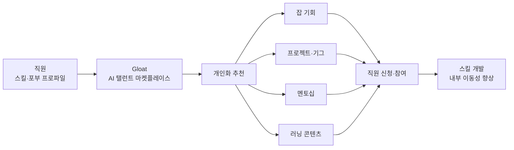

## Summary

글로벌 제약사 Novartis(바젤)는 Gloat의 'agile workforce OS'/탤런트 마켓플레이스(Talent Match)를 test-and-learn 방식으로 확산하며 스킬 기반 조직으로 전환 중이다 ⚠️ **자사 보고** (Gloat 고객 사례 PDF) [[sources/gloat-novartis-case-study-2024.md]]. 30,000명 이상 등록, 33,000개 job code·105,000명 스킬 매핑, 크로스펑셔널 프로젝트 배정 67% 증가, 마켓플레이스 사용자는 퇴사 가능성 73% 낮고 승진 가능성 51% 높음 [[sources/gloat-novartis-case-study-2024.md]]. '영구 이동 가능성 132% 향상'은 인용 소스 PDF에 없음(Gloat 블로그에만 등장) → _미공개_ (수치 근거 미확보 — 2026-09-27 grounding 점검). HRD Connect(Tier 2)는 탤런트 마켓플레이스+스킬 인텔리전스 통합과 Markus Graf의 데이터 품질 향상 발언을 전하나 벤더명·수치는 없음 [[sources/hrdconnect-novartis-skills-2024.md]].

## Problem / Why (도입 배경)

- **Before (baseline)**: ❓ baseline 미공개 — 도입 전 내부 이동률·크로스펑셔널 배정 절대값은 인용 소스에 없음
- **Pain point**: 직원 스킬·개발 목표 데이터 품질 (Markus Graf, Global Head of Talent) [[sources/hrdconnect-novartis-skills-2024.md]]; 스킬을 워크포스 전환의 중심에 두려는 전략 [[sources/gloat-novartis-case-study-2024.md]]
- **Trigger**: 2019년 CEO Vasant Narasimhan의 데이터·디지털 기반 P&O 전환 지시 [[sources/myhrfuture-novartis-people-data.md]]; 2022-04 '집중 의약품 기업' 전환 [[sources/myhrfuture-novartis-people-data.md]] — 마켓플레이스 도입의 직접 계기 여부는 ❓ 미공개

## Solution Architecture

> **최우선 원칙**: 이 섹션은 **공개된 사실만** 기록한다.

### A. Process (프로세스)

- **Before (As-is)**: 직무 중심의 경직된 인사 관리. 내부 이동 기회가 제한적이고 관리자 추천에 의존.
- **After (To-be)**:
  1. ⚠️ **자사 보고** Gloat agile workforce OS/Talent Match로 직원이 프로젝트 등 기회에 참여 — 등록 30,000명+ (입소문 중심 확산). [[sources/gloat-novartis-case-study-2024.md]]
  2. ⚠️ **자사 보고** 33,000개 job code·105,000명 대상 스킬-역할 매핑. [[sources/gloat-novartis-case-study-2024.md]]
  3. '2개월 만에 4년치 데이터' 서술은 인용 소스 raw에 없어 제거 (2026-09-27 grounding 점검)
- **Human-in-the-loop (HITL) 지점**: 직원이 자율 등록·참여 [[sources/gloat-novartis-case-study-2024.md]]; 매니저/HR 승인 단계 _미공개 (not disclosed)_
- **Trigger & Frequency**: 직원 커리어 탐색·프로젝트 매칭 수시.
- **Scope of autonomy**: Recommend 수준.

```mermaid
flowchart LR
    A[직원\n스킬·포부 프로파일] --> B[Gloat\nAI 탤런트 마켓플레이스]
    B --> C[개인화 추천]
    C --> D1[잡 기회]
    C --> D2[프로젝트·기그]
    C --> D3[멘토십]
    C --> D4[러닝 콘텐츠]
    D1 & D2 & D3 & D4 --> E[직원 신청·참여]
    E --> F[스킬 개발\n내부 이동성 향상]
```
범례: 실선 = [[sources/gloat-novartis-case-study-2024.md]] 확인.

### B. System & Infrastructure (시스템·인프라)

- **Core HRIS / 기반 시스템**: _미공개 (not disclosed)_
- **AI 시스템 배치**: ✅ **Fact** Gloat SaaS 탤런트 마켓플레이스. [[sources/gloat-novartis-case-study-2024.md]]
- **배포 환경**: _미공개 (not disclosed)_
- **연동·통합**: _미공개 (not disclosed)_
- **사용자 접점 (UX layer)**: _미공개 (not disclosed)_

### C. Data (데이터)

- **입력 데이터 소스**: 직원 스킬·역할 매핑 데이터 (33,000 job code) [[sources/gloat-novartis-case-study-2024.md]]; 직원 스킬·개발 목표 데이터 [[sources/hrdconnect-novartis-skills-2024.md]]; 프로젝트·러닝 데이터 세부 _미공개_
- **데이터 규모**: 등록 사용자 30,000명+, 스킬 매핑 105,000명 (개요 표기 직원 76,000명과 불일치) [[sources/gloat-novartis-case-study-2024.md]]
- **학습 vs RAG vs In-context**: _미공개 (not disclosed)_
- **데이터 거버넌스**: _미공개 (not disclosed)_ — 스위스 본사 기반, GDPR 적용 환경.
- **민감정보 처리**: _미공개 (not disclosed)_

### D. Model (모델)

- **Foundation model**: _미공개 (not disclosed)_ — Gloat 내부 AI 엔진. 구체 기술 미공개.
- **Model 유형**: _미공개 (not disclosed)_ — 스킬 매칭 기반 마켓플레이스라는 서술만 [[sources/gloat-novartis-case-study-2024.md]]
- **커스터마이징 기법**: _미공개 (not disclosed)_

### E. Organization & Team (조직·팀 구조)

- **오너십**: Talent 조직 (Global Head of Talent Markus Graf) [[sources/gloat-novartis-case-study-2024.md]] [[sources/hrdconnect-novartis-skills-2024.md]]; People Analytics 조직(Ashish Pant)은 데이터 기반 P&O 전환 담당 [[sources/myhrfuture-novartis-people-data.md]]
- **문화 전략**: ⚠️ **자사 보고** "Unbossed" 문화 — 관리자 중심 탤런트 결정의 민주화. [[sources/gloat-novartis-case-study-2024.md]]
- **팀 규모**: _미공개 (not disclosed)_

## Impact / Metrics (기대효과)

### 기대효과 요약
Before: _미공개 (마켓플레이스 도입 전 내부 이동률·크로스펑셔널 배정 절대값)_ → After: ⚠️ 자사 보고 크로스펑셔널 프로젝트 배정 67% 증가, 마켓플레이스 사용자 퇴사 가능성 73%↓·승진 가능성 51%↑. '영구 이동 가능성 132%'는 인용 소스에 없음 → _미공개_. Before 절대값 미공개로 실제 규모 판단 불가. Tier 1·2 독립 검증 미확인.

- ⚠️ **자사 보고** (Gloat 고객 사례 PDF, 출처 표기 Gloat Live 2024·Josh Bersin Company 2023):
  - 크로스펑셔널 프로젝트 배정 **67% 증가**. [[sources/gloat-novartis-case-study-2024.md]]
  - Talent Match로 프로젝트에 참여한 직원은 퇴사 가능성 **73% 낮고** 승진 가능성 **51% 높음**. [[sources/gloat-novartis-case-study-2024.md]]
  - 등록 사용자 30,000명+; 33,000 job code·105,000명 스킬 매핑. [[sources/gloat-novartis-case-study-2024.md]]
  - '2개월 내 4년치 데이터'는 raw 미확인 → _미공개_
  - 영구 이동 가능성 132% 향상: _미공개_ (수치 근거 미확보 — 2026-09-27 grounding 점검; Gloat 블로그 별도 소스 필요)
  - Tier 1·2 독립 검증 미확인 — HRD Connect·myHRfuture는 수치 없음 [[sources/hrdconnect-novartis-skills-2024.md]] [[sources/myhrfuture-novartis-people-data.md]]

## Governance & Risk

- GDPR 적용 환경(스위스 본사 + 유럽 직원 다수). 세부 DPIA 내용 _미공개 (not disclosed)_.
- 매니저 승인 절차·탤런트 독점 방지 설계 여부 _미공개 (not disclosed)_.

## Contradictions

> [!contradiction] 직원 수: Gloat PDF 개요 76,000명 vs 스킬 매핑 105,000명 [[sources/gloat-novartis-case-study-2024.md]] — 집계 범위 차이로 보이나 미확인. 상태: noted.

> [!note] 2026-09-27 grounding — 인용 소스 PDF에 없는 '영구 이동 가능성 132% 향상'을 _미공개_ 처리하고 raw 확인 수치(73%·51%·30,000+·33,000·105,000)를 추가. ✅ Fact 표기는 벤더 사례 기반이므로 ⚠️ 자사 보고로 재분류. HITL·매니저 승인·모델 유형 등 소스에 없는 서술은 _미공개_.

## Consulting Angle

- **Unilever FLEX, Schneider Electric OTM과 삼각 비교**: 세 사례 모두 Gloat 기반 탤런트 마켓플레이스. 제약(Novartis)·FMCG(Unilever)·산업재(Schneider)라는 산업별 적용 양상 차이를 비교 분석하면 강력한 컨설팅 자료.
- **스킬 기반 조직 전환 ROI**: 퇴사 가능성 73%↓·승진 가능성 51%↑·크로스펑셔널 배정 67%↑ 수치는 스킬 마켓플레이스 투자 타당성 제시 시 활용 (단, Gloat 사례 PDF 기반 자사 보고임을 명시; 132%는 소스 확보 전 인용 금지).
- **직원 자율 등록·입소문 확산**: 30,000명+ 등록을 입소문 중심으로 달성했다는 test-and-learn 확산 방식은 수직적 위계 문화의 국내 기업 적용 시 변화관리 설계 포인트.
- **데이터 가속 주장**: '2개월에 4년치 데이터' 등 벤더 사례 수치는 자사 보고임을 반드시 병기.
