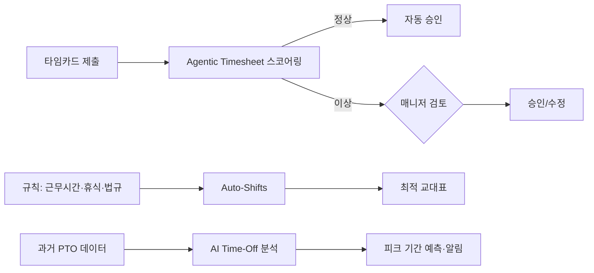

## Summary

Paychex가 2026년 2월 **Paycor** 및 **Paychex Flex** 플랫폼에 에이전틱 AI 솔루션을 발표. **Paycor Agentic Timesheet Approvals**(타임카드 자동 스코어링·이상만 사람 검토), **Paycor Auto-Shifts**(근무시간 제한·휴식·공정근무법 기반 최적 교대 생성), **Paychex Flex AI-Powered Time-Off**(PTO 패턴 분석·반복 가용성 AI). **800,000 고객** 규모. Nucleus Research: 워크포스 관리 자동화 평균 ROI **$12.24/달러**. [[sources/paychex-agentic-workforce-2026-02.md]]

## Problem / Why

- 매니저가 타임시트를 **수동으로 하나씩 검토·승인** → 시간 낭비 + 오류 발생
- 교대 스케줄을 **수동 작성** → 노동법(공정근무법·52시간) 위반 리스크
- PTO 관리가 반응적 → **피크 기간 인력 부족** 사전 예측 불가
- SMB(중소기업)는 HR 전담 인력이 적어 **자동화 수요 특히 높음**

## Solution Architecture (요약)

### A. Process (프로세스)

- **Before**: 매니저가 타임카드 수동 검토 → 교대표 수동 작성 → PTO 개별 승인
- **After**: Agentic Timesheet Approvals가 타임카드를 임계값 기반 자동 스코어링 → 정상은 자동 승인, 이상만 사람에게 플래그 → Auto-Shifts가 규칙(근무시간·휴식·공정근무) 기반 최적 교대 생성 → AI Time-Off가 과거 PTO 패턴 분석·피크 예측 [[sources/paychex-agentic-workforce-2026-02.md]]
- **HITL 지점**: 이상 타임카드만 매니저 검토 (정상은 autonomous)
- **Scope of autonomy**: Autonomous (정상 타임카드) + Approve-then-act (이상 케이스)

### B. System & Infrastructure

- **Core 플랫폼**: Paychex Flex + Paycor (HCM + Payroll + WFM)
- **AI**: 에이전틱 AI — Paycor 및 Flex 플랫폼 내장 [[sources/paychex-agentic-workforce-2026-02.md]]
- **고객 규모**: ⚠️ 벤더 주장: 800,000 고객 (미국·유럽) [[sources/paychex-agentic-workforce-2026-02.md]]
- 연동·배포 상세: _미공개 (not disclosed)_

### C~E. Data / Model / Organization

- _미공개 (not disclosed)_

## Impact / Metrics

### 기대효과 요약

타임시트 자동 승인 + 교대 최적화 + PTO 예측. 제품 발표 단계로 고객 outcome 미공개.

| 지표 | 값 | 출처 | 성격 |
|---|---|---|---|
| 고객 수 | **800,000** | Paychex 공식 | ⚠️ 벤더 주장 |
| WFM 자동화 ROI | **$12.24/달러** | Nucleus Research | ✅ Fact (독립 리서치, 단 산업 일반치) |
| 타임시트 자동 승인 | 정상 자동 → 이상만 사람 검토 | Paychex 공식 | ⚠️ 벤더 주장 |

**고객별 outcome (처리 시간 단축률·오류 감소율 등)은 _미공개 (not disclosed)_. stage: announced.**

## Governance & Risk

- Agentic(자율) 타임시트 승인: **자동 승인 임계값 설정**이 핵심 — 과도한 자율은 급여 오류 리스크
- Auto-Shifts: 공정근무법(fair workweek) 규제가 지역마다 다름 → 규칙 엔진의 지역별 업데이트 필요

## Consulting Angle

### 활용 포인트
- **"Agentic HR" 개념의 Total Rewards 적용 사례**: 단순 추천(recommend)을 넘어 자동 승인(autonomous)까지 가는 에이전틱 AI의 실용적 예시
- **SMB 시장의 AI 급여 자동화 트렌드**: ADP Assist(대기업) vs Paychex(SMB) 비교 프레임
- **Nucleus Research ROI $12.24**: 급여·WFM 자동화 투자 정당화 근거

### 한국 적용
- 국내 중소기업 급여·근태 자동화: 플렉스(flex)·시프티(Shiftee) 등이 유사 시장
- Agentic timesheet 자동 승인 모델은 한국 노동법(52시간·연장근로 승인) 맥락에서 검토 필요
