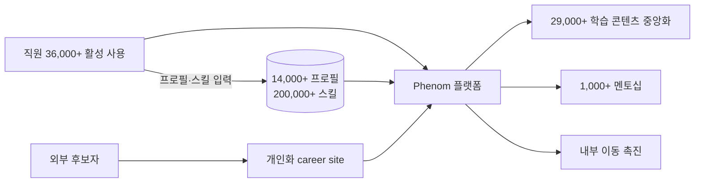

# Merck KGaA — Phenom 기반 내부 인재 플랫폼

## Summary

Merck KGaA(독일 다름슈타트, 제약·화학·생명과학)가 Phenom 플랫폼으로 전체 talent experience 전략을 전환 — 2025-03 Phenom 'Top Talent Experience' 어워드 수상 [[sources/phenom-talent-experience-awards-2025-03]]. ⚠️ 벤더 주장: **직원 36,000명 이상(전체 인력의 과반)이 플랫폼 활발 사용, 14,000명 이상 개인 프로필 생성, 200,000개 이상 스킬 입력, 29,000개 이상 학습 콘텐츠 중앙화, 1,000건 이상 멘토십** [[sources/phenom-talent-experience-awards-2025-03]]. 전체 직원 수는 인용 소스에 없음 → _미공개_ (2026-09-27 grounding 점검). Phenom 고객 허브 페이지는 '700+ 조직' 사용을 표방하나 Merck 내용 없음 [[sources/phenom-customers-page-2026-09]]. Gloat(Unilever·Schneider) 대비 **Phenom이 mobility + learning + mentoring을 통합**한 use case.

## Problem / Why (도입 배경)

- **Before (baseline)**: ❓ baseline 미공개 — 도입 전 내부 이동·학습 플랫폼 상태는 인용 소스에 없음
- **Pain point**: 후보자·현직 직원 모두에게 seamless한 journey 부재 → 채용과 개발을 잇는 talent experience 전략 전환 (Phenom 서술) ⚠️ 벤더 주장 [[sources/phenom-talent-experience-awards-2025-03]]
- **Trigger**: ❓ 미공개

## Solution Architecture

### A. Process (프로세스)

- **Before (As-is)**: _미공개 (not disclosed)_
- **After (To-be)** ⚠️ 벤더 주장 [[sources/phenom-talent-experience-awards-2025-03]]:
  1. 현대화된 career site — 개인화 경험·지능형 자동화로 외부 후보자 engagement
  2. 직원이 플랫폼에서 개인 프로필 생성·스킬 입력 (14,000+ 프로필, 200,000+ 스킬)
  3. 플랫폼이 29,000+ 학습 콘텐츠를 중앙화하고 내부 이동을 촉진
  4. 멘토십 매칭 (1,000+ 멘토십)
  - MyGrowth 포털명·매니저 routing·후보자 자동 통지 서술은 인용 소스에 없어 제거 (2026-09-27)
- **Human-in-the-loop (HITL) 지점**: _미공개 (not disclosed)_
- **Trigger & Frequency**: 상시 (직원 self-service) — 세부 _미공개_
- **Scope of autonomy**: _미공개 (not disclosed)_ — 추천·매칭 로직 세부 미기재

범례: 실선 = [[sources/phenom-talent-experience-awards-2025-03]] 확인 (⚠️ 벤더 어워드 보도자료, Tier 3). 매칭 로직·승인 흐름은 미공개로 미표시.

### B. System & Infrastructure (시스템·인프라)

- **Core HRIS / 기반 시스템**: _미공개 (not disclosed)_ — SAP 연동 서술은 인용 소스에 없어 제거
- **AI 시스템 배치**: Phenom 플랫폼 (외부 SaaS) [[sources/phenom-talent-experience-awards-2025-03]]
- **배포 환경**: _미공개 (not disclosed)_
- **연동·통합**: _미공개 (not disclosed)_
- **사용자 접점 (UX layer)**: career site (외부) + 직원용 플랫폼 (내부) [[sources/phenom-talent-experience-awards-2025-03]]; 세부 _미공개_
- **인증·권한**: _미공개 (not disclosed)_

### C. Data (데이터)

- **입력 데이터 소스**: 직원 프로필·입력 스킬, 학습 콘텐츠 카탈로그 [[sources/phenom-talent-experience-awards-2025-03]]
- **데이터 규모**: 14,000+ 프로필, 200,000+ 스킬, 29,000+ 학습 콘텐츠 ⚠️ 벤더 주장 [[sources/phenom-talent-experience-awards-2025-03]]
- **전처리·정제**: _미공개 (not disclosed)_
- **학습 vs RAG vs In-context 구분**: _미공개 (not disclosed)_
- **데이터 거버넌스**: _미공개 (not disclosed)_ — 독일 본사로 GDPR 적용 환경이나 대응 세부 미공개
- **민감정보 처리**: _미공개 (not disclosed)_

### D. Model (모델)

- **Foundation model**: _미공개 (not disclosed)_
- **Model 유형**: _미공개 (not disclosed)_ — "intelligence, automation and experience" 수준의 서술만 [[sources/phenom-talent-experience-awards-2025-03]]
- **제공 방식**: Phenom SaaS [[sources/phenom-talent-experience-awards-2025-03]]
- **커스터마이징 기법**: _미공개 (not disclosed)_
- **평가·가드레일**: _미공개 (not disclosed)_

### E. Organization & Team (조직·팀 구조)

- **오너십**: _미공개 (not disclosed)_
- **참여 역할**: _미공개 (not disclosed)_
- **팀 규모·기간**: _미공개 (not disclosed)_
- **거버넌스 체계**: _미공개 (not disclosed)_
- **파트너**: Phenom [[sources/phenom-talent-experience-awards-2025-03]]

## Impact / Metrics (기대효과)

### 기대효과 요약
⚠️ 벤더 주장: 36,000+ 직원(과반) 활발 사용, 14,000+ 프로필, 200,000+ 스킬, 29,000+ 학습 콘텐츠, 1,000+ 멘토십 — 모두 adoption/output 수치이며 outcome(내부 이동률 변화·스킬 갭 감소·시간 절감) 아님. Before 상태 _미공개_.

| 지표 | 값 | 출처 | 성격 |
|---|---|---|---|
| 활성 사용자 | **36,000+ 직원** ("well over half of the workforce") | [[sources/phenom-talent-experience-awards-2025-03]] | ⚠️ 벤더 주장 |
| 개인 프로필 생성 | **14,000+** | [[sources/phenom-talent-experience-awards-2025-03]] | ⚠️ 벤더 주장 |
| 등록 스킬 | **200,000+** | [[sources/phenom-talent-experience-awards-2025-03]] | ⚠️ 벤더 주장 |
| 중앙화 학습 콘텐츠 | **29,000+** | [[sources/phenom-talent-experience-awards-2025-03]] | ⚠️ 벤더 주장 |
| 멘토십 | **1,000+** | [[sources/phenom-talent-experience-awards-2025-03]] | ⚠️ 벤더 주장 |
| 전체 직원 | _미공개_ (인용 소스에 없음 — 2026-09-27 grounding 점검) | — | — |

## Governance & Risk

- ⚠️ 유일한 근거가 Phenom 어워드 보도자료(Tier 3) — Merck KGaA 측 발표·독립 검증 _미공개_
- ⚠️ 스킬 데이터 200,000+ 운영에 대한 GDPR·직원 동의·접근 권한 설계 _미공개_
- ⚠️ 내부 이동 추천이 배치·승진 결정에 쓰이면 EU AI Act Annex III·AI 기본법 검토 대상 — 적용 범위 _미공개_

## Contradictions

_없음._

> [!note] 2026-09-27 grounding — 인용 소스에 없는 전체 직원 수, MyGrowth 포털, candidate 자동 통지·매니저 routing, SAP ISV 파트너 서술, Gloat 고객 직원 수(Unilever 65k·Schneider 135k)를 제거·_미공개_ 처리. BusinessWire 원문은 403이라 Phenom 자사 게재본(동일 본문)을 근거로 사용.

## Consulting Angle

### ★ 유럽(EU) region의 fact-rich internal mobility 사례
- Unilever (글로벌/UK), Schneider Electric (글로벌/프랑스)에 이어 **Merck KGaA (독일)**
- **EU 기업 특유의 맥락**: GDPR 규제 하에서 200,000+ 스킬 데이터를 운영한다는 것 자체가 governance 사례 — 단 설계 세부 미공개

### Dallas College (Phenom) — TA 사례도 같은 보도자료에 기록
- Phenom 2025 어워드 보도자료에 Dallas College 수상 내용 포함 [[sources/phenom-talent-experience-awards-2025-03]] — 세부 수치는 raw 본문 기준으로 별도 확인 후 인용 (기존 표의 50%·2배·32%·6개월은 raw 대조 전까지 _미공개_)

### vs Gloat (Unilever, Schneider) vs Phenom (Merck KGaA)

| | Gloat | Phenom |
|---|---|---|
| 핵심 | Project-based mobility | **Mobility + Learning + Mentoring 통합** (벤더 서술) |
| 대표 고객 | Unilever [[unilever-flex-gloat-talent-marketplace]], Schneider [[schneider-electric-gloat-talent-marketplace]] | **Merck KGaA** |
| 수치 유형 | Hours unlocked, $ saved | **스킬 수, 학습 수, 멘토십 수** (adoption 지표) |
| HCM 연동 | 각 페이지 참조 | _미공개_ |

- **파생 질문**: 36,000+ '활발 사용'의 정의(로그인? 프로필 생성?)와 내부 이동률 outcome은? — Merck KGaA 1차 자료 확보 후 갱신
