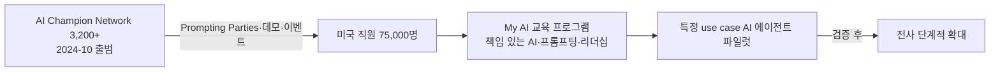

# PwC — 미국 직원 AI 업스킬링 + Agentic AI 단계적 도입

## Summary

PwC US가 미국 직원 **75,000명** 전원을 대상으로 agentic AI를 **단계적(phased)으로 도입** 중이며, 교육 프로그램 **'My AI'**로 이미 75,000명 이상을 책임 있는 AI 사용·프롬프팅·AI 시대 리더십에 교육 (⚠️ 자사 보고 — HR Grapevine 단독 인터뷰, Anthony Abbatiello US Workforce Transformation Leader) [[sources/hrgrapevine-pwc-prompting-parties-2025-04]]. 2024-10 출범한 **AI Champion Network(3,200명 이상)**가 **Prompting Parties**·GenAI 데모·오피스 이벤트를 주도 [[sources/hrgrapevine-pwc-prompting-parties-2025-04]]. 2023-05 HR Executive는 PwC HR·기술 리더의 미국 인력 ChatGPT 교육 준비를 보도했으나 본문 미확보 [[sources/hrexecutive-pwc-chatgpt-training-2023-05]] — '65,000명·3년 계획' 수치는 검증 불가 → _미공개_ (수치 근거 미확보 — 2026-09-27 grounding 점검).

## Problem / Why (도입 배경)

- **Before (baseline)**: ❓ baseline 미공개 — 2023~2024년 대부분의 고용주가 AI 도입을 시험적으로만 시도했다는 업계 맥락 (HR Grapevine 서술) [[sources/hrgrapevine-pwc-prompting-parties-2025-04]]; PwC 내부 AI 역량 수준 수치 없음
- **Pain point**: 직원이 AI 에이전트와 함께 일하도록 하는 것 — 자동화가 아닌 augmentation 관점, AI 리터러시·리스킬링 투자로 대체 우려 완화 [[sources/hrgrapevine-pwc-prompting-parties-2025-04]]
- **Trigger**: 2025년 경영진의 agentic AI 도입 요구 확산 속에서 PwC가 phased approach 채택 [[sources/hrgrapevine-pwc-prompting-parties-2025-04]]; 2023-05 ChatGPT 교육 준비 보도 [[sources/hrexecutive-pwc-chatgpt-training-2023-05]] (본문 미확보)

## Solution Architecture

### A. Process (프로세스)

- **Before (As-is)**: _미공개 (not disclosed)_
- **After (To-be)** ⚠️ 자사 보고 [[sources/hrgrapevine-pwc-prompting-parties-2025-04]]:
  1. 'My AI' 교육 프로그램 — 책임 있는 AI 사용·프롬프팅 기법·AI 시대 리더십 (75,000명+ 이수)
  2. AI Champion Network(2024-10 출범, 3,200명+)가 peer-led로 Prompting Parties·GenAI 데모·오피스 이벤트 진행
  3. 특정 use case 대상 AI 에이전트 파일럿 → 실제 적용 검증 후 전사 확대 (phased)
  4. 직무별 GenAI Skills Quests 운영 [[sources/hrgrapevine-pwc-prompting-parties-2025-04]]
  - 기존 서술 중 인용 소스에 없는 항목 제거 (2026-09-27 grounding 점검): ChatPwC playground, Super User Network 350명, hackathon·게임쇼, $1B 투자 보도자료, 자발 학습 시간 누적 추적, 우수 use case 클라이언트 자산 승격, 20인 AI 챔피언, PwC 조사 AI agent 채택률
- **Human-in-the-loop (HITL) 지점**: "human oversight at the helm" — 책임 있는 AI 도입 원칙 [[sources/hrgrapevine-pwc-prompting-parties-2025-04]]; 검토 절차 세부 _미공개_
- **Trigger & Frequency**: continuous (ongoing program) [[sources/hrgrapevine-pwc-prompting-parties-2025-04]]
- **Scope of autonomy**: AI 에이전트는 "true collaborators" — 자동화 도구가 아닌 협업자로 포지셔닝 [[sources/hrgrapevine-pwc-prompting-parties-2025-04]]; 자율 실행 범위 _미공개_

범례: 실선 = [[sources/hrgrapevine-pwc-prompting-parties-2025-04]] 확인 (⚠️ 자사 보고, 인터뷰).

### B. System & Infrastructure (시스템·인프라)

- **Core HRIS / 기반 시스템**: _미공개 (not disclosed)_
- **AI 시스템 배치**: 사내 AI 에이전트 (예: 'AI-driven Code Intelligence' 에이전트, 'Software Development Lifecycle Canvas', Assurance 가이드 검색 에이전트, 'Change Navigator' 변화 도구) ⚠️ 자사 보고 [[sources/hrgrapevine-pwc-prompting-parties-2025-04]]; 플랫폼·벤더 _미공개_
- **배포 환경**: _미공개 (not disclosed)_
- **연동·통합**: 사내 knowledge repository(Assurance) 연동 [[sources/hrgrapevine-pwc-prompting-parties-2025-04]]; 세부 _미공개_
- **사용자 접점 (UX layer)**: _미공개 (not disclosed)_
- **인증·권한**: _미공개 (not disclosed)_

### C. Data (데이터)

- **입력 데이터 소스**: 코드베이스(문서화·테스트 생성), 감사 가이드 knowledge repository [[sources/hrgrapevine-pwc-prompting-parties-2025-04]]; HR 학습 데이터 _미공개_
- **데이터 규모**: 교육 이수 75,000명+, Champion 3,200명+ [[sources/hrgrapevine-pwc-prompting-parties-2025-04]]
- **전처리·정제**: _미공개 (not disclosed)_
- **학습 vs RAG vs In-context 구분**: _미공개 (not disclosed)_
- **데이터 거버넌스**: 책임 있는 AI 거버넌스·투명성 강조 [[sources/hrgrapevine-pwc-prompting-parties-2025-04]]; 세부 _미공개_
- **민감정보 처리**: _미공개 (not disclosed)_

### D. Model (모델)

- **Foundation model**: _미공개 (not disclosed)_ — OpenAI/ChatGPT 사용은 2023 HR Executive 제목에서만 확인 [[sources/hrexecutive-pwc-chatgpt-training-2023-05]]
- **Model 유형**: agent (코드 문서화·테스트 생성·가이드 검색) [[sources/hrgrapevine-pwc-prompting-parties-2025-04]]
- **제공 방식**: _미공개 (not disclosed)_
- **커스터마이징 기법**: _미공개 (not disclosed)_
- **평가·가드레일**: 파일럿에서 실제 적용·영향 검증 후 확대 [[sources/hrgrapevine-pwc-prompting-parties-2025-04]]; 평가 지표 _미공개_
- **비용·성능 지표**: SDLC Canvas 도구가 시간 70% 단축 ⚠️ 자사 보고 [[sources/hrgrapevine-pwc-prompting-parties-2025-04]] (HR 아닌 개발 영역)

### E. Organization & Team (조직·팀 구조)

- **오너십**: US Workforce Transformation (Anthony Abbatiello, US Workforce Transformation Leader) [[sources/hrgrapevine-pwc-prompting-parties-2025-04]]; HR·기술 리더 공동 준비 (2023 보도 제목) [[sources/hrexecutive-pwc-chatgpt-training-2023-05]]
- **참여 역할**: AI Champion Network 3,200명+ (peer-led 학습) [[sources/hrgrapevine-pwc-prompting-parties-2025-04]]
- **팀 규모·기간**: Champion Network 2024-10 출범 [[sources/hrgrapevine-pwc-prompting-parties-2025-04]]; 프로그램 기간 _미공개_
- **거버넌스 체계**: 책임 있는 AI 거버넌스 언급 [[sources/hrgrapevine-pwc-prompting-parties-2025-04]]; 위원회 구성 _미공개_
- **변화관리**: Prompting Parties·GenAI 데모·오피스 이벤트·Skills Quests (peer-led) [[sources/hrgrapevine-pwc-prompting-parties-2025-04]]
- **파트너**: _미공개 (not disclosed)_

## Impact / Metrics (기대효과)

### 기대효과 요약
⚠️ 자사 보고: My AI 교육 75,000명+ 이수, AI Champion Network 3,200명+. 생산성·채택률 outcome은 _미공개_. '65,000명·3년'·'자발 학습 시간 누적'·'20인 챔피언'·'PwC 조사 채택률'은 인용 소스에서 확인 불가 → _미공개_.

| 지표 | 값 | 출처 | 성격 |
|---|---|---|---|
| Agentic AI 도입 대상 | **75,000명** (US, phased) | [[sources/hrgrapevine-pwc-prompting-parties-2025-04]] | ⚠️ 자사 보고 (인터뷰) |
| My AI 교육 이수 | **75,000명+** | [[sources/hrgrapevine-pwc-prompting-parties-2025-04]] | ⚠️ 자사 보고 |
| AI Champion Network | **3,200명+** (2024-10 출범) | [[sources/hrgrapevine-pwc-prompting-parties-2025-04]] | ⚠️ 자사 보고 |
| "Prompting Parties" | peer-led 비공식 AI 학습 세션 | [[sources/hrgrapevine-pwc-prompting-parties-2025-04]] | ⚠️ 자사 보고 |
| GenAI 업스킬링 65,000명·3년 | _미공개_ (HR Executive 본문 미확보) | [[sources/hrexecutive-pwc-chatgpt-training-2023-05]] | — |
| 자발 학습 시간 누적 | _미공개_ (수치 근거 미확보 — 2026-09-27 grounding 점검) | — | — |
| PwC 조사 AI agent 채택률 | _미공개_ (수치 근거 미확보 — 2026-09-27 grounding 점검) | — | — |

## Governance & Risk

- ⚠️ 자사 보고: 인간 감독 유지·책임 있는 AI 거버넌스·투명성 강조 [[sources/hrgrapevine-pwc-prompting-parties-2025-04]]; 구체 정책 _미공개_
- ⚠️ 소스 한계: HR Grapevine은 PwC 리더 단독 인터뷰(자기 서술), HR Executive는 본문 미확보 — 독립 검증 없음
- ⚠️ 직무 대체 우려: PwC는 augmentation·새 career pathway를 강조 [[sources/hrgrapevine-pwc-prompting-parties-2025-04]]; 인력 영향 수치 _미공개_

## Contradictions

> [!contradiction] 챔피언 규모: 기존 페이지 '20인 자원봉사 AI 챔피언' vs HR Grapevine 'AI Champion Network 3,200명 이상' [[sources/hrgrapevine-pwc-prompting-parties-2025-04]] — raw 기준 3,200명+ 채택. 상태: resolved (2026-09-27).

> [!note] 2026-09-27 grounding — HR Executive 본문 미확보로 '65,000명·3년 계획' 검증 불가 → _미공개_. 인용 소스에 없는 ChatPwC·Super User 350명·hackathon·자발 학습 시간·use case 승격·PwC 조사 채택률·$1B 보도자료 서술 제거. 페이지 제목·slug의 '65k'는 frontmatter/파일명이므로 미수정 — 소스 확보 후 정정 필요.

## Consulting Angle

- **"Prompting Parties" + Champion Network 3,200명**은 변화관리의 참고 사례 — 강제 교육이 아닌 **peer-led 비공식 학습**으로 AI 채택 촉진 [[sources/hrgrapevine-pwc-prompting-parties-2025-04]]
- **Phased agentic AI 도입**: 특정 use case 파일럿 → 검증 → 확대 — 한국 대기업 AI 에이전트 도입 로드맵의 reference
- **Big 4 L&D AI 비교**: Accenture [[accenture-ai-learning-workforce]], Deloitte [[deloitte-claude-470k-employees]], **PwC(My AI 75,000명+ + Prompting Parties)** — 각 수치는 해당 페이지 참조
- 한국 Big 4(삼일·삼정·안진·한영)가 같은 전략 참고 가능 — 단 PwC 수치는 자사 인터뷰 기반임을 명시
