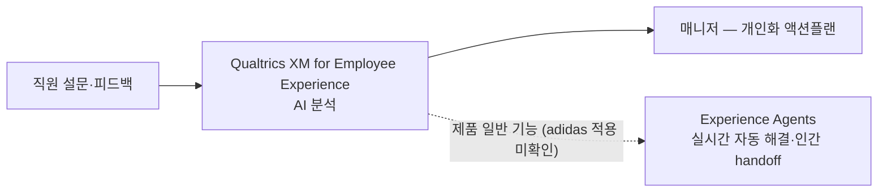

# adidas — Qualtrics XM Employee Experience AI

## Summary

Qualtrics가 2025-10-07 보도자료에서 adidas·Stripe·Owens Corning 등이 XM for Employee Experience의 AI 도구로 **수동 분석을 95% 이상 줄이고 개인화 액션플랜을 작성하는 매니저 수를 최대 70% 늘렸다**고 발표 (⚠️ 벤더 주장 — 세 고객사를 묶은 표현, adidas 단독 수치 아님) [[sources/qualtrics-experience-agents-press-2025-10]]. Employee Benefit News(2024-11-26)가 adidas·Allstate의 Qualtrics AI 활용을 다뤘으나 본문 미확보 [[sources/benefitnews-adidas-allstate-ai-feedback-2024-11]] — adidas 담당자(Dr. Sebastian Projahn) 인용·매장/물류센터 매니저 서술은 검증 불가 → _미공개_ (수치 근거 미확보 — 2026-09-27 grounding 점검).

## Problem / Why (도입 배경)

- **Before (baseline)**: ❓ baseline 미공개 — 도입 전 분석 소요 시간(160+ hours 등)은 인용 소스에 없음 (수치 근거 미확보 — 2026-09-27 grounding 점검). 업계 맥락: 직원 피드백이 고용주 행동으로 이어진다고 강하게 동의하는 직원은 8% (Gallup, Benefit News 도입부) [[sources/benefitnews-adidas-allstate-ai-feedback-2024-11]]
- **Pain point**: 직원 피드백을 수집해도 대응하지 못하는 조직이 많음 — "appearing to ignore employees' input" 리스크 [[sources/benefitnews-adidas-allstate-ai-feedback-2024-11]]; 수동 분석 부담 (Qualtrics 문제 설정) [[sources/qualtrics-experience-agents-press-2025-10]]
- **Trigger**: ❓ 미공개 — adidas의 도입 계기는 인용 소스에 없음

## Solution Architecture

### A. Process (프로세스)

- **Before (As-is)**: _미공개 (not disclosed)_
- **After (To-be)** ⚠️ 벤더 주장 [[sources/qualtrics-experience-agents-press-2025-10]]:
  1. 직원 설문·피드백 수집 (XM for Employee Experience)
  2. AI 도구가 분석을 자동화 — 수동 분석 95% 이상 감소 (adidas·Stripe·Owens Corning 합산 표현)
  3. 매니저가 개인화 액션플랜 작성 — 작성 매니저 수 최대 70% 증가
  - Continuous Listening 대화형 follow-up·xFlow 자동 alert·at-risk 이탈 예측·매장/물류센터 매니저 서술은 인용 소스에 없어 제거 (2026-09-27 grounding 점검)
- **Human-in-the-loop (HITL) 지점**: 매니저가 액션플랜 작성 [[sources/qualtrics-experience-agents-press-2025-10]]; Experience Agents는 인간 감독이 필요한 경우 handoff (제품 일반 설명) [[sources/qualtrics-experience-agents-press-2025-10]]
- **Trigger & Frequency**: _미공개 (not disclosed)_ — adidas 설문 주기 미기재
- **Scope of autonomy**: 분석 자동화 + 매니저 action 지원 (recommend) [[sources/qualtrics-experience-agents-press-2025-10]]; 자율 실행 범위 _미공개_

범례: 실선 = [[sources/qualtrics-experience-agents-press-2025-10]] 확인 (⚠️ 벤더 보도자료, 3사 합산 수치). 점선 = 제품 일반 설명.

### B. System & Infrastructure (시스템·인프라)

- **Core HRIS / 기반 시스템**: _미공개 (not disclosed)_
- **AI 시스템 배치**: Qualtrics XM Platform (SaaS) 내 AI 기능 [[sources/qualtrics-experience-agents-press-2025-10]]
- **배포 환경**: _미공개 (not disclosed)_
- **연동·통합**: _미공개 (not disclosed)_ — HRIS·ticketing 연동(xFlow) 서술은 인용 소스에 없음
- **사용자 접점 (UX layer)**: _미공개 (not disclosed)_
- **인증·권한**: _미공개 (not disclosed)_

### C. Data (데이터)

- **입력 데이터 소스**: 직원 설문 응답·피드백 [[sources/qualtrics-experience-agents-press-2025-10]]; 항목 세부 _미공개_
- **데이터 규모**: _미공개 (not disclosed)_ — Qualtrics 플랫폼 전체는 연 3.5 billion 건 이상의 대화·상호작용 분석 ⚠️ 벤더 주장 [[sources/qualtrics-experience-agents-press-2025-10]] (adidas 특정 아님)
- **전처리·정제**: _미공개 (not disclosed)_
- **학습 vs RAG vs In-context 구분**: _미공개 (not disclosed)_
- **데이터 거버넌스**: _미공개 (not disclosed)_ — 독일 본사로 GDPR 적용 환경이나 대응 세부 미공개
- **민감정보 처리**: _미공개 (not disclosed)_

### D. Model (모델)

- **Foundation model**: _미공개 (not disclosed)_
- **Model 유형**: _미공개 (not disclosed)_ — 분석 자동화·Experience Agents(agent) 제품 설명만 [[sources/qualtrics-experience-agents-press-2025-10]]
- **제공 방식**: Qualtrics SaaS [[sources/qualtrics-experience-agents-press-2025-10]]
- **커스터마이징 기법**: _미공개 (not disclosed)_
- **평가·가드레일**: _미공개 (not disclosed)_

### E. Organization & Team (조직·팀 구조)

- **오너십**: _미공개 (not disclosed)_ — People Intelligence 조직·담당자 인용은 본문 미확보 소스([[sources/benefitnews-adidas-allstate-ai-feedback-2024-11]])에 의존하여 제거
- **참여 역할**: _미공개 (not disclosed)_
- **팀 규모·기간**: _미공개 (not disclosed)_
- **거버넌스 체계**: _미공개 (not disclosed)_
- **파트너**: Qualtrics [[sources/qualtrics-experience-agents-press-2025-10]]

## Impact / Metrics (기대효과)

### 기대효과 요약
⚠️ 벤더 주장: 수동 분석 95%+ 감소, 개인화 액션플랜 작성 매니저 최대 70% 증가 — adidas·Stripe·Owens Corning 합산 표현. adidas 단독 outcome _미공개_.

| 지표 | 값 | 출처 | 성격 |
|---|---|---|---|
| 수동 분석 감소 | **95%+** (adidas·Stripe·Owens Corning 합산 표현) | [[sources/qualtrics-experience-agents-press-2025-10]] | ⚠️ 벤더 주장 |
| 개인화 액션플랜 작성 매니저 | **최대 70%↑** (동상) | [[sources/qualtrics-experience-agents-press-2025-10]] | ⚠️ 벤더 주장 |
| Qualtrics AI 월간 활성 고객 증가 | **346%** (전년 대비, Qualtrics 전체) | [[sources/qualtrics-experience-agents-press-2025-10]] | ⚠️ 벤더 주장 (adidas 무관) |
| Named leader (Projahn) 인용 | _미공개_ — Benefit News 본문 미확보 | [[sources/benefitnews-adidas-allstate-ai-feedback-2024-11]] | — |

## Governance & Risk

- ⚠️ 유일한 본문 확보 소스가 Qualtrics 보도자료(Tier 3) — adidas 측 발표·독립 검증 _미공개_
- ⚠️ 직원 설문 AI 분석의 익명성·소그룹 재식별 리스크 — adidas 대응 _미공개_
- ⚠️ 이탈 예측·매니저 평가 활용 여부 _미공개_ — 적용 시 EU AI Act Annex III·AI 기본법 검토 대상

## Contradictions

_없음._

> [!note] 2026-09-27 grounding — 95%/70%는 raw 기준 adidas·Stripe·Owens Corning 합산 표현으로 정정. 인용 소스에 없는 Projahn 인용, 160+ hours baseline, Continuous Listening 대화형 follow-up, xFlow 자동 alert, at-risk 이탈 예측, 매장·물류센터 매니저 서술을 제거·_미공개_ 처리. Benefit News 본문 미확보.

## Consulting Angle

- **Listening & Engagement 카테고리의 named-customer 사례** — 단 수치가 3사 합산 벤더 주장이므로 "adidas 95%"로 인용 금지; [[workday-illuminate-employee-sentiment]]과 비교 시 동일 기준 적용
- **매니저 액션플랜 작성률**을 engagement AI의 KPI로 쓰는 프레임 [[sources/qualtrics-experience-agents-press-2025-10]] — 국내 조직문화 진단 후속 action 관리 지표 설계에 참고
- **EU 기업 (독일 본사)**: GDPR 하 employee sentiment AI 운영 → EU compliance reference — 세부는 adidas 1차 자료 확보 후 보강
- **파생 질문**: adidas 단독 outcome·설문 주기·매장 현장 매니저 적용 여부 — Benefit News 재인제스트(브라우저 렌더링) 후 갱신
