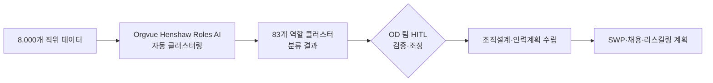

## Summary

Salesforce의 Organizational Strategy & Effectiveness 팀이 Orgvue의 Henshaw AI(직무 클러스터링 AI)를 통해 8,000개 직위를 83개 클러스터로 자동 분류했다. OD·SWP 타임라인을 "최소 6개월" 단축했다고 자사 보고. Orgvue Henshaw AI는 2025년 12월 정식 출시. 직무체계 구축 시간 6개월 → 6일 단축은 Orgvue의 일반 고객 사례로도 인용.

## Problem / Why

- 대규모 테크 기업의 직무 아키텍처 및 조직설계는 수작업 데이터 분류에 수개월 소요
- AI 도입에 따른 역할 재정의·조직 재설계 요구가 급증 → 분석 속도가 의사결정 병목
- 기존 방식: "기회를 찾는" 수동 탐색 → AI 이후: "기회를 검증"하는 방향으로 전환

## Solution Architecture

### A. Process (프로세스)

- **Before (As-is)**: 직무 데이터 수작업 분류 → 직무체계 설계 → 수개월 소요
- **After (To-be)**:
  1. Orgvue Henshaw Roles AI가 8,000개 직위 자동 분석
  2. 83개 역할 클러스터로 자동 분류 (분 단위)
  3. OD 팀이 클러스터 결과 검토·수정 (HITL)
  4. 검증된 클러스터 기반으로 조직설계·인력계획 가속
- **Human-in-the-loop**: OD 전략 팀이 AI 클러스터링 결과 검증·조정
- **Trigger & Frequency**: 조직개편 시 수시(adhoc)
- **Scope of autonomy**: autonomous (데이터 분석·클러스터링); approve-then-act (클러스터 확정·OD 결정)

범례: 실선 = Orgvue PR / Salesforce 담당자 발언에서 확인

### B. System & Infrastructure (시스템·인프라)

- **Core HRIS**: _미공개 (not disclosed)_
- **AI 시스템 배치**: Orgvue SaaS 플랫폼 (Henshaw AI 모듈)
- **배포 환경**: _미공개 (not disclosed)_
- **연동·통합**: HR 시스템 → Orgvue 데이터 수집 (구체 시스템 미공개)

### C. Data (데이터)

- **입력**: 8,000개 직위 데이터 (JD, 직급, 보고 체계 등)
- **출력**: 83개 역할 클러스터 + 조직 구조 인사이트
- **데이터 규모**: Salesforce 전사 직위 8,000개

### D. Model (모델)

- **Foundation model**: _미공개 (not disclosed)_ — Orgvue Henshaw AI 내부 모델
- **Model 유형**: Clustering/embedding (역할 유사성 분석)

### E. Organization & Team (조직·팀 구조)

- **오너십**: OD/Organizational Strategy & Effectiveness 팀
- **담당자**: Stacy Anderson, Director of Organizational Strategy & Effectiveness (공개 발언)
- **파트너**: Orgvue

## Impact / Metrics (기대효과)

### 기대효과 요약
Before: 8,000개 직위가 미정리 상태, 직무체계 구축 약 6개월 소요 → After: ⚠️ 자사 보고 83개 클러스터로 분류 완료, OD/SWP 타임라인 최소 6개월 단축. ⚠️ 벤더 주장 직무체계 구축 6개월→6일 (Orgvue 일반 사례, Salesforce 특정 아님). 이 case는 Before→After가 가장 명확한 사례 중 하나.

| 지표 | 결과 | 신뢰도 |
|---|---|---|
| 직위 분류 | 8,000개 → 83개 클러스터 | ⚠️ 자사 보고 (Orgvue PR 인용) |
| OD·SWP 타임라인 단축 | "최소 6개월" | ⚠️ 자사 보고 |
| 직무체계 구축 시간 (일반 사례) | 6개월 → 6일 | ⚠️ 벤더 주장 (Orgvue 일반 주장) |

## Governance & Risk

- AI 클러스터링 결과의 편향: 특정 직무 그룹이 과소/과대 분류될 경우 → 인력계획 왜곡 가능
- Orgvue 2025 연구: 32%의 기업이 AI 비용 절감 기대로 감원 후 재고용 — 데이터 기반 역할 분석의 중요성 시사

## Contradictions

없음.

## Consulting Angle

- **조직개편 컨설팅**: "AI 기반 직무 클러스터링으로 OD 분석 6개월 → 6일"은 조직설계 제안서의 핵심 속도 논거
- **대규모 구조조정/리오그**: 감원·재배치 전 AI 기반 역할 분석으로 결정의 근거 확보 — "23%가 일반 가정으로 감원" 리스크 방지
- **한국 대기업 적용**: 직급체계 개편(예: 삼성의 직위 통폐합 흐름)과 연계 가능; 수만 개 직위를 AI로 클러스터링하는 접근 제안
- **파생 질문**: "클러스터링 후 실제 역할 재정의·JD 갱신 프로세스는 어떻게 이어지는가?" — 후속 단계 설계 필요
