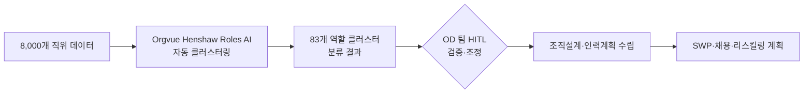

## Summary

Salesforce의 Organizational Strategy & Effectiveness 팀(Stacy Anderson, Director)이 **early access** 고객으로 Orgvue의 Henshaw Roles(직무 자동 클러스터링)를 사용 — ⚠️ 자사 보고: 8,000개 직위를 83개 클러스터로 정리, OD·SWP 타임라인 "최소 6개월" 단축 [[sources/orgvue-salesforce-henshaw-ai-2025]]. Orgvue는 2025-12 Henshaw AI 스위트를 발표했으며 Henshaw Roles·Assistant는 early access 프로그램으로 제공, 추가 기능은 2026년 중 예정 [[sources/orgvue-salesforce-henshaw-ai-2025]]. 직무체계 구축 6개월 → 6일은 Orgvue 보도자료가 Henshaw AI 결과로 제시 ⚠️ 벤더 주장 [[sources/orgvue-salesforce-henshaw-ai-2025]].

## Problem / Why (도입 배경)

- 대규모 테크 기업의 직무 아키텍처 및 조직설계는 수작업 데이터 분류에 수개월 소요
- AI 도입에 따른 역할 재정의·조직 재설계 요구가 급증 → 분석 속도가 의사결정 병목
- 기존 방식: "기회를 찾는" 수동 탐색 → AI 이후: "기회를 검증"하는 방향으로 전환

## Solution Architecture

### A. Process (프로세스)

- **Before (As-is)**: 직무 데이터 수작업 분류 → 직무체계 설계 → 수개월 소요
- **After (To-be)**:
  1. Orgvue Henshaw Roles AI가 8,000개 직위 자동 분석
  2. 83개 역할 클러스터로 자동 분류 (분 단위)
  3. OD 팀이 클러스터 결과 검토·수정 (HITL)
  4. 검증된 클러스터 기반으로 조직설계·인력계획 가속
- **Human-in-the-loop**: OD 전략 팀이 AI 클러스터링 결과 검증·조정
- **Trigger & Frequency**: 조직개편 시 수시(adhoc)
- **Scope of autonomy**: autonomous (데이터 분석·클러스터링); approve-then-act (클러스터 확정·OD 결정)

```mermaid
flowchart LR
    Jobs[8,000개 직위 데이터] --> Henshaw[Orgvue Henshaw Roles AI\n자동 클러스터링]
    Henshaw --> Clusters[83개 역할 클러스터\n분류 결과]
    Clusters --> HITL{OD 팀 HITL\n검증·조정}
    HITL --> OD[조직설계·인력계획 수립]
    OD --> SWP[SWP·채용·리스킬링 계획]
```
범례: 실선 = Orgvue PR / Salesforce 담당자 발언에서 확인

### B. System & Infrastructure (시스템·인프라)

- **Core HRIS**: _미공개 (not disclosed)_
- **AI 시스템 배치**: Orgvue 플랫폼의 Henshaw AI 스위트 (Henshaw Roles·CoModeler·Workforce Analyst AI agent) — Roles·Assistant는 early access [[sources/orgvue-salesforce-henshaw-ai-2025]]
- **배포 환경**: _미공개 (not disclosed)_
- **연동·통합**: _미공개 (not disclosed)_ — 직위 데이터 수집 경로 미기재
- **사용자 접점 (UX layer)**: _미공개 (not disclosed)_
- **인증·권한**: _미공개 (not disclosed)_

### C. Data (데이터)

- **입력 데이터 소스**: 직위(position) 데이터 [[sources/orgvue-salesforce-henshaw-ai-2025]]; JD·직급·보고 체계 등 구체 항목 _미공개_
- **출력**: 역할·역할 클러스터·job family 자동 그룹핑 — Salesforce는 83개 클러스터 ⚠️ 자사 보고 [[sources/orgvue-salesforce-henshaw-ai-2025]]
- **데이터 규모**: 8,000개 직위 ⚠️ 자사 보고 [[sources/orgvue-salesforce-henshaw-ai-2025]]
- **전처리·정제**: _미공개 (not disclosed)_
- **학습 vs RAG vs In-context 구분**: _미공개 (not disclosed)_
- **데이터 거버넌스**: _미공개 (not disclosed)_
- **민감정보 처리**: _미공개 (not disclosed)_

### D. Model (모델)

- **Foundation model**: _미공개 (not disclosed)_
- **Model 유형**: 유사 직위 자동 그룹핑(클러스터링) [[sources/orgvue-salesforce-henshaw-ai-2025]]; CoModeler는 자연어 → 구조화 모델 변환 (LLM 성격) [[sources/orgvue-salesforce-henshaw-ai-2025]]; 기술 세부 _미공개_
- **제공 방식**: Orgvue SaaS (early access) [[sources/orgvue-salesforce-henshaw-ai-2025]]
- **커스터마이징 기법**: _미공개 (not disclosed)_
- **평가·가드레일**: _미공개 (not disclosed)_ — 클러스터 결과는 OD 팀이 검토

### E. Organization & Team (조직·팀 구조)

- **오너십**: Organizational Strategy & Effectiveness 팀 [[sources/orgvue-salesforce-henshaw-ai-2025]]
- **담당자**: Stacy Anderson, Director of Organizational Strategy & Effectiveness (Orgvue 보도자료 인용) [[sources/orgvue-salesforce-henshaw-ai-2025]]
- **팀 규모·기간**: _미공개 (not disclosed)_
- **거버넌스 체계**: _미공개 (not disclosed)_
- **파트너**: Orgvue [[sources/orgvue-salesforce-henshaw-ai-2025]]

## Impact / Metrics (기대효과)

### 기대효과 요약
Before: 8,000개 직위가 미정리 상태, 직무체계 구축 약 6개월 소요 → After: ⚠️ 자사 보고 83개 클러스터로 분류 완료, OD/SWP 타임라인 최소 6개월 단축. ⚠️ 벤더 주장 직무체계 구축 6개월→6일 (Orgvue 일반 사례, Salesforce 특정 아님). 이 case는 Before→After가 가장 명확한 사례 중 하나.

| 지표 | 결과 | 신뢰도 |
|---|---|---|
| 직위 분류 | 8,000개 → 83개 클러스터 | ⚠️ 자사 보고 (Orgvue PR 인용, early access) [[sources/orgvue-salesforce-henshaw-ai-2025]] |
| OD·SWP 타임라인 단축 | "최소 6개월" | ⚠️ 자사 보고 [[sources/orgvue-salesforce-henshaw-ai-2025]] |
| 직무체계 구축 시간 | 6개월 → 6일 | ⚠️ 벤더 주장 (Henshaw AI 결과로 제시) [[sources/orgvue-salesforce-henshaw-ai-2025]] |

## Governance & Risk

- AI 클러스터링 결과의 편향: 특정 직무 그룹이 과소/과대 분류될 경우 → 인력계획 왜곡 가능
- Orgvue 2025 연구: 32%의 기업이 AI 비용 절감 기대로 감원 후 재고용 — 데이터 기반 역할 분석의 중요성 시사

## Contradictions

_없음._

> [!note] 2026-09-27 grounding — Henshaw Roles는 raw 기준 early access 프로그램 제공(2025-12 발표)이며 Salesforce는 early access 고객 인용이므로 stage를 production → pilot으로 정정하고 '정식 출시' 표현을 조정. B·C·D 서술에 인용을 보강하고 소스에 없는 항목(JD·직급 입력, HR 시스템 연동, embedding)은 _미공개_ 처리.

## Consulting Angle

- **조직개편 컨설팅**: "AI 기반 직무 클러스터링으로 직무체계 구축 6개월 → 6일"(벤더 주장, early access)은 조직설계 제안서의 속도 논거 — 벤더 보도자료 기반임을 병기
- **대규모 구조조정/리오그**: 감원·재배치 전 AI 기반 역할 분석으로 결정의 근거 확보 — "23%가 일반 가정으로 감원" 리스크 방지
- **한국 대기업 적용**: 직급체계 개편(예: 삼성의 직위 통폐합 흐름)과 연계 가능; 수만 개 직위를 AI로 클러스터링하는 접근 제안
- **파생 질문**: "클러스터링 후 실제 역할 재정의·JD 갱신 프로세스는 어떻게 이어지는가?" — 후속 단계 설계 필요
