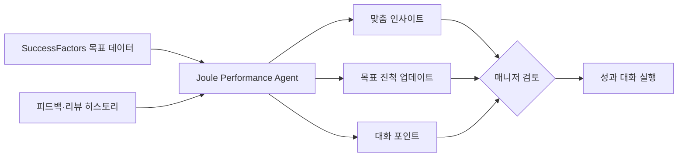

## Summary

SAP SuccessFactors의 첫 번째 HR Joule Agent인 **Performance & Goals Agent**가 2025년 하반기 GA. 매니저에게 맞춤 인사이트·목표 진척 업데이트·개인화된 대화 포인트를 제공해 성과 대화의 질을 높인다. Josh Bersin(Tier 1)은 이를 "one of the most impressive array of enterprise-class AI announcements"로 평가. 2026년 상반기 Career & Talent Development Agent, HR Service Agent, People Intelligence Agent, Payroll Agent 등 4개 추가 에이전트 GA 예정. [[sources/sap-joule-performance-agent-bersin-2025-10.md]]

## Problem / Why

- 매니저가 성과 대화를 준비하는 데 **시간이 많이 소요** — 여러 시스템에서 데이터를 수집해야 함
- 목표 진척도를 실시간으로 파악하기 어려움 → **형식적 리뷰**로 전락
- 대규모 SuccessFactors 고객(SAP ERP 기반 대기업)에서 **HRIS 내장 AI**에 대한 수요 증가
- Bersin: IBM, Disney 등이 Workday → SuccessFactors로 전환하는 사례 증가 — SAP 에코시스템 통합이 동인 [[sources/sap-joule-performance-agent-bersin-2025-10.md]]

## Solution Architecture (요약)

### A. Process (프로세스)

- **Before**: 매니저가 SuccessFactors에서 직원별 목표·피드백·리뷰 데이터를 개별 조회 → 수동으로 대화 포인트 준비
- **After**: Joule Performance & Goals Agent가 목표 진척·피드백 데이터를 자동 통합 → 맞춤 인사이트·대화 포인트 생성 → 매니저가 리뷰 [[sources/sap-joule-performance-agent-bersin-2025-10.md]]
- **HITL 지점**: Agent가 대화 포인트를 추천 — 매니저가 최종 사용 여부 결정
- **Trigger & Frequency**: 성과 리뷰 주기 + 매니저 수시 요청
- **Scope of autonomy**: Recommend

### B. System & Infrastructure

- **Core HRIS**: SAP SuccessFactors
- **AI 시스템**: Joule (SAP의 AI copilot/agent 플랫폼) — SuccessFactors 내장 [[sources/sap-joule-performance-agent-bersin-2025-10.md]]
- **연동**: ✅ Fact: 40개 AI 엔진 통합, Microsoft Copilot 연동, a2a/MCP 프로토콜 지원 [[sources/sap-joule-performance-agent-bersin-2025-10.md]]
- **사용자 접점**: SuccessFactors UI 내 Joule 대화형 인터페이스 + Microsoft Teams/Outlook 연동 [[sources/sap-joule-performance-agent-bersin-2025-10.md]]
- 배포 환경: SAP BTP (Business Technology Platform) 기반 — _상세 미공개_

### C. Data

- **입력**: SuccessFactors 내 목표·성과·피드백·학습 데이터 + SAP Business Data Cloud + Datasphere [[sources/sap-joule-performance-agent-bersin-2025-10.md]]
- **데이터 규모**: _미공개 (not disclosed)_
- **학습 vs RAG**: _미공개 (not disclosed)_

### D. Model

- **Foundation model**: _미공개_ — Joule이 40개 AI 엔진을 통합하므로 다중 모델 오케스트레이션 추정 가능하나 구체 모델명 미공개 [[sources/sap-joule-performance-agent-bersin-2025-10.md]]
- **Orchestration**: a2a/MCP 프로토콜 기반 에이전트 간 통신 [[sources/sap-joule-performance-agent-bersin-2025-10.md]]
- 나머지: _미공개 (not disclosed)_

### E. Organization & Team

- IBM, Disney 등이 Workday → SuccessFactors 전환 (Bersin 언급, 구체 수치 없음) [[sources/sap-joule-performance-agent-bersin-2025-10.md]]
- 거버넌스·팀 구조: _미공개 (not disclosed)_

## Impact / Metrics

### 기대효과 요약

매니저의 성과 대화 준비 시간 단축 + 목표 관리 실시간화. 구체 고객 outcome metric은 미공개.

| 지표 | 값 | 출처 | 성격 |
|---|---|---|---|
| Bersin 평가 | "most impressive enterprise-class AI announcements" | Josh Bersin (Tier 1) | ✅ Fact (독립 분석가 의견) |
| 추가 에이전트 | 4개 (Career, HR Service, People Intelligence, Payroll) — 2026 H1 GA | SAP 공식 + Bersin | ✅ Fact |
| 고객 전환 사례 | IBM, Disney (Workday→SF 전환) | Bersin (구체 수치 없음) | ✅ Fact (언급), 세부 _미공개_ |

## Governance & Risk

- SAP의 a2a/MCP 프로토콜 기반 에이전트 아키텍처는 멀티벤더 AI 통합의 선례 → 거버넌스 복잡성 증가
- 성과 리뷰에 AI가 생성한 대화 포인트의 **편향·환각** 리스크
- EU AI Act 맥락: SAP는 유럽 기반이므로 규제 준수에 강점 주장 가능 — 실제 인증 여부 _미공개_

## Consulting Angle

### 활용 포인트
- **Workday Illuminate vs SAP Joule 비교 프레임워크의 핵심 축**: 두 HRMS 거인의 AI agent 전략을 비교해 "어떤 HRMS AI가 성과관리에 더 성숙한가" 논의 가능
- **a2a/MCP 프로토콜**: 에이전트 간 통신 표준화 — IT 아키텍처 논의에서 선진 사례
- **"HRIS 내장 AI" vs "Point Solution AI" 선택 프레임**: SAP Joule(내장) vs 15Five/BetterUp(독립) — 클라이언트 IT 전략에 따른 추천 차별화

### 한국 적용
- 삼성·SK 등 SAP ERP 대규모 도입 기업에서 SuccessFactors Joule 도입 가능성 높음
- 한국어 Joule 지원 여부가 핵심 의사결정 포인트 — _미공개_
- 국내 SAP 파트너(삼성SDS, LG CNS, 메타넷 등)의 Joule 구현 역량도 변수
