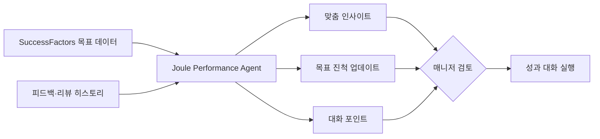

## Summary

SAP가 SAP Connect(2025-10)에서 Joule 에이전트 수십 개를 출시했으며 HR 영역에는 **Performance and Goals Agent**, Career and Talent Development Agent, HR Service Agent, Payroll Agent, People Intelligence Agent 5개가 포함 — Josh Bersin(Tier 1) 현장 분석 [[sources/sap-joule-performance-agent-bersin-2025-10.md]]. 이 에이전트들은 목표 개발·검토, 커리어 플랜, 학습 프로그램, HR 질문 응답, 급여 관리·대사 등을 돕는 "mini-app"으로 설명됨 [[sources/sap-joule-performance-agent-bersin-2025-10.md]]. Bersin은 "one of the most impressive array of enterprise-class AI announcements I've seen to date"로 평가 [[sources/sap-joule-performance-agent-bersin-2025-10.md]]. 'Performance & Goals Agent 단독 선행 GA·나머지 4개 2026 상반기 GA' 일정과 '맞춤 인사이트·대화 포인트' 기능 세부는 인용 소스 raw에 없음 → _미공개_ (2026-09-27 grounding 점검).

## Problem / Why (도입 배경)

- 매니저가 성과 대화를 준비하는 데 **시간이 많이 소요** — 여러 시스템에서 데이터를 수집해야 함
- 목표 진척도를 실시간으로 파악하기 어려움 → **형식적 리뷰**로 전락
- 대규모 SuccessFactors 고객(SAP ERP 기반 대기업)에서 **HRIS 내장 AI**에 대한 수요 증가
- Bersin: IBM, Disney 등이 Workday → SuccessFactors로 전환하는 사례 증가 — SAP 에코시스템 통합이 동인 [[sources/sap-joule-performance-agent-bersin-2025-10.md]]

## Solution Architecture

### A. Process (프로세스)

- **Before**: _미공개 (not disclosed)_ — 도입 전 프로세스는 인용 소스에 없음
- **After**: Joule 채팅을 통해 직원·매니저가 목표를 개발·검토 (Performance and Goals Agent) [[sources/sap-joule-performance-agent-bersin-2025-10.md]]; 세부 흐름(인사이트·대화 포인트 생성)은 _미공개_
- **HITL 지점**: _미공개 (not disclosed)_ — 매니저 최종 결정 여부 미기재
- **Trigger & Frequency**: _미공개 (not disclosed)_
- **Scope of autonomy**: _미공개 (not disclosed)_ — "mini-app"으로 사용자를 돕는다는 서술만 [[sources/sap-joule-performance-agent-bersin-2025-10.md]]

```mermaid
flowchart LR
    A[SuccessFactors 목표 데이터] --> B[Joule Performance Agent]
    C[피드백·리뷰 히스토리] --> B
    B --> D[맞춤 인사이트]
    B --> E[목표 진척 업데이트]
    B --> F[대화 포인트]
    D --> G{매니저 검토}
    E --> G
    F --> G
    G --> H[성과 대화 실행]
```

### B. System & Infrastructure (시스템·인프라)

- **Core HRIS**: SAP SuccessFactors [[sources/sap-joule-performance-agent-bersin-2025-10.md]]
- **AI 시스템**: Joule — SAP 앱·데이터 위에 놓인 AI 에이전트 플랫폼, Joule Studio로 프로그래밍 가능 [[sources/sap-joule-performance-agent-bersin-2025-10.md]]
- **연동**: ✅ Fact(분석가 기술): 40개 AI 엔진 지원, Microsoft Copilot 및 타 에이전트와 a2a·MCP 프로토콜로 상호운용 [[sources/sap-joule-performance-agent-bersin-2025-10.md]]; SAP 주장 "핵심 기능의 80%를 Joule로 접근" ⚠️ 벤더 주장(Bersin 전달) [[sources/sap-joule-performance-agent-bersin-2025-10.md]]
- **사용자 접점**: Joule 채팅 인터페이스 [[sources/sap-joule-performance-agent-bersin-2025-10.md]]; Teams·Outlook 연동 여부 _미공개_
- **배포 환경**: _미공개 (not disclosed)_

### C. Data (데이터)

- **입력**: SAP Business Data Cloud(앱 데이터 통합) + Datasphere(데이터 사전) [[sources/sap-joule-performance-agent-bersin-2025-10.md]]; 성과·목표 데이터 항목 세부 _미공개_
- **데이터 규모**: _미공개 (not disclosed)_
- **전처리·정제**: _미공개 (not disclosed)_
- **학습 vs RAG**: _미공개 (not disclosed)_
- **데이터 거버넌스**: _미공개 (not disclosed)_
- **민감정보 처리**: _미공개 (not disclosed)_

### D. Model (모델)

- **Foundation model**: _미공개 (not disclosed)_ — Joule이 40개 AI 엔진을 지원한다는 서술만 있고 구체 모델명 없음 [[sources/sap-joule-performance-agent-bersin-2025-10.md]]
- **Model 유형**: agent (Joule 에이전트, 채팅 인터페이스) [[sources/sap-joule-performance-agent-bersin-2025-10.md]]
- **제공 방식**: _미공개 (not disclosed)_
- **커스터마이징 기법**: Joule Studio로 자체 에이전트 구축 가능 [[sources/sap-joule-performance-agent-bersin-2025-10.md]]
- **Orchestration**: a2a·MCP 프로토콜로 에이전트 간 상호운용 [[sources/sap-joule-performance-agent-bersin-2025-10.md]]
- **평가·가드레일**: _미공개 (not disclosed)_

### E. Organization & Team (조직·팀 구조)

- IBM, Disney 등이 Workday → SuccessFactors 전환 (Bersin 언급, 구체 수치 없음) [[sources/sap-joule-performance-agent-bersin-2025-10.md]]
- 거버넌스·팀 구조: _미공개 (not disclosed)_

## Impact / Metrics (기대효과)

### 기대효과 요약

매니저의 성과 대화 준비 시간 단축 + 목표 관리 실시간화. 구체 고객 outcome metric은 미공개.

| 지표 | 값 | 출처 | 성격 |
|---|---|---|---|
| Bersin 평가 | "one of the most impressive array of enterprise-class AI announcements I've seen to date" | [[sources/sap-joule-performance-agent-bersin-2025-10.md]] | ✅ Fact (독립 분석가 의견, Galileo-Joule 연동 이해관계 있음) |
| HR Joule Agent | 5개 (Performance and Goals, Career and Talent Development, HR Service, Payroll, People Intelligence) — SAP Connect 2025-10 출시 | [[sources/sap-joule-performance-agent-bersin-2025-10.md]] | ✅ Fact (분석가 기술) |
| 단계별 GA 일정 | _미공개_ (인용 소스 raw에 없음 — 2026-09-27 grounding 점검) | — | — |
| Joule 접근 범위 | 핵심 기능의 80% | SAP 주장, [[sources/sap-joule-performance-agent-bersin-2025-10.md]] 전달 | ⚠️ 벤더 주장 |
| 고객 전환 사례 | IBM, Disney (Workday→SF 전환) | [[sources/sap-joule-performance-agent-bersin-2025-10.md]] (구체 수치 없음) | ✅ Fact (언급), 세부 _미공개_ |

## Governance & Risk

- SAP의 a2a/MCP 프로토콜 기반 에이전트 아키텍처는 멀티벤더 AI 통합의 선례 → 거버넌스 복잡성 증가
- 성과 리뷰에 AI가 생성한 대화 포인트의 **편향·환각** 리스크
- EU AI Act 맥락: SAP는 유럽 기반이므로 규제 준수에 강점 주장 가능 — 실제 인증 여부 _미공개_

## Contradictions

> [!note] 2026-09-27 grounding — Bersin raw는 5개 HR 에이전트가 SAP Connect(2025-10)에서 함께 출시됐다고 기술하며 'Performance & Goals 선행 GA·4개 2026 H1 GA' 일정, '맞춤 인사이트·대화 포인트' 기능 세부, Teams/Outlook 연동, SAP BTP 배포는 raw에 없어 _미공개_ 처리. Bersin은 자사 Galileo의 Joule 연동을 홍보 — 이해관계 병기.

## Consulting Angle

### 활용 포인트
- **Workday Illuminate vs SAP Joule 비교 프레임워크의 핵심 축**: 두 HRMS 거인의 AI agent 전략을 비교해 "어떤 HRMS AI가 성과관리에 더 성숙한가" 논의 가능
- **a2a/MCP 프로토콜**: 에이전트 간 통신 표준화 — IT 아키텍처 논의에서 선진 사례
- **"HRIS 내장 AI" vs "Point Solution AI" 선택 프레임**: SAP Joule(내장) vs 15Five/BetterUp(독립) — 클라이언트 IT 전략에 따른 추천 차별화

### 한국 적용
- 삼성·SK 등 SAP ERP 대규모 도입 기업에서 SuccessFactors Joule 도입 가능성 높음
- 한국어 Joule 지원 여부가 핵심 의사결정 포인트 — _미공개_
- 국내 SAP 파트너(삼성SDS, LG CNS, 메타넷 등)의 Joule 구현 역량도 변수
