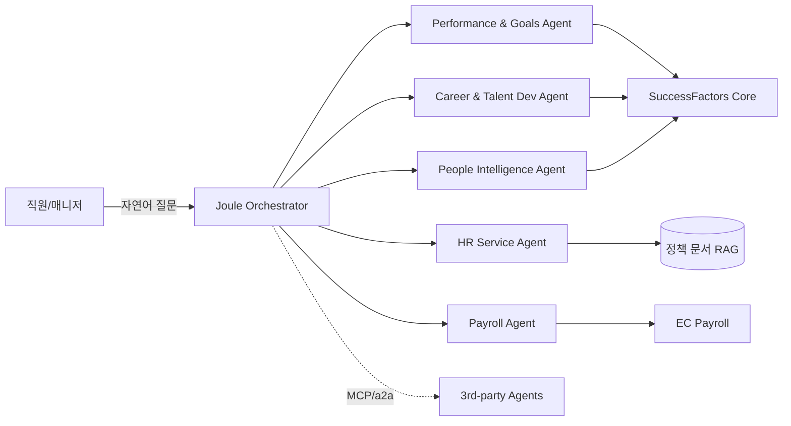

## Summary

SAP가 2026-04에 발표한 SuccessFactors 1H 2026 Release에서 **4개 신규 Joule Agent**가 May 2026 GA 예정. 기존 Performance & Goals Agent에 더해 **Career & Talent Development Agent**(승계·커리어), **HR Service Agent**(self-service), **People Intelligence Agent**(매니저 분석), **Payroll Agent**(급여 Q&A)가 추가됨. SAP 자사 표현으로 "the most comprehensive AI agent suite for HR". a2a/MCP 프로토콜 지원으로 3rd-party agent 호출 가능.

## Problem / Why (도입 배경)

- **Before (baseline)**: SAP SuccessFactors는 conventional HCM 위주, AI 기능은 모듈별 산발 (Joule 초기 release). Workday Illuminate에 비해 agentic 카테고리 catch-up 필요.
- **Pain point**: 대규모 SAP HCM 고객(IBM·Disney·한국 제조 대기업)이 AI 에이전트 carve-out을 별도 벤더로 가는 것을 막아야 함. SAP suite 안에 native agent 생태계 형성이 시급.
- **Trigger**: Workday Illuminate (2024~2025), Workday × Sana 인수, Workday ASOR(2026-02) 등 경쟁 압박. SAP가 Joule 통합 가속화로 대응.

## Solution Architecture

### A. Process

- **5개 Joule Agent별 process 차이**:
  1. **Performance & Goals Agent** (기존, GA): 매니저에게 팀 성과 인사이트·목표 진척·1:1 대화 포인트 제공 → 상세는 [[sap-joule-performance-goals-agent]]
  2. **Career & Talent Development Agent** (신규): 직원 스킬·커리어 목표 매핑 → 학습/내부 이동/멘토링 추천. 매니저는 후계자 후보 자동 식별
  3. **HR Service Agent** (신규): 직원 정책 Q&A·티켓 deflection — ⚠️ 벤더 주장 60% deflection (early access 평균)
  4. **People Intelligence Agent** (신규): 매니저 dashboard에 팀 이슈 알림·action recommendation
  5. **Payroll Agent** (신규): 직원 pay 관련 Q&A (FAQ 위주)

- **Before (As-is, HR Service Agent 예시)**: 1) 직원이 HR 포털·이메일·전화로 정책 문의 / 2) HRBP/HR ops가 수동 응답 / 3) 평균 응답 1~3일
- **After (To-be)**: 1) Joule 채팅창에 자연어 질문 / 2) Agent가 정책 문서 RAG로 즉시 응답 / 3) 복잡 케이스는 HR ops 티켓으로 escalate
- **HITL**: HR Service는 escalation 케이스에서 사람 개입. Career Agent는 매니저 검토. Payroll Agent는 단순 Q&A만 자율, 정정·계산 변경은 payroll team
- **Trigger & Frequency**: 직원 셀프서비스(daily) + 매니저 분석(주/월) + 페이롤 Q&A(monthly 정기 + adhoc)

### B. System & Infrastructure

- **Core HRIS**: SAP SuccessFactors (전 모듈 — Performance, Compensation, Learning, Recruiting, EC Payroll)
- **AI 시스템 배치**: Joule이 SuccessFactors 코어에 내장. 통합 LLM 오케스트레이터.
- **배포 환경**: SAP BTP (Business Technology Platform) cloud
- **연동·통합**: 40개 AI 엔진 통합 (Bersin 분석), Microsoft Copilot 연동, **a2a/MCP 프로토콜 지원** (3rd-party agent 호출)
- **사용자 접점**: SuccessFactors web/mobile + Microsoft Teams + a2a 경유 외부 channel
- **인증·권한**: SAP IAM (전사 SSO 통합)

### C. Data

- **입력 데이터 소스**: 직원 프로필, 정책 문서, 성과 데이터, 페이롤 데이터, 학습 이력, 스킬 매핑
- **데이터 규모**: _미공개_
- **전처리·정제**: SAP HANA 기반 통합 데이터 레이어
- **학습 vs RAG vs In-context 구분**: HR Service는 RAG (정책 문서). Performance·Career는 in-context + 데이터 분석. Payroll은 RAG + 정형 룩업
- **데이터 거버넌스**: SAP 표준 (GDPR 인증, EU 데이터 거주)
- **민감정보 처리**: 페이롤 데이터는 강한 격리, RBAC 적용

### D. Model

- **Foundation model**: SAP 자체 호스팅 + 외부 API 혼합. 구체 base model 지속 evolving
- **Model 유형**: LLM (생성·대화) + agentic (tool-use, MCP)
- **제공 방식**: SAP BTP에서 통합 제공
- **커스터마이징 기법**: RAG (정책·문서) + few-shot (페이롤 룰) + agent orchestration
- **Orchestration 프레임워크**: SAP 자체 구축
- **평가·가드레일**: SAP 표준 content filter + GDPR/EU AI Act 대응 모니터링

### E. Organization & Team

- **오너십**: HR 부서 + IT/CIO (SAP 관계사 협업)
- **참여 역할**: HRBP·HR Tech PM·SAP CoE·IT
- **거버넌스 체계**: SAP의 자체 AI Ethics 정책 + 고객사 별도 AI 위원회
- **변화관리**: HR ops 직무 재설계, 매니저 self-service 확장 교육

### F. Diagrams

## Impact / Metrics (기대효과)

### 기대효과 요약
SAP HCM 고객이 별도 point solution 없이 native agent 생태계로 5개 HR 영역(성과·커리어·서비스·분석·페이롤)을 통합 자동화. ⚠️ 벤더 주장 60% HR 티켓 deflection (early access 평균).

- **Before → After**:
  - HR Service: 응답 1~3일 → ⚠️ 벤더 주장 60% 즉시 self-service deflection
  - Career: 매니저 후계자 식별 수동·연1회 → AI 추천 상시
  - Performance: 1:1 대화 포인트 수동 → AI 자동 제안
  - Payroll Q&A: HR ops 수동 응답 → FAQ 자동 응답
- **Forrester TEI / 독립 검증**: 1H 2026 GA 직후로 별도 미발표
- **레퍼런스 customer**: IBM, Disney 등 Workday→SAP 마이그레이션 사례 (Bersin 분석에서 언급, 구체 metric 미공개)

## Governance & Risk

- ⚠️ 벤더 주장 60% deflection 수치 출처 검증 불가 (early access 명단 미공개)
- ⚠️ 한국 페이롤 복잡성(연말정산·퇴직정산·DC/DB·복지포인트·52시간) 지원 여부 미공개 — Payroll Agent KR fit POC 필수
- ⚠️ a2a/MCP 통한 3rd-party agent 호출의 보안·감사 모델 미검증
- ✅ EU/GDPR 거버넌스는 SAP 표준 강점
- ⚠️ 한국 AI 기본법 "고영향 AI" 범주(채용·승진·해고)와 Career Agent의 후계자 추천 기능이 직접 충돌 — 인적감독 의무 자동 적용 여부 검토 필요

## Contradictions

(없음 — GA 직후)

## Consulting Angle

- **KR 적용 1순위**: SAP HCM 점유율 큰 한국 제조 대기업(현대차·포스코·한화·LG화학·SK하이닉스 일부) 직격. SAP 도입사 대상 "Joule 5-agent 통합 로드맵" 컨설팅 시급
- **2026 Q3-Q4 핵심 슬라이드**: Workday Illuminate vs SAP Joule 5-agent vs Oracle Fusion Workforce Agent 3-way 비교덱
- **Payroll Agent 한국 fit 검증 필수**: 한국 페이롤 룰(연말정산 등 [[douzone-one-ai-year-end-tax]] 비교) 지원 여부 POC. 부족하면 더존 ONE AI·시프티 등 KR 솔루션 보완 제안
- **HR Service Agent 보강**: 한국어 quality 검증 + 정책 RAG 코퍼스 한국 법규(근로기준법·산업안전보건법) 추가 필요
- **AI 기본법 dual-compliance 어젠다**: Career Agent의 후계자 추천 기능에 "인적감독 의무" + "이용자 고지" 의무 반영 — 한국 AI 기본법 시행령 2026 상반기 추가 고시 후 재점검
- **반면교사 포인트**: 60% deflection 등 벤더 주장 수치를 실측 없이 임원 발표에 인용 시 추후 검증 부담 — POC 결과 데이터로 대체 권장
