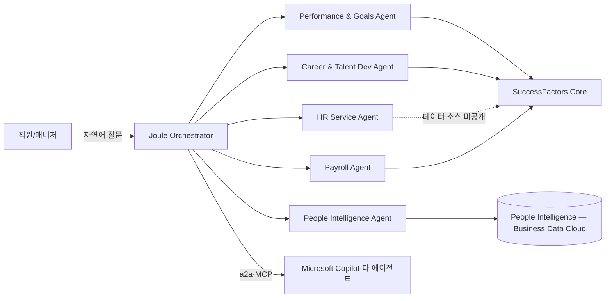

## Summary

SAP SuccessFactors 1H 2026 Release(2026-04)는 **suite-wide agentic AI 확장** — 채용·인사행정·급여·학습·성과·인재개발 영역을 지원하는 연결된 AI 에이전트 네트워크, Joule을 통한 workforce knowledge network(외부 전문 지식·리서치), Learning intelligent Q&A, People Intelligence 패키지(SAP Business Data Cloud)의 pay transparency insights, 스킬 거버넌스 강화를 발표 ⚠️ 벤더 주장 [[sources/sap-1h-2026-release-2026-04.md]]. HR Joule Agent 5종(Performance and Goals, Career and Talent Development, HR Service, Payroll, People Intelligence)은 SAP Connect 2025-10에서 출시 — Bersin 분석 [[sources/sap-joule-performance-agent-bersin-2025-10.md]]; Joule은 Microsoft Copilot·타 에이전트와 a2a·MCP 프로토콜로 상호운용 [[sources/sap-joule-performance-agent-bersin-2025-10.md]]. '4개 신규 에이전트 May 2026 GA'·'60% 티켓 deflection'·'most comprehensive AI agent suite' 표현은 인용 소스 raw에 없음 → _미공개_ (수치 근거 미확보 — 2026-09-27 grounding 점검).

## Problem / Why (도입 배경)

- **Before (baseline)**: 벤더 제품이므로 특정 기업의 도입 배경은 고객별 상이. SAP의 문제 설정: AI가 고립된 기능이 아니라 인력 lifecycle 전체에서 맥락을 공유하며 작동해야 효과가 큼 [[sources/sap-1h-2026-release-2026-04.md]]; Bersin은 Joule 초기 방향이 불분명했다가 명확해졌다고 평가 [[sources/sap-joule-performance-agent-bersin-2025-10.md]]
- **Pain point**: 🚫 일반론: 대규모 HCM 고객이 AI 에이전트를 별도 벤더로 분리 도입하는 것을 suite 내 native 에이전트로 흡수 — SAP 명시 근거 없음
- **Trigger**: ❓ 미공개 — 경쟁사(Workday) 대응 서술은 인용 소스에 없음. Bersin은 SAP 엔터프라이즈 사용자(IBM·Disney 등)가 Workday에서 SuccessFactors로 전환했다고 언급 [[sources/sap-joule-performance-agent-bersin-2025-10.md]]

## Solution Architecture

### A. Process (프로세스)

- **5개 HR Joule Agent** (SAP Connect 2025-10 출시, Bersin 기술 [[sources/sap-joule-performance-agent-bersin-2025-10.md]]) — "mini-app" 기능 설명:
  1. **Performance and Goals Agent**: 직원의 목표 개발·검토 지원 → [[sap-joule-performance-goals-agent]]
  2. **Career and Talent Development Agent**: 커리어 플랜 수립 지원 — 후계자 후보 자동 식별 서술은 인용 소스에 없음 _미공개_
  3. **HR Service Agent**: HR 질문 응답 — 티켓 deflection 수치 _미공개_ (수치 근거 미확보 — 2026-09-27 grounding 점검)
  4. **People Intelligence Agent**: People Intelligence 제품(스킬·engagement·turnover 모니터링 + 권고) Joule 인터페이스 [[sources/sap-joule-performance-agent-bersin-2025-10.md]]; 1H 2026 pay transparency insights 추가 [[sources/sap-1h-2026-release-2026-04.md]]
  5. **Payroll Agent**: 급여 관리·대사(reconcile) 지원 [[sources/sap-joule-performance-agent-bersin-2025-10.md]]
  - 1H 2026 release 추가: Joule 경유 workforce knowledge network(외부 고용 가이드·리서치), SuccessFactors Learning intelligent Q&A(학습 콘텐츠 기반 즉답) [[sources/sap-1h-2026-release-2026-04.md]]

- **Before (As-is)**: _미공개 (not disclosed)_ — 응답 시간 등 baseline은 인용 소스에 없음
- **After (To-be)**: Joule 채팅으로 정보 검색·데이터 분석·팀/프로세스 모니터링·조언 획득 ("front door") [[sources/sap-joule-performance-agent-bersin-2025-10.md]]; RAG·escalation 흐름 세부 _미공개_
- **HITL**: _미공개 (not disclosed)_ — 에이전트별 검토·escalation 절차 미기재
- **Trigger & Frequency**: _미공개 (not disclosed)_

### B. System & Infrastructure (시스템·인프라)

- **Core HRIS**: SAP SuccessFactors — Employee Central·Onboarding·Learning·Global Benefits 등 언급 [[sources/sap-1h-2026-release-2026-04.md]]; SmartRecruiters 네이티브 통합 [[sources/sap-1h-2026-release-2026-04.md]]
- **AI 시스템 배치**: Joule — SAP 앱·데이터 위 AI 에이전트 플랫폼 [[sources/sap-joule-performance-agent-bersin-2025-10.md]]; suite-wide 에이전트 네트워크 [[sources/sap-1h-2026-release-2026-04.md]]
- **배포 환경**: SAP BTP 상 custom extension 지원(extensibility wizard) [[sources/sap-1h-2026-release-2026-04.md]]; 에이전트 자체 배포 환경 _미공개_
- **연동·통합**: 40개 AI 엔진 지원, Microsoft Copilot·타 에이전트와 a2a·MCP 상호운용 [[sources/sap-joule-performance-agent-bersin-2025-10.md]]; SAP Business Data Cloud [[sources/sap-1h-2026-release-2026-04.md]] [[sources/sap-joule-performance-agent-bersin-2025-10.md]]
- **사용자 접점**: Joule 채팅 [[sources/sap-joule-performance-agent-bersin-2025-10.md]]; Teams·모바일 등 채널 세부 _미공개_
- **인증·권한**: _미공개 (not disclosed)_

### C. Data (데이터)

- **입력 데이터 소스**: 학습 콘텐츠(Learning Q&A) [[sources/sap-1h-2026-release-2026-04.md]], 보상 데이터(pay transparency insights) [[sources/sap-1h-2026-release-2026-04.md]], 스킬 데이터(talent intelligence hub) [[sources/sap-1h-2026-release-2026-04.md]], 외부 고용 가이드·리서치(workforce knowledge network) [[sources/sap-1h-2026-release-2026-04.md]]; SAP Business Data Cloud·Datasphere 통합 [[sources/sap-joule-performance-agent-bersin-2025-10.md]]
- **데이터 규모**: _미공개 (not disclosed)_
- **전처리·정제**: _미공개 (not disclosed)_ — HANA 서술은 인용 소스에 없음
- **학습 vs RAG vs In-context 구분**: Learning Q&A는 조직의 학습 콘텐츠에서 직접 응답 생성 [[sources/sap-1h-2026-release-2026-04.md]]; 그 외 에이전트별 기법 _미공개_
- **데이터 거버넌스**: 스킬 거버넌스 중앙 인터페이스(talent intelligence hub) [[sources/sap-1h-2026-release-2026-04.md]]; GDPR 인증·EU 데이터 거주 서술은 인용 소스에 없음 _미공개_
- **민감정보 처리**: _미공개 (not disclosed)_

### D. Model (모델)

- **Foundation model**: _미공개 (not disclosed)_ — Joule이 40개 AI 엔진을 지원한다는 서술만 [[sources/sap-joule-performance-agent-bersin-2025-10.md]]
- **Model 유형**: agent (채팅 기반 Joule 에이전트, a2a·MCP 상호운용) [[sources/sap-joule-performance-agent-bersin-2025-10.md]]
- **제공 방식**: SuccessFactors suite 내 제공 [[sources/sap-1h-2026-release-2026-04.md]]; 호스팅 세부 _미공개_
- **커스터마이징 기법**: Joule Studio로 자체 에이전트 구축 [[sources/sap-joule-performance-agent-bersin-2025-10.md]]; BTP extensibility wizard [[sources/sap-1h-2026-release-2026-04.md]]; RAG·few-shot 서술은 인용 소스에 없음 _미공개_
- **Orchestration 프레임워크**: _미공개 (not disclosed)_
- **평가·가드레일**: _미공개 (not disclosed)_ — content filter·EU AI Act 모니터링 서술은 인용 소스에 없음

### E. Organization & Team (조직·팀 구조)

- **오너십**: SAP 벤더 제품 — 고객사 HR·IT 운영 (고객별 상이); SAP 측 SuccessFactors 책임자 Dan Beck(President), Bianka Woelke(GVP Application Product Management) [[sources/sap-joule-performance-agent-bersin-2025-10.md]] [[sources/sap-1h-2026-release-2026-04.md]]
- **참여 역할**: _미공개 (not disclosed)_
- **거버넌스 체계**: _미공개 (not disclosed)_ — SAP AI Ethics 정책 서술은 인용 소스에 없음
- **변화관리**: _미공개 (not disclosed)_
- **파트너**: Bersin의 Galileo가 Joule에 연동 예정(2026) — 분석가 이해관계 [[sources/sap-joule-performance-agent-bersin-2025-10.md]]

### F. Diagrams (도식)

```mermaid
flowchart LR
    User[직원/매니저] -->|자연어 질문| Joule[Joule Orchestrator]
    Joule --> Perf[Performance & Goals Agent]
    Joule --> Career[Career & Talent Dev Agent]
    Joule --> Service[HR Service Agent]
    Joule --> People[People Intelligence Agent]
    Joule --> Pay[Payroll Agent]
    Perf --> SF[SuccessFactors Core]
    Career --> SF
    Service -.->|"데이터 소스 미공개"| SF
    People --> PI[(People Intelligence — Business Data Cloud)]
    Pay --> SF
    Joule -->|a2a·MCP| Ext[Microsoft Copilot·타 에이전트]
```
범례: 실선 = Bersin 2025-10·SAP 1H 2026 release 확인. 점선 = 소스 미확인. 5개 에이전트 명칭은 Bersin, People Intelligence·pay transparency는 SAP.

## Impact / Metrics (기대효과)

### 기대효과 요약
SAP HCM 고객이 suite 내 Joule 에이전트로 성과·커리어·HR 서비스·분석·페이롤 영역을 다룰 수 있게 됨 (⚠️ 벤더 발표 + Bersin 분석). 정량 outcome _미공개_.

- ⚠️ 벤더 주장: SAP 핵심 기능의 80%를 Joule로 접근 가능 (Bersin 전달) [[sources/sap-joule-performance-agent-bersin-2025-10.md]]
- ⚠️ 벤더 주장: 1H 2026 — 연결된 에이전트 네트워크가 채용·인사행정·급여·학습·성과·인재개발 지원 [[sources/sap-1h-2026-release-2026-04.md]]
- HR Service Agent 티켓 deflection 60%: _미공개_ (수치 근거 미확보 — 2026-09-27 grounding 점검) — source 페이지 Key Claims에만 있고 raw 스냅샷에 없음
- Before → After 수치(응답 1~3일 등): _미공개_
- **Forrester TEI / 독립 검증**: 미발표
- **레퍼런스 customer**: IBM, Disney 등 Workday→SAP 전환 사례 (Bersin 언급, 구체 metric 미공개) [[sources/sap-joule-performance-agent-bersin-2025-10.md]]

## Governance & Risk

- ⚠️ '60% deflection' 수치는 인용 소스 raw에 없어 본문에서 제거 — frontmatter output 필드의 표기는 미수정(정정 필요)
- ⚠️ 한국 페이롤 복잡성(연말정산·퇴직정산·DC/DB·복지포인트·52시간) 지원 여부 미공개 — Payroll Agent KR fit POC 필수
- ⚠️ a2a/MCP 통한 3rd-party agent 호출의 보안·감사 모델 미검증
- ⚠️ EU pay transparency 규제 대응용 insights 제공 [[sources/sap-1h-2026-release-2026-04.md]]; GDPR 거버넌스 세부 _미공개_
- ⚠️ 한국 AI 기본법 "고영향 AI" 범주(채용·승진·해고)와 Career Agent의 후계자 추천 기능이 직접 충돌 — 인적감독 의무 자동 적용 여부 검토 필요

## Contradictions

> [!contradiction] 출시 시점: source 페이지 [[sources/sap-1h-2026-release-2026-04.md]] Key Claims는 '4개 신규 Joule Agent May 2026 GA'라 하나 raw 스냅샷(SAP 블로그 본문)에는 에이전트명·GA 일정·60% 수치가 없고, Bersin [[sources/sap-joule-performance-agent-bersin-2025-10.md]]은 5개 HR 에이전트가 SAP Connect 2025-10에 출시됐다고 기술. 상태: noted — source 페이지 Key Claims 재검증 필요(/hr-verify).

> [!note] 2026-09-27 grounding — 인용 소스 raw에 없는 60% deflection, May 2026 GA, 'most comprehensive' 표현, 후계자 자동 식별, RAG·few-shot·HANA·GDPR 인증·content filter·SAP IAM·Teams 접점·HR ops 응답 1~3일 서술을 제거·_미공개_ 처리. B·C·D에 SAP 1H 2026 release raw 확인 항목(Learning Q&A·pay transparency·skills governance·BTP extensibility·SmartRecruiters 통합)을 인용과 함께 추가.

## Consulting Angle

- **KR 적용 1순위**: SAP HCM 점유율 큰 한국 제조 대기업(현대차·포스코·한화·LG화학·SK하이닉스 일부) 직격. SAP 도입사 대상 "Joule 5-agent 통합 로드맵" 컨설팅 시급
- **2026 Q3-Q4 핵심 슬라이드**: Workday Illuminate vs SAP Joule 5-agent vs Oracle Fusion Workforce Agent 3-way 비교덱
- **Payroll Agent 한국 fit 검증 필수**: 한국 페이롤 룰(연말정산 등 [[douzone-one-ai-year-end-tax]] 비교) 지원 여부 POC. 부족하면 더존 ONE AI·시프티 등 KR 솔루션 보완 제안
- **HR Service Agent 보강**: 한국어 quality 검증 + 정책 RAG 코퍼스 한국 법규(근로기준법·산업안전보건법) 추가 필요
- **AI 기본법 dual-compliance 어젠다**: Career Agent의 후계자 추천 기능에 "인적감독 의무" + "이용자 고지" 의무 반영 — 한국 AI 기본법 시행령 2026 상반기 추가 고시 후 재점검
- **반면교사 포인트**: 벤더 주장 수치(deflection 등)를 실측 없이 임원 발표에 인용 시 추후 검증 부담 — 현재 raw에서 확인되는 정량 수치가 없으므로 POC 결과 데이터로 대체 권장
