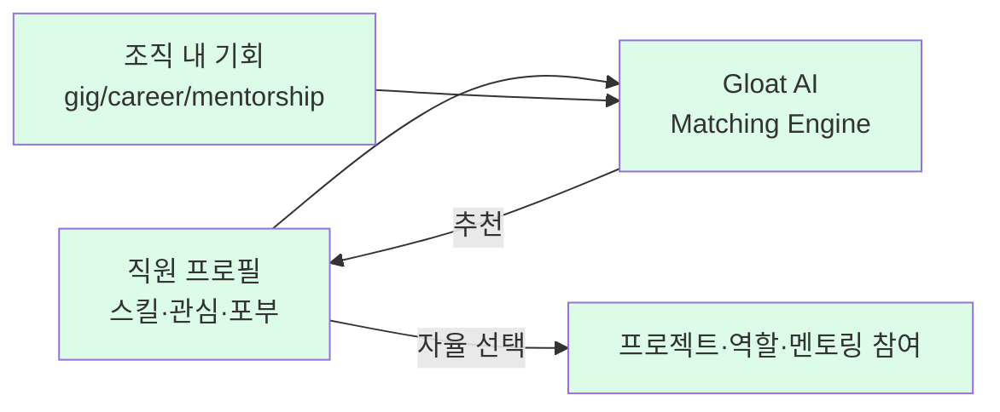

# Schneider Electric — Open Talent Market (Gloat AI)

## Summary

Schneider Electric(글로벌 에너지 관리·자동화 기업, 135,000+ 직원)은 Gloat 기반 **"Open Talent Market"**을 2020-04에 전사 big bang launch. 직원의 스킬·관심을 AI가 분석해 **gig work·career transitions·mentorship** 기회를 매칭. ⚠️ 벤더 주장: **360,000+ 시간 unlocked, $15M+ 생산성 향상 + 채용 비용 절감**. Unilever FLEX와 함께 Gloat의 양대 레퍼런스. **Josh Bersin**(Tier 1)이 2019년 독립 분석에서 "가장 영리한 비즈니스 리더" CHRO Olivier Blum의 전략으로 소개 ([[bersin-schneider-unilever-talent-marketplace-2019-07]]). **SHRM**(Tier 2)이 2025년 현 CHRO Charise Le의 비전통적 인재 전략으로 재조명 ([[shrm-schneider-electric-chro-nontraditional-2025]]).

## Problem / Why

- ⚠️ 자사 보고: **직원의 50%가 "내부 성장 기회 부족"을 퇴직 주요 사유로 꼽음** — 이 데이터가 Open Talent Market 구축의 직접적 트리거
- 135,000명 규모에서 부서·지역 간 인력 가시성 부족 → 외부 채용에 의존
- 직원은 현재 역할 외 기회를 알 수 없고, 매니저는 팀원을 놓치지 않으려 함

## Solution Architecture

### A. Process

- **Before (As-is)**: 직원이 내부 성장 기회를 인식하지 못함 → 50% 퇴직 사유
- **After (To-be)**:
  1. 직원이 프로필(스킬·관심·포부) 작성
  2. Gloat AI가 스킬·관심과 조직 내 기회를 매칭
  3. 제공되는 기회 유형: **gig work(단기 프로젝트)**, **career transitions(역할 이동)**, **mentorship(멘토링)**
  4. 직원이 자율적으로 참여 선택
- **Launch 전략**: 초기 HR 부서 pilot → 국가별 순차 rollout 시도 → **big bang 전환 (2020-04)**
- **HITL**: 직원 자율 선택 (Unilever와 동일한 recommend-only 패턴)

### B~E. 시스템·데이터·모델·조직 — 세부 대부분 _미공개_ (Unilever FLEX와 동일 패턴)

### B. System & Infrastructure (R9 research)

- **Core HRIS**: ✅ Oracle Fusion HCM, Taleo (ATS), Cornerstone (LMS) 통합 — Bersin 2019 독립 확인
- **AI 시스템 배치**: Gloat Workforce Agility Platform — SaaS, Schneider 사내 SSO
- **배포 환경**: _미공개_ (Gloat AWS multi-tenant SaaS 추정)
- **연동·통합**: ✅ Oracle Fusion·Taleo·Cornerstone과 데이터 sync (skill·position·learning)
- **사용자 접점**: Gloat web·모바일 — 직원 프로필·기회 매칭 dashboard
- **인증·권한**: 사내 SSO (구체 IdP _미공개_)

### C. Data (R9 research)

- **입력 데이터 소스**: 직원 프로필 (스킬·관심·포부), 조직 내 기회 (gig·career·mentorship)
- **데이터 규모**: ⚠️ 자사 보고: 135K+ 직원, 등록률 89% (NA 92%), gig 13,400건, mentor 27,500건
- **전처리·정제**: _미공개_ — Gloat skill ontology 기반 inference 추정
- **학습 vs RAG vs In-context**: matching engine = skills graph + ML recommendation
- **데이터 거버넌스**: _미공개_ — 직원 자율 입력 + 매칭 활용 동의
- **민감정보 처리**: _미공개_ — EU GDPR (Schneider HQ 프랑스)

### D. Model (R9 research)

- **Foundation model**: _미공개_ — Gloat 자체 ML/skills inference, LLM 도입 여부 (2024+) 별도 발표 미확인
- **모델 유형**: predictive (recommendation·ranking) + skills inference
- **제공 방식**: Gloat SaaS (자체 호스팅)
- **커스터마이징 기법**: ✅ Schneider 41 capability·career path 자체 정의를 Gloat에 주입
- **Orchestration 프레임워크**: _미공개_
- **평가·가드레일**: _미공개_ — bias audit·explainability 결과 공식 발표 없음

## Impact / Metrics (기대효과)

### 기대효과 요약
360,000+ 시간의 unlocked capacity, $15M+ 생산성/비용 절감 (벤더 주장). 기존 퇴직 사유의 50%가 "내부 기회 부족"이었으나 talent marketplace로 개선.

| 지표 | 값 | 출처 | 성격 |
|---|---|---|---|
| Unlocked capacity | **360,000+ hours** | Gloat case study | ⚠️ 벤더 주장 |
| 생산성·비용 절감 | **$15M+** | Gloat case study | ⚠️ 벤더 주장 |
| 직원 퇴직 사유 (before) | **47%** (또는 ~50%)가 "내부 기회 부족" | [[bersin-schneider-unilever-talent-marketplace-2019-07]] (Bersin Tier 1) | ✅ Fact (Bersin 독립 확인) |
| 직원 등록률 (초기) | **75%** | [[bersin-schneider-unilever-talent-marketplace-2019-07]] | ✅ Fact |
| 직원 등록률 (현재) | **89%** (NA 92%) | SHRM + Gloat + LinkedIn Talent Blog 교차 확인 | ⚠️ 자사 보고 (다수 매체 전달) |
| Gig matches | **13,400건** | SHRM + Gloat 교차 확인 | ⚠️ 자사 보고 |
| Mentor matches | **27,500건** | SHRM + Gloat 교차 확인 | ⚠️ 자사 보고 |
| 내부 이동 증가 | **35%** (일부 소스 20%) | 다수 소스, 측정 시점에 따라 상이 | ⚠️ 자사 보고 |
| Launch 일정 | 2020-04 big bang (2018~19 pilot 후) | Gloat + Bersin 교차 확인 | ✅ Fact |
| 시스템 통합 | Oracle Fusion, Taleo, Cornerstone | [[bersin-schneider-unilever-talent-marketplace-2019-07]] | ✅ Fact |
| 주요 리더 | **Olivier Blum** (CHRO), **Andrew Saidy** (Head of Talent Digitization), **Charise Le** (현 CHRO) | Bersin + SHRM | ✅ Fact |

## Consulting Angle

- **Unilever FLEX와 twin reference**: 양사 모두 Gloat 기반이지만 **Schneider는 $15M 절감 수치가 있어** ROI 논의에 더 직접적
- **"big bang vs phased rollout" 교훈**: Schneider는 처음 국가별 순차 접근 → big bang 전환. 이 **전략 pivot의 이유·결과**가 한국 대기업 도입 시 참고
- **"직원 50% 퇴직 사유"** 데이터: 이 수치 하나로 investment case 작성 가능 — CHRO에게 "우리도 같은 문제 아닌가?" 질문

### vs Unilever

| | Unilever FLEX | Schneider OTM |
|---|---|---|
| 규모 | 65,000 직원 | 135,000+ 직원 |
| ROI 수치 | 700k hours, 41% 생산성 | 360k hours, **$15M+** |
| Before metric | 없음 | **50% 퇴직 사유** (가장 강력한 before data) |
| Launch | pilot → gradual | pilot → **big bang** |
