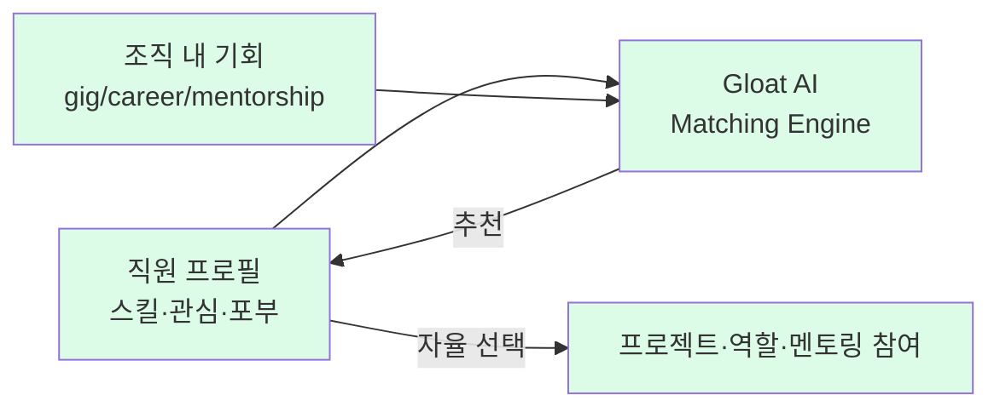

# Schneider Electric — Open Talent Market (Gloat AI)

## Summary

Schneider Electric(글로벌 에너지 관리·자동화 기업, 135,000+ 직원 [[sources/gloat-schneider-electric-career-agility-2022-02]])은 Gloat 기반 **"Open Talent Market"**을 2020-04에 전사 big bang launch. 직원의 스킬·관심을 AI가 분석해 **gig work·career transitions·mentorship** 기회를 매칭 ([[sources/shrm-schneider-electric-chro-nontraditional-2025]]). ⚠️ 벤더 주장: **360,000+ 시간 unlocked, $15M+ 생산성 향상 + 채용 비용 절감** ([[sources/gloat-schneider-electric-case-study-2026-09]] — 게이팅 자료, 원문 미확인). Unilever FLEX와 함께 Gloat의 양대 레퍼런스. **Josh Bersin**(Tier 1)이 2019년 독립 분석에서 "가장 영리한 비즈니스 리더" CHRO Olivier Blum의 전략으로 소개 ([[bersin-schneider-unilever-talent-marketplace-2019-07]]). **SHRM**(Tier 2)이 2025년 현 CHRO Charise Le의 비전통적 인재 전략으로 재조명 ([[shrm-schneider-electric-chro-nontraditional-2025]]).

## Problem / Why (도입 배경)

- ⚠️ 자사 보고: **직원의 50%가 "내부 성장 기회 부족"을 퇴직 주요 사유로 꼽음** — 이 데이터가 Open Talent Market 구축의 직접적 트리거 ([[sources/gloat-schneider-electric-career-agility-2022-02]]; Bersin 2019는 47%로 보도 [[sources/bersin-schneider-unilever-talent-marketplace-2019-07]])
- 135,000명 규모에서 사일로(부서·지역 간 인력 가시성 부족) 해소가 도입 목적 ([[sources/gloat-schneider-electric-career-agility-2022-02]])
- 직원은 현재 역할 외 기회를 알 수 없고, 매니저는 팀원을 놓치지 않으려 함

## Solution Architecture

### A. Process (프로세스)

- **Before (As-is)**: 직원이 내부 성장 기회를 인식하지 못함 → 50% 퇴직 사유
- **After (To-be)**:
  1. 직원이 프로필(스킬·관심·포부) 작성
  2. Gloat AI가 스킬·관심과 조직 내 기회를 매칭
  3. 제공되는 기회 유형: **gig work(단기 프로젝트)**, **career transitions(역할 이동)**, **mentorship(멘토링)**
  4. 직원이 자율적으로 참여 선택
- **Launch 전략**: 초기 HR 부서 pilot → 국가별 순차 rollout 시도 → **big bang 전환 (2020-04)**
- **HITL**: 직원 자율 선택 (Unilever와 동일한 recommend-only 패턴)

```mermaid
flowchart LR
    Emp[직원 프로필<br/>스킬·관심·포부] --> AI[Gloat AI<br/>Matching Engine]
    Opp[조직 내 기회<br/>gig/career/mentorship] --> AI
    AI -->|추천| Emp
    Emp -->|자율 선택| Project[프로젝트·역할·멘토링 참여]
    classDef fact fill:#dcfce7
    class Emp,AI,Opp,Project fact
```

### B~E. 시스템·데이터·모델·조직 — 세부 대부분 _미공개_ (Unilever FLEX와 동일 패턴)

### B. System & Infrastructure (시스템·인프라)

- **Core HRIS**: ✅ Oracle Fusion HCM, Taleo (ATS), Cornerstone (LMS) 통합 — Bersin 2019 독립 확인 ([[sources/bersin-schneider-unilever-talent-marketplace-2019-07]])
- **AI 시스템 배치**: ✅ Gloat 탤런트 마켓플레이스(InnerMobility) SaaS ([[sources/bersin-schneider-unilever-talent-marketplace-2019-07]], [[sources/gloat-schneider-electric-career-agility-2022-02]])
- **배포 환경**: _미공개 (not disclosed)_
- **연동·통합**: ✅ Oracle Fusion·Taleo·Cornerstone 시스템과 통합 ([[sources/bersin-schneider-unilever-talent-marketplace-2019-07]]) — sync 항목(skill·position·learning)은 _미공개_
- **사용자 접점**: _미공개 (not disclosed)_ — 플랫폼이 직원에게 새 역할·프로젝트·멘토십·학습 추천을 제공한다는 점만 확인 ([[sources/shrm-schneider-electric-chro-nontraditional-2025]])
- **인증·권한**: _미공개 (not disclosed)_

### C. Data (데이터)

- **입력 데이터 소스**: 직원 프로필·조직 내 기회(프로젝트·멘토링·직무 기회) ([[sources/bersin-schneider-unilever-talent-marketplace-2019-07]], [[sources/shrm-schneider-electric-chro-nontraditional-2025]])
- **데이터 규모**: ⚠️ 자사 보고: 135,000+ 직원, 60,000+ 사용자 ([[sources/gloat-schneider-electric-career-agility-2022-02]]); 초기 등록률 75% ([[sources/bersin-schneider-unilever-talent-marketplace-2019-07]]); 현재 등록률·gig/mentor 매칭 건수 _미공개_ (수치 근거 미확보 — 2026-09-27 grounding 점검)
- **전처리·정제**: _미공개 (not disclosed)_
- **학습 vs RAG vs In-context**: _미공개 (not disclosed)_
- **데이터 거버넌스**: _미공개 (not disclosed)_
- **민감정보 처리**: _미공개 (not disclosed)_

### D. Model (모델)

- **Foundation model**: _미공개 (not disclosed)_
- **모델 유형**: 추천·매칭 (역할·프로젝트·멘토십·학습 추천) ([[sources/shrm-schneider-electric-chro-nontraditional-2025]])
- **제공 방식**: _미공개 (not disclosed)_
- **커스터마이징 기법**: _미공개 (not disclosed)_ (2026-09-27 grounding 점검 — 기존 "41 capability" 서술은 인용 소스에 없어 삭제)
- **Orchestration 프레임워크**: _미공개 (not disclosed)_
- **평가·가드레일**: _미공개 (not disclosed)_

### E. Organization & Team (조직·팀 구조)

- **오너십**: ✅ HR 주도 — CHRO Olivier Blum(2019) → 현 CHRO Charise Le ([[sources/bersin-schneider-unilever-talent-marketplace-2019-07]], [[sources/shrm-schneider-electric-chro-nontraditional-2025]])
- **참여 역할**: ✅ Andrew Saidy (Head of Talent Digitization)가 구현 주도 ([[sources/bersin-schneider-unilever-talent-marketplace-2019-07]])
- **팀 규모·기간**: ✅ 초기 rollout: 2,300 HR 직원 → UK·Ireland·Singapore(5,500+ 직원) 확대 ([[sources/bersin-schneider-unilever-talent-marketplace-2019-07]]); 이후 단계 인력·기간 _미공개_
- **거버넌스 체계**: _미공개 (not disclosed)_
- **변화관리**: _미공개 (not disclosed)_
- **파트너**: _미공개 (not disclosed)_

## Impact / Metrics (기대효과)

### 기대효과 요약
⚠️ 벤더 주장: 360,000+ 시간의 unlocked capacity, $15M+ 생산성/비용 절감 ([[sources/gloat-schneider-electric-case-study-2026-09]] — 게이팅 자료, 원문 미확인). 기존 퇴직 사유의 50%가 "내부 기회 부족"이었으나 talent marketplace로 개선 ([[sources/gloat-schneider-electric-career-agility-2022-02]]).

| 지표 | 값 | 출처 | 성격 |
|---|---|---|---|
| Unlocked capacity | **360,000+ hours** | [[sources/gloat-schneider-electric-case-study-2026-09]] (게이팅, 원문 미확인) | ⚠️ 벤더 주장 |
| 생산성·비용 절감 | **$15M+** | [[sources/gloat-schneider-electric-case-study-2026-09]] (게이팅, 원문 미확인) | ⚠️ 벤더 주장 |
| 직원 퇴직 사유 (before) | **47%** (또는 ~50%)가 "내부 기회 부족" | [[bersin-schneider-unilever-talent-marketplace-2019-07]] (Bersin Tier 1) | ✅ Fact (Bersin 독립 확인) |
| 직원 등록률 (초기) | **75%** | [[bersin-schneider-unilever-talent-marketplace-2019-07]] | ✅ Fact |
| 직원 등록률 (현재) | _미공개_ | 인용 소스에 없음 (수치 근거 미확보 — 2026-09-27 grounding 점검) | ❓ |
| 플랫폼 사용자 | **60,000+** | [[sources/gloat-schneider-electric-career-agility-2022-02]] | ⚠️ 자사 보고 (벤더 블로그 전달) |
| Gig matches | _미공개_ | 인용 소스에 없음 (2026-09-27 grounding 점검) | ❓ |
| Mentor matches | _미공개_ | 인용 소스에 없음 (2026-09-27 grounding 점검) | ❓ |
| 내부 이동 증가 | _미공개_ | 인용 소스에 없음 (2026-09-27 grounding 점검) | ❓ |
| Launch 일정 | 2019 초기 rollout 확인; 2020-04 big bang은 인용 소스 원문 미확인 | [[sources/bersin-schneider-unilever-talent-marketplace-2019-07]] / Gloat 게이팅 자료 | ✅ Fact (2019) / ⚠️ 벤더 주장 (2020-04) |
| 시스템 통합 | Oracle Fusion, Taleo, Cornerstone | [[bersin-schneider-unilever-talent-marketplace-2019-07]] | ✅ Fact |
| 주요 리더 | **Olivier Blum** (CHRO), **Andrew Saidy** (Head of Talent Digitization), **Charise Le** (현 CHRO) | Bersin + SHRM | ✅ Fact |

## Governance & Risk

- **HITL**: 매칭은 추천만 하고 참여는 직원 자율 선택 — recommend-only 패턴 ([[sources/shrm-schneider-electric-chro-nontraditional-2025]])
- **편향·설명가능성**: bias audit·explainability 결과 _미공개 (not disclosed)_
- **개인정보**: 데이터 처리·동의 방식 _미공개 (not disclosed)_
- **한국 적용 시**: 내부이동·배치 매칭은 AI 기본법 고영향 검토 대상(frontmatter `regulatory_exposure` 참조)

## Contradictions

> [!contradiction] 퇴직 사유 비율·직원 수: Bersin 2019는 **47%** 자발적 퇴직자·**140,000** 직원 ([[sources/bersin-schneider-unilever-talent-marketplace-2019-07]]), Gloat 2022 블로그는 **nearly 50%**·**135,000+** ([[sources/gloat-schneider-electric-career-agility-2022-02]]). 측정 시점 차이로 보이나 확인 불가. 상태: noted

> [!note] 2026-09-27 grounding — 현재 등록률(전사·NA)·gig/mentor 매칭 건수·내부 이동 증가율·"41 capability" 서술은 인용 소스 어디에도 없어 `_미공개_`로 교체. 360,000+ 시간·$15M+는 Gloat 게이팅 case study가 원출처로 추정되나 스냅샷 unavailable — 벤더 주장·원문 미확인으로 유지. Gloat career-agility 블로그 실제 발행일은 2022-02-09.

## Consulting Angle

- **Unilever FLEX와 twin reference**: 양사 모두 Gloat 기반이지만 **Schneider는 $15M 절감 수치(⚠️ 벤더 주장, 원문 미확인)가 있어** ROI 논의에 더 직접적
- **"big bang vs phased rollout" 교훈**: Schneider는 처음 국가별 순차 접근 → big bang 전환. 이 **전략 pivot의 이유·결과**가 한국 대기업 도입 시 참고
- **"직원 50% 퇴직 사유"** 데이터: 이 수치 하나로 investment case 작성 가능 — CHRO에게 "우리도 같은 문제 아닌가?" 질문

### vs Unilever

| | Unilever FLEX | Schneider OTM |
|---|---|---|
| 규모 | [[unilever-flex-gloat-talent-marketplace]] 참조 | 135,000+ 직원 |
| ROI 수치 | [[unilever-flex-gloat-talent-marketplace]] 참조 | 360k hours, **$15M+** (⚠️ 벤더 주장) |
| Before metric | 없음 | **50% 퇴직 사유** (가장 강력한 before data) |
| Launch | pilot → gradual | pilot → **big bang** |
